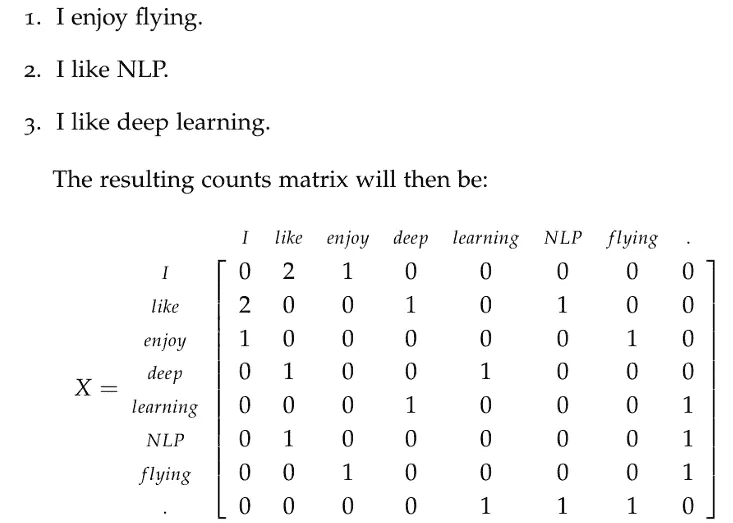

# 词到向量—自然语言处理

> 原文：<https://towardsdatascience.com/word-to-vectors-natural-language-processing-b253dd0b0817?source=collection_archive---------0----------------------->

**自然语言处理为什么很难？**

计算机用编程语言与人类交流，这种语言清晰、精确，而且通常是结构化的。但是，自然(人类)语言有很多歧义。有多个意思相同的词(同义词)，有多个意思的词(一词多义)，其中一些在性质上完全相反(自动反义词)，还有当用作名词和动词时表现不同的词。这些词在自然语言的上下文中是有意义的，人类可以很容易地理解和区分，但机器不能。这就是 NLP 成为人工智能中最困难和最有趣的任务之一的原因。

**使用自然语言处理可以完成什么？**

让计算机“理解”人类语言可以完成几项任务。一个活生生的例子就是我在这篇文章中用来检查拼写和语法的软件。以下是目前使用 NLP 完成的一些任务:

1.  拼写和语法检查
2.  寻找同义词和反义词
3.  从文档、网站解析信息
4.  理解句子、文档和查询的含义
5.  机器翻译(例如，将文本从英语翻译成德语)
6.  回答问题和执行任务(例如安排约会等。)

**如何表示文字？**

首先，我们需要能够将单词表示为机器学习模型的输入。表示单词的一种数学方法是向量。英语中估计有 1300 万个单词。但其中许多是相关的。从配偶到伴侣，从酒店到汽车旅馆。那么，我们是否希望 1300 万个单词都有独立的向量呢？

不。我们必须寻找一个 N 维向量空间(其中 N << 13 million) that is sufficient to encode all semantics in our language. We need to have a sense of similarity and difference between words. We can exploit concept of vectors and distances between them (Cosine, Euclidean etc. ) to find similarities and differences between words.

**我们如何表示单词的意思？**

如果我们对英语词汇中的 1300 万个单词(或者更多)使用不同的向量，我们将面临几个问题。首先，我们有一个大的向量，里面有很多“0”和一个“1”(在不同的位置代表不同的单词)。这也被称为**一键编码。**其次，当我们在谷歌中搜索诸如“新泽西州的酒店”等短语时，我们希望返回与新泽西州的“汽车旅馆”、“住宿”和“住宿”相关的结果。如果我们使用一键编码，这些单词没有自然的相似性。理想情况下，我们希望同义词/相似词的点积(因为我们处理的是向量)接近 1。

**基于分布相似性的表示:**

> 从一个人交的朋友你就可以知道他说了什么——j·r·弗斯

用非常简单的外行话来说，就拿一个字‘银行’来说吧。这个词有许多含义，其中一个是金融机构，另一个是水边的土地。如果在一个句子中，银行与邻近的词如货币、政府、国库、利率等一起出现。我们可以理解为前者的意思。相反，如果相邻的词是水、海岸、河流、土地等。情况是后者。我们可以利用这个概念来处理多义词和同义词，并使我们的模型能够学习。

**Word2Vec**

我们如何构建简单、可扩展、快速的训练模型，能够运行数十亿个单词，产生非常好的单词表示？让我们研究一下 Word2Vec 模型来寻找这个问题的答案。

Word2Vec 是一组帮助导出单词与其上下文单词之间关系的模型。让我们看看 Word2Vec 中的两个重要模型:Skip-grams 和 CBOW

**跳棋**

在 Skip-gram 模型中，我们取一个**中心**单词和一个**上下文(邻居)**单词的窗口，并且我们尝试为每个中心单词预测出一些窗口大小的上下文单词。因此，我们的模型将定义一个概率分布，即给定一个中心词，一个词在上下文中出现的概率，我们将选择我们的向量表示来最大化该概率。

**连续单词包模型(CBOW)**

从抽象的角度来说，这与跳格是相反的。在 CBOW 中，我们试图通过对周围单词的向量求和来预测中心单词。

这是关于把单词转换成向量。但是“学习”发生在哪里呢？本质上，我们从单词向量的小的随机初始化开始。我们的预测模型通过最小化损失函数来学习向量。在 Word2vec 中，这是通过前馈神经网络和优化技术(如随机梯度下降)实现的。还存在基于计数的模型，其在我们的语料库中形成单词的共现计数矩阵；我们有一个大矩阵，每行代表“单词”,每列代表“上下文”。“上下文”的数量当然很大，因为它在大小上基本上是组合的。为了克服这个尺寸问题，我们将 [SVD](https://en.wikipedia.org/wiki/Singular_value_decomposition) 应用于矩阵。这减少了矩阵的维数，保留了最大限度的信息。

总之，将单词转换为深度学习算法可以摄取和处理的向量，有助于更好地理解自然语言。小说家埃尔·多克托罗在他的《比利·巴斯盖特》一书中颇有诗意地表达了这一观点。

> 就像数字是语言一样，语言中的所有字母都变成了数字，所以每个人都以同样的方式理解它。你失去了字母的声音，不管它们是咔嚓声、砰砰声还是碰上颚的声音，或者发出“哦”或“啊”的声音，以及任何可能被误读或被它的音乐或它放在你脑海中的图片欺骗的声音，所有这些都消失了，连同口音，你有了一种完全新的理解，一种数字语言，一切对每个人来说都变得像墙上的文字一样清晰。所以正如我所说的，阅读数字的时间到了。