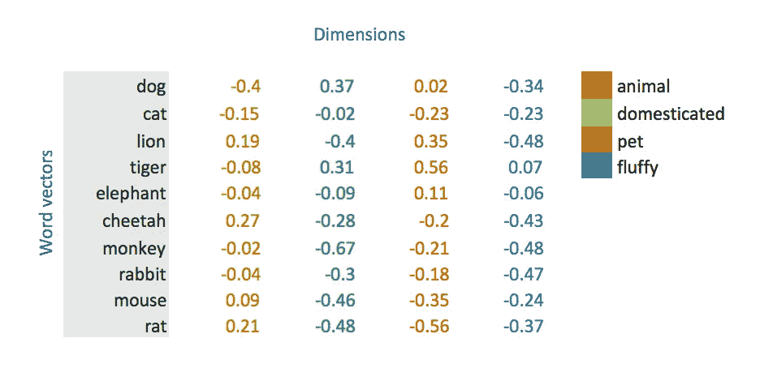
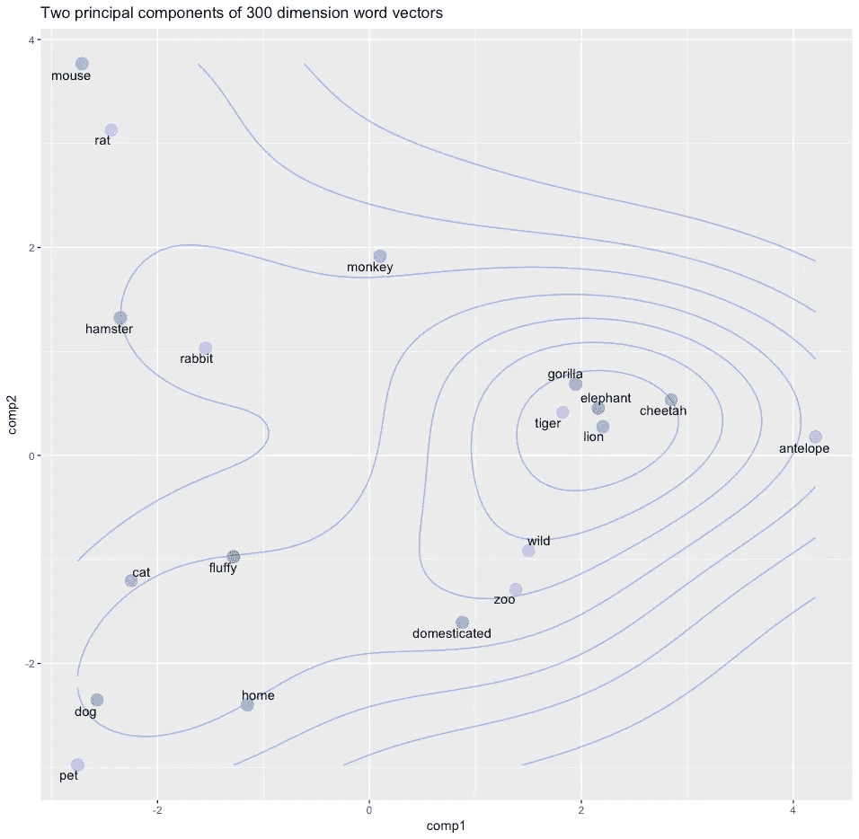
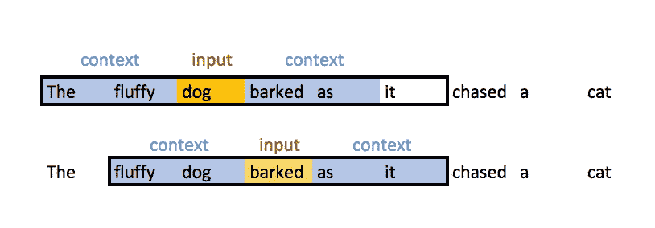
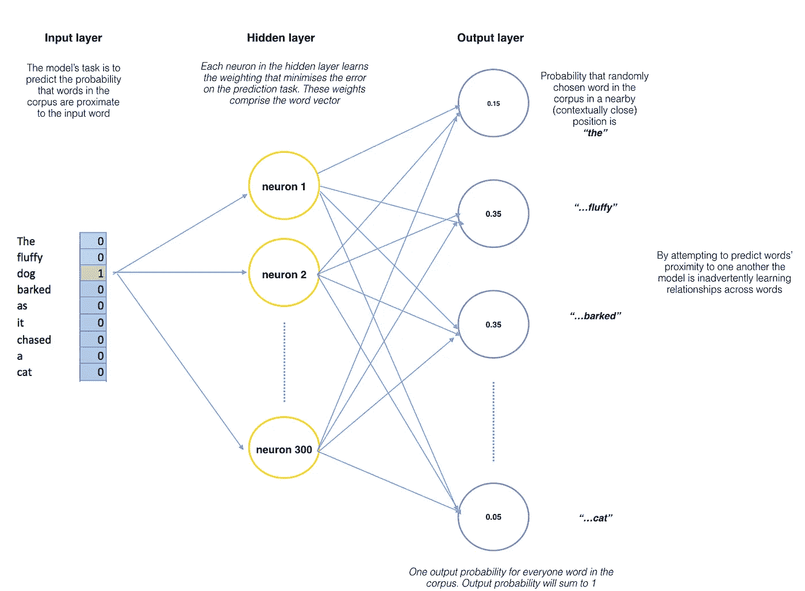

# 面向非 NLP 数据和研究人员的词向量

> 原文：<https://towardsdatascience.com/word-vectors-for-non-nlp-data-and-research-people-8d689c692353?source=collection_archive---------3----------------------->

单词向量代表了在提高我们分析单词、句子和文档之间关系的能力方面的一个重大飞跃。在这样做的过程中，他们通过向机器提供比以前可能使用的传统单词表示更多的单词信息来推进技术。正是单词向量使得语音识别和机器翻译等技术成为可能。关于词向量有很多很好的解释，但在这一篇中，我想让不太熟悉自然语言处理(NLP)的数据和研究人员也能理解这个概念——有关基本 NLP 概念的初级读本，请在这里查看我的帖子:[https://data flume . WordPress . com/2017/03/17/intro-NLP-python-spacy/](https://dataflume.wordpress.com/2017/03/17/intro-nlp-python-spacy/)。

# 什么是词向量？

单词向量只是代表单词意思的数字向量。现在，这还不是很清楚，但我们一会儿会回来。首先，考虑一下为什么单词向量被认为是对传统单词表示的一次飞跃，这是很有用的。

传统的 NLP 方法，如一键编码和词袋模型(即，使用虚拟变量来表示单词在观察结果(例如，句子)中的存在或不存在)，虽然对一些机器学习(ML)任务有用，但不能捕获关于单词的含义或上下文的信息。这意味着潜在的关系，如上下文的密切程度，不能在单词集合中被捕获。例如，一键编码不能捕捉简单的关系，例如确定单词“狗”和“猫”都是指经常在家庭宠物的上下文中讨论的动物。这种编码通常为简单的 NLP 任务(例如，电子邮件垃圾分类器)提供了足够的基线，但对于更复杂的任务(如翻译和语音识别)来说，却缺乏复杂性。本质上，传统的自然语言处理方法，比如一键编码，不能捕捉单词集合之间的句法(*结构*和语义(*含义*)关系，因此，以一种非常幼稚的方式来表示语言。

相反，单词向量将单词表示为多维连续浮点数，其中语义相似的单词被映射到几何空间中的邻近点。更简单地说， ***一个单词向量是一行实数值*** (与虚数值相对)，其中 ***每个点捕捉单词含义的一个维度*** 和 ***，其中语义相似的单词具有相似的向量*** *。*这意味着像*车轮*和*发动机*这样的词应该和*汽车*这样的词有相似的词向量(因为它们的意思相似)，而*香蕉*这样的词应该是相当遥远的。换句话说，在相似上下文中使用的单词将被映射到一个近似的向量空间(我们将在下面讨论这些单词向量是如何创建的)。将单词表示为向量的美妙之处在于它们有助于数学运算。例如，我们可以增加和减少向量，这里的典型例子表明，通过使用词向量，我们可以确定:

**国王-男人+女人=王后**

换句话说，我们可以从代表国王的单词向量中减去一个意思(即男性)，添加另一个意思(女性)，并显示这个新的单词向量(国王-男人+女人)最接近地映射到代表王后的单词向量。

单词向量中的数字代表*单词在维度*上的分布权重。在简化的意义上，每个维度代表一个意义，单词在该维度上的数字权重捕捉了它与该意义的关联的紧密程度。因此，单词的 ***语义被嵌入到向量的维度中。***

## 词向量的简化表示

在图中，我们假设每个维度都有一个明确定义的含义。例如，如果你想象第一个维度代表“动物”的意义或概念，那么每个词在那个维度上的权重代表它与那个概念的密切程度。

这是对单词向量的一个相当大的简化，因为维度并不具有如此明确定义的含义，但这是一个有用且直观的方法来让你理解单词向量维度的概念。

我们可以使用 Python NLP 库 spaCy(在这里查看我的介绍:[*https://data flume . WordPress . com/2017/03/17/intro-NLP-Python-spaCy/*，](https://dataflume.wordpress.com/2017/03/17/intro-nlp-python-spacy/,)最近也移植到了 R【https://github.com/kbenoit/spacyr】的上，快速访问一些预先训练好的 300 维单词向量。我们创建一个单词列表，应用 spaCy 的解析器，提取每个单词的向量，将它们堆叠在一起，然后提取两个主要成分用于可视化。

[https://gist . github . com/Conor mm/ca 0 CDF 78 fa 7a 91 fdacf 500 ff 4 dff 0645](https://gist.github.com/conormm/ca0cdf78fa7a91fdacf500ff4dff0645)

在这里，我们简单地提取不同动物的向量和可能用来描述其中一些动物的单词。正如开头提到的，单词向量非常强大，因为它们允许我们(和机器)通过在连续的向量空间中表示不同单词来识别它们之间的相似性。你可以在这里看到像“狮子”、“老虎”、“猎豹”和“大象”这样的动物的向量是如何非常接近的。这可能是因为它们经常在类似的背景下被讨论，例如这些动物很大，是野生的，有潜在的危险——事实上，描述性的词“野生”与这组动物非常接近。

*相似的单词在向量空间中被映射在一起。注意猫和狗和宠物有多接近，大象、狮子和老虎有多聚在一起，以及描述性的词语是如何聚在一起的。*

同样有趣的是，“野生”、“动物园”和“驯养”这三个词是如何相互对应的。这是有道理的，因为它们是经常被用来描述动物的词，但突出了词向量的惊人力量！

# 词向量从何而来？

此时一个极好的问题是这些维度和权重从何而来？！生成单词向量有两种常见方式:

1.  单词/上下文共现的计数
2.  给定单词的上下文预测(skip-gram 神经网络模型，例如 word2vec)

*注意:下面我描述了一种生成单词向量的高级 word2vec 方法，但是可以在这里找到计数/共现方法的很好的概述(https://medium . com/ai-society/jkljlj-7d6e 699895 C4)。

生成单词向量的两种方法都建立在 Firth(1957)*分布假设*的基础上，该假设陈述:

# “从一个人交的朋友，你就可以知道他说的是什么”

换句话说，拥有相似语境的单词往往有相似的意思。单词的上下文在实际意义上是指其周围的单词，并且*单词向量(通常)是通过预测给定单词*的上下文的概率而生成的。换句话说，组成单词向量的权重是通过预测其他单词在上下文中接近给定单词的概率来学习的。这类似于试图填充某个给定输入单词周围的空白。例如，给定输入序列，*“蓬松的狗在追猫时吠叫”*，单词“狗”和“吠叫”的双窗口(焦点单词之前和之前的两个单词)上下文看起来像:

我不想过多地探究神经网络如何学习单词嵌入的数学细节，因为更有资格这样做的人已经解释了这一点。尤其是这些帖子对我理解单词向量是如何学习的很有帮助:

1.  深度学习、NLP 和表示法([http://colah . github . io/posts/2014-07-NLP-RNNs-re presentations/](http://colah.github.io/posts/2014-07-NLP-RNNs-Representations/))
2.  词向量的惊人力量([https://blog . acolyer . org/2016/04/21/the-amazing-power-of-word-vectors/](https://blog.acolyer.org/2016/04/21/the-amazing-power-of-word-vectors/))
3.  Word2Vec 教程—跳过 Gram 模型([http://mccormickml . com/2016/04/19/word 2 vec-Tutorial-The-Skip-Gram-Model/](http://mccormickml.com/2016/04/19/word2vec-tutorial-the-skip-gram-model/))

然而，考虑到它的流行性和实用性，接触一下 **word2vec** 模型的工作原理是很有用的。word2vec 模型只是一个具有单个隐藏层的神经网络，它被设计为通过估计一个单词与作为输入给出的另一个单词“接近”的概率来重建单词的上下文。

该模型针对语料库中每个单词的单词、上下文配对进行训练，即:

(狗)

(狗，毛茸茸的)

(狗叫)

(狗，作为)

请注意，从技术上讲，这是一个受监督的学习过程，但您不需要带标签的数据—标签(目标/因变量)是从形成焦点单词上下文的单词中生成的。因此，使用窗口函数，模型学习使用单词的上下文。在这个简单的例子中，模型将了解到 *fluffy* 和*barbed*在单词 dog 的上下文(由窗口长度定义)中使用。

由 word2vec 模型创建的单词向量的一个迷人之处在于，它们是预测任务的*副作用*，*而不是输出*。换句话说，单词向量不是预测的，(预测的是上下文概率)， ***单词向量是输入*** 的学习表示，用于预测任务，即预测给定上下文的单词。单词向量是模型学习单词的良好数字表示的尝试，以便最小化其预测的损失(误差)。随着模型的迭代，它调整其神经元的权重，试图最小化其预测的误差，并在这样做的过程中，逐渐完善其对单词的表示。在这样做的过程中，*单词的“含义”嵌入了网络隐藏层中每个神经元学习的权重中*。

因此，word2vec 模型接受单个单词作为输入(表示为语料库中所有单词中的独热编码),并且该模型试图预测语料库中随机选择的单词位于输入单词附近位置的概率。这意味着对于，每个输入单词都有 *n 个*输出概率，其中 *n* 等于语料库的总大小。这里的神奇之处在于，训练过程只包括单词的上下文，而不是语料库中的所有单词。这意味着在我们上面的简单例子中，给定单词“狗”作为输入，“汪汪”将比“猫”具有更高的概率估计，因为它在上下文中更接近，即它是在训练过程中学习的。换句话说，**模型试图预测语料库中的其他单词属于输入单词的上下文的概率。**因此，给定上面的句子(*“毛茸茸的狗在追逐一只猫时吠叫”)*作为输入，模型的运行将如下所示:

*注意:这个概念神经网络是 Chris McCormick 博客文章中的图表的密友，链接到上面的*

经历这个过程的价值是提取模型隐藏层的神经元已经学习的权重。正是这些权重形成了单词向量，即，如果你有 300 个神经元隐藏层，你将为语料库中的每个单词创建 300 维的单词向量。因此，这个过程的输出是大小为 *n-* 个输入单词* *n* 个隐藏层神经元的单词向量映射。

感谢你的阅读，希望你学到了新的东西:)