# Word2Vec 遭遇特朗普推文——视觉分析

> 原文：<https://towardsdatascience.com/word2vec-meets-trump-tweets-a-visual-analysis-3c7de6e2ac85?source=collection_archive---------9----------------------->

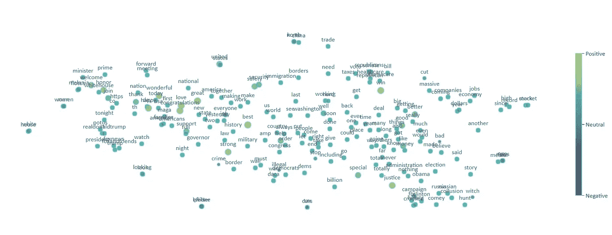

# TL；速度三角形定位法(dead reckoning)

你会发现:

*   基于神经网络的特朗普推特词汇相似度分析
*   很棒的笑话
*   一个[互动工具](https://plot.ly/~aukslius12/9/)让你自己探索数据
*   一个[可能性](https://github.com/aukslius12/W2V-on-your-Facebook-chat)做同样的分析*上自己的脸书聊天*
*   谷歌 Word2Vec 的易懂介绍

# 特朗普发推特？真的吗？

我知道，我知道——“又一个对特朗普推文的分析？”，但也许没那么糟糕？“嘿，也许我是第一个做*这种*类型分析的人？”

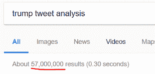

“嗯，是的，但这并不意味着它是数据科学——任何人都可以简单地看一看，然后做出结论。”

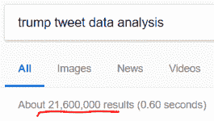

“…好吧，那么我正在做的 ***确切地说是*** 的事情呢？”

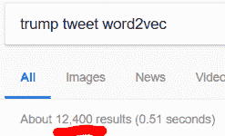

你知道，现在我已经花了至少 5 天半的时间来做这件事(大部分时间都是为了让图表看起来足够好，符合我的完美主义者的口味)，我觉得有点愚蠢。我甚至找到了一篇很棒的文章，解释了几乎与我相同的分析。不，说真的，看看这里的——太棒了。

…不管怎样。既然我们已经解决了“这已经被做了 5700 万次，而你的分析是垃圾”的问题，我们可以开始了。

# Word2Vec 和集群

我真的很喜欢将**聚集**的想法——因为相似的东西几乎总是在一起，因此可以将它们分组或*聚集*在一起。

例如，如果一个女人开着 SUV，有孩子，留着标志性的发型，她很可能属于“我能和经理说话吗”这一类。

Can I speak to the manager?

聚类也是数字类别的完美匹配:年龄、薪水、职位等。利用这一点，公司可以识别出高收入——高支出群体，在每一个 YouTube 视频之后用不间断的广告轰炸他们。

但是文本聚类呢？

对你来说，“回头见”后面可能会跟着“鳄鱼”或“一会儿”后面可能会跟着“鳄鱼”，这似乎是显而易见的，但对计算机来说，这种逻辑是荒谬的:“这是一种杀手动物，再见，你说它们相似是什么意思，哔哔 BOOP”(用机器人的声音朗读)。这就是 Word2Vec 算法大放异彩的地方。

跳过几乎每一个细节，该算法所做的是寻找在**相似上下文**中使用过的单词，并基于此创建它们的相似度。

如果你让计算机根据四年级英语课上使用的单词做出决定，它可能会认为“再见”和“鳄鱼”几乎是相同的短语，但如果你把它带到一个新闻站，它会把“鳄鱼”和“残忍地谋杀了一个小孩”放在一起。

这就是 Word2Vec 的闪光点——你可以用任何你想要的数据来训练它！你可以在你的脸书聊天记录、特朗普推文甚至产品评论中创建词语相似度云，根据上下文,*可能会*将“假”和“新闻”放在一起。

# 特朗普会见 Word2Vec

单词相似度云相当简单——单词越接近，它们就越相似。注意，并不是所有的单词都包括在内。是的，*科菲*也不见了。

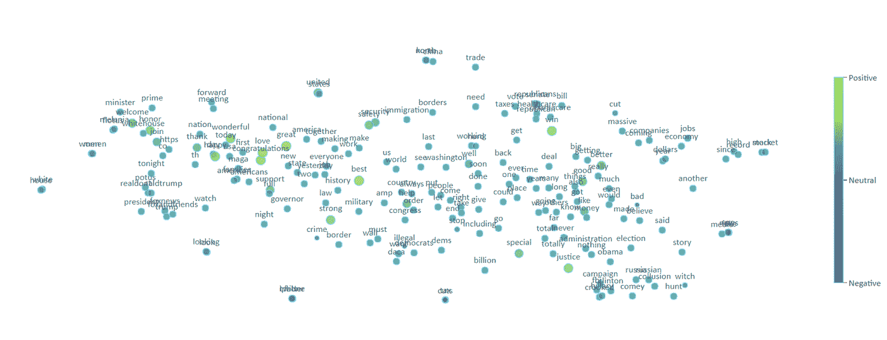

Full word cloud. To represent Word2Vec in 2D, I used t-SNE.

太美了。那它是什么呢？嗯，有几件事。首先，如果你花同样多的时间试图绘制一个符合我所有完美主义者需求的图表，你会发现这里有一个轻微的趋势。

注意，左上方有更多的正(黄色)气泡？没错。让我们仔细看看。

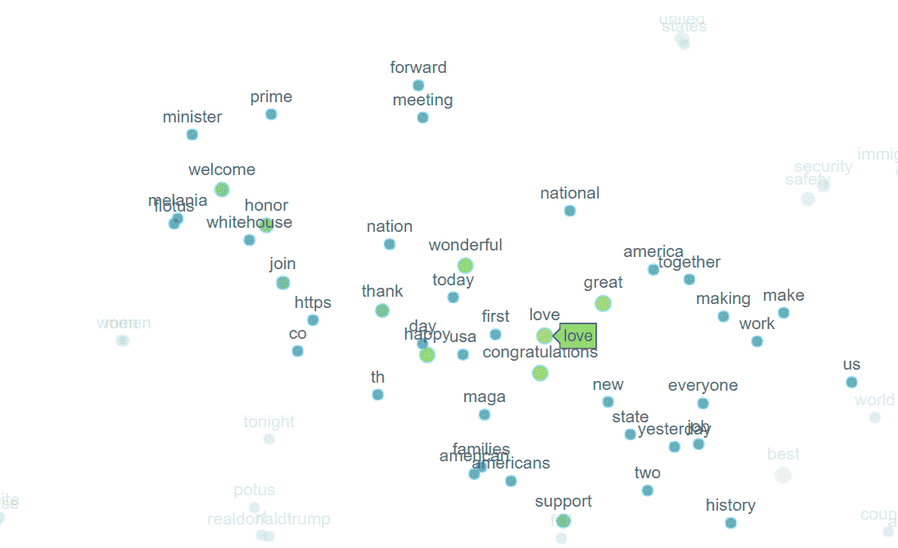

这看起来很像感激的声音——我们到处都有像*祝贺、美好、感谢、欢迎*这样的词。最左边的单词似乎表示欢迎某人(总理梅拉尼娅)加入团队或只是参加白宫会议，并获得荣誉。

在特朗普的推特世界里，感激的反义词是什么？看一看。

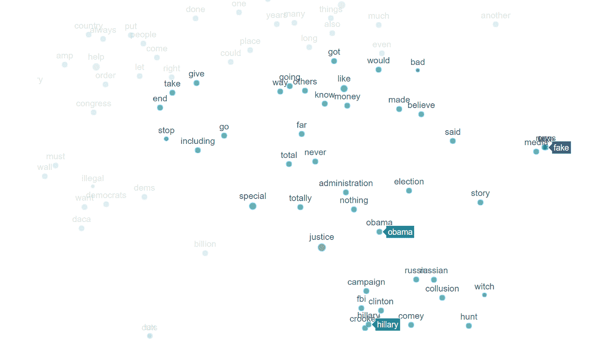

这真的让我大笑——看看特朗普认为负面的东西吧！

如果让你选出唐纳德·特朗普最常用的两个单词，会是什么？

*I actually had to zoom* ***REALLY*** *close to prevent words from overlapping (that’s how close they were!). This is a representation of how often fake news has been tweeted by Trump.*

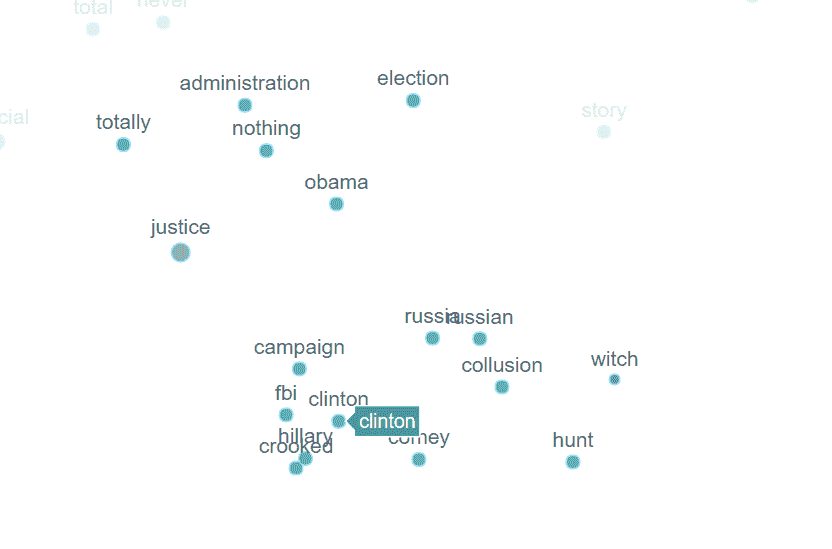

第二朵云更有趣。我们这里有三件主要的事情——希拉里、俄罗斯和政治迫害,*所有这些*都在*相似的上下文中被提及*。看起来，特朗普咆哮时，他也是以类似的方式做的，只是切换了实体。

让我们仔细看看。

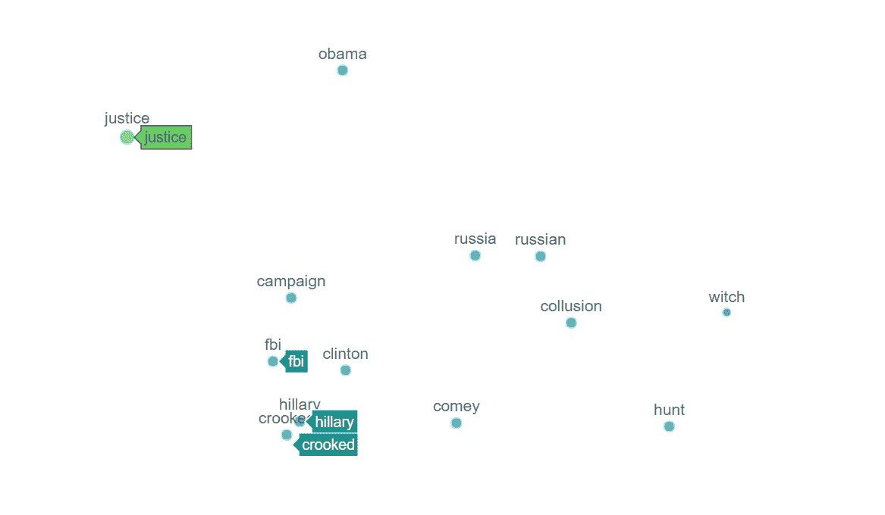

这绝对是 Hillaryous(对不起)——和希拉里最接近、最相似的词是什么？当然是歪的。

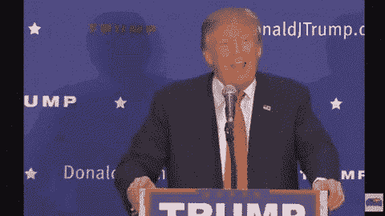

在“hillary”的左边，朝着*“positive”*的那一边是什么？ ***正义*** *。*在联邦调查局调查希拉里·克林顿的问题上，特朗普似乎一直在要求很多正义——注意“联邦调查局”。它位于“希拉里”云的中央。

但事情变得更有趣了。在“联邦调查局”和“希拉里”的右边，漂浮着“俄罗斯”和“勾结”的云。那是对俄罗斯干涉总统选举的调查！

但是为什么《猎巫》和它如此接近呢？现在，我不是美国人，我不在推特上关注特朗普，也没有花太多时间思考这个问题，但特朗普似乎认为联邦调查局对俄罗斯人的调查与其说是可信的调查，不如说是政治迫害。

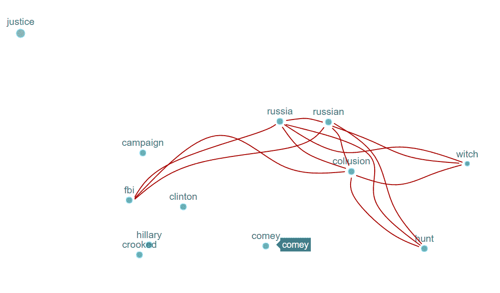

谁在这中间？科米。哪个科米？联邦调查局局长科米。

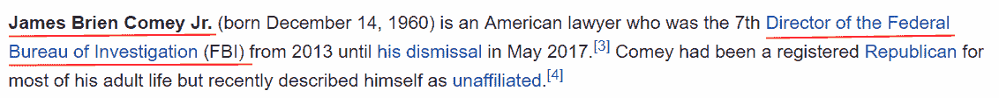

这就是我喜欢这种文本分析方法的原因。一旦你仔细观察云里面的东西，你会发现惊人的关系。

Word2Vec 做出的单词之间关系的复杂程度其实高得不可思议。这不是一个人跟踪特朗普的每一个举动，阅读每一个与特朗普相关的标题——这是一个运行了 30 秒的算法。可能性是如此之大，我完全不知所措，但我会把它留给另一个帖子。

这还不是这一具体分析的全部——例如，有一些群集将诸如*【白色】*和*【房子】**【前进】*和*【会议】*(期待会议)*【联合】*和*【国家】*这样的词放在一起。与‘奥巴马医改’相关的一切都与共和党纠缠在一起。*【墙】*站在*【边境】**【犯罪】**【非法】*旁边。

我个人最喜欢的是*，*，*，*，*，【中国】，*，但是下一个最接近的词实际上是*，【贸易】，*！

但是不要相信我的话，你自己看看吧！(双击缩小)

特朗普的推文到此为止。

但是这个想法总体上怎么样呢？由于欧盟数据保护法的最新变化，你现在可以下载你在脸书发来的每一封邮件。

你可以在我的 GitHub 上使用[我的 JupyterNotebook](https://github.com/aukslius12/W2V-on-your-Facebook-chat) 来生成同样的图形，就像你的脸书一样。它包含了太多的信息——我可以看到“滑稽”(笑的 DD 类型中的字母 D 的数量)和诅咒语/猴子噪音逐渐消失，并转化为用于描述你情绪的单词，因为这些单词在 x 轴上移动。

在“笑话云”的另一边，你可以看到我变得富有哲理，并使用诸如*、*、*、【意识到】、*等词语。另一类包含黑色幽默——如果我把它们发布到网上，这些话题会让我丧命。

你还可以发现更多的东西——这绝对值得花时间去做！

我希望你喜欢阅读这篇文章，就像我喜欢创作它一样。

要知道，数据科学将数据转化为知识，我们都知道知识*就是* ***力量*** *。*

