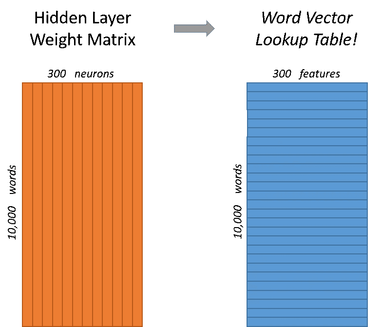
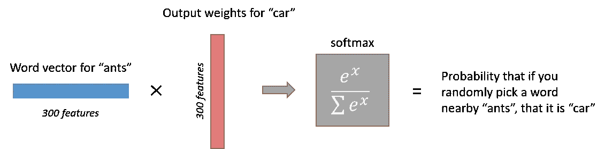

# Word2Vec(跳格模型):第 1 部分——直觉。

> 原文：<https://towardsdatascience.com/word2vec-skip-gram-model-part-1-intuition-78614e4d6e0b?source=collection_archive---------0----------------------->

这里的大部分内容来自克里斯的博客。我对它进行了压缩，并做了一些小的改动。

鸣谢:克里斯·麦考密克

[http://mccormickml . com/2016/04/19/word 2 vec-tutorial-the-skip-gram-model/](http://mccormickml.com/2016/04/19/word2vec-tutorial-the-skip-gram-model/)

[http://mccormickml . com/2017/01/11/word 2 vec-tutorial-part-2-negative-sampling/](http://mccormickml.com/2017/01/11/word2vec-tutorial-part-2-negative-sampling/)

该算法有两种版本 **CBOW** 和 **Skip-Gram** 。给定一组句子(也称为**语料库**)，该模型循环每个句子的单词，并试图使用当前单词来预测其邻居(其上下文)，在这种情况下，该方法被称为“Skip-Gram”，或者它使用这些上下文中的每一个来预测当前单词，在这种情况下，该方法被称为“连续单词包”(CBOW)。每个上下文中的字数限制由一个名为“**窗口大小**的参数决定。

# 直觉

skip-gram 神经网络模型的最基本形式实际上非常简单。训练一个只有一个隐藏层的简单神经网络来执行某项任务，但是我们实际上不会将该神经网络用于我们训练它的任务！相反，目标实际上只是学习隐藏层的权重——我们将看到这些权重实际上是我们试图学习的“单词向量”。

我们将训练神经网络做以下事情。给定一个句子中间的特定单词(输入单词)，查看附近的单词并随机选择一个。网络会告诉我们，我们词汇表中的每个单词成为我们选择的“邻近单词”的概率。

输出概率将与在我们的输入单词附近找到每个词汇单词的可能性有关。例如，如果你给训练好的网络输入单词“苏维埃”，输出概率对于像“联盟”和“俄罗斯”这样的单词比对于像“西瓜”和“袋鼠”这样不相关的单词要高得多。

我们将通过向神经网络输入在我们的训练文档中找到的单词对来训练它做到这一点。下面的例子展示了我们从句子“敏捷的棕色狐狸跳过懒惰的狗”中提取的一些训练样本(单词对)我在这个例子中使用了一个大小为 2 的小窗口。用蓝色突出显示的单词是输入单词。

我们将把像“蚂蚁”这样的输入单词表示为一个热向量。这个向量将有 10，000 个分量(我们词汇表中的每个单词一个分量)，我们将在对应于单词“ants”的位置放置一个“1”，在所有其他位置放置 0。

网络的输出是一个单一的向量(也有 10，000 个分量),它包含我们词汇表中的每个单词，随机选择的邻近单词是该词汇表单词的概率。

这是我们神经网络的架构。

隐层神经元上没有激活函数，但输出神经元使用 softmax。

对于我们的例子，我们将说我们正在学习有 300 个特征的词向量。因此，隐藏层将由一个 10，000 行(词汇表中的每个单词一行)和 300 列(每个隐藏神经元一列)的权重矩阵来表示。

300 个特征是谷歌在谷歌新闻数据集上训练的发布模型中使用的(你可以从[这里](https://code.google.com/archive/p/word2vec/)下载)。特性的数量是一个“超级参数”，您只需根据您的应用进行调整(也就是说，尝试不同的值，看看什么能产生最好的结果)。

如果你看看这个权重矩阵的*行*，这些实际上将是我们的单词向量！

因此，所有这些的最终目标实际上只是学习这个隐藏的层权重矩阵——当我们完成时，输出层将被丢弃！“蚂蚁”的`1 x 300`单词向量然后被馈送到输出层。输出层是 softmax 回归分类器。

具体来说，每个输出神经元都有一个权重向量，它与来自隐藏层的单词向量相乘，然后将函数`exp(x)`应用于结果。最后，为了使输出总和为 1，我们将这个结果除以来自所有*10，000 个输出节点的结果总和。*

下面是计算单词“car”的输出神经元的输出的图示。

> 如果两个不同的单词有非常相似的“上下文”(即它们周围有可能出现什么单词)，那么我们的模型需要为这两个单词输出非常相似的结果。并且网络输出这两个单词的相似上下文预测的一种方式是如果*单词向量相似*。所以，如果两个单词有相似的上下文，那么我们的网络就有动力为这两个单词学习相似的单词向量！哒哒！

而两个词有相似的上下文是什么意思？我认为你可以预期像“智能”和“聪明”这样的同义词会有非常相似的上下文。或者相关的单词，如“引擎”和“传输”，可能也有相似的上下文。

这也可以为你处理词干——网络可能会为单词“ant”和“ants”学习相似的单词向量，因为它们应该有相似的上下文。

我们需要对基本的跳格模型进行一些额外的修改，这些修改对于实际上使训练可行是很重要的。在这么大的神经网络上运行梯度下降会很慢。更糟糕的是，你需要大量的训练数据来调整这么多权重，避免过度拟合。数百万的权重乘以数十亿的训练样本意味着训练这个模型将会是一头野兽。Word2Vec 的作者在他们的第二篇[论文](http://arxiv.org/pdf/1310.4546.pdf)中解决了这些问题。

第二篇论文有三个创新点:

1.  将常见的单词对或短语视为模型中的单个“单词”。
2.  对常用词进行二次抽样以减少训练样本的数量。
3.  使用他们称为“负采样”的技术修改优化目标，这导致每个训练样本只更新模型权重的一小部分。

值得注意的是，子采样频繁词和应用负采样不仅减少了训练过程的计算负担，还提高了结果词向量的质量。

## 子采样:

像“the”这样的常用词有两个“问题”:

1.  在看词对的时候(《狐狸》、《the》)并没有告诉我们太多关于“狐狸”的意思。“the”出现在几乎每个单词的上下文中。
2.  我们将有更多的样本(“the”，…)比我们需要学习一个好的“the”向量。

Word2Vec 实现了一个“子采样”方案来解决这个问题。对于我们在训练文本中遇到的每个单词，我们都有可能有效地将其从文本中删除。我们截词的概率和词的频率有关。

如果我们的窗口大小为 10，并且我们从文本中删除了“the”的一个特定实例:

1.  当我们训练剩下的单词时，“the”将不会出现在它们的任何上下文窗口中。
2.  我们将少 10 个训练样本，其中“the”是输入单词。

注意这两种效应是如何帮助解决上述两个问题的。

## 负采样:

正如我们上面讨论的，我们的单词词汇量的大小意味着我们的 skip-gram 神经网络有大量的权重，所有这些都将由我们数十亿训练样本中的每一个进行轻微更新！

负采样通过使每个训练样本仅修改一小部分权重而不是所有权重来解决这一问题。它是这样工作的。

当在单词对(“fox”、“quick”)上训练网络时，回想一下，网络的“标签”或“正确输出”是一个热向量。即对于“quick”对应的输出神经元输出 1，对于*其他几千个输出神经元的所有*输出 0。

对于负采样，我们将随机选择少量的“负”词(假设 5 个)来更新权重。(在这种情况下,“否定”单词是我们希望网络输出 0 的单词)。我们还将更新“正面”单词(在我们当前的例子中是单词“quick”)的权重。

这篇论文说，选择 5-20 个单词对于较小的数据集很有效，对于较大的数据集，你可以只选择 2-5 个单词。

回想一下，我们模型的输出层有一个 300 x 10，000 的权重矩阵。因此，我们将只更新正面词(“quick”)的权重，加上我们希望输出 0 的其他 5 个词的权重。总共有 6 个输出神经元和 1800 个权重值。这只是输出层中 3M 重量的 0.06%！

在隐藏层中，只更新输入单词的权重(无论是否使用负采样都是如此)。

使用“一元分布”选择“负样本”(即，我们将训练输出 0 的 5 个输出单词)。

本质上，选择一个词作为负样本的概率与其频率相关，更频繁的词更有可能被选择作为负样本。

鸣谢:克里斯·麦考密克

[http://mccormickml . com/2016/04/19/word 2 vec-tutorial-the-skip-gram-model/](http://mccormickml.com/2016/04/19/word2vec-tutorial-the-skip-gram-model/)

[http://mccormickml . com/2017/01/11/word 2 vec-tutorial-part-2-negative-sampling/](http://mccormickml.com/2017/01/11/word2vec-tutorial-part-2-negative-sampling/)