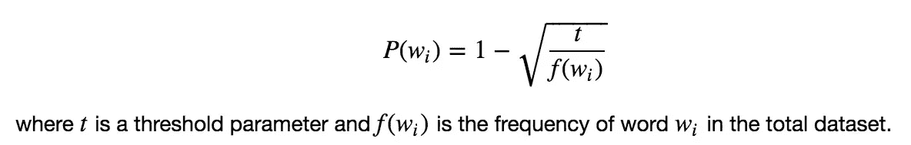

# Word2Vec(跳格模型):第 2 部分—在 TF 中的实现

> 原文：<https://towardsdatascience.com/word2vec-skip-gram-model-part-2-implementation-in-tf-7efdf6f58a27?source=collection_archive---------1----------------------->

Jupyter 笔记本:[https://github . com/mchablani/deep-learning/blob/master/embeddings/Skip-Gram _ word 2 vec . ipynb](https://github.com/mchablani/deep-learning/blob/master/embeddings/Skip-Gram_word2vec.ipynb)

张量流内置了对 skip-gram word 2 ect 所需的大部分支架的支持，包括嵌入查找和负采样。

```
tf.nn.embedding_lookup
tf.nn.sampled_softmax_loss
```

# 预处理

将输入标记化，并将输入转换为 int 表示。从单词到 int 查找，反之亦然。

# 二次抽样

经常出现的单词，如“the”、“of”和“for ”,不会为附近的单词提供太多的上下文信息。如果我们丢弃其中一些，我们可以从数据中去除一些噪声，反过来得到更快的训练和更好的表示。这个过程被米科洛夫称为子采样。对于训练集中的每个单词 wi，我们将以如下概率将其丢弃



```
from collections import Counter
import randomthreshold = 1e-5
word_counts = Counter(int_words)
total_count = len(int_words)
freqs = {word: count/total_count for word, count in word_counts.items()}
p_drop = {word: 1 - np.sqrt(threshold/freqs[word]) for word in word_counts}
train_words = [word for word in int_words if random.random() < (1 - p_drop[word])]
```

## 构建图表

```
inputs = tf.placeholder(tf.int32, [None], name=’inputs’)
labels = tf.placeholder(tf.int32, [None, None], name=’labels’)
```

注意标签是二维的，如用于负采样的 tf.nn.sampled_softmax_loss 所要求的。

嵌入矩阵的大小为单词数乘以隐藏层中的单元数。因此，如果您有 10，000 个单词和 300 个隐藏单元，矩阵的大小将为 10，000×300。请记住，我们对输入使用了标记化的数据，通常是整数，其中标记的数量就是我们词汇表中的单词数量。

```
n_vocab = len(int_to_vocab)
n_embedding =  300
embedding = tf.Variable(tf.random_uniform((n_vocab, n_embedding), -1, 1))
embed = tf.nn.embedding_lookup(embedding, inputs)
```

# 负采样

我们将更新正确标签的权重，但只有少量不正确的标签。这就是所谓的[【负抽样】](http://papers.nips.cc/paper/5021-distributed-representations-of-words-and-phrases-and-their-compositionality.pdf)。Tensorflow 有一个方便的函数可以做到这一点，`[tf.nn.sampled_softmax_loss](https://www.tensorflow.org/api_docs/python/tf/nn/sampled_softmax_loss)`。

```
# Number of negative labels to sample
n_sampled = 100
softmax_w = tf.Variable(tf.truncated_normal((n_vocab, n_embedding))) softmax_b = tf.Variable(tf.zeros(n_vocab), name="softmax_bias")

# Calculate the loss using negative sampling
loss = tf.nn.sampled_softmax_loss(
    weights=softmax_w,
    biases=softmax_b,
    labels=labels,
    inputs=embed,
    num_sampled=n_sampled,
    num_classes=n_vocab)

cost = tf.reduce_mean(loss)
optimizer = tf.train.AdamOptimizer().minimize(cost)
```

# 培养

```
batches = get_batches(train_words, batch_size, window_size)
for x, y in batches:
    feed = {inputs: x, labels: np.array(y)[:, None]}
    train_loss, _ = sess.run([cost, optimizer], feed_dict=feed)
```

# 使用 T-SNE 可视化单词向量

```
%matplotlib inline
%config InlineBackend.figure_format = 'retina'import matplotlib.pyplot as plt
from sklearn.manifold import TSNEembed_mat = sess.run(embedding)viz_words = 500
tsne = TSNE()
embed_tsne = tsne.fit_transform(embed_mat[:viz_words, :])
fig, ax = plt.subplots(figsize=(14, 14))
for idx in range(viz_words):
    plt.scatter(*embed_tsne[idx, :], color='steelblue')
    plt.annotate(int_to_vocab[idx], (embed_tsne[idx, 0], embed_tsne[idx, 1]), alpha=0.7)
```

学分:来自课堂讲稿:[https://classroom.udacity.com/nanodegrees/nd101/syllabus](https://classroom.udacity.com/nanodegrees/nd101/syllabus)