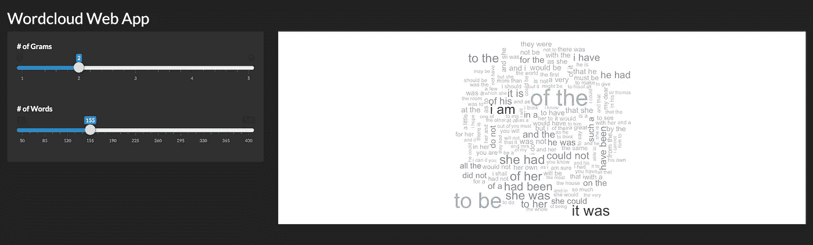
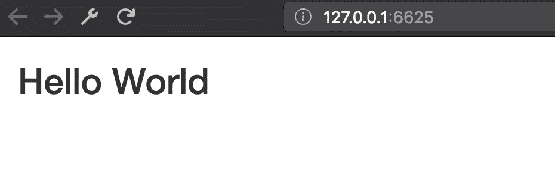

# 40 行代码的 Wordcloud Web 应用程序

> 原文：<https://towardsdatascience.com/wordcloud-web-app-in-40-lines-of-code-1be8f8fbd745?source=collection_archive---------2----------------------->


这些天来，r 的成长势头迅猛。鉴于其统计学根源，这种受欢迎程度可能看起来有些奇怪。然而，通过[哈德利·韦翰](https://en.wikipedia.org/wiki/Hadley_Wickham)和整个 R 工作室团队的惊人工作，这种情况正在改变。这种新发现的能力的一个例子是能够用少得可笑的代码编写清晰的 web 应用程序。在这篇文章中，我将演示如何使用 R！没有 Javascript，HTML 或 CSS 什么的。



Final project

# 启动和运行



Simple ‘Hello World’ with R + Shiny

通往 Hello World 的道路很简单。你需要安装 r。对于 Mac 用户来说，最简单的方法是[自制](https://brew.sh)。如果没有，你总是可以从[曲柄](https://cran.r-project.org)处得到它。你只需在你选择的终端上输入 R 就可以得到一个 R 控制台。

接下来，您需要创建一个名为 app 的文件。r 用下面的代码。我们将要做的一切背后的主要驱动力是一个叫做[闪亮](https://github.com/rstudio/shiny)的 R 包。这个神奇的包到底是什么？

> [Shiny](http://shiny.rstudio.com/) 是一个开源的 R 包，它为使用 R 构建 web 应用程序提供了一个优雅而强大的 web 框架。Shiny 帮助您将您的分析转化为交互式 web 应用程序，而不需要 HTML、CSS 或 JavaScript 知识。

一旦你做到了。您可以通过调用 R 并键入以下命令来运行该应用程序:

```
library(shiny)
shiny::runApp()
```

很简单，对吧？好吧，这只是开始。

*   闪亮的应用程序会像电子表格一样自动“活”起来。当用户修改输入时，输出会立即改变，不需要重新加载浏览器。
*   闪亮的用户界面可以完全使用 R 构建，也可以直接用 HTML、CSS 和 JavaScript 编写，以获得更大的灵活性。
*   可在任何 R 环境下工作(控制台 R、用于 Windows 或 Mac 的 Rgui、ESS、StatET、RStudio 等。)
*   基于 [Twitter Bootstrap](http://twitter.github.com/bootstrap) 的有吸引力的默认 UI 主题。
*   一个高度可定制的滑块部件，内置动画支持。
*   预构建的输出部件，用于显示 R 对象的绘图、表格和打印输出。
*   使用 [websockets](http://illposed.net/websockets.html) 包在 web 浏览器和 R 之间进行快速双向通信。
*   使用[反应式](http://en.wikipedia.org/wiki/Reactive_programming)编程模型，消除混乱的事件处理代码，因此您可以专注于真正重要的代码。

至此，我们的项目已经启动。下一步是添加侧边栏，滑块和设置我们的主面板。

尽管有些语法是新的，但它相当简单。我们用 fluidPage 定义了我们的页面样式，它允许我们利用 Bootstrap 的网格系统。然后，我们建立我们的侧边栏。接下来，我们设置两个幻灯片输入。这将允许用户在我们的 wordcloud 中更改值，这将立即反映在我们的云中。这种对输入及其后续变化的关注是 Shiny 的核心。这一过程的方法论基础是反应性。

在很大程度上，反应超出了本文的范围，但是我将从 RStudio 的优秀人员那里提供一个快速的概述。

> 闪亮的 web 框架从根本上说是让从 web 页面连接*输入值*变得容易，让它们在 R 中对你可用，并且让你的 R 代码的结果作为*输出值*写回到 web 页面。

```
input values => R code => output values
```

> 由于闪亮的 web 应用程序是交互式的，输入值可以随时更改，输出值需要立即更新以反映这些更改。
> 
> Shiny 附带了一个**反应式编程**库，你可以用它来构建你的应用程序逻辑。通过使用这个库，更改输入值自然会导致 R 代码的正确部分被重新执行，这又会导致任何更改的输出被更新。

我们已经完成了这个应用程序的 UI 所需的所有代码。现在，我们将关注服务器端。如果你是 R 和 Tidyverse 的新手，下面的语法看起来完全陌生，但是请耐心听我说。这比看起来容易。

信不信由你，就是这样。如果你想在本地运行这个，你需要声明你正在使用什么库。你可以在这里 找到这个演练 [*的最终代码。*](https://github.com/beigebrucewayne/RandomShinyApps/blob/master/wordcloud/app.R)

本演练绝非详尽无遗。Shiny 提供了很多东西，有一个看似无穷无尽的工具箱。如果你愿意，你可以编写自定义的 HTML 和 CSS。此外，像 [ShinyJS](https://github.com/daattali/shinyjs) 这样的包将会给更有经验的开发者一个机会，通过开发 Javascript 让他们的应用大放异彩。

希望这个简单的概述能揭示使用 R 和 Shiny 是多么的简单和有趣。这对于围绕模型或数据的内部工具来说是非常好的。绝对值得一个周末的黑客会议。你可以在 RStudio 上看到一系列例子来获得一些灵感。

如果你正在寻找一个更深入的教程[，由迪安·阿塔利撰写的这个](http://deanattali.com/blog/building-shiny-apps-tutorial/)是一个很好的起点！