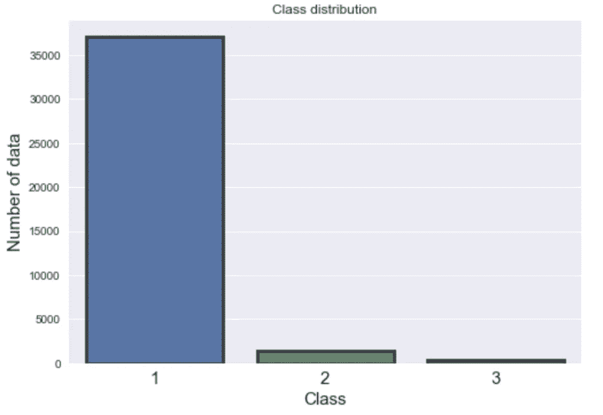
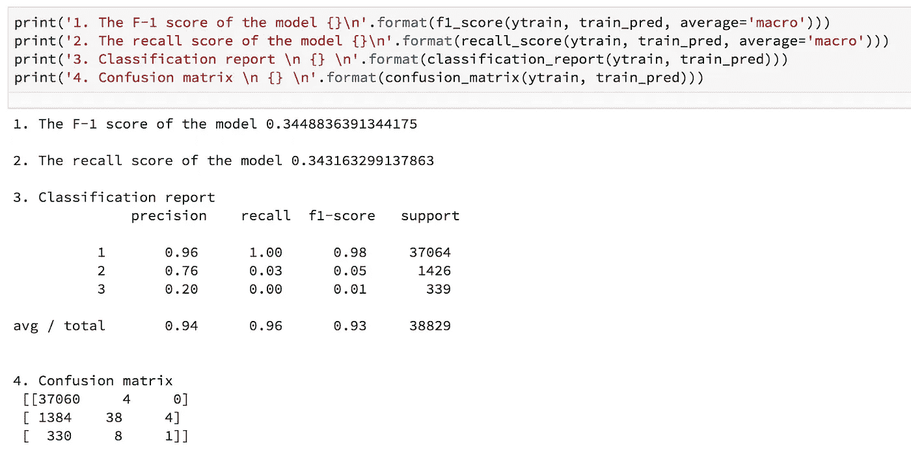
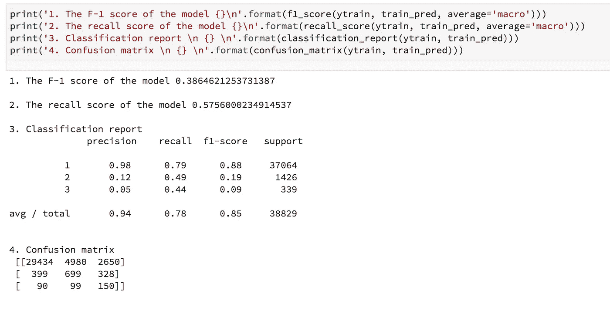
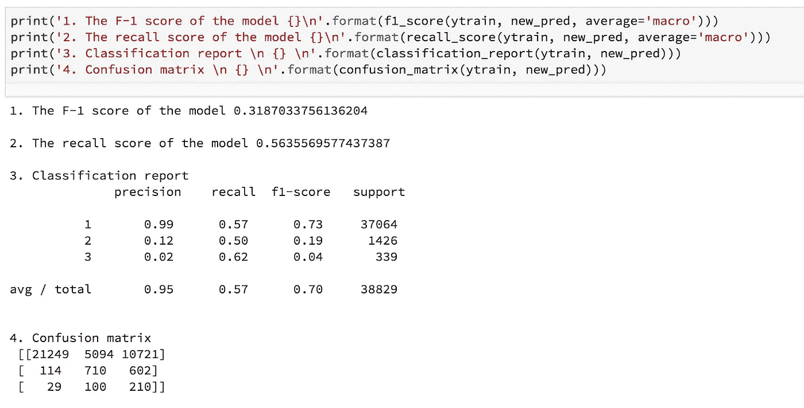

# 提高不平衡数据集下机器学习模型性能的三项重要技术

> 原文：<https://towardsdatascience.com/working-with-highly-imbalanced-datasets-in-machine-learning-projects-c70c5f2a7b16?source=collection_archive---------2----------------------->


这个项目是我最近“机器学习工程师”职位面试技能测试的一部分。我必须在 48 小时内完成这个项目，包括用 latex 写一份 10 页的报告。数据集有三个类，并且高度不平衡。这个项目的主要目标是处理数据不平衡的问题。在下面的小节中，我描述了我用来克服数据不平衡问题的三种技术。

*首先，让我们开始熟悉数据集:*

**数据集:**训练数据中有三个标签【1，2，3】，使得问题成为多类问题。训练数据集有 17 个特征和 38829 个体数据点。而在测试数据中，有 16 个特征没有标签，有 16641 个数据点。训练数据集非常不平衡。大部分数据属于 1 类(95%)，而 2 类和 3 类只有 3.0%和 0.87%的数据。由于数据集没有任何空值，并且已经缩放，所以我没有做任何进一步的处理。由于一些内部原因，我不会分享数据集，但详细的结果和技术。下图显示数据不平衡。



Figure 1: The graph shows the data imbalance in the training dataset. The majority of the data belongs to class-1 (95%), whereas class-2 and class-3 have 3.0% and 0.87% data.

**算法:**经过初步观察，我决定使用随机森林(RF)算法，因为它优于其他算法，如支持向量机、Xgboost、LightGBM 等。RF 是一种 bagging 类型的集成分类器，它使用许多这样的单个树来进行预测。在这个项目中选择 RF 有几个原因:

1.  RF 对于过拟合是健壮的(因此解决了单一决策树的最显著的缺点之一)。
2.  参数化仍然非常直观和简单。
3.  随机森林算法在高度不平衡的数据集中有很多成功的使用案例，就像我们在这个项目中所做的那样。
4.  我有以前的算法实现经验。

为了找到最佳参数，我使用 *scikit-sklearn* 实现的 GridSearchCV 对指定的参数值进行了网格搜索。更多细节可以在 [Github](https://github.com/msahamed/handle_imabalnce_class) 上找到。

## 为了处理数据不平衡问题，我使用了以下三种技术:

**A .使用集成交叉验证(CV):** 在这个项目中，我使用交叉验证来证明模型的稳健性。整个数据集被分成五个子集。在每个 CV 中，5 个子集中的 4 个用于训练，剩余的集用于验证模型。在每个 CV 中，模型还预测(概率，而不是类别)测试数据。在交叉验证的最后，我们有五个测试预测概率。最后，我对所有类别的预测概率进行平均。该模型的训练表现稳定，在每份简历上的回忆和 f1 分数几乎保持不变。这项技术帮助我在一次 Kaggle 比赛中很好地预测了测试数据，在那次比赛中，我在 5355 名选手中名列前 25 名，也就是前 1%。以下部分代码片段显示了集成交叉验证的实现:

```
for j, (train_idx, valid_idx) in enumerate(folds):

                X_train = X[train_idx]
                Y_train = y[train_idx]
                X_valid = X[valid_idx]
                Y_valid = y[valid_idx]

                clf.fit(X_train, Y_train)

                valid_pred = clf.predict(X_valid)
                recall  = recall_score(Y_valid, valid_pred, average='macro')
                f1 = f1_score(Y_valid, valid_pred, average='macro')

                recall_scores[i][j] = recall
                f1_scores[i][j] = f1

                train_pred[valid_idx, i] = valid_pred
                test_pred[:, test_col] = clf.predict(T)
                test_col += 1

                ## Probabilities
                valid_proba = clf.predict_proba(X_valid)
                train_proba[valid_idx, :] = valid_proba
                test_proba  += clf.predict_proba(T)

            test_proba /= self.n_splits
```

**B .设置类权重/重要性:**成本敏感学习是使随机森林更适合从非常不平衡的数据中学习的许多其他方法之一。RF 倾向于偏向多数阶级。因此，对少数类错误分类施加成本惩罚可能是有用的。因为这种技术被证明可以提高模型性能，所以我给少数类分配了较高的权重(即较高的误分类成本)。然后将类别权重合并到 RF 算法中。我根据 class-1 中数据集的数量与数据集中类的数量之间的比率来确定类权重。例如，类-1 和类-3 中数据集的数量之比约为 110，类-1 和类-2 的数量之比约为 26。后来，我在反复试验的基础上稍微修改了这个数字，以提高模型的性能。下面的代码片段显示了不同类权重的实现。

```
from sklearn.ensemble import RandomForestClassifier
class_weight = dict({1:1.9, 2:35, 3:180})rdf = RandomForestClassifier(bootstrap=True, class_weight=class_weight, 
            criterion='gini',
            max_depth=8, max_features='auto', max_leaf_nodes=None,
            min_impurity_decrease=0.0, min_impurity_split=None,
            min_samples_leaf=4, min_samples_split=10,
            min_weight_fraction_leaf=0.0, n_estimators=300,
            oob_score=False,
            random_state=random_state,
            verbose=0, warm_start=False)
```

**C .过度预测一个标签比预测不足:**这个技巧是可选的。自从我被要求实现这个技术以来，我就一直在应用它。在我看来，这种方法对提高少数民族学生的成绩很有影响。简而言之，如果模型误分类为类 3，则该技术对模型的惩罚最大，对类 2 的惩罚稍小，对类 1 的惩罚最小。

为了实现这个方法，我改变了每个类的概率阈值。为此，我以递增的顺序为类别 3、类别 2 和类别 1 设置概率(即，类别 3 = 0.25、类别 2 = 0.35、类别 1 = 0.50)，以便该模型被强制过度预测类别。这个算法的详细实现可以在这个项目 [Github 页面](https://github.com/msahamed/handle_imabalnce_class)找到。

# 最终结果:

以下结果显示了上述三种技术如何帮助提高模型性能。

1.  **集成交叉验证的结果:**



**2。集成交叉验证+类别权重的结果:**



**3。集成交叉验证+类别权重+过度预测标签的结果:**



## **结论**

最初，过度预测对我来说似乎很棘手。然而，研究这种方法有助于我找到解决这个问题的方法。由于时间限制，我无法专注于模型的微调和功能工程。该模型还有许多进一步改进的空间。比如删除不必要的特性，通过工程增加一些额外的特性。我也试过 LightGBM 和 XgBoost。但是在这么短的时间内，我发现随机森林比其他算法更好。我们可以尝试一些其他的算法，包括神经网络，来改进这个模型。最后，我想说，从这次数据挑战中，我学会了如何以一种组织良好的方式处理不平衡的数据。

非常感谢您的阅读。完整代码可以在 [Github](https://github.com/msahamed/handle_imabalnce_class) 上找到。如果你有任何问题或者这篇文章需要修改，请告诉我。

# 想在附近找到对机器学习感兴趣的人吗？

我将通过分享关于 xoolooloo 的有趣信息来结束这篇文章。它是一个基于位置的搜索引擎，利用相似和多重兴趣寻找当地人。例如，如果你读了这篇文章，你肯定对数据科学、图论、机器学习感兴趣。因此，你可以在你的地区找到有这些兴趣的人；去看看 www.xoolooloo.com 的

## 让我们讨论一下

如果你有任何问题，请随意提问。看到错别字、错误，或者有什么建议，请评论。你可以联系我:

```
Email: sabbers@gmail.com
LinkedIn: [https://www.linkedin.com/in/sabber-ahamed/](https://www.linkedin.com/in/sabber-ahamed/)
Github: [https://github.com/msahamed](https://github.com/msahamed)
Medium: [https://medium.com/@sabber/](https://medium.com/@sabber/)
```