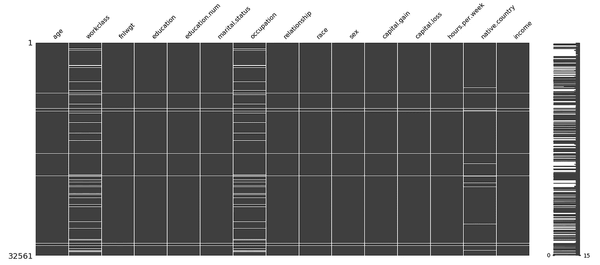
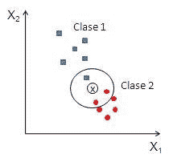
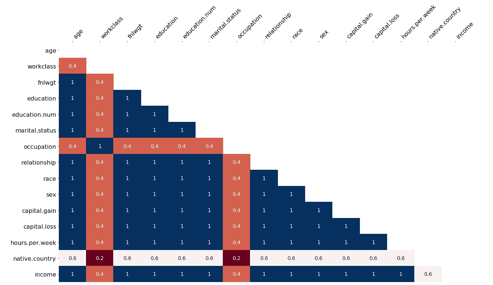
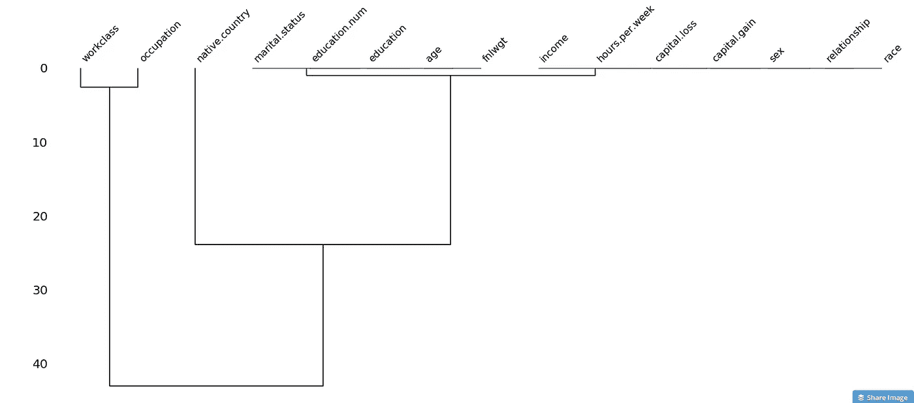

# 在机器学习中处理缺失数据

> 原文：<https://towardsdatascience.com/working-with-missing-data-in-machine-learning-9c0a430df4ce?source=collection_archive---------0----------------------->


缺失值代表了真实世界数据的混乱。发生这种情况的原因可能有很多，从数据输入过程中的人为错误、不正确的传感器读数，到数据处理流程中的软件错误。

正常的反应是沮丧。丢失数据可能是代码中最常见的错误来源，也是大多数异常处理的原因。如果你试图删除它们，你可能会大幅减少可用的数据量——这可能是机器学习中最糟糕的情况。

尽管如此，在缺失的数据点中通常存在隐藏的模式。这些模式可以为你试图解决的问题提供额外的洞察力。

> 我们可以像对待音乐中的沉默一样对待数据中的缺失值——从表面上看，它们可能被认为是负面的(没有贡献任何信息),但其中蕴含着巨大的潜力。

## 方法

*注意:我们将使用 Python 和一个* [*人口普查数据集*](https://archive.ics.uci.edu/ml/datasets/adult) *(为本教程的目的而修改)*

您可能会惊讶地发现有多少种处理缺失数据的方法。这证明了这个问题的重要性，也证明了创造性解决问题的巨大潜力。

你应该做的第一件事是数一数你有多少，并试着想象它们的分布。为了使这一步正常工作，您应该手动检查数据(或者至少是数据的一个子集),以尝试确定它们是如何指定的。可能的变体有:' NaN '，' NA '，' None '，' '，'？'和其他人。如果你有不同于' NaN '的东西，你应该通过使用 np.nan 来标准化它们。

```
import missingno as msno
msno.matrix(census_data)
```



Missing data visualisation. White fields indicate NA’s

```
import pandas as pd
census_data.isnull().sum()age                325
workclass         2143
fnlwgt             325
education          325
education.num      325
marital.status     325
occupation        2151
relationship       326
race               326
sex                326
capital.gain       326
capital.loss       326
hours.per.week     326
native.country     906
income             326
dtype: int64
```

让我们从你能做的最简单的事情开始:移除。如前所述，虽然这是一个快速的解决方案，并且在丢失值的比例相对较低(< 10%)的情况下可能有效，但大多数时候它会使您丢失大量数据。想象一下，仅仅因为某个要素中缺少值，您就不得不放弃整个观察值，即使其余的要素已经完全填充且信息丰富！

```
import numpy as np
census_data = census_data.replace('np.nan', 0)
```

第二糟糕的方法是用 0(或-1)替换。虽然这将有助于您运行您的模型，但它可能是极其危险的。这样做的原因是，有时这个值可能会产生误导。想象一个出现负值的回归问题(例如预测温度)，在这种情况下，这将成为一个实际的数据点。

既然我们已经解决了这些问题，让我们变得更有创造力。我们可以根据父数据类型来划分缺失值的类型:

## 数值分析

一个标准且通常非常好的方法是用平均值、中间值或众数替换缺失值。对于数值，你应该选择平均值，如果有一些异常值，试试中值(因为它对异常值不太敏感)。

```
**from** sklearn.preprocessing **import** Imputer
imputer = Imputer(missing_values=np.nan, strategy='median', axis=0)
census_data[['fnlwgt']] = imputer.fit_transform(census_data[['fnlwgt']])
```

## 类别分析

分类值可能有点棘手，所以在编辑后，您一定要注意您的模型性能指标(比较前后)。标准做法是用最常用的条目替换丢失的条目:

```
census_data['marital.status'].value_counts()Married-civ-spouse       14808
Never-married            10590
Divorced                  4406
Separated                 1017
Widowed                    979
Married-spouse-absent      413
Married-AF-spouse           23
Name: marital.status, dtype: int64def replace_most_common(x):
    if pd.isnull(x):
        return most_common
    else:
        return xcensus_data = census_data['marital.status'].map(replace_most_common)
```

## 结论

最重要的是，您应该知道从缺失数据中获取更多信息的不同方法，更重要的是，开始将它视为可能的洞察力来源，而不是烦恼！

快乐编码:)

## 奖励—先进的方法和可视化

理论上，您可以通过拟合回归模型来估算缺失值，例如线性回归或 k 最近邻。这一点的实现留给读者作为示例。



A visual example of kNN.

这里有一些可视化，也可以从奇妙的 [missingno](https://github.com/ResidentMario/missingno) 包中获得，它可以帮助你以相关矩阵或树状图的形式揭示关系:



Correlation matrix of missing values. Values which are often missing together can help you solve the problem.



Dendrogram of missing values