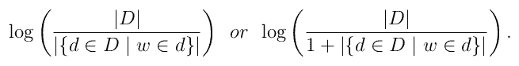
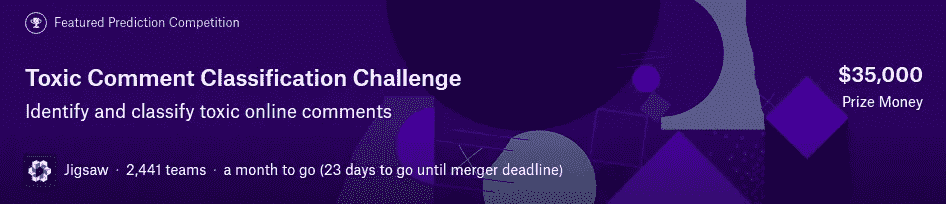

# 处理文本数据—从质量到数量

> 原文：<https://towardsdatascience.com/working-with-text-data-from-quality-to-quantity-1e9d8aa773dd?source=collection_archive---------7----------------------->


## 注意你的语言:有毒评论的挑战

由于互联网上的大量文本数据，文本处理和分析变得越来越普遍。从拼写检查等相对简单的任务到监视网络活动等更加不祥的任务，基本项目是将语言和哲学的特殊性(如意义、内涵和上下文)转换为有意义的数学对象，然后可以输入到 ML 算法中。

让我们揭开这个问题的表面，看看解决这个问题的基本方法。假设我们有一组文档(也称为*语料库*)要分析。这些文档可以是推文、句子甚至整本书。要将文档转换为向量，一个简单的尝试是对我们的词汇表 V 中的所有单词进行排序，并让文档 *d* 由向量 *v，*表示，其中如果 *d* 包含我们的词汇表中的第 *i 到第*个单词，则该向量中的第 *i 到第*个条目为 1，否则为 0。这个过程的一个显而易见的结果是，我们的语料库中的所有文档都由相同大小的向量来表示，即我们的词汇量的大小|V|。**这里的缺点是我们已经失去了所有的语言结构，**这被恰当地称为*单词袋*模型。我们所获得的是我们词汇表中每个单词的数据特征。重新获得文档局部结构的一种方法是通过添加 ngrams 来扩大我们的词汇量。这些只是被视为一个单元的 n 个连续单词(将我们的词汇单元称为'*记号'*而不是单词更合适)，这一变化允许我们考虑频繁共现的单词。

一个小小的改进是跟踪单词在文档中出现的次数，因此我们使用单词在文档中的频率，通常称为术语频率(TF ),而不是上面公式中的 1。现在，一个重要的词可能频繁出现，但频繁出现的词不一定重要；像‘the’和‘of’这样的词很少给出关于文档内容的信息。考虑到这一点，我们将使用与语料库中单词的频率成反比的权重，而不是仅使用单词的 TF 值，这通常被称为逆文档频率(IDF ),通常被认为是



TF 和 IDF 具有相反的趋势，如果该单词在文档中频繁出现，则 TF 值大(根据定义),如果该单词在语料库中的文档中频繁出现，则 IDF 权重低。这就是流行的 TF-IDF 方案的提法。

让我们玩玩这个概念，并将其应用于维基百科评论数据，作为 [Kaggle](https://www.kaggle.com/) 上 [*有毒评论分类挑战*](https://www.kaggle.com/c/jigsaw-toxic-comment-classification-challenge) 的一部分。



这里的数据由维基百科的文本评论组成，其中一些评论被贴上了一个或多个标签——“有毒”、“严重 _ 有毒”、“淫秽”、“威胁”、“侮辱”和“身份 _ 仇恨”。这里我们的文档是单独的评论，目的是学习一些模式，并用零个或多个上述标签来标记一个新的评论。让我们使用 python 中的 sklearn 来看看 TF-IDF 的实际功能。

首先，我们导入数据(名为 test 和 train 的两个 CSV 文件)和一些 python 库:

```
import numpy as np
import pandas as pd
import matplotlib.pyplot as plt
import stringfrom sklearn.feature_extraction.text import TfidfVectorizer
from sklearn.feature_extraction.text import CountVectorizer,
from sklearn.linear_model import LogisticRegression
from sklearn.model_selection import cross_val_score

train = pd.read_csv('..\train.csv').fillna(' ')
test = pd.read_csv('..\test.csv').fillna(' ')train_text = train['comment_text']
test_text = test['comment_text']
```

文本数据通常需要一些清理，但如果我们希望使用上述方案来识别包含侮辱性和有毒语言的评论，这一点更重要。我们不应该将' *F**** '和' *F**k* '视为不同的词，因为这会混淆我们的 TF 值。尽管有这样的警告，让我们满足于下面的简单函数 str_clean()并清理测试和训练文档集合。

```
# Replace all elements of punct by white spaces and delete all  numbers and a few chosen punctuation import string
from nltk.stem import PorterStemmer
ps = PortStemmer()
def str_clean(text):
    punct = '():[]?.,|_^-&><;!"/%'  
    table = str.maketrans(punct, ' '*len(punct), "0123456789$#'=")
    cleaned_comment = []
    for word in text.split():
        cleaned_comment.extend(word.translate(table).split())
        cleaned_comment = [ps.stem(word) for word in
                                                  cleaned_comment]
    return " ".join(cleaned_comment)
```

在上面的代码块中，我们用空格替换了一些标点符号，并删除了一些数字和标点符号。最后，我们使用了 nltk 包中的一个特殊的“词干分析器”将一些单词转换成它们的“词根形式”——例如，“哔”、“哔”和“哔”到“哔”。这允许我们忽略单词的某些形式，因为它们本身是不同的单词。

```
train_text = train_text.map(lambda x: str_clean(x))
test_text = test_text.map(lambda x: str_clean(x))
```

Scikit-Learn 有一个内置函数 **TfidfVectorizer** ，它将语料库作为输入，输出文档的 TF-IDF 向量——这正是我们所需要的。我们现在需要做的就是应用 **fit_transform** 方法来获得所需的矩阵。该函数有多个参数，有助于获得更好的结果；*小写*和 *strip_accents* 允许进一步清理原始文本， *min_df* 和 *max_df* 允许我们限制哪些单词进入我们的词汇表。控制我们词汇的另一个重要方法是使用 *stop_words* 参数，该参数允许删除诸如“is”、“at”和“which”之类的单词。

```
tfidf_vectorizer = TfidfVectorizer(strip_accents='unicode',
    analyzer='word', token_pattern=r'\w{1,}', ngram_range=(1, 2),
    max_features=10000)train_features = tfidf_vectorizer.fit_transform(train_text)
test_features = tfidf_vectorizer.fit_transform(test_text)
```

*max_features* 参数允许将我们的词汇表限制为最频繁出现的特性；它假设最常用的术语是最重要的。我们的另一个选择是使用 sublinear 参数，它返回 1+log(TF ),而不仅仅是 TF。这可以用在这样的情况下，即有理由假设一个比另一个令牌多 n 倍出现的令牌不是重要 n 倍，而是大约重要 log(n)倍。最后，默认情况下应用 IDF 权重。

现在，有了这些特性，我们可以预测测试集中注释的类别标签。这是一个多标签问题，因此标签并不相互排斥。我们将在 sklearn 中使用 logit 来获得循环中每个类的预测。我们将使用三重交叉验证来检查 ROCAUC 分数(本次挑战的评估指标)不会大幅波动。

```
pred = pd.DataFrame([])
labels = ['toxic', 'severe_toxic', 'obscene', 'threat', 'insult', 'identity_hate']for label in labels:    
    target = train[label]
    classifier = LogisticRegression(solver = 'sag') 
    cv_scores = cross_val_score(classifier, train_features,
                     train_target, cv=3, scoring = 'roc_auc')
    mean_cv = np.mean(cv_scores) print('CV score for label {} is {}'.format(label,mean_cv))
    print('\n') classifier.fit(train_features, train_target)
    pred[label]=classifier.predict_proba(test_features)[:, 1]
```

虽然这是一个非常基本的模型，还有许多参数优化有待执行，但它做得相当好——交叉验证得分约为 0.97。从某种意义上来说，一个评论是否包含侮辱或有毒或可被视为身份仇恨，实际上在很大程度上是由话语本身所捕捉的。我们不需要钻研注释的语法或以更复杂的方式解析它来确定给出哪个标签，所以 TF-IDF 特征提取非常适合这里。

# 接下来呢？

这里的分析可以从改进的词汇中受益。人们对侮辱和谩骂有着非凡的创造力，我们需要更好的方式来看待同一侮辱或词语的各种形式。也许几个小时的正则表达式工作可以帮助大大提高分数。

并不是所有 IDF 分值大的单词都在区分类别标签。我们可以使用一些特征选择的方法来降低我们正在处理的向量的维数，并使用其他算法来进行预测。在后面的帖子中，我们将考虑一种称为双正态比例(BNS)的特征选择方法，该方法将权重添加到术语频率，类似于 IDF 权重，但考虑了文档的实际类别标签，以确定哪个特征对预测有影响。

其他特征可以附加到 TF-IDF 矩阵之外。粗略地看一下评论，看起来被归类为有毒的评论往往有更多的标点符号。像这样的元特征可以从数据中收集。

在任何情况下，为了保持理智和功能，不要涉入太多的有毒评论！