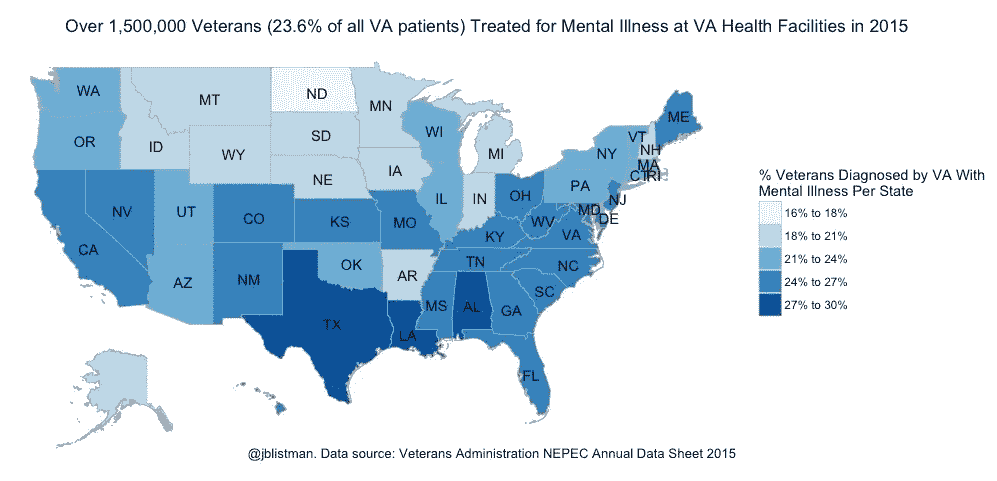

# 世界精神卫生日数据可视化:退伍军人与精神疾病

> 原文：<https://towardsdatascience.com/world-mental-health-day-data-visualization-veterans-mental-illness-f519b065ac88?source=collection_archive---------10----------------------->

10 月 10 日是世界精神卫生日，旨在提高人们对精神卫生问题的认识，加大对精神卫生的支持力度，减少社会对精神疾病的歧视。2017 年心理健康日的主题是工作场所的心理健康。

## 退伍军人面临风险

虽然许多工作场所都充满压力，而且[某些类型的工作](http://www.huffingtonpost.ca/2017/05/11/suicide-rates-by-job_n_16543360.html)或老板比其他人更有可能对心理健康造成损害，但很难想象有任何工作环境比[军人](https://www.nami.org/Find-Support/Veterans-and-Active-Duty)所经历的工作环境更容易产生压力。虽然退伍军人管理局系统的医院和门诊诊所为许多美国退伍军人提供服务，但据估计，超过 20%的退伍军人寻求退伍军人管理局系统之外的精神健康治疗，在许多情况下，因为他们住的地方离退伍军人管理局下属的治疗中心不在合理的距离内。此外，那些因收入原因而被开除军籍或不符合退伍军人服务资格的退伍军人无法从退伍军人健康服务机构获得帮助。截至 2017 年 7 月 5 日，退伍军人医疗中心将为退伍军人提供长达 90 天的[心理健康紧急情况](http://www.blogs.va.gov/VAntage/39092/va-secretary-formalizes-expansion-emergency-mental-health-care-former-service-members-honorable-discharges/)护理。

退伍军人管理局东北项目评估中心发布了 2015 财年的心理健康统计数据。根据这些数据，2015 年有 1，570，907 名退伍军人在寻求退伍军人健康服务时被诊断患有精神疾病。我已经按州绘制了使用退伍军人健康服务的确诊患有精神疾病的退伍军人的总数。

要探索数据集的其他细节，请访问这个由退伍军人事务部维护的[闪亮应用](https://mihiriyer.shinyapps.io/MentalHealth/)或包含原始数据的 [GitHub 存储库](https://github.com/mihiriyer/mental)。

## 寻求精神疾病的帮助

如果你或你认识的人现在有自杀倾向，你应该立即拨打 1–800–273–8255 的[国家预防自杀生命线](http://www.suicidepreventionlifeline.org/)，拨打 911 或去医院急诊室。

对于任何痛苦情绪的短期帮助，美国的青少年可以通过给家里发短信 741741 给 24 小时[危机短信热线](https://www.crisistextline.org)发短信

成人或青少年可以拨打 1-800-273-TALK(8255)联系 24 小时危机中心，或者发短信给 MHA，号码是 741741

T4 精神健康网站可以帮助你在当地找到支持。

退伍军人可以拨打退伍军人危机热线 800–273–8255(按 1)，或发短信 838255

## 感谢您的阅读。

我欢迎反馈——您可以“鼓掌”表示赞同，或者如果您有具体的回应或问题，请在此给我发消息。我也有兴趣听听你想在未来的帖子中涉及哪些主题。用于数据操作和数据可视化的代码可以在我的 GitHub 上找到。

**阅读更多关于我的作品**[**jenny-listman.netlify.com**](https://jenny-listman.netlify.com)**。欢迎随时通过 Twitter**[**@ jblistman**](https://twitter.com/jblistman)**或**[**LinkedIn**](https://www.linkedin.com/in/jenniferlistman/)**联系我。**

注意事项:

1.  在[https://www.va.gov/directory/guide/rpt_fac_list.cfm](https://www.va.gov/directory/guide/rpt_fac_list.cfm)找到退伍军人事务部所在地的州和邮政编码数据
2.  退伍军人事务部报告的原始数据从 Mihir Iyer 的 [GitHub 储存库](https://github.com/mihiriyer/mental)[https://github.com/mihiriyer/mental](https://github.com/mihiriyer/mental)下载
3.  使用 [R](https://www.r-project.org) 中的工具处理和绘制数据