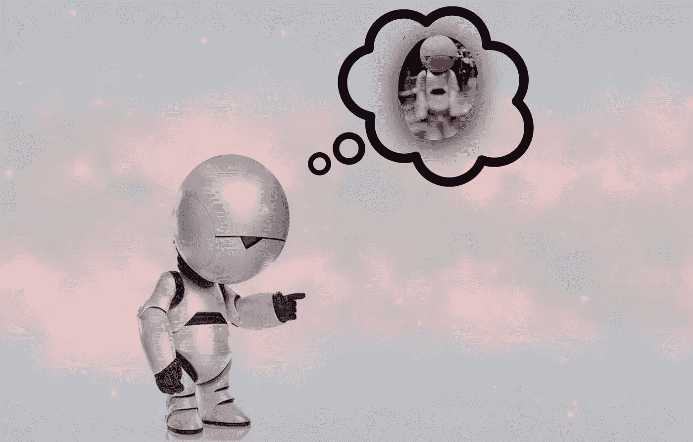
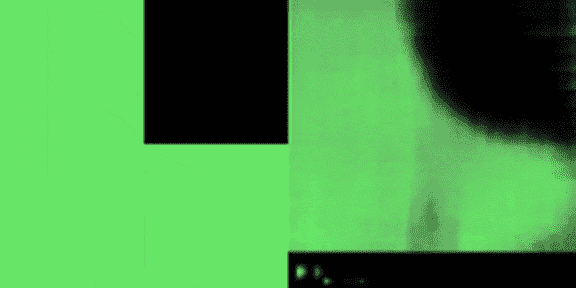
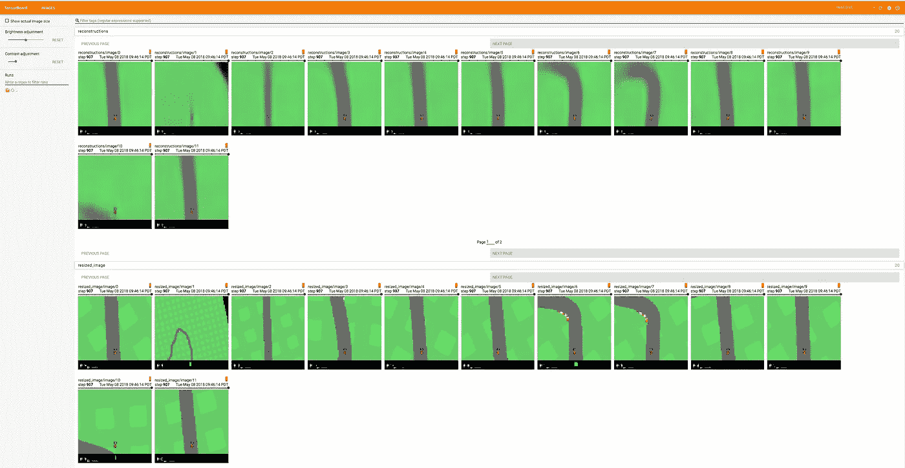
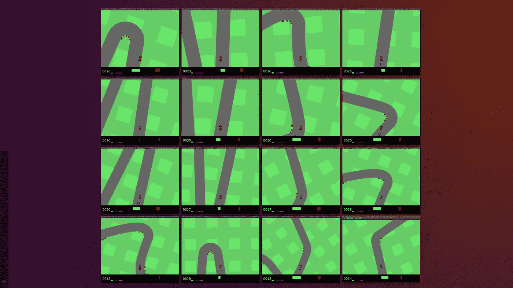
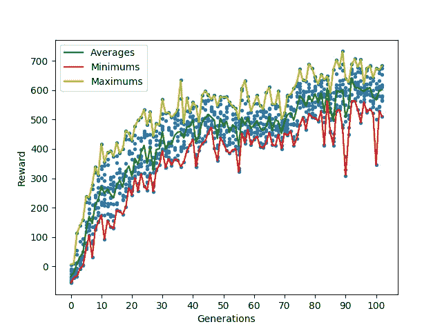
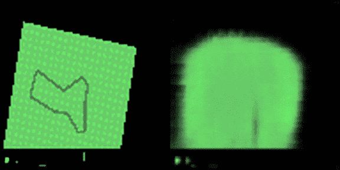

# TensorFlow 中的世界模型—第 1.0 集— OpenAi 健身房赛车

> 原文：<https://towardsdatascience.com/world-models-in-tensorflow-episode-1-2b3c217ebc8f?source=collection_archive---------8----------------------->



Creative Common License

> 代理人能了解他们自己的梦吗？

论文开头的这一句话立刻引起了我的注意。
如果你还没有读过这篇文章，我肯定会推荐它，因为它令人兴奋，而且对理解本文的内容是必要的。

## 让我们实施它

每当我偶然发现一些有趣的事情时，我总是试图自己去实现它。

据我所知，我是第二个分享本文实现的人。
大卫·福斯特写了一篇非常好的[博文](https://medium.com/applied-data-science/how-to-build-your-own-world-model-using-python-and-keras-64fb388ba459)，他在博文中一步步解释了他在 Keras 的实施。
然而，最有趣的部分——*机器的梦想*😴—缺失。

这一系列文章的目标是更深入地阅读 TensorFlow 中的代码，并在阅读过程中学习(与读者一起)。

我不会重新解释这个想法和方法，因为它们已经在最初的[论文](https://arxiv.org/abs/1803.10122)和作者写的博客中很好地覆盖了。

[](https://worldmodels.github.io/) [## 世界模特

### 互动演示:点击屏幕以覆盖代理的决定。我们探索建立生成神经网络模型的…

worldmodels.github.io](https://worldmodels.github.io/) 

## OpenAi 健身赛车

这个任务的目标是训练一个代理在模拟的轨道上驾驶汽车。代理可以看到一个 96x96 的 RGB 像素网格，以及比赛完成后的最终奖励。

代理可以通过决定转向角度[-1，1]→[左，右]，加速和刹车来控制汽车。

## 代理人如何看待世界🤖

首先要解决的是让代理人有可能以一种有意义的方式看到他们生活的世界。

作者使用[变分自动编码器](https://arxiv.org/abs/1606.05908) - *VAE* -将每一帧的信息压缩成大小为 32 的向量。
(如果你还没看过，可以看看我的另一篇文章[用人工神经网络生成数字和声音](/generating-digits-and-sounds-with-artificial-neural-nets-ca1270d8445f)使用 VAEs。)



Left: What the human sees — Right: What the agent sees (Image created by the author)

## 获取代码

让我们从克隆我的回购代码开始:

```
git clone [https://github.com/dariocazzani/World-Models-TensorFlow](https://github.com/dariocazzani/World-Models-TensorFlow)
```

将所有依赖项(只需按照[自述文件](https://github.com/dariocazzani/World-Models-TensorFlow/blob/master/README.md)和*光盘*安装到 VAE 文件夹中:

```
cd [stateless_agent/](https://github.com/dariocazzani/World-Models-TensorFlow/tree/master/stateless_agent)
```

## VAE 的数据

首先要做的是生成数据来训练 VAE，这就是 [*生成-VAE-data.py*](https://github.com/dariocazzani/World-Models-TensorFlow/blob/master/01-VAE/generate-VAE-data.py) 脚本的作用。
在运行它之前，让我们先看看几件事:

如果您有一台带有多个 CPU 的机器，这两行代码将加快整个过程。

这里有一个小技巧来迫使环境将汽车定位在赛道上的任意点:

现在运行:

```
mkdir -p ../data
python generate-VAE-data.py
```

所有的数据将被放置在根文件夹下的文件夹 *data* 中。

## 自动编码器

作者提供了他们使用的 VAE 的详细描述，因此在 TensorFlow 中对其进行编码非常简单。

该脚本与 VAE 架构的定义一起提供了两个主要功能:

1.  **train_vae()** 会加载一个已保存的模型(如果存在)或者从头开始，训练直到损耗低于一个定义的值(我是凭经验挑的)。
2.  **代理将使用 load_vae()** 将每一帧编码成一个嵌入向量。

## 训练 VAE

要开始训练变分自动编码器，只需运行:

```
python train_vae.py
```

并且在另一个终端中

```
tensorboard --logdir logdir
```

在我装有 Nvidia Geforce Titan X 的机器上，只需要几分钟就可以完成。
在 tensorboard URL 上打开浏览器，检查自动编码器是否正常工作。



Image created by the author

## 现在有趣的部分来了:让我们学开车吧！

为了驾驶汽车，代理需要输出 3 个值:

*   转向角
*   加速度值
*   制动值

我假设刹车时加速是没有意义的，所以代理只需输出 2 个参数，这将减少 1/3 的学习参数。

因为动作仅依赖于当前观察，所以参数的数量为:

```
Embedding_size * 2 + bias = 66
```

训练使用 [CMA-ES](https://github.com/CMA-ES/pycma) 学习 66 个参数。作者说他们使用了 64 种药物，每种药物都在 16 次试验中进行了评估。因为我们还没有解决高级问题(RNN 的状态被输入到控制器中)，为了加速训练，我把数字保持得较低。

当我完成完整的解决方案时，这些数字将会改变。

每个代理运行在不同的进程中，他们得到的回报是 12 次尝试的平均值。作者之一大卫·哈在他的博客[进化稳定策略](http://blog.otoro.net/2017/11/12/evolving-stable-strategies/)中很好地解释了为什么需要多次试验。

最后，运行:

```
python [train-agents.py](https://github.com/dariocazzani/World-Models-TensorFlow/blob/master/01-VAE/train-agents.py)
```



Image created by the author

并且等待…

## 几个小时后…

在我有 16 个 CPU 的机器上，我必须等待几个小时才能得到不错的结果。
差不多 100 代之后，最好的代理平均能拿到~740 的奖励。



Image created by the author

## 下一步是什么？

特工们的驾驶风格相当古怪。他们对之前发生的事情没有记忆，也没有能力预测采取某种行动后汽车会在哪里。



Image created by the author

在下一篇文章中，我将介绍如何训练 RNN，让它学会每一帧的潜在空间如何随着时间的推移和不同的动作而演变。

敬请关注，请在下面留下评论或提问😊