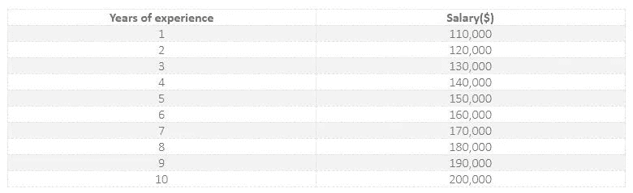
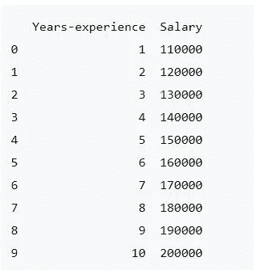
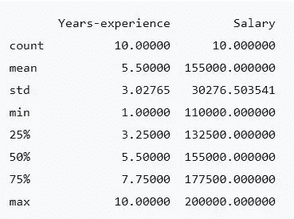
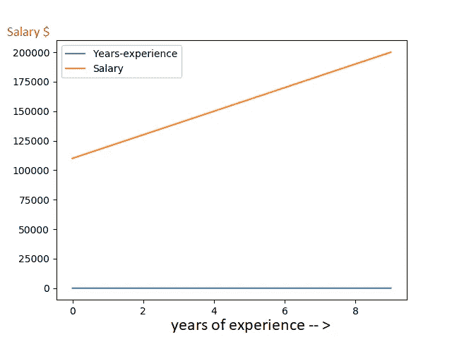

# 世界上最小的机器学习项目，将吸引你开始

> 原文：<https://towardsdatascience.com/worlds-tiniest-machine-learning-project-that-will-tempt-you-to-get-started-75a8d8db05d6?source=collection_archive---------16----------------------->


机器学习火热！互联网上有大量关于机器学习的话题和文章。

大多数初学者仍然在机器学习中消耗大量的内容，而不是自己尝试一个小程序。因为大多数教程用所有的统计、数据清理、线性代数、复杂的数学、学习 python 或 r 淹没了初学者，所以初学者更喜欢消费更多的内容，而不是创造一些东西。初学者需要一个微型的“Hello world”项目来理解这些概念。如果你是一个机器学习爱好者，如果你还没有编写你的第一个机器学习程序，这个教程/项目是为你准备的。

# 机器学习项目涉及的步骤:

以下是创建定义良好的 ML 项目的步骤:

*   理解并定义问题
*   分析和准备数据
*   应用算法并训练模型
*   预测结果

# 我们的第一个项目:让我们根据数据科学家多年的工作经验来预测他的工资

学习新平台或工具的最佳方式是端到端地从事机器学习项目，并涵盖关键步骤。从加载数据、清洗数据、汇总数据、评估算法到最后做一些预测。

我们将使用一个简单的训练数据集:

根据工作经验的年数，我们将预测工资



our dataset

为什么这是一个适合初学者解决的问题:

*   这是一个简单的单变量问题(单变量线性回归),我们用美元($)来预测工资
*   属性是数字的，所以你必须弄清楚如何加载和处理数据，而且不需要数据清理或转换
*   数据集只有 2 个属性和 10 行，这意味着它很小，很容易放入内存并易于解释。

所以，花点时间去理解问题陈述。完成每一步。

您可以简单地点击命令，将命令复制并粘贴到您的程序中

看哪！要完成这个项目，您需要在系统中安装带有机器学习库的 python。设置机器学习环境需要 30 分钟。跟随此处的指南[。](https://copycoding.com/how-to-setup-a-python-environment-for-machine-learning-with-anaconda-part-3-of-9-)

# 加载薪金数据集

*   启动 Anaconda navigator 并打开终端
*   键入以下命令启动 python 环境

```
python
```

*   让我们确保 python 环境已经启动并正在运行。将下面的命令复制粘贴到终端中，检查它是否正常工作

```
print("Hello World")
```

*   很好，让我们开始写我们的第一个程序。首先，导入项目所需的所有库是很重要的。因此，将下面的命令复制粘贴到终端中。(您可以一次复制全部内容)

```
import pandas
import numpy as np
import matplotlib.pyplot as plt from sklearn.metrics 
import accuracy_score
```

*   现在，让我们加载 salary training 数据集，并将其分配给一个名为“data set”的变量

```
#Load training dataset
url = "[https://raw.githubusercontent.com/callxpert/datasets/master/data-scientist-salaries.cc](https://raw.githubusercontent.com/callxpert/datasets/master/data-scientist-salaries.cc)"
names = ['Years-experience', 'Salary']
dataset = pandas.read_csv(url, names=names)
```

# 汇总数据并进行分析

让我们来看看我们的训练数据集:

*   数据集的维度:使用 shape 属性找出我们的数据集有多少行和列

```
# shape
print(dataset.shape)
```

结果:(10，2)，这意味着我们的数据集有 10 行 2 列

*   要查看数据集的前 10 行

```
print(dataset.head(10))
```

结果:



*   找出数据的统计摘要，包括计数、平均值、最小值和最大值以及一些百分点。

```
print(dataset.describe())
```

结果:



# 可视化数据并执行分析

现在，我们已经加载了库，导入了数据集，并进行了一些数据处理。现在是我们查看数据并理解它的时候了。

*   让我们用曲线图来看看数据集。复制粘贴以下命令，在我们的数据集上绘制一个图形

```
#visualize
dataset.plot()
plt.show()
```



如图所示，我们有两个参数。年资和薪资。橙色线表示两者之间的相关性

# 拆分数据

在机器学习中，我们有两种数据集

*   训练数据集—用于训练我们的模型
*   测试数据集—用于测试我们的模型是否做出准确的预测

由于我们的数据集很小(10 条记录)，我们将使用 9 条记录来训练模型，1 条记录来评估模型。复制粘贴下面的命令来准备我们的数据集。

```
X = dataset[['Years-experience']]
y = dataset['Salary']
from sklearn.model_selection import train_test_split
X_train, X_test, y_train, y_test = train_test_split(X, y, test_size=0.1, random_state=101)
```

# 训练模型

现在我们已经分析了数据，并准备好了我们的训练和测试集。我们将使用下面的命令来训练我们的模型。在这个例子中，我们选择线性回归，因为我们试图预测一个连续的数字(薪水)

```
from sklearn.linear_model import LinearRegression
model = LinearRegression()
model.fit(X_train,y_train)
```

# 测试模型

我们已经有了训练好的模型，现在我们应该开始用它来预测。让我们使用我们的测试数据集来估计我们的模型的准确性

```
predictions = model.predict(X_test)
print(accuracy_score(y_test,predictions))
```

我们得到了 1.0，这是我们模型的 100%准确性。这是理想的准确度分数。在生产系统中，任何超过 90%的都被认为是成功的模型

我们也可以用我们自己的输入来测试我们的模型

让我们试试一个有 6.3 年经验的人能赚多少钱

```
print(model.predict(6.3))
```

结果:【163000。].我们的模型估计一个有 6.3 年经验的人需要 16.3 万英镑。

恭喜你完成了你的第一个机器学习项目。现在休息一下，去慢跑，或者欣赏一下你渴望已久的网飞秀

# 摘要

总之，在本教程中，您逐步了解了如何使用 Python 中的第一个机器学习项目来导入、分析和预测

# 你的下一步

再次浏览这个教程来修正你的理解。列出你的疑问并在网上搜索。激动吗？需要多运动？尝试另一个机器学习项目:

**下一步:** [你用 python 进行机器学习的第二个实践项目](https://copycoding.com/your-second-machine-learning-project-with-this-famous-iris-dataset-in-python-part-5-of-9-)

*最初发表于*[*【copycoding.com】*](https://copycoding.com/your-first-machine-learning-project-in-python-with-step-by-step-instructions)*。机器学习社区*