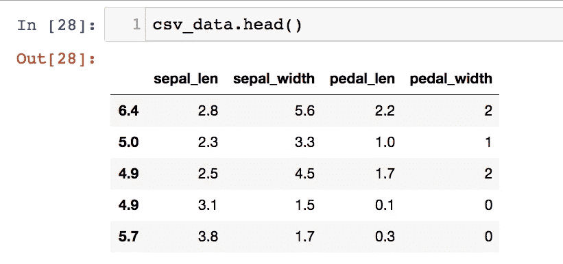
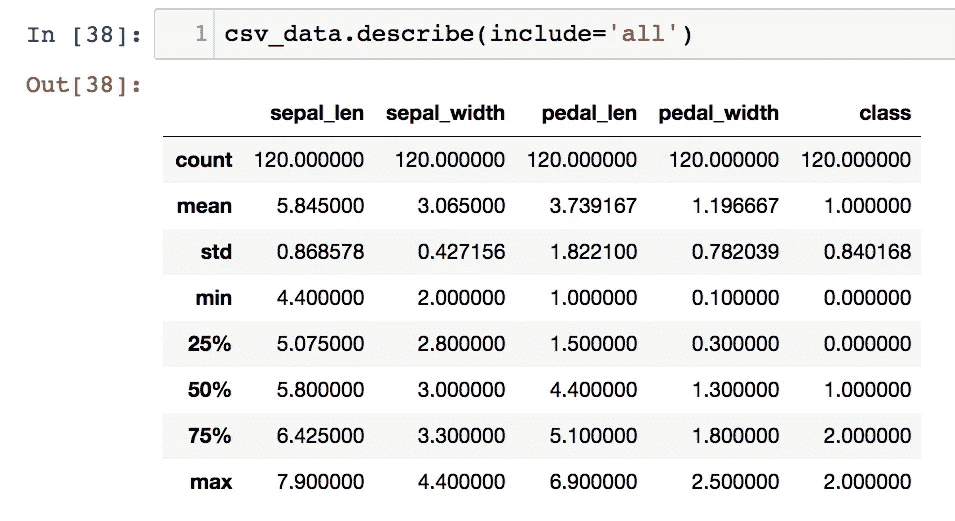
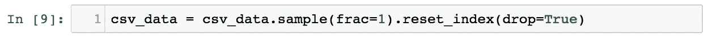
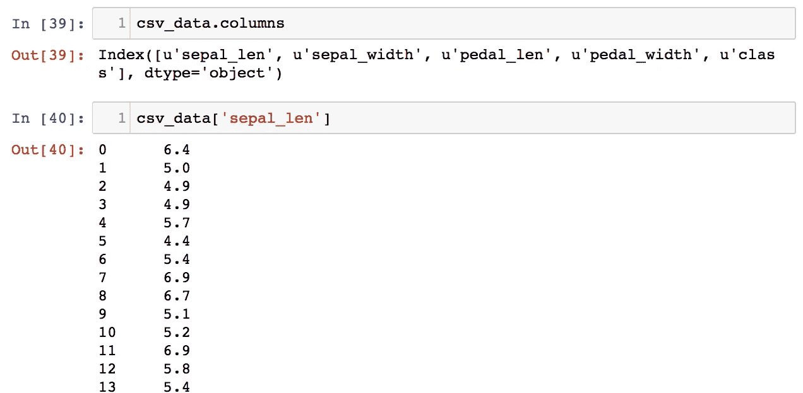
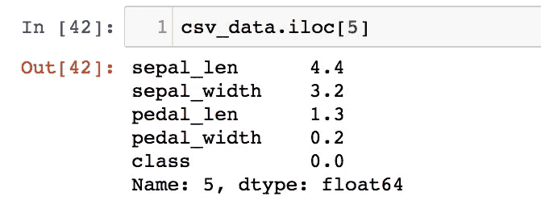
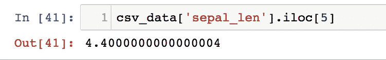
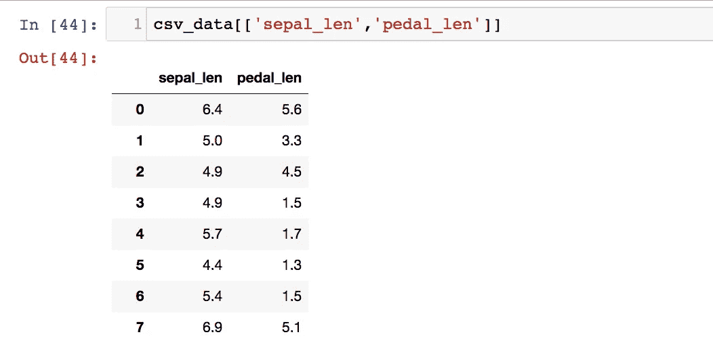
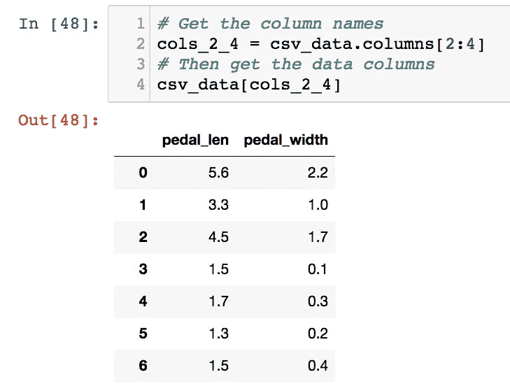
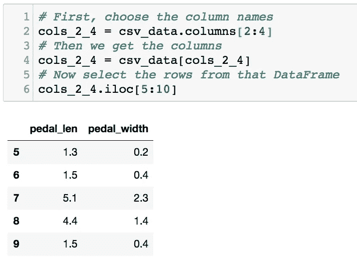

# 与熊猫争论数据

> 原文：<https://towardsdatascience.com/wrangling-data-with-pandas-27ef828aff01?source=collection_archive---------2----------------------->

熊猫以竹子为食，非常擅长长时间睡眠。但是他们也有一个秘密的力量:啃下大数据集。今天，我们将介绍数据争论中最强大和最受欢迎的工具之一，它叫熊猫！

当你想到数据科学时，熊猫可能不是第一个想到的。这些黑白熊通常大部分时间都在吃竹子和睡觉，而不是做数据科学！但是今天，我们将使用[熊猫](http://pandas.pydata.org/)来操作我们的数据集，并为机器学习设置它。我不能在一个视频中对整个图书馆进行公正的评价，但希望这个概述能帮助你开始，我会让你更深入地探索熊猫的迷人世界。

Chomping on datasets! This dataset looks like bamboo, however.

[Pandas](http://pandas.pydata.org/) 是一个开源的 python 库，它提供了易于使用的高性能数据结构和数据分析工具。撇开 Cuddley bears 不谈，这个名字来自术语‘panel data’，指的是统计学和计量经济学中遇到的多维数据集。

要安装 pandas，只需在 python 环境中运行`pip install pandas`。然后我们就可以`import pandas as pd`了。

熊猫最常见的用途之一是使用`pd.read_csv`读取 CSV 文件。往往是利用熊猫的起点。

`pd.read_csv`将该数据加载到数据帧中。这可以被认为本质上是一个表格或电子表格。我们可以通过在数据帧上调用`head()`来快速浏览一下我们的数据集。

数据帧包含带有命名列的数据行，在 pandas 中称为“系列”。

对我来说，Dataframes 最棒的地方之一是`describe()`函数，它显示了关于 Dataframe 的统计表。这对于检查数据集的完整性非常有用，可以查看数据的分布是否合理，以及属性是否符合您的预期。

我有时也会用熊猫来打乱我的数据。这在您想要混洗整个数据集而不仅仅是在提取数据时有一个先行缓冲区的情况下非常有用。例如，如果您的数据根本没有被打乱，而且实际上是排序的，那么您会希望对它进行额外的混合。

然而，对于不适合内存的非常大的数据集，如果没有更复杂的方法，这可能是不切实际的。

## 列访问

要访问数据集的特定列，请使用括号符号来提取该列，并传递该列的名称。如果您想知道可能的列名是什么，您可以回顾一下`.describe()`输出的顶部，或者使用`.columns`将数据帧中的所有列作为一个数组来访问。

## 行访问

访问数据帧的行与访问列略有不同。例如，如果我们想要一个给定数据帧的索引为`i`的行，我们可以使用`.iloc[i]`。

This is index 5, so it’s the 6th row of data

请记住，Pandas 是基于 0 的索引系统，所以第一行实际上是索引 0。

## 列和行在一起

有时您可能需要特定的行和列。因为行和列的访问方式不同，所以我们需要结合上述技术来完成这项工作。

你也可以把事情调换一下，使用`csv_data.iloc[5][‘sepal_len’]`，但我觉得这样可读性较差。

## 行和列范围

更有趣的是当你想得到一系列的行和列时。

在列方面，获取多列的方法是传入一个列名数组。

如果需要输入更多的列名，您可以使用`csv_data.columns`输出数组并从中选择一系列列名，然后使用它来选择列。

I guess I could have just typed the names of the 2 columns … but you get the idea.

如果我们想要得到一系列的行，我们在跟随`.iloc`的括号内使用冒号符号:

包括起始索引，但不包括结束索引。请注意，这会返回行索引 5、6、7、8 和 9，但不会返回行索引 10。

## 行和列的范围

假设我们两个都想要——列的子集*和行的子集*。那会是什么样子？我们可以将目前使用的所有技术结合起来，做出一个表达式来完成这项工作。

首先，像前面一样选择列名:

`cols_2_4 = csv_data.column[2:4]`

然后我们得到列:

`df_cols_2_4 = df[cols_2_4]`

现在从该数据帧中选择行:

`df_cols_2_4.iloc[5:10]`

一旦你掌握了窍门，你将开始把这些变量压缩成一个表达式，就像这样:

`csv_data[csv_data.columns[2:4]].iloc[5:10]`

我鼓励你在这里停下来，看看这个表达式是如何等价于我们刚刚在上面展示的。你回来的时候我还会在这里。

## 包扎

Pandas 中的链接操作不仅能让你更快地处理数据，而且一旦你掌握了它，它的可读性会更好。

到目前为止，我们已经看到了一些简单的数据帧操作，但是熊猫生态系统还提供了更多的功能，从 PyTables 和 HDF5 格式的高效文件存储，到运行各种统计分析。

走出去，尝试野生大熊猫！

感谢阅读这一集的[云人工智能冒险](https://goo.gl/UC5usG)。如果你喜欢这个系列，请为这篇文章鼓掌让我知道。如果你想要更多的机器学习动作，一定要关注媒体上的[我](https://medium.com/@yufengg)或[订阅 YouTube 频道](https://goo.gl/S0AS51)以观看未来的剧集。更多剧集即将推出！