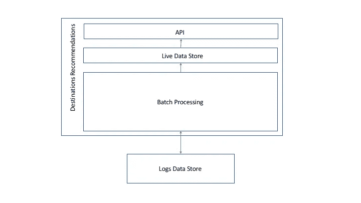
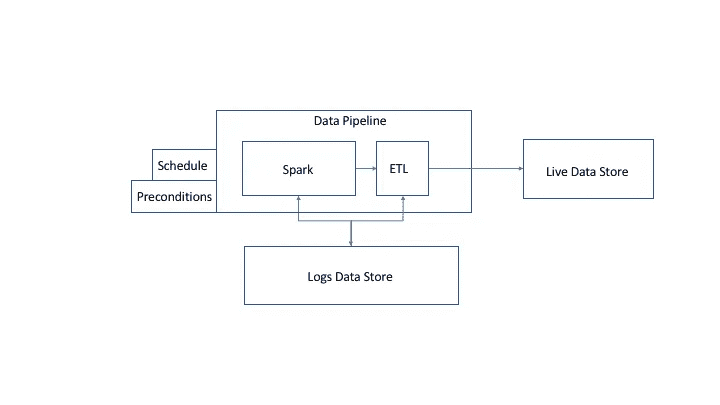
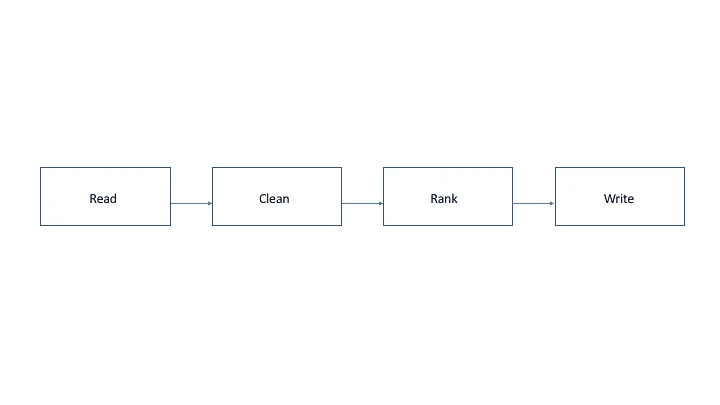

# 编写代码:

> 原文：<https://towardsdatascience.com/write-the-code-f6d58c728df0?source=collection_archive---------1----------------------->

## Skyscanner 推荐目的地背后的架构

安德烈·巴博萨

在 Skyscanner，我们处理大量数据。一部分来自我们的合作伙伴的机票、酒店或租车费用，一部分来自我们的用户。传统上，我们的产品专注于使用我们从合作伙伴那里收集的数据来为我们的旅行者产品提供支持，我们使用来自用户的匿名行为数据来验证我们的假设并做出商业决策。

我们现在开始构建新一代产品，这些产品不仅基于我们合作伙伴的数据，还基于匿名化的用户行为数据，以提供更好、更个性化的体验。这些新产品带来了新的挑战，我们正在用新的方法和技术应对这些挑战。 [**你可以通过订阅我们的 CodeVoyagers 简讯**](http://tr4ckit.com/andre_codevoyagersmailinglist) 在这里看到更多我们的报道。

最近，我们在移动应用程序的“探索”屏幕上添加了推荐目的地。

Skyscanner’s Recommended Destinations functionality pictured above

这意味着我们的用户不仅可以获得最优惠的价格，还可以利用我们的集体知识为他们的旅行寻找灵感。我们每天都会计算这些建议，并根据用户位置对其进行个性化设置。

历史上，这个屏幕上的发现提要是由我们的“无处不在”搜索提供的，允许用户探索市场上最好的交易。对于推荐的 feed，我们采取了一种稍微不同的方法，将价格放在一边，专注于用户的实际去向。到目前为止，自发布以来，我们已经看到我们的转化率增加了 5%以上。

这篇文章将概述我们为提供目的地推荐而构建的技术架构。

## 要求

让我们先来看看支持这些建议的平台要求。从高层次的角度来看，有三点是问题的核心。我们需要:

*   存储大量历史数据，可用于训练和测试我们的模型；
*   处理大量数据；
*   以最小的延迟向用户提供结果建议。

但是，当我们开始深入挖掘时，我们需要关心的事情更多了:

*   快速实验——我们依靠用户反馈来验证我们的假设，因此我们需要能够轻松地即插即用新算法，并从管道的另一端获得结果；
*   最低运营成本—我们专注于产品，因此我们负担不起花费太多时间来运行手动工作或维护基础架构。

## 体系结构

考虑到这些需求，我们设计了一个两层架构，如下图所示。

Two-tiered architecture behind Skyscanner’s Recommended Destinations

在最底部，我们有“日志数据存储”,它存储任何 Skyscanner 团队通过我们的数据平台记录的每个用户事件。我们的批处理层离线运行，并通过消费数据和运行一系列算法来利用这个数据存储。完成后，它会向实时数据存储提供新的推荐。这个数据存储是一个低延迟 web API 的基础，它为我们的用户提供计算数据。

在批处理和实时之间进行明确分离的主要优势之一是，它为试验新算法和数据集提供了很大的空间。只要结果符合预定义的模式，我们知道它们可以由 API 提供服务。

因为我们希望保持较低的运营成本，所以该架构构建为在 AWS 云上运行。日志数据存储基于 S3，由我们的数据管理团队维护。

## 深入探讨批处理

The batch processing layer is where we do all the data transformations that generate the recommendations that we serve through the live service.

批处理层是我们进行所有数据转换的地方，这些数据转换生成我们通过实时服务提供的建议。

[我们使用 AWS 数据管道](https://aws.amazon.com/datapipeline/)来协调这项工作。DataPipeline 非常适合我们的用例，有助于为我们的批处理作业带来可靠性。

附加到我们的数据管道，我们有一个时间表，我们希望我们的批处理作业运行。这并不比普通的 cron 工作更花哨。但是将它与整个系统集成并完全由 AWS 管理是非常方便的。

我们还附加了一系列先决条件。这些有助于使管道更加可靠。我们使用这个特性来确保在开始这个过程之前，我们已经得到了我们需要的所有数据。当一些输入是不同批处理作业的输出时，这尤其重要。也可以将前提条件配置为等待一段时间，因此即使在计划的时间没有满足某个条件，也不一定意味着作业会失败，它可能只是稍微晚一点执行。这还意味着，如果先决条件从未得到满足，作业将在配置任何硬件之前失败，因此我们不会产生任何不必要的成本。

当所有先决条件通过时，DataPipeline 将提供一个 [EMR 集群](https://aws.amazon.com/emr/)。EMR 是 AWS 托管的 [Hadoop YARN](https://hadoop.apache.org/docs/r2.7.2/hadoop-yarn/hadoop-yarn-site/YARN.html) 版本，适合您选择的分布式数据处理系统。[我们选择了星火](http://spark.apache.org/)。我们选择 Spark 有两个主要原因:它非常快，很大程度上是因为它的内存缓存，而且它对开发人员非常友好。我们特别喜欢 Spark SQL 和 DataFrame 抽象。此外，PySpark 是我们的一大卖点。

我们编写的大部分代码都是作为 Spark 作业运行的。即使细节可能变得有点复杂，从高层次的角度来看，代码如下图所示。

Read Clean Rank Write

## 现场服务的深度探讨

我们已经看了我们如何产生推荐；现在让我们来看看我们是如何为他们服务的。你可能已经猜到了，这一层非常薄，我们尽最大努力让它尽可能的轻和简单。

对于我们的实时数据存储，我们决定使用 [Postgres](https://www.postgresql.org/) 。我们选择它是因为:

*   它在 [RDS](https://aws.amazon.com/rds/) 中可用，AWS 的托管关系数据库具有[开箱即用的多区域复制](https://aws.amazon.com/about-aws/whats-new/2016/06/amazon-rds-for-postgresql-now-supports-cross-region-read-replicas/)，这意味着我们的维护工作最少
*   它具有非常低的延迟(我们一贯测量每个查询低于 5 毫秒)
*   很容易针对读取密集型工作负载进行扩展
*   随着产品的成熟，修改模式和查询相对容易

在数据存储的前面有一个服务 REST API 的 web 服务。在 Skyscanner，我们相信微服务，最近开始向前端的后端发展。这意味着我们的移动客户端不需要直接查询这个 API，他们通过一个 BFF 服务来完成，这个 BFF 服务聚合了他们渲染最终 UI 所需的所有数据。这个特殊的架构决策使得我们在这一层的工作变得更加容易。这意味着我们可以提供一个非常简单的 API，供另一个内部服务使用。这样，我们最大化了可重用性，并使我们能够在不改变合同的情况下试验许多不同的 UI。

## 结论

我们已经在生产中运行了一段时间。到目前为止，它基本上是无痛的，但也不是没有学习和迭代的公平份额。在批处理层编写新算法并让它们立即投入使用的灵活性已经得到了回报，我们正在不断迭代。另一方面，维护 DataPipeline 所需的维护工作可能被低估了一点，因为我们最终花费了相当多的时间来处理服务中的许多警告。

我们预计未来面临的挑战之一是扩大批处理层的输出规模。输出的大小与我们使用的个性化因子成比例。例如，如果我们开始计算为每个 Skyscanner 用户单独定制的推荐，输出的大小将乘以我们用户群的大小。我们当前替换实时数据存储上的数据集的策略可能无法在这种规模下保持，在某个时候，我们将需要重新考虑该架构决策。

还有实时模型的问题。目前，一切都是批量完成的，但可能有产品需要更新鲜的结果。在 Skyscanner，我们已经使用 [Kafka](http://kafka.apache.org/) 进行流式数据处理，使用 [Samza](http://samza.apache.org/) 进行一些实时处理。所以基础设施的这一面不会是最难的部分。但是，我们可能需要重新考虑我们为实时数据存储选择的 Postgres，并可能转向更容易在写入繁重的工作负载上扩展的东西。

## 与我们合作

我们在 Skyscanner 以不同的方式做事，我们正在全球办事处寻找更多的工程团队成员。看看我们的 [Skyscanner 职位](http://andre_skyscannerjobspage)寻找更多空缺。

## 关于作者

大家好，我是 André，是 Skyscanner 的一名软件工程师。我是忠诚的常客部落中的一员，我们致力于改善那些知道乘务员名字的旅客的体验。我热衷于提供产品，为人们的生活增加价值，并将其发展到世界规模。

Andre Barbosa