# " WTH，神经网络会学习吗？"—新来者的困境

> 原文：<https://towardsdatascience.com/wth-does-a-neural-network-even-learn-a-newcomers-dilemma-bd8d1bbbed89?source=collection_archive---------1----------------------->

Photo by [ANDRIK LANGFIELD PETRIDES](https://unsplash.com/photos/BCChEYrooGU?utm_source=unsplash&utm_medium=referral&utm_content=creditCopyText) on [Unsplash](https://unsplash.com/search/photos/solution?utm_source=unsplash&utm_medium=referral&utm_content=creditCopyText)

我相信，我们的大脑中都有一个喜欢思考思维是如何发生的心理学家/哲学家。

> “深度网络具有层次结构，这使得它们特别适合于学习知识的层次，这些知识在解决现实世界的问题时似乎是有用的。更具体地说，在解决图像识别等问题时，使用不仅理解单个像素，还理解越来越复杂的概念的系统会有所帮助:从边缘到简单的几何形状，一直到复杂的多对象场景。”
> 
> ——**迈克尔·尼尔森在他的书** [**神经网络和深度学习**](http://neuralnetworksanddeeplearning.com/about.html)

那里。

神经网络学习内容的简单、清晰的鸟瞰图——它们学习“越来越复杂的概念”。

*这感觉不熟悉吗？我们不就是这样学习的吗？*

例如，让我们考虑一下，我们作为孩子，可能是如何学会识别物体和动物的——

*   我们学习什么是“手”、“腿”、“眼睛”、“鼻子”、“嘴”和“耳朵”。
*   我们学习数数，知道我们有两条腿、手、眼睛和耳朵，只有一个鼻子和嘴。
*   然后，我们观察狗，了解到狗和我们一样，但是有四条腿而不是两条腿，而且没有手。
*   然后我们了解到大象是一种动物，就像狗一样，但是很大，鼻子长得出奇。

看到了吗？

所以，神经网络像我们一样学习！

这几乎让我们相信我们拥有这种无形的东西..人造的“东西”那是类比于心灵本身的！对于刚开始深度学习之旅的人来说，尤其具有吸引力。

但不是。神经网络的学习与我们自己的学习不同。几乎所有关于深度学习的可信指南和“入门包”都附有警告，大致如下:

> **免责声明**:神经网络只是非常松散地受到大脑的启发。它们并不代表真实人脑的功能。
> **警告**:在神经学家面前，他们这样做的任何主张都可能引发一场激烈的舌战。

**..这就是所有混乱的开始！**

Francois Chollet- one of the pioneers of Deep Learning, author of the Keras framework

## 困惑和为什么它会在那里

我认为这主要是因为大多数教程和初级书籍处理这个问题的方式。

让我们看看迈克尔·尼尔森(Michael Nielsen)在他的书《神经网络和深度学习:

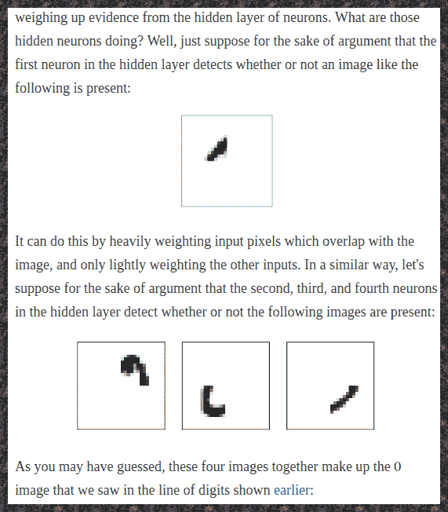

An excerpt from Neural Networks and Deep Learning by Michael Nielsen

像许多其他人一样，他使用神经网络和人类思维之间的类比来试图解释神经网络。线条和边缘形成循环的方式有助于识别一些数字，这就是我们想要做的。许多其他教程试图使用类似的类比来解释构建知识层次的含义。

不得不说，因为这个类比，我对神经网络的理解更深了。

但是这是一个悖论，使一个困难的概念为大众所理解的类比，也能在他们中间产生一种知识的幻觉。

读者需要明白，这只是一个类比。不多不少。他们需要明白，每一个简单的类比后面都需要有更严谨、看似困难的解释。

别误会我的意思。我非常感谢迈克尔·尼尔森写了这本书。这是关于这个主题的最好的书之一。他小心翼翼地提到这是*“只是为了论证”*。

但我把它理解为这个意思—
*也许，网络不会使用完全相同的片段。也许，它会找出一些其他的碎片，并以其他方式将它们连接起来，以识别这些数字。但本质会是一样的。对吗？我的意思是，每一部分都必须是某种边缘或线条或某种环状结构。毕竟，如果你想建立一个层次结构来解决识别数字的问题，似乎没有其他的可能性。*

随着我对它们以及它们如何工作有了更好的直觉，我明白这种观点显然是错误的。它击中了我..

## 甚至循环和边缘都不像是 NN 的可能性！

让我们考虑一下循环—

能够识别环对我们人类书写数字至关重要-8 是两个首尾相连的环，9 是下面有尾巴的环，6 是上面有尾巴的环。但是当涉及到识别图像中的数字时，像循环这样的特征对于神经网络来说似乎是困难和不可行的(*记住，我说的是你的普通神经网络或* [*MLPs*](https://en.wikipedia.org/wiki/Multilayer_perceptron) *这里是*)。

1.  除了“0”和“8”之外，如果“6”在图片的下半部分，循环只能帮助识别它；如果“9”在图片的上半部分，循环可以帮助识别它。
2.  因此，如果我们有一个简单的网络，只有一个隐藏层，我们已经“用完”了该层的 2 个神经元，每个神经元对应于环路的一个位置(上/下)。当你考虑到可能出现的不同形状的环，以及这些数字可以被画出的不同空间位置时，这个数字会迅速增加。
3.  现在，即使是一个基本的网络架构(香草神经网络)也可以在只有 20-30 个隐藏神经元的情况下实现显著的准确性(> 95%)。所以，你可以理解为什么这样一个神经网络可能不会进入循环那么多。

我知道这只是一大堆“手动波动”的推理，但我认为这足以令人信服。很可能，边缘和所有其他手工设计的功能将面临类似的问题。

*..这是一个两难的问题！*

## 那么，神经网络实际上会学习哪些特征呢？

直到 [3blue1brown](https://www.youtube.com/channel/UCYO_jab_esuFRV4b17AJtAw) 发布了一组关于神经网络的视频，我才知道答案或者如何找到它。格兰特·桑德森负责向新来者解释这个问题。也许他甚至觉得其他人的解释中有一些缺失，他可以在他的教程中解决这些问题。

好家伙，他做到了！

## 视频

3blue1brown 的格兰特·桑德森(Grant Sanderson)使用了一个有两个隐藏层的结构，他说

> 最初，我激发这种结构的方式是通过描述一种希望，即第二层可能会拾取小边缘，第三层将这些边缘拼凑在一起以识别循环和更长的线，这些可能被拼凑在一起(在最后一层)以识别数字。

我们上面排除的环和边。

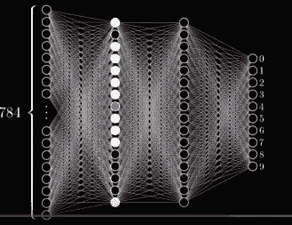

Structure of the neural network used in [3blue1brown’s video series](https://www.youtube.com/playlist?list=PLZHQObOWTQDNU6R1_67000Dx_ZCJB-3pi)

> 这就是我们的网络实际在做的事情吗？
> 
> 至少在这一点上——一点也不！

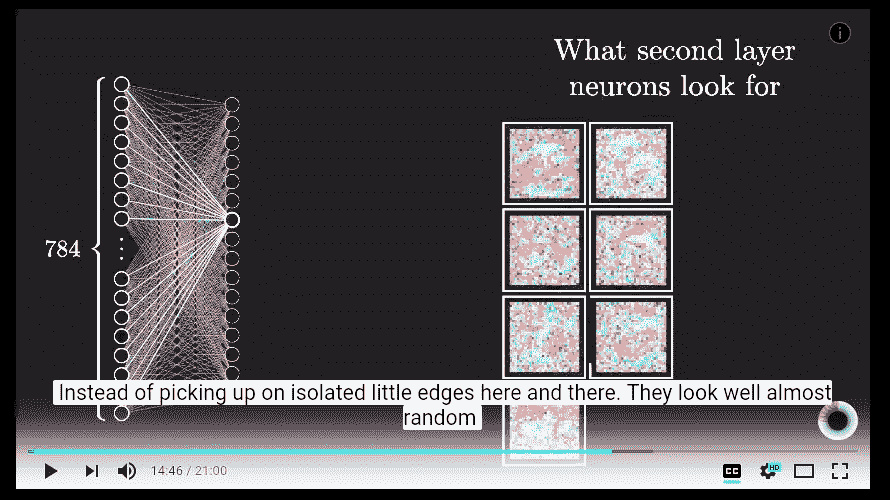

The weight matrices for the 1st hidden layer visualised

> 他们不再四处寻找孤立的小边缘，而是寻找..嗯，几乎随机(！)只是中间却有些非常松散的模式

他们不是在寻找循环或边缘或任何一点点接近的东西！他们在寻找..*好莫名其妙的事情..一些奇怪的模式，可以混淆为随机噪声！*

# 该项目

我发现那些权重矩阵图(在上面的截图中)真的很吸引人。我认为它们是一个乐高拼图。

权重矩阵图像就像基本的乐高积木，我的任务是找出一种方法将它们排列在一起，这样我就可以创建所有的 10 个数字。这个想法的灵感来自于我上面贴的神经网络和深度学习的节选。在那里，我们看到了如何使用手工制作的特征(如边缘和曲线)组装 0。所以，我想，也许，我们可以对神经网络实际发现的好的特征做同样的事情。

我所需要的只是 3blue1brown 的视频中使用的那些权重矩阵图像。现在的问题是格兰特在视频中只放了 7 张图片。所以，我不得不自己制作它们，创造我自己的一套乐高积木！

## 乐高积木，组装！

我把迈克尔·尼尔森书中使用的代码输入到一个 Jupyter 笔记本中。然后，我在那里扩展了`Network`类，以包含帮助我可视化权重矩阵的方法。

网络中的每个连接对应一个像素。每个神经元的一个图像显示它有多“喜欢”(颜色:蓝色)或“不喜欢”(颜色:红色)前一层神经元。

因此，如果我观察隐藏层中某个神经元的图像，它就像一张显示一个特征的热图，一个基本的乐高积木，将被用来识别数字。蓝色像素代表它“喜欢”的连接，而红色像素代表它“不喜欢”的连接。

Heat map showing the Carbon Monoxide density. Credits- Nasa Earth Observatory

我训练了一个神经网络:

*   1 个输入层(784 个节点)
*   1 个隐藏层(30 个节点)
*   1 个输出层(10 个节点)

请注意，我们将有 30 种不同类型的基本乐高积木用于我们的乐高拼图，因为这是我们隐藏层的大小。

*和..这是它们的样子！—*

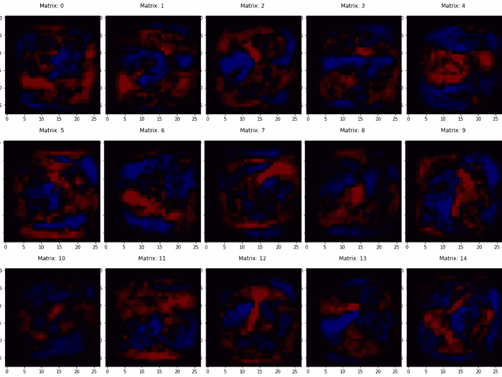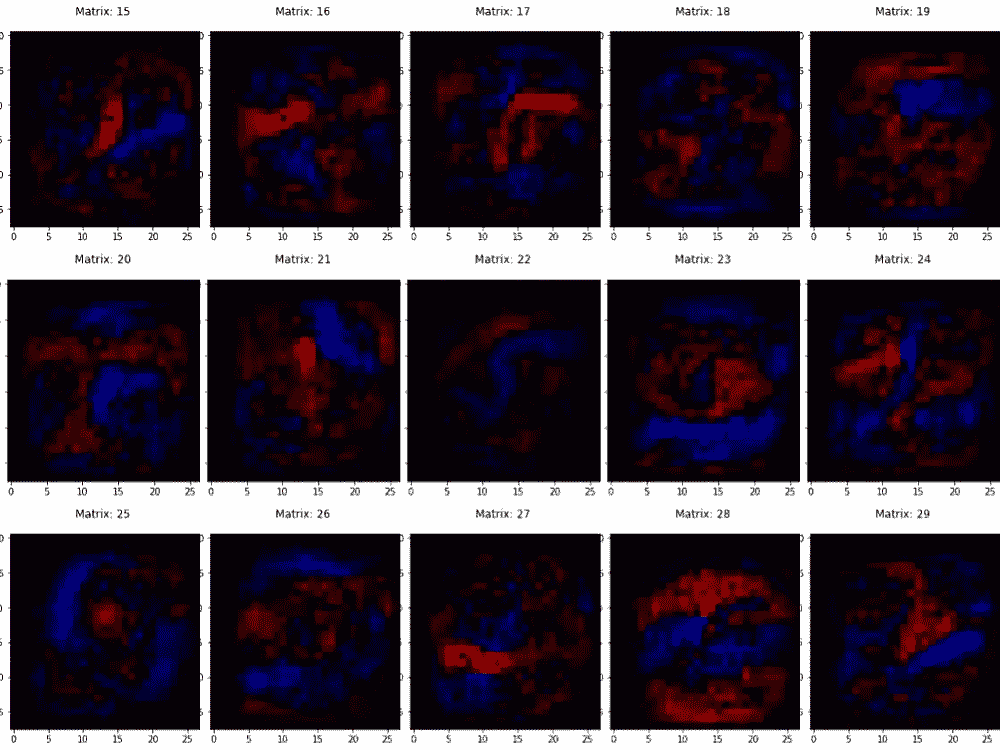

Hidden layer of the neural network (size- 30 neurons)

**这些就是我们一直在寻找的功能！根据网络比环和边更好的那些。**

这是它对所有 10 个数字的分类方式:

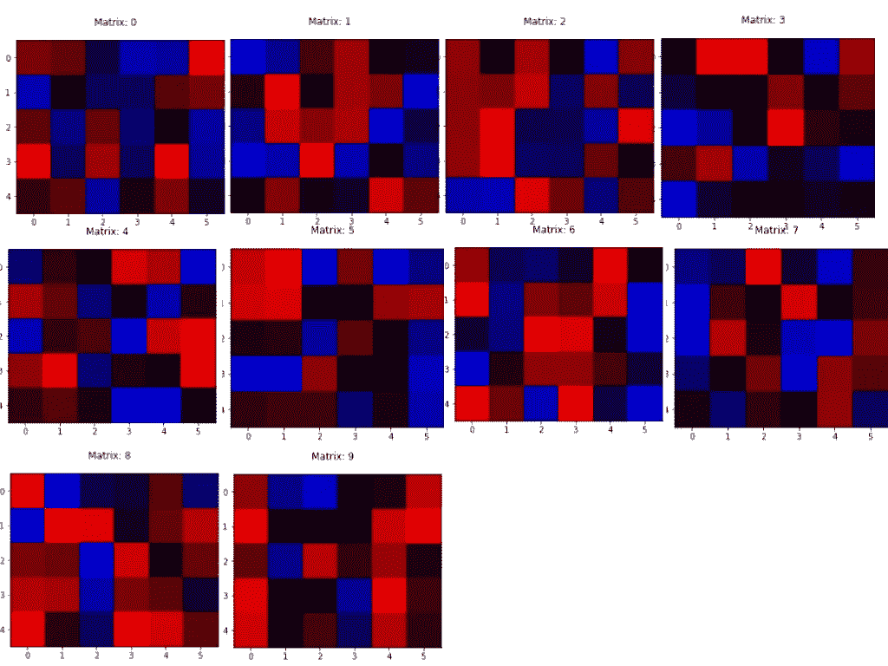

Weight matrix images attached to the neurons of the output layer

***猜猜看？这些都没有任何意义！！***

这些特征似乎都没有捕捉到输入图像中任何孤立的可区分特征。所有这些都可能被误认为只是在随机选择的地方随机形成的斑点。

**我的意思是，只要看看它如何识别一个‘0’:**

这是识别“0”的输出神经元的权重矩阵图像:

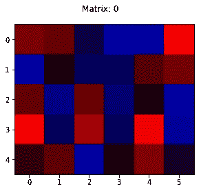

Weight matrix image used to identify a ‘0'

为了清楚起见，这个图像中的像素代表连接隐藏层和识别“0”的输出神经元的权重。

我们将只考虑每一个数字的几个最有用的特征。为此，我们可以从视觉上选择最强烈的蓝色像素和最强烈的红色像素。在这里，蓝色的应该给我们最有用的特征，而红色的应该给我们最可怕的特征(把它想象成神经元在说——“如果它是 0，图像将绝对*不*匹配这个原型”)。

三个最强蓝色像素的指数:3，6，26
三个最强红色像素的指数:5，18，22

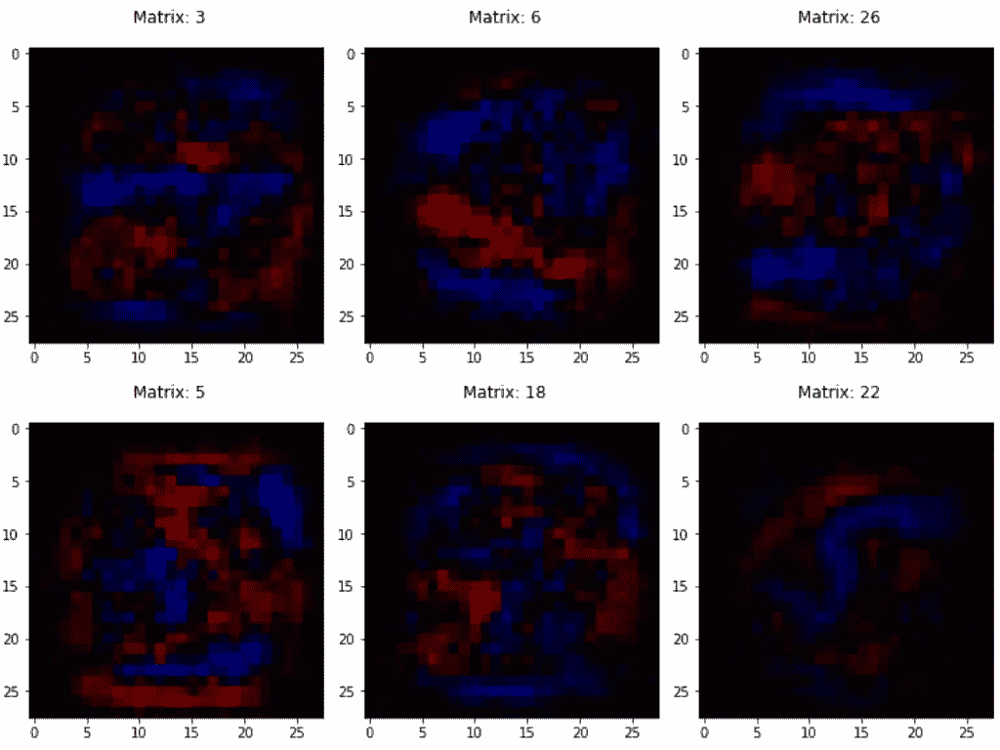

Recognising 0’s; indices- 3, 6, 26 (blue) 5, 18, 22 (red)

矩阵 6 和 26 似乎捕捉到了类似蓝色边界的东西，围绕着内部的红色像素——这实际上有助于识别“0”。

但是《黑客帝国 3》呢？它没有抓住任何我们甚至可以用语言解释的特征。《黑客帝国 18》也是如此。为什么神经元会不喜欢它？好像和《黑客帝国 3》挺像的。我们甚至不要在 22 分钟内进入奇怪的蓝色。

荒谬，看！

**让我们为‘1’做这件事:**

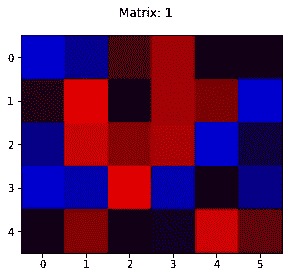

Weight matrix image used to identify a 1

三个最强蓝色像素的指数:0，11，16
顶部两个最强红色像素的指数:7，20

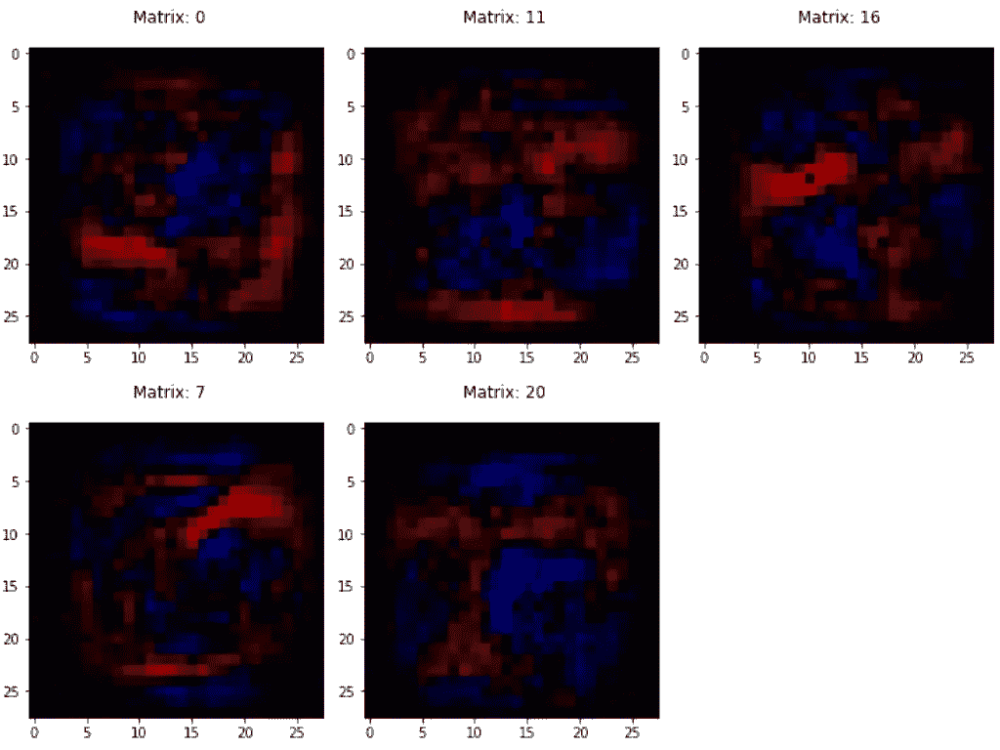

Recognising 1; 0, 11, 16 (blue) 7, 20 (red)

我对此无话可说！我甚至不想评论。

**在什么情况下这些可以用来识别 1！？**

**现在，备受期待的‘8’**(*它将如何表示其中的 2 个循环？？)*:

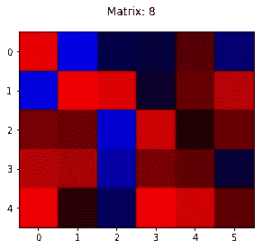

Weight matrix image used to identify an 8

前 3 个最强烈的蓝色像素:1，6，14
前 3 个最强烈的红色像素:7，24，27

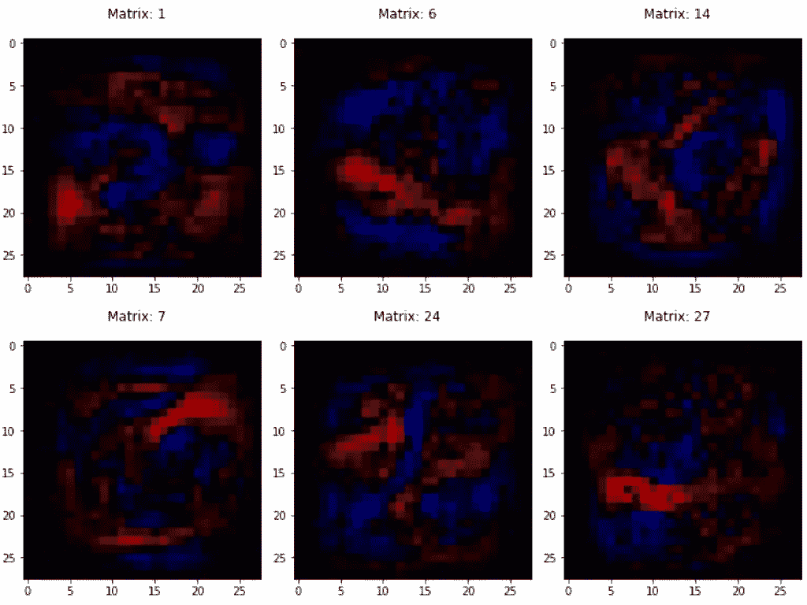

Recognising 8; 1, 6, 14 (blue) 7, 24, 27 (red)

不，这也不好。似乎没有我们预期的循环。但是这里还有一件有趣的事情需要注意——输出层神经元图像(拼贴上方的那个)中的大多数像素是红色的。看起来这个网络已经找到了一种方法，利用它不喜欢的*特征来识别 8！*

## 推理

所以，不。我不能用这些特征像乐高积木一样把数字放在一起。我在这项任务上非常失败。

但是平心而论，这些功能也不是那么像*乐高积木！*原因如下

1.  它们可以部分使用。我的意思是他们的贡献状态不是 0 或 1。这些特性中的一些被完全使用，一些被部分使用，一些没有被使用，一些有负面影响(然而重要的是！)对数字结构的影响。这不像乐高积木，既可以用也可以不用。
2.  它们似乎没有捕捉到任何特定的特征。相反，它们似乎只有与其他隐藏的神经元*结合起来才是有用和合理的(还记得 matrix 3 和 matrix 18 在识别‘0’方面的失败吗？)*。一些奇怪的组合，网络已经用我们给它的强大的微积分能力计算出来了！一个如此不可理解的组合，看起来就像“*几乎是随机的*”！

*原来如此，原来如此。如果你像我们一样考虑神经网络构建特征层次的方式，可以说神经网络像我们一样学习。但是当你看到功能本身时，它们与我们使用的完全不同。网络几乎没有给你解释它们所学习的特征。*

神经网络是很好的函数近似器。当我们构建和训练一个模型时，我们主要关心它的准确性—
它在多大比例的测试样本上给出了肯定的结果？

这对于许多目的来说都非常有效，因为现代神经网络可以具有非常高的准确性——超过 98%并不少见(这意味着失败的几率仅为 1/100！)

但是这里有一个问题——当他们错了，没有简单的方法去理解他们错的原因。它们不能被传统意义上的“调试”。举个例子，这是谷歌因为这个发生的一个尴尬的事件:

Because of this incident, [When it comes to gorillas, Google Photos remains blind](https://www.wired.com/story/when-it-comes-to-gorillas-google-photos-remains-blind/) even now!

理解神经网络学习什么是一个非常重要的课题。这对释放深度学习的真正力量至关重要。它会帮我们进去

*   仅基于神经网络创建可调试的端到端系统
*   使用这样的系统来拓宽我们对各种主题的理解，并最终实现使用人工智能来增强人类智能的目标

几周前,《纽约时报》杂志刊登了一篇关于神经网络如何被训练成以惊人的准确度预测癌症患者死亡的报道。

这位作家是一位肿瘤学家，他说:

> 那么，关于死亡的过程，算法到底“学到”了什么？反过来，它能教给肿瘤学家什么？这是这样一个深度学习系统的奇怪之处:它学习，但它不能告诉我们它为什么学习；它分配概率，但是它不能容易地表达分配背后的推理。就像一个通过反复试验学会骑自行车的孩子，被要求说出骑自行车的规则，只是耸耸肩就离开了，当我们问“为什么？”时，算法茫然地看着我们就像死亡一样，它是另一个黑匣子。
> 
> 一位肿瘤学家在《纽约时报杂志》上发表的文章

因为我的小项目，我想我对此有强烈的共鸣。:-)

# 奖金部分(请随意跳过)

在我之前描述的小项目中，我偶然发现了一些其他的结果，我觉得它们真的很酷，值得分享。所以他们在这里—

**较小的网络:**

我想看看我能使隐藏层的大小变得多小，同时在我的测试集中仍能获得相当高的精确度。结果表明，用 10 个神经元，该网络能够从 10000 张测试图像中正确分类 9343 张。只用 **10 个隐藏神经元**就能对从未见过的图像进行分类，准确率达到 **93.43%。**

*只需 10 种不同类型的乐高积木就能识别 10 个数字！！*

我觉得这非常有趣。

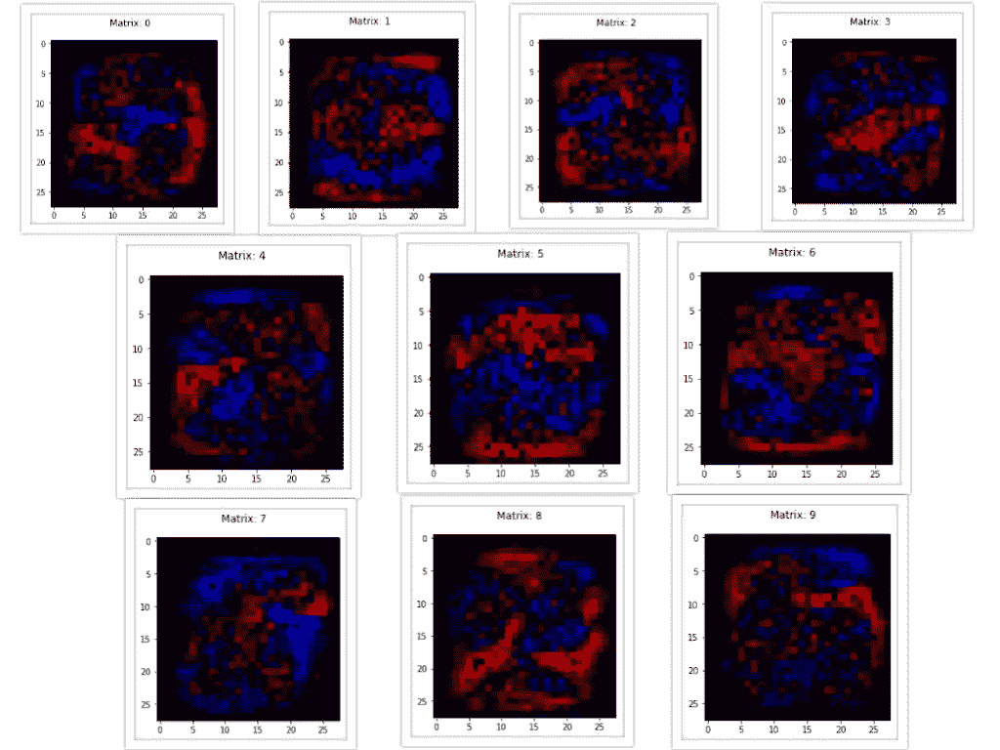

Hidden layer of the neural network with 10 neurons in it

当然这些权重也没有太大意义！

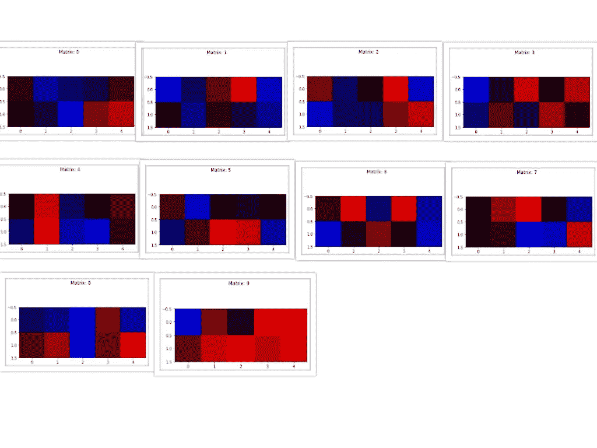

Weight matrix images for the output layer

如果你好奇的话，我也用 5 个神经元进行了测试，我得到了 86.65%的准确率；4 个神经元——准确率 83.73%；在此之下，下降幅度非常大——3 个神经元下降了 58.75%，2 个神经元下降了 22.80%。

**重量初始化+正则化带来很大不同:**

仅仅是调整你的网络和对权重使用良好的初始化就能对你的网络学习产生巨大的影响。

让我来演示一下。

我使用了相同的网络架构，意味着相同的层数和相同的神经元数。然后我训练了 2 个`Network`物体——一个没有正则化，使用相同的旧`np.random.randn()`,而另一个我使用正则化和`np.random.randn()/sqrt(n)`。这是我观察到的:

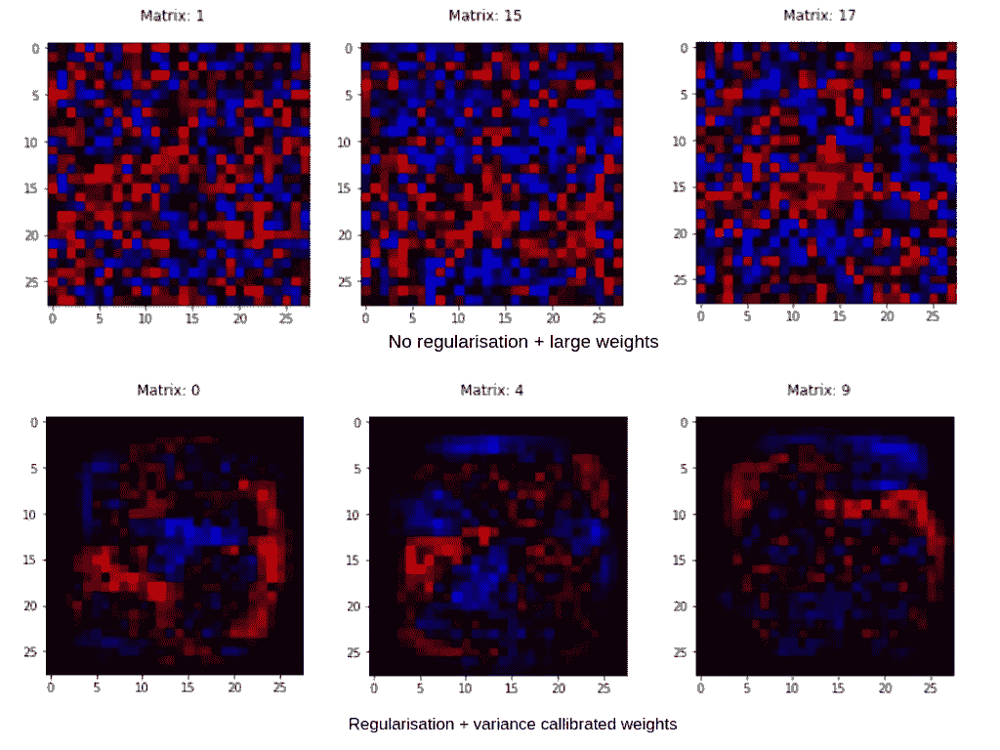

Comparison of what the weight matrices look like before/after using regularisation + good weight initialiser

是啊！我也震惊了！

***(注:*** *我已经在上图拼贴中展示了与不同指数神经元相关的权重矩阵。这是因为由于不同的初始化，即使是相同索引的节点也学习不同的特征。所以，我选择了那些看起来效果最明显的。* ***)***

要了解更多关于神经网络中的权重初始化技术，我推荐你从这里的开始。

感谢您的阅读！😄

如果你想讨论这篇文章或你脑海中的任何其他项目或真的任何事情，请随时在下面评论或在 [LinkedIn](https://www.linkedin.com/in/nityeshaga/) 或 [Twitter](https://twitter.com/nityeshaga) 上给我留言。

我是一名自由作家。你可以雇我为你公司的博客写类似的深入、热情的文章，解释 ML/DL 技术。给我发邮件到 `**nityeshagarwal[at]gmail[dot]com**` **讨论我们的合作。**

还有，你可以[在 Twitter 上关注我](https://twitter.com/nityeshaga)；我不会给你发垃圾邮件；-)

最初发表于 [Zeolearn 博客](https://www.zeolearn.com/magazine/what-does-a-neural-network-even-learn-a-newcomers-dilemma)。