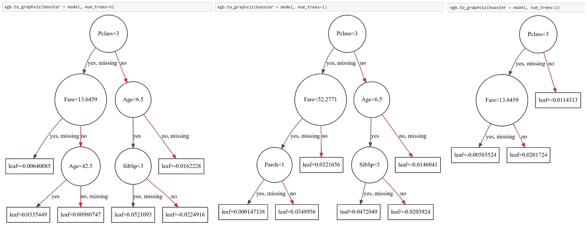
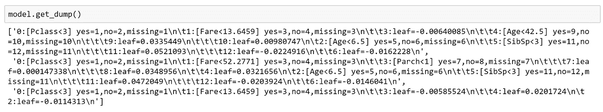
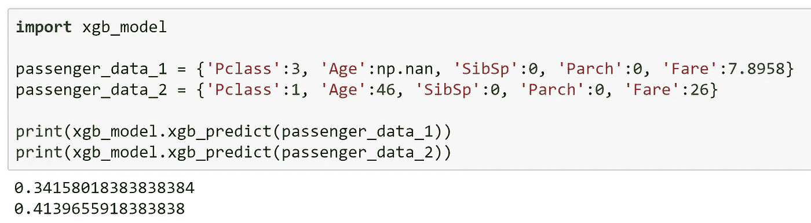
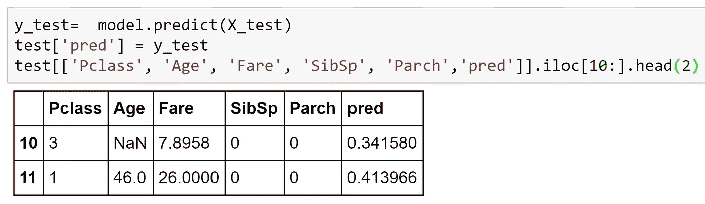

# 将 XGBoost 模型转换成 if-else 格式

> 原文：<https://towardsdatascience.com/xgboost-deployment-made-easy-6e11f4b3f817?source=collection_archive---------2----------------------->


New river, WV, photo by myself

在本文中，我将向读者展示如何使用正则表达式的一些技巧将 XGBoost 模型转换成. py 文件。py 文件是“numpy”包。因此，在您训练了 XGB 模型之后，您可以在另一个不需要 XGBoost 包的环境中部署该模型。

当您计划在 AWS lambda 中部署 XGBoost 模型时，这个技巧可以帮助您满足包大小的限制。如果你打算用其他方法(AWS sage maker/Docker+Flask+Nginx……)部署模型，那么这篇文章可能真的帮不了你。

本教程分为几个部分:**下载数据并训练模型→将模型转换为. py 文件→使用。py 文件来预测测试数据。**

# 步骤 0。下载 jupyter 笔记本

这本[笔记本](https://github.com/Shiutang-Li/xgboost_deployment/blob/master/deploy_xgboost.ipynb)包含了下面所有的代码。把它放在你的目标文件夹里。

# 第一步。下载数据并训练模型

让我们使用众所周知的[泰坦尼克号数据集](https://www.kaggle.com/c/titanic/data)来建立一个玩具模型。从链接下载 train.csv 和 test.csv。创建一个子文件夹“/data”并将。csv 在那里。

因为 XGBoost 只接受数字输入，所以让我们跳过分类变量编码，随机选择几个数字列进行建模。

这个 XGBoost 模型产生 3 个决策树，每个决策树的最大高度= 3。因为 gamma(分裂次数的惩罚常数)被设置为一个较大的值，所以它可以防止对某些树节点进行分裂。

决策树看起来像:



每个记录的预测得分由“基础得分+所有树的最终叶值”给出。

# 第二步。将模型转换为. py 文件

在 [XGBoost Python API](https://xgboost.readthedocs.io/en/latest/python/python_api.html) 中，您可以找到允许您将模型作为字符串或. txt 文件转储的函数，或者保存模型以备后用。但是没有 API 将模型作为 Python 函数转储。这里有一个技巧:我们首先将模型作为一个字符串转储，然后使用正则表达式解析这个长字符串并将其转换成一个. py 文件。



完成这项工作的代码片段:

使用模型训练中使用的基本分数和训练的模型，我们能够将其转换为. py 模型，该模型只需要“numpy”包(用于缺失值处理)。

```
model_to_py(params['base_score'], model, 'xgb_model.py')
```

生成的“xgb_model.py”的一部分如下所示:

# 第三步。使用。py 文件来预测测试数据。

我们现在可以导入刚刚创建的 xgb_model.py，执行预测非常简单。



让我们将其与 XGBoost 模型产生的预测进行比较。



结果匹配。

**一些警告**:

1.  这些代码在 python 3.5.2 + xgboost 0.6 下运行良好。不保证为其他版本生成正确的结果。
2.  我没有在我的代码中做任何错误处理。
3.  的。py 是为给 python 字典打分而设计的，但是您可以做一些小的修改来适应您的用例。
4.  在生成。py 文件，确保没有。目标文件夹中同名的 py 文件。