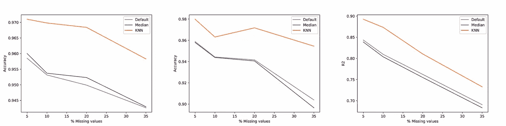
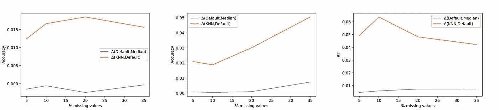

# XGBoost 不是黑魔法

> 原文：<https://towardsdatascience.com/xgboost-is-not-black-magic-56ca013144b4?source=collection_archive---------3----------------------->

Photo by [Tobias Tullius](https://unsplash.com/@tobiastu?utm_source=unsplash&utm_medium=referral&utm_content=creditCopyText) on [Unsplash](https://unsplash.com/?utm_source=unsplash&utm_medium=referral&utm_content=creditCopyText)

## 不输入缺失值并不总是正确的选择。

如今，在数据科学任务中取得令人满意的结果相当容易:对这个过程有一个大致的了解，对 Python 有一个基本的了解，花十分钟的时间实例化 XGBoost 并拟合模型就足够了。好的，如果这是你的第一次，那么你可能会花几分钟通过 pip 收集需要的包，但是仅此而已。这种方法的唯一问题是它工作得相当好🤷🏻‍♂️:几年前，我在一次大学竞赛中，通过将数据集输入到一个具有一些基本功能工程的 XGBoost，击败了展示非常复杂的架构和数据管道的团队，名列前五。XGBoost 最酷的特性之一是它处理缺失值的方式:决定每个样本的最佳估算方式。这个特性对我在过去几个月中遇到的许多项目和数据集非常有用；为了更配得上以我的名字命名的*数据科学家*的头衔，我决定更深入一点，花几个小时阅读[的原始论文](https://arxiv.org/pdf/1603.02754.pdf)，试图理解 XGBoost 实际上是什么，以及它如何能够以某种神奇的方式处理缺失值。

## 从决策树到 XGBoost

决策树可能是机器学习中最简单的算法:树的每个节点是对一个特征的测试，每个分支代表测试的一个结果；树叶包含模型的输出，无论是离散的标签还是实数。决策树可以被描述为一个函数:

(1)

函数 **f** 根据树结构 **T** 基于 m 大小的样本 **x** 所遵循的从根到叶子的路径分配一个权重 **w** 。

现在想象有不止一棵决策树，而是 K 棵；最终产生的输出不再是与叶子相关联的权重，而是与每一棵树产生的叶子相关联的权重的总和。

(2)

这些结构不是固定的，与经典梯度下降框架中发生的情况不同，在经典梯度下降框架中，网络结构不变，权重在每一步更新，在每次迭代中添加新的函数(树)以提高模型的性能。为了避免过度拟合和/或非常复杂的结构，误差由两部分组成:*第一部分*对在第 k 次迭代中获得的模型的良好性进行评分，以及*第二部分*对与叶子相关联的权重的大小以及所开发的树的深度和结构的复杂性进行惩罚。

(3)

然后，使用二阶梯度统计简化该目标函数，并且——无需输入太多细节——可以直接用于以封闭形式计算与固定树结构相关联的最佳叶的权重。重量可以直接与误差相关联，因此与所使用的固定结构的良好性相关联(3)。

训练 XGBoost 是一个迭代过程，它在每一步计算第 k 棵树的最佳可能分裂，枚举在路径中该点仍然可用的所有可能结构。这种对所有可能拆分的详尽列举非常符合本文的范围，但在实践中不可行，它被一种近似的版本所取代，该版本不尝试所有可能的拆分，而是根据每个特性分布的百分位数仅列举与*相关的*个。

## XGBoost 和缺失值:神奇的事情发生在哪里

一旦训练了一个树结构，也就不难考虑测试集中缺失值的存在:为每个决策节点附加一个默认方向就足够了。如果样本的特征丢失，并且判定节点在该特征上分割，则路径采用分支的默认方向，并且路径继续。但是给每个分支分配一个默认的方向更复杂，这可能是本文最有趣的部分。

已经解释过的*分裂寻找*算法可以稍微调整一下，不仅返回每一步的最佳分裂，还返回分配给新插入的决策节点的默认方向。给定一个特征集 **I，**，所有可能的分裂都被枚举，但是现在相应的损失不是被计算一次而是两次，对于该特征的缺失值可能采取的每个默认方向一次。根据特征 **m** 的值 **j** 进行分割时，两者中最好的一个是要分配的最佳默认方向。最好的分割仍然是最大化计算分数的分割，但是现在我们给它附加了一个默认的方向。

这种算法被称为*稀疏感知分裂查找*，这也是 XGBoost 背后的魔力所在；最后不太复杂。稀疏感知方法仅保证平均而言*采用默认方向*会导致给定已经遍历的分裂的最佳可能结果，它不保证已经遍历的分裂(可能通过采用默认方向解决)是考虑整个样本的最佳结果。如果样本中缺失值的百分比增加，内置策略的性能可能会大大下降。

> 好吧，默认方向是最佳选择，因为它到达了当前位置，但是考虑到当前样本的所有特征，不能保证当前位置是最佳情况。

克服这一限制意味着在处理样本时同时考虑其所有特征*和直接处理同一实现中可能同时存在的多个缺失值。*

## 输入缺失值并提高性能

为了击败 XGBoost 内置策略，我们必须同时考虑样本的所有特征，并以某种方式处理样本中可能存在的多个缺失值。这种方法的一个很好的例子是 K-最近邻(KNN ),它具有专门的距离度量来适当地处理缺失值。一般来说，KNN 是一种众所周知的算法，它检索 K 个(例如 3，10，50，…)最接近所考虑样本的样本。它既可用于对未知输入进行分类，也可用于估算缺失值，在这两种情况下，考虑 K 个最近邻，将平均值或中值分配给目标值。这种方法需要距离度量(或者相应地，相似性度量)来实际排列训练集中的所有样本，并检索最相似的 K 个*。*

为了超越 XGBoost 内置的默认策略，我们需要两件事情:

*   考虑到缺失值的距离度量(感谢 AirBnb 的[这篇文章](https://medium.com/airbnb-engineering/overcoming-missing-values-in-a-random-forest-classifier-7b1fc1fc03ba)带来的灵感)

Python implementation of the distance metric employed

*   对数据集进行归一化处理，以获得有意义的距离，该距离是对不同属性域的要素之间的差异进行求和而获得的(XGBoost 并不严格要求这样做，但 KNN 插补需要这样做！).

使用 K 个最接近样本的所述特征的中值来估算特征的缺失值，并且在 K 个检索到的邻居中找不到至少一个非缺失值的非常特殊的情况下，使用整个列的中值。

## 实验结果

我在 *scikit-learn* 中使用三个著名的免费数据集进行了一些测试(两个分类和一个回归)。已经通过比较三种不同插补策略的 k 倍交叉验证来测量性能:

*   默认的内置在 XGBoost 算法中
*   简单的按列中位数插补
*   如前一段所述的 KNN

对于 KNN 的情况，我已经针对 **k** (要考虑的邻居数量)和 **λ** (当两个样本中至少有一个样本的某个特征缺失时，要添加到距离中的常数)绘制了所考虑的缺失值百分比的最佳性能。

Figure 1

使用稀疏感知 KNN 来输入缺失值始终优于其他两种方法。差异的程度当然取决于数据集。第一个天真的结论是:数据集的质量越差，更好的插补策略的影响就越大。如图 2 所示，内置策略最终的性能接近于普通的列式中位数插补。

Figure 2

看到 **k** 和 **λ** 如何影响最终结果，以及引入惩罚因子不仅仅是在纸面上是有意义的，这非常有趣。距离度量不仅丢弃缺失值，而且为它们中的每一个增加权重，这对于用这种方法获得的性能是至关重要的，即使它的值与缺失值百分比的增加不直接相关。

Figure 3

测试表明，根据经验法则，缺失值的数量越多，就有越多的邻居需要考虑进行更好的插补。再一次非常直观的结论。