# xkcd.com+人工智能

> 原文：<https://towardsdatascience.com/xkcd-com-artificial-intelligence-a4cbf6303b1e?source=collection_archive---------6----------------------->

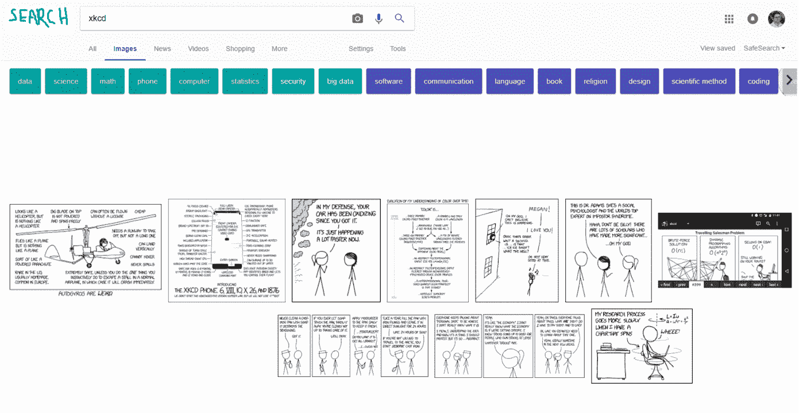

这篇文章向您展示了我们如何使用数据科学、深度学习和肘部油脂来创建 xkcd.com 漫画分类器。我们可以从漫画的描述中预测漫画的主题。


xkcd is an excellent example of time well wasted.

我的朋友圈里有一个巨大的书呆子迷恋[兰道尔·门罗](https://en.wikipedia.org/wiki/Randall_Munroe),[xkcd 漫画](https://xkcd.com)的作者，还有像[如果这样的书？](https://what-if.xkcd.com)。 [Mary Kate MacPherson](https://medium.com/u/c1c775be8058?source=post_page-----a4cbf6303b1e--------------------------------) 主动，[为每一部漫画](https://www.explainxkcd.com/)刮抄本，用我的专利分析器代码把抄本变成嵌入向量。然后，她将向量和标签放入 tensorflow，并使用 t-SNE 将数据分解成簇 T10。那些了解 xkcd.com 的人会很清楚漫画是按顺序编号的。我打赌兰德尔会在漫画编号与当前年份(2018 年)相同时提及，所以我必须尽快发表这篇文章！写这句话的时候，他已经在 2017 年了！

这里有一个视频，展示了降维是如何进行的，有 3D 的也有 2D 的:

Sorry I didn’t have the time to clip and edit the video like I wanted to, so it’s a bit long. Feel free to jump around and see the difference between 2D and 3D, and other settings. A learning rate of 1 worked best for us. The result we used is shown in an annotated screenshot below.

t-SNE 降维的输出是从原始的 300 维嵌入空间压缩下来的 2D 空间中的一串点。

玛丽·凯特·麦克弗森接着查看了 2D 结果上的聚类，以理解它们的含义。下图向我们展示了按主题和实体分类的文章。

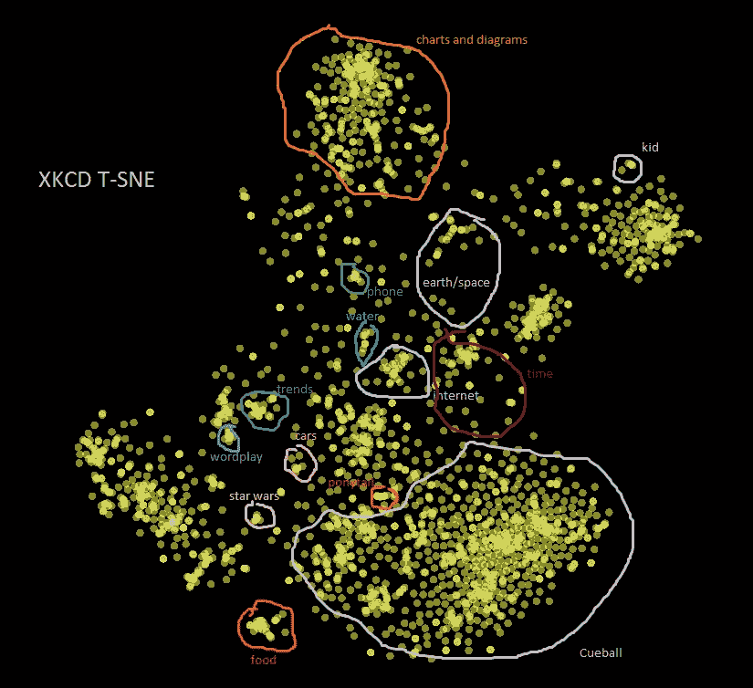

This is our look into Randall Munroe’s brain.

纵观全局，我们可以看到关于食物的漫画聚集在一起，关于星球大战、趋势、文字游戏、儿童、图表等等的文章也是如此。作为人类，我们可以识别十几个或更少项目的小集群(例如，kid cluster)，但为了做好工作，深度学习希望看到大量的例子，因此我将在下面向您展示如何使用更少的集群建立 xkcd 主题模型。作为背景，xkcd.com 总共有大约 2000 本漫画。

让我们来看看漫画是如何在时间域中聚集的:

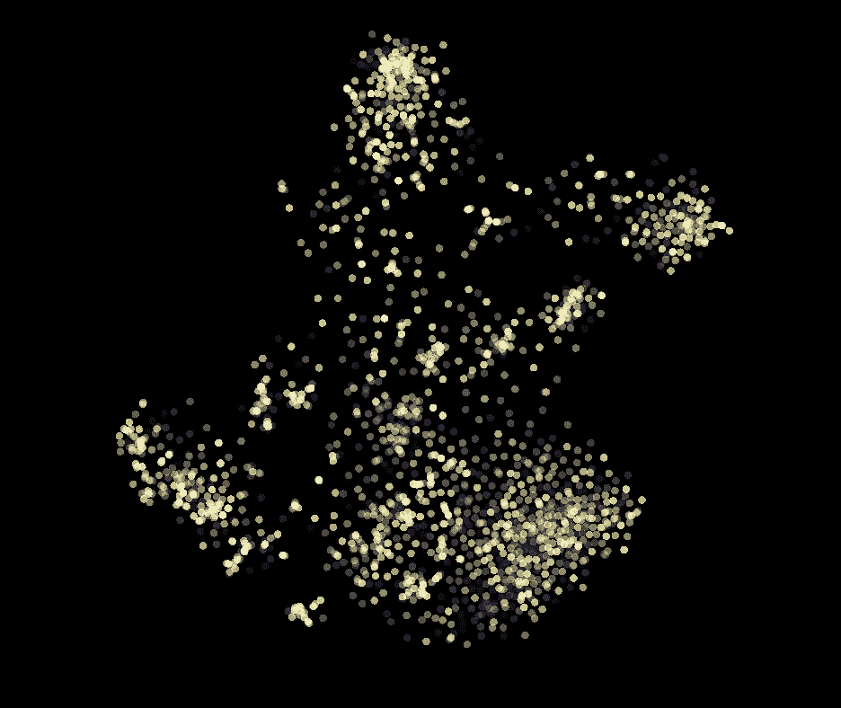

Brighter dot = newer comic. Darker dot = older comic.

下面是原始代码:

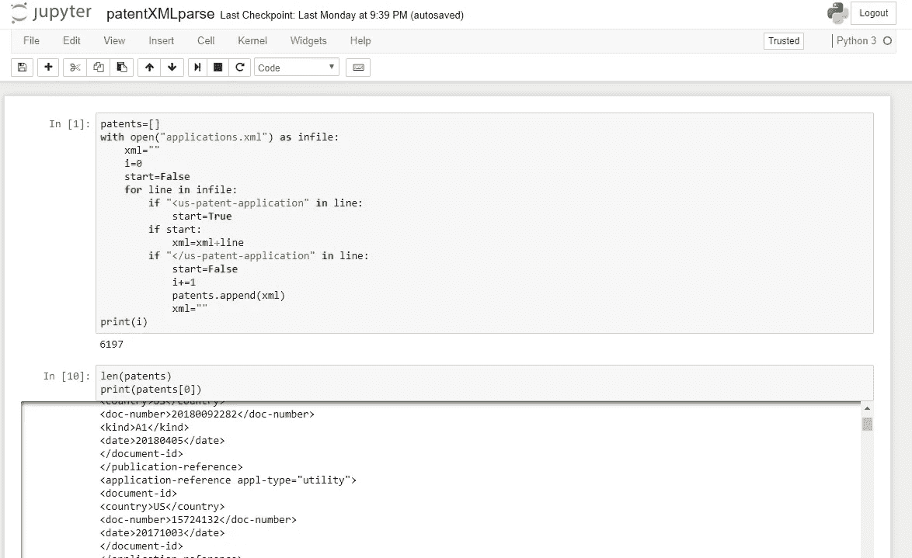

Original patent application to vectors code… but comics are way more fun!

在 python 中应用 [t-SNE](http://scikit-learn.org/stable/modules/generated/sklearn.manifold.TSNE.html) 和 [GMM](http://scikit-learn.org/stable/modules/mixture.html) ，我们得到以下集群:

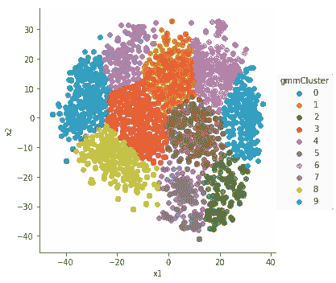

Not super nice clumps. Let’s try again….

当我们看到像上面这样的星团时，这不是一个好结果。我们希望在有数据的地方看到簇，在簇之间看到空洞。这让我想起我经常从我的一个朋友那里听到的一句话“ [**”未来已经在这里了——只是不是很均匀地分布**](https://en.wikiquote.org/wiki/William_Gibson) **。因此，当我们看到这样的均匀分布时，这通常意味着我们需要再试一次。**

以下是我们希望看到的分离类型的示例:

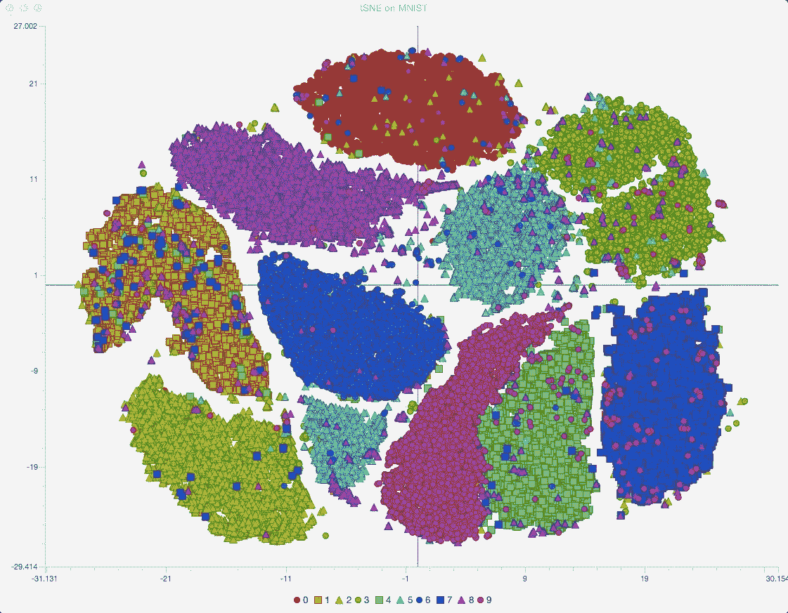

This MNIST example looks way better than what we got from our python code so far… Source: this [online book](https://leonardoaraujosantos.gitbooks.io/artificial-inteligence/content/unsupervised_learning.html).

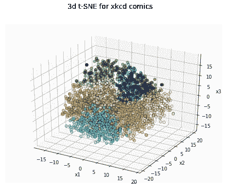

The color of each dot shows the cluster membership for that dot. There are still not as nice separations as we saw with the embedding projector…

我想我找到 tensorboard 和我的 python 代码不匹配的原因了。我在 25 岁而不是 12 岁时感到困惑。DOH。现在我改变了 2D 和 3D 困惑值，并重新运行代码。以下是我们得到的结果:

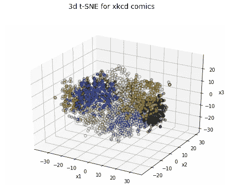

Each color is a different cluster. It looks quite similar to the original non-working example… But a later version worked amazing, as you will see…

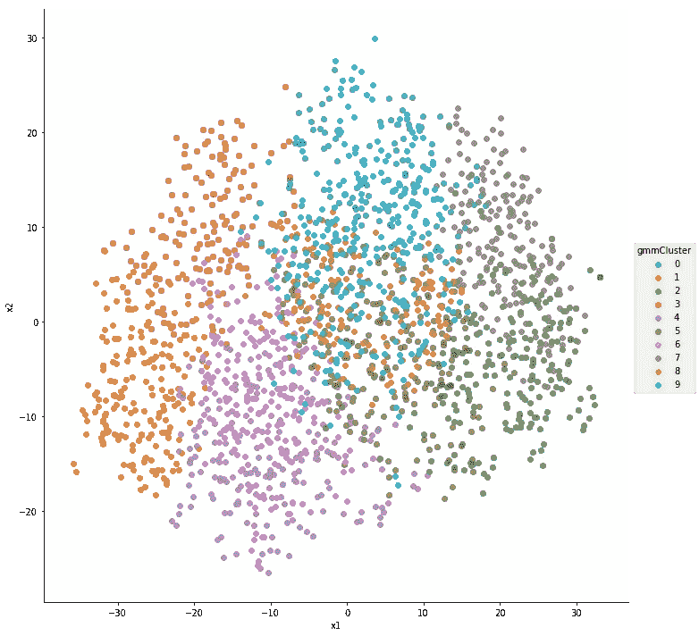

2D slice of the 3D t-SNE results. Clusters 4 and 6 are pretty mixed up.

我对 2D t-SNE 的结果很满意，但是 GMM 没有做好细分工作:


More separation than the last time.

[归一化](http://scikit-learn.org/stable/modules/generated/sklearn.preprocessing.StandardScaler.html)t-SNE 之前的 300 列给了我们这个结果:

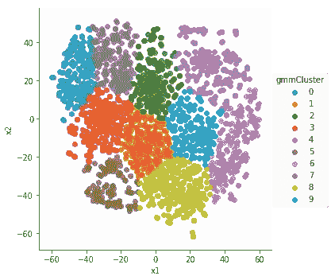

Let’s just go for it…

让我们退出对 t-SNE 的研究，试着去理解集群，但首先这里是用来做这些事情的数据…

提醒您一下，我们已经使用漫画创建了一个主题模型。这里是每个漫画的[主题模型向量，这里是每个漫画的](https://gist.github.com/dcshapiro/5ea8694f9eb1ad9a3e5304d93940663d)[主题标签(只是整数)](https://gist.github.com/dcshapiro/4d616b95b39d1a015ca44759af70cb2a)。我已经把一些东西组织到了 github repo 中，以满足你的编码乐趣。

下面是使用上述自动化方法为每个漫画制作的聚类数据帧: [3D](https://github.com/dcshapiro/xkcd/blob/master/tSNE_3D_xkcd_noDates.csv) 和 [2D](https://github.com/dcshapiro/xkcd/blob/master/tSNE_xkcd_noDates.csv) 。这是在 2D 和 3D 中应用 t-SNE 的[笔记本。下面是使用下面描述的手动方法为每个漫画(10 个聚类的样本)制作的](https://github.com/dcshapiro/xkcd/blob/master/xkcd%2BGMM.ipynb)[聚类标签(只是整数)](https://gist.github.com/dcshapiro/8f2a0c4fa58592132276efe974658b76)。

## 这一切意味着什么？

以下是我们对由 GMM 聚类的 [3D t-SNE 数据的聚类解释:](https://github.com/dcshapiro/xkcd/blob/master/tSNE_3D_xkcd_noDates.csv)

来自该 3D 数据集的聚类示例有:[零](https://xkcd.com/949/)(问题)[一](https://xkcd.com/1728/)(技术)[两](https://xkcd.com/1561/)(图形)[三](https://xkcd.com/775/)(日期+地点)[四](https://xkcd.com/1311/)(时间)[五](https://xkcd.com/1971/)(思考的东西)[六](https://xkcd.com/1786/)(帽子！是的，帽子！)、[七](https://xkcd.com/599/)(烂东西)[八](https://xkcd.com/1789/)(数学)[九](https://xkcd.com/2006/) (interwebz)。

以下是我们对使用嵌入式投影仪手工创建的 [2D 星团数据的解读](https://gist.github.com/dcshapiro/8f2a0c4fa58592132276efe974658b76):

来自这个数据集中的聚类例子有:[一个](https://xkcd.com/695/)(时间)[两个](https://xkcd.com/191/)(哲学)[三个](https://xkcd.com/1851/)(科学)[四个](https://xkcd.com/438/)(视角)[五个](https://xkcd.com/209/)(兴奋)[六个](https://xkcd.com/531/)(梅根)[七个](https://xkcd.com/351/)(计算机网页)[八个](https://xkcd.com/1303/)(连字符)[九个](https://xkcd.com/530/)(科技)，以及[十个](https://xkcd.com/334/)(思维素材)。

特别感谢[玛丽·凯特·麦克弗森](https://medium.com/u/c1c775be8058?source=post_page-----a4cbf6303b1e--------------------------------)为集群标记做了所有的体力劳动，也感谢[马修·勒梅](https://medium.com/u/f84a70d8f74?source=post_page-----a4cbf6303b1e--------------------------------)让她来做这件事。

## 要手动制作您自己的分类标签…

为了手动获得聚类(标签)**，我们运行 10，000 次 t-SNE 迭代(学习率= 1；困惑= 12 ),而不是使用聚类(k-means 或 GMM ),我们只是目测它，并提取每个聚类的 id。我非常喜欢你们这些读者能够前往 projector.tensorflow.org 完全复制这个实验。**

**下面是如何自己“手动”完成这项工作的大图:**

**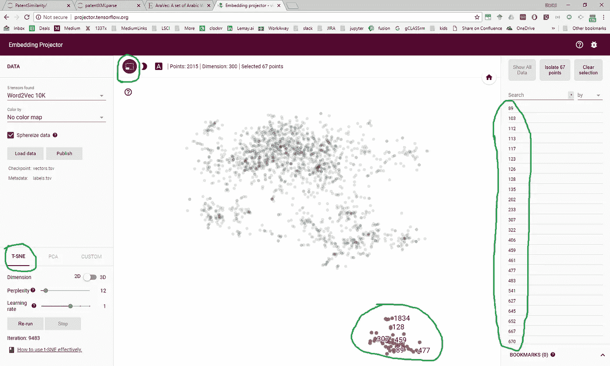**

**This is the picture of the hand-made data we used.**

**现在让我们一步一步地来看:**

**1)加载数据**

****以下是嵌入式投影仪中数据交互版本的链接:****

**[](http://projector.tensorflow.org/?config=https://gist.githubusercontent.com/dcshapiro/6e04db42f17ac310fc5260684b2b9508/raw/b0b4b1ed32442620c9a9810b4abe7bb1429cb623/template_projector_config.json) [## xkcd 嵌入式投影仪太酷了

### 可视化高维数据。](http://projector.tensorflow.org/?config=https://gist.githubusercontent.com/dcshapiro/6e04db42f17ac310fc5260684b2b9508/raw/b0b4b1ed32442620c9a9810b4abe7bb1429cb623/template_projector_config.json) 

2)运行 t-SNE。当你觉得聚类看起来不错的时候就停下来。

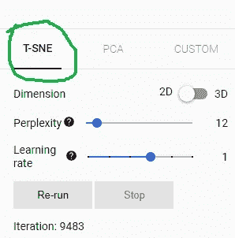

3)通过使用注释工具拖动来手动创建聚类

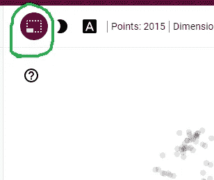

This is the tool you want

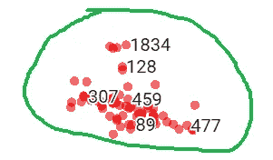

Drag the tool to make a box over the points you want to label. We can see that the cluster includes samples such as [1834](https://xkcd.com/1834/), [128](https://xkcd.com/128/), [307](https://xkcd.com/307/), [459](https://xkcd.com/459/), [89](https://xkcd.com/89/), and [477](https://xkcd.com/477/). They are about disaster, pain, disaster, angry exclamation… I see a pattern.

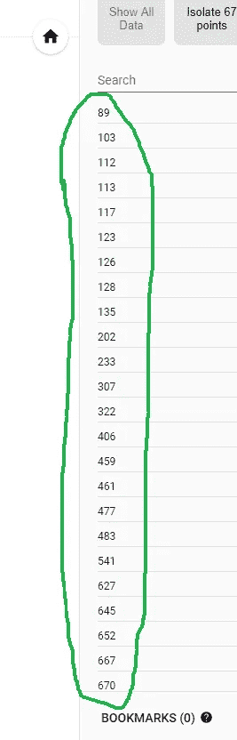

The points will show up in the list on the right hand side

4)检查右边列表的来源，复制出列表的 HTML DIV(我知道:gross，它有一个限制 100，所以你没有得到大集群的所有数据)

5)在 notepad++中用空格替换所有 HTML。为此，只需转到替换菜单(CTRL+H ),用空格字符替换此正则表达式:

```
<[^>]+>
```

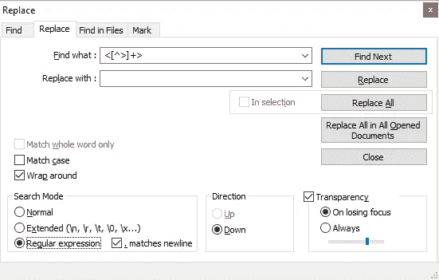

现在用单空格替换所有双空格，直到只剩下单空格，然后用换行符替换所有单空格。去掉第一个空格字符，我们现在有了这个集群的 id 列表。对每个集群重复上述步骤，直到覆盖了您关心的所有集群。砰。完成了。

您可以在 python 或 excel 中将所有聚类合并到一个文件中。这里很容易看出我们是如何构建主题模型的熊猫数据框架的。

# 预测的东西！

如果能建立一个 xkcd 的主题模型，并且 ***预测*** 给定漫画是关于什么样的主题，那就太棒了。

我们知道输入(X)是漫画的主题模型向量和漫画的升序 ID，预测(Y)是聚类标签。因此，我们知道这是一个[分类问题](https://keras.io/getting-started/sequential-model-guide/)，需要一个 softmax，MLP (DNN)似乎适合这个工作。

这是我们在 3D t-SNE 数据集上使用的网络(random_state=42！):

```
model = Sequential()
model.add(Dense(128, activation='relu', input_dim=X_train.shape[1]))
model.add(Dropout(0.5))
model.add(Dense(128, activation='relu'))
model.add(Dropout(0.5))
model.add(Dense(128, activation='relu'))
model.add(Dropout(0.5))
model.add(Dense(y_train.shape[1], activation='softmax'))
```

我们从这个网络中得到了非常好的预测(89%的准确率):

```
Confusion Matrix
[[11  0  0  1  0  0  0  0  0  0]
 [ 0 27  0  0  0  0  1  2  1  1]
 [ 0  2 11  0  0  0  0  0  4  2]
 [ 0  1  0 16  0  0  0  0  0  0]
 [ 0  0  0  0 24  0  1  1  0  0]
 [ 1  0  0  1  0 25  0  0  0  0]
 [ 0  0  0  0  1  0 18  0  0  0]
 [ 0  0  0  0  0  0  0 12  0  0]
 [ 0  0  0  0  0  0  0  0 23  0]
 [ 0  2  0  0  0  0  0  0  0 13]]
```

如果你真的在玩这个数据集，那么听到你的结果将会很棒！我相信兰德尔会很高兴我们都厌倦了他多年来的涂鸦。

快乐 xkcd 编码，

丹尼尔

[daniel@lemay.ai](mailto:daniel@lemay.ai) ←打个招呼。
[LEMAY . AI](https://lemay.ai)
1(855)LEMAY-AI

您可能喜欢的其他文章:

*   [人工智能和不良数据](/artificial-intelligence-and-bad-data-fbf2564c541a)
*   [人工智能的图像数据集](/image-datasets-for-artificial-intelligence-bbb12615edd7)
*   [人工智能:让你的用户给你的数据贴标签](https://medium.com/towards-data-science/artificial-intelligence-get-your-users-to-label-your-data-b5fa7c0c9e00)**