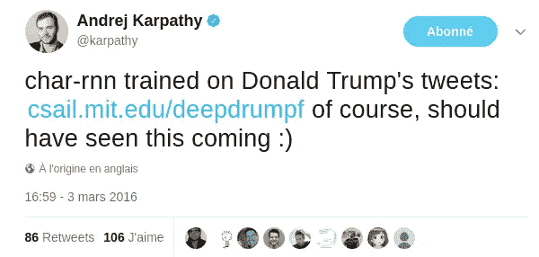
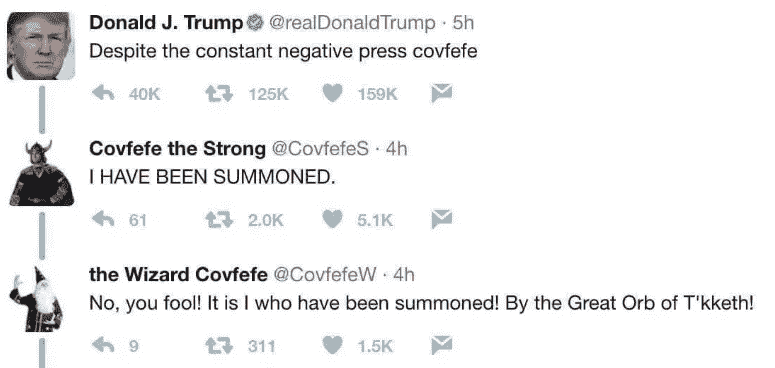

# 另一个文本生成项目

> 原文：<https://towardsdatascience.com/yet-another-text-generation-project-5cfb59b26255?source=collection_archive---------1----------------------->

> 我对深度学习比较陌生。我正努力尽快赶上进度，但我担心在这个过程中我可能会挖出一些旧东西。从我初学者的角度来看，文本生成还是很刺激的！我希望我能通过这篇文章和附带的知识库帮助一些人…

和很多人一样，我是在看了 Andrej Karpathy 的著名博文:[《递归神经网络的不合理有效性》](http://karpathy.github.io/2015/05/21/rnn-effectiveness/)后爱上递归神经网络(RNN)的。这篇文章令人大开眼界，它证明了 RNN 在学习序列数据方面有多好，以及一个训练有素的网络如何可以用来生成新的和类似的数据。

在他的文章中，要学习的序列数据是文本。文本被认为是一串相继出现的字符。一个基于 RNN 的神经网络被训练来从前面的字符序列中预测下一个字符。这种网络通常被称为“char-rnn”。

为了更好地工作，网络从字符序列中学习高级概念。它逐渐了解数据中越来越多有趣的方面。它可以学习单词和如何拼写单词，如何尊重良好的语法，最终，它可能能够生成或多或少有意义的带标点的句子。对于最后一部分，为了生成从头到尾都有意义的长句(甚至是更大的任务，如生成整个故事)，网络必须学会保存和管理大量的上下文(这很难)。

多年来，相关代码已经被移植到更新的深度学习库中，如谷歌的 [tensorflow](https://github.com/tensorflow/tensorflow) ，以及高级 API [keras](https://github.com/fchollet/keras) 。RNN 的生成性用法现在非常流行。然而，让我开始这个主题的是一个应用程序的想法(我以为我首先想到的，我太天真了)。

# 特朗普机器人军队

由于唐纳德·特朗普的言论非常有趣，我想，作为一个个人项目，我可以训练一个神经网络来产生更多的言论，也许我可以通过阅读结果来获得一两个笑声。很快就发现我不是第一个有这个想法的人。

我发现的一些项目可以追溯到 2015 年，像[这个叫做 RoboTrump](https://github.com/ppramesi/RoboTrumpDNN) 的项目，网络在单词级别工作(下一个单词预测)。

有些是特朗普在总统竞选中还是局外人时创造的，他们几乎不知道:

> “我写这篇文章的时候，美国正在进行总统选举。这次我们有一些不寻常的候选人，我想看看 RNN 能从他们的演讲中学到多少有趣的东西。”deeplearningathome.com

最成功的似乎是 [@DeepDrumpf](http://twitter.com/DeepDrumpf) (有自己的推特账号)。它甚至引起了我们最喜欢的 char-rnn 专家的注意:



足够的考古学，回到我(非革命的)对这个主题的看法。

# 我对特朗普的看法

我用 Keras 2.0.6 创建了一个 char-rnn(用 tensorflow 后端)。在这个地址的[什么都有。它采用两个 python 笔记本的形式，一个用于训练，一个用于测试。您可以使用数据集，从头开始训练模型，或者跳过这一部分，使用提供的权重来玩文本生成(玩得开心！).](https://github.com/jctestud/char-rnn)

> 注意:训练代码是“多 GPU 兼容”。根据我的经验，如果输入网络的序列很长(例如 120 个)，可以显著减少训练时间。对于双 GPU，我每个时期的时间减少了 56%。

## 收集和清理数据

我基于特朗普推特档案建立了一个文本数据集，这是一个所有总统推特的最新档案(从 2009 年开始约有 32000 条推特)。

这表示 3.3MB 的文本数据，大约是 350 万个字符。据我所知，对于我们要做的事情来说，它并不是很大。
字符“词汇”按顺序固定为 98 个可打印的 ASCII 字符(在稳定的词汇上工作有助于改变模型的用途)

## 数据准备

训练基于向网络输入 60 个字符的固定大小的序列。使用我的 GPU，我能够处理包含 512 个样本的大批量数据。

一批是 512 个 60 个字符的序列的列表。每个字符只能是词汇表中 98 个可用条目中的一个。对于每个 60 个字符的序列，预期的输出是第 61 个字符。预测只是一个步骤(长度为 1 的序列)。

准备这些批次会占用大量内存。因此，批量创建是在训练时实时完成的。

## 模型架构和培训

该建筑的灵感来自弗朗索瓦·乔莱(Franç ois Chollet)的作品，该作品可在 Keras repository 中找到(它本身源自卡帕西的作品)。

神经网络有 4 个堆叠的 512 单元 LSTM 层，每一层后面都有 20%随机神经元[丢失](http://machinelearningmastery.com/dropout-regularization-deep-learning-models-keras/)用于正则化。
最后一个递归层被设置为只返回其最终状态(一步)。
一个全连接的常规层获取大小为 512 的“隐藏”向量，并将其带回词汇表的大小(98)。
最后一个处理是将 softmax 函数应用于该向量，使其成为字符概率分布。
最后，使用 [Adam 优化器](http://machinelearningmastery.com/adam-optimization-algorithm-for-deep-learning/)训练网络，以最小化交叉熵损失函数(或多或少分布之间的距离)。

经过十几代的训练，输出开始听起来连贯。

注意:对于 Keras 鉴赏家，我使用“无状态”模式进行训练，这意味着在两个(甚至连续的)60 个字符的序列之间的网络中没有保存任何东西。但是，在生成文本时，网络以 1 对 1 字符的“有状态”模式使用(RNN 单元状态从不重置)

## 模型检验

这个模型现在可以用来生成类似 Trump 的文本。可以给网络一个种子(一些文本)来预热，并在生成过程中 100%自主之前获得一些上下文。

在生成的同时也加入了一些即兴创作。在每一步中，所选择的字符并不总是网络输出中概率最高的字符。这个额外的步骤防止了循环，并给出了更多的人工结果。

下面是一个低多样性的例子:

```
[I, Donald J. Trump, president of the United ]States of The Apprentice and the world in the world that we have to be a great trade deal and the people of the World Trade Center in the world that we have to be a great person to be a great problem.
```

同样的种子和更高的多样性:

```
[I, Donald J. Trump, president of the United ]States. Were going to have you to say what happens to try to make America great again. We're going to tell you that we have to win. We owe $100.
```

这个模型本身很有趣，但它很少连贯。它无法长时间保持上下文。很容易看到网络忘记了不久前开始的事情。

60 个字符的序列长度相对较短可能是一个原因。该长度决定了训练时梯度可以向后传播多远(随时间截断的反向传播)。更大的“回顾”可以使学习更长的依赖性成为可能。例如，一个经过理想训练的 char-rnn 应该能够跟踪引号和括号，以便确保将它们关闭，记住当前句子的主题等。

糟糕的结果也可能来自数据本身。可能是尺寸太有限了。此外，推特可能不是学习语言的最佳方式。Tweets 很短并且独立，它们包含奇怪的文本，比如 URL 和用户句柄等等。

## 最后的测试…

基于该网络了解到的一切，它能回答一个真正的问题吗:covfefe 推文的真正结局是什么？



以下是以推文开头为种子的一些尝试:

```
[Despite the constant negative press cov]erage. I was going to be great. But if they’re going to stop the good guy who has a big night.[Despite the constant negative press cov]erage. Looking forward to it. The fundraisers are totally promised by the Central Park South...[Despite the constant negative press cov]erage lines to Trump Tower. That’s not the relationships. It doesn’t have to be a disaster to Iraq.[Despite the constant negative press cov]erage car millions of people and spot. We are going to come back. We have to go to golf.
```

看起来他真的是指报道…强大的 Covfefe 被错误的召唤了。

*这个故事到此结束。如果你喜欢，可以关注我的* [*中*](https://medium.com/@jctestud) *或* [*推特*](https://twitter.com/jctestud) *获取最新消息。如果你喜欢美食，你可能会喜欢阅读* [*这篇*](https://medium.com/@jctestud/food-ingredient-reverse-engineering-through-gradient-descent-2a8d3880dd81) *。如果你更喜欢《权力的游戏》，* [*去那里*](https://medium.com/jctestud/game-of-thrones-word-embeddings-does-r-l-j-part-1-8ca70a8f1fad) *。*

另外，如果你发现有什么不对的地方，或者有任何问题，欢迎在下面评论。