# 另一个推特情绪分析第一部分——解决阶级不平衡

> 原文：<https://towardsdatascience.com/yet-another-twitter-sentiment-analysis-part-1-tackling-class-imbalance-4d7a7f717d44?source=collection_archive---------2----------------------->


Photo by [Piret Ilver](https://unsplash.com/@saltsup?utm_source=medium&utm_medium=referral) on [Unsplash](https://unsplash.com?utm_source=medium&utm_medium=referral)

不久前，我在 Twitter 情绪分析上完成了 11 篇系列博文。为什么我要再做一次情感分析？我想进一步扩展，对真实检索的推文进行情感分析。我之前的情感分析项目还有其他限制。

1.  该项目停止在最终的训练模型上，并且缺乏对检索到的推文的模型应用
2.  该模型仅在正面和负面类别上训练，因此它缺乏预测中性类别的能力

关于中性类别，可以为负面、中性和正面类别设置阈值，并将最终输出概率值映射到三个类别中的一个，但我想用训练数据训练一个模型，该模型有三个情感类别:负面、中性和正面。

因为我已经写了一个相当长的关于 NLP，情感分析的系列文章，如果一个概念已经在我以前的文章中提到过，我就不详细解释了。此外，主要的数据可视化将与检索到的 tweets 有关，我不会对我用于训练和测试模型的数据进行大量的数据可视化。

除了我将附上的简短代码块，你可以在这篇文章的末尾找到整个 Jupyter 笔记本的链接。

# 数据

为了训练我的情感分类器，我需要一个满足以下条件的数据集。

*   优选地，推特带有注释情感标签的文本数据
*   有 3 个情绪等级:消极，中立，积极
*   大到可以训练一个模特

当我在谷歌上寻找一个好的数据源时，我了解到了一个著名的 NLP 竞赛，叫做 SemEval。 [SemEval(语义评估)是正在进行的一系列计算语义分析系统的评估，由 SIGLEX 组织，SIGLEX 是计算语言学协会词汇方面的特别兴趣小组。](http://alt.qcri.org/semeval2017/)

如果你对 NLP 感兴趣，你可能已经听说过这个。来自世界各地的高技能团队在几个任务上竞争，例如“语义文本相似度”、“多语言语义单词相似度”等。比赛任务之一是推特情感分析。它也有几个子任务，但我想重点关注的是“[子任务 a .:消息极性分类:给定一条消息，分类该消息是正面、负面还是中性情绪](http://alt.qcri.org/semeval2017/task4/)”。

幸运的是，他们为比赛提供的数据集[可供下载](http://alt.qcri.org/semeval2017/task4/index.php?id=data-and-tools)。训练数据由 SemEval 之前的训练和测试数据组成。更棒的是他们提供测试数据，所有参赛的队伍都是用同样的测试数据打分。这意味着我可以将我的模型性能与 2017 年 SemEval 的参与者进行比较。

我先下载了 SemEval 2017 Task 4 的[全训数据](http://alt.qcri.org/semeval2017/task4/index.php?id=download-the-full-training-data-for-semeval-2017-task-4)。

总共有 11 个 txt 文件，跨度从 SemEval 2013 到 SemEval 2016。当试图将文件读入熊猫数据帧时，我发现两个文件不能作为 tsv 文件正确加载。似乎有一些条目没有正确地用制表符分隔，所以最终会有 10 条或更多的推文粘在一起。我本来可以尝试用提供的 tweet ID 来检索它们，但是我决定先忽略这两个文件，用 9 个 txt 文件组成一个训练集。

```
import pandas as pd  
import numpy as np
import matplotlib.pyplot as plt
plt.style.use('fivethirtyeight')%matplotlib inline
%config InlineBackend.figure_format = 'retina'
```

一旦我导入了基本的依赖项，我将把数据读入熊猫数据框架。

```
import glob
path ='Subtask_A/'
all_files = glob.glob(path + "/twitter*.txt")
frame = pd.DataFrame()
list_ = []
for file_ in all_files:
    df = pd.read_csv(file_,index_col=None, sep='\t', header=None, names=['id','sentiment','text','to_delete'])
    list_.append(df.iloc[:,:-1])
df = pd.concat(list_)df = df.drop_duplicates()
df = df.reset_index(drop=True)
df.tail()
```

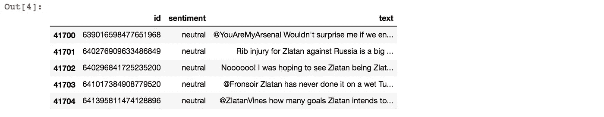

数据集看起来相当简单，有单独的 tweet ID、情感标签和 tweet 文本。

```
df.info()
```

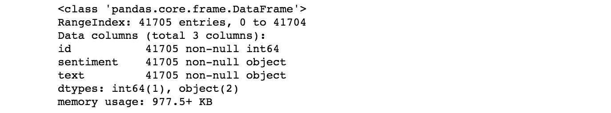

总共有 41705 条推文。作为另一项健全性检查，让我们看看每条推文中有多少单词。

```
df['token_length'] = [len(x.split(" ")) for x in df.text]
max(df.token_length)
```

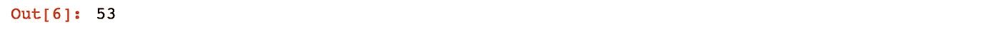

```
df.loc[df.token_length.idxmax(),'text']
```

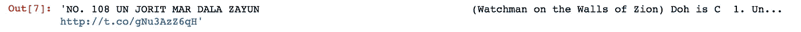

好的，令牌长度看起来很好，最大令牌长度的 tweet 看起来像是一个正确解析的 tweet。让我们来看看数据的类别分布。

```
df.sentiment.value_counts()
```

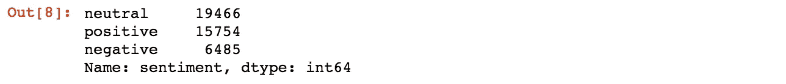

数据不平衡，负类的数据条目最少，为 6，485 个，中性类的数据条目最多，为 19，466 个。我想重新平衡数据，这样我至少在训练时会有一个平衡的数据集。我将在定义清洗函数后处理这个问题。

# 数据清理

数据清理过程与我之前的项目类似，但这次我添加了一个很长的收缩列表，以将大多数收缩形式扩展为其原始形式如“不要”到“不要”。这一次，我使用 Spacy 而不是 Regex 来解析文档，并过滤数字、URL、标点符号等。以下是我清理推文的步骤。

1.  解码:unicode 字符前的多余“\”的 unicode_escape，然后是 unidecode
2.  撇号处理:人们用两个字符来表示缩写。“'”(撇号)和“'”(单引号)。如果这两个符号都用于收缩，将很难检测和正确映射正确的展开形式。所以任何“'”(撇号)都改成“'”(单引号)
3.  收缩检查:检查是否有收缩形式，并将其替换为原始形式
4.  解析:已完成空间解析
5.  使用 Spacy 方法过滤标点、空格、数字、URL，同时保持 hashtag 的文本内容完整
6.  移除@提及
7.  Lemmatize:使用 Spacy 方法对每个标记进行 lemma tize。引理 _ '。代词保持原样，因为 Spacy lemmatizer 将每个代词转换为“-PRON-”
8.  特殊字符删除
9.  单音节标记去除
10.  拼写纠正:这是一个简单的拼写纠正，处理重复的字符，如“sooooo goooood”。如果同一个字符重复出现两次以上，它会将重复次数缩短为两次。例如,“sooooo goooood”将被转换为“soo good”。这不是一个完美的解决方案，因为即使在纠正之后，在“soo”的情况下，它也不是正确的拼写。但是通过将“sooo”、“sooo”、“sooooo”变成同一个单词“soo ”,至少有助于减少特征空间

好了，现在让我们看看这个自定义清理器是如何处理推文的。

```
pd.set_option('display.max_colwidth', -1)
df.text[:10]
```

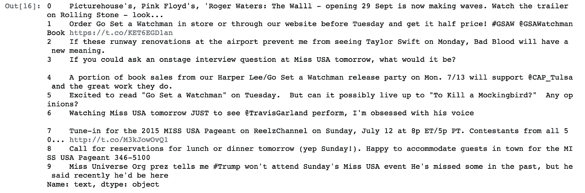

```
[spacy_cleaner(t) for t in df.text[:10]]
```

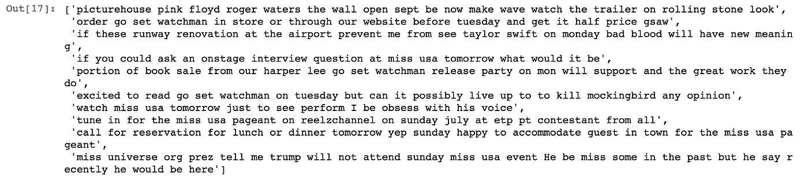

看起来它正在做我想让它做的事情。我将清理“text”列，并创建一个名为“clean_text”的新列。

```
df['clean_text'] = [spacy_cleaner(t) for t in df.text]
```

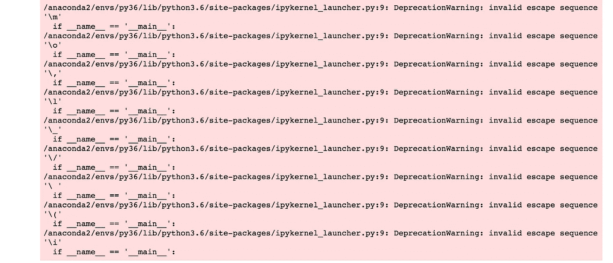

通过运行清理功能，我可以看到它遇到了一些“无效的转义序列”。让我们看看这些是什么。

```
for i,t in enumerate(df.text):
    if '\m' in t:
        print(i,t)
```

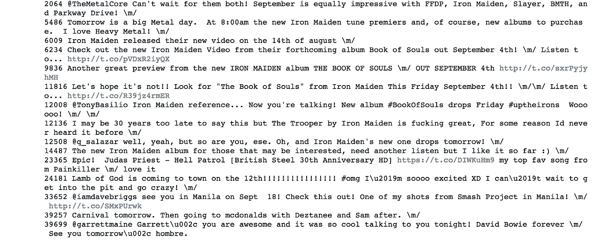

包含“\m”的推文实际上包含一个表情符号“\m/”,我在谷歌上搜索后才知道这件事。显然， ['\m/'代表你用手做的喇叭手势](https://www.urbandictionary.com/define.php?term=%5Cm%2F)。这种手势在金属音乐中很流行。无论如何，这只是一个警告，而不是一个错误。让我们看看清洁工是如何处理这个问题的。

```
df.text[2064]
```

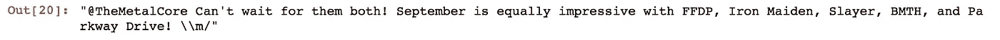

```
spacy_cleaner(df.text[2064])
```

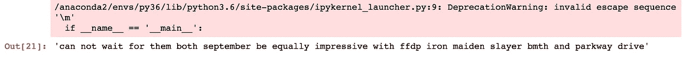

这看起来又像是在做我想让它做的事情。到目前为止一切顺利。

# 不平衡学习

"[在分类问题中，当某些类别的实例比其他类别多得多时，通常会出现类别不平衡问题。在这种情况下，标准分类器往往会被大类淹没，而忽略小类。](https://www3.nd.edu/~dial/publications/chawla2004editorial.pdf)

正如我已经意识到的，训练数据并不是完全平衡的，“中立”类的数据是“消极”类的 3 倍，“积极”类的数据是“消极”类的 2.4 倍。我将尝试用三种不同的数据拟合一个模型；过采样、下采样、原始，以了解不同的采样技术如何影响分类器的学习。

我将用来比较不同数据集性能的简单默认分类器是逻辑回归。从我以前的情感分析项目中，我了解到 Tf-Idf 和逻辑回归是一个非常强大的组合。在我应用任何其他更复杂的模型，如人工神经网络，美国有线电视新闻网，RNN 等，与逻辑回归的性能将有望给我一个好主意，我应该选择哪些数据采样方法。如果你想更多地了解 Tf-Idf，以及它如何从文本中提取特征，你可以查看我的旧帖子，“另一个使用 Python 的 Twitter 情绪分析-第 5 部分”。

在验证方面，我会使用 K 重交叉验证。在我之前的项目中，我把数据分成三份；训练、验证、测试和所有参数调整都是用保留的验证集完成的，最后将模型应用于测试集。考虑到我有超过一百万的数据用于训练，这种验证集方法是可以接受的。但是这一次，我拥有的数据要小得多(大约 40，000 条推文)，通过从数据中省去验证集，我们可能会省去关于数据的有趣信息。

# 原始不平衡数据

```
from sklearn.pipeline import Pipelineoriginal_pipeline = Pipeline([
    ('vectorizer', tvec),
    ('classifier', lr)
])lr_cv(5, df.clean_text, df.sentiment, original_pipeline, 'macro')
```

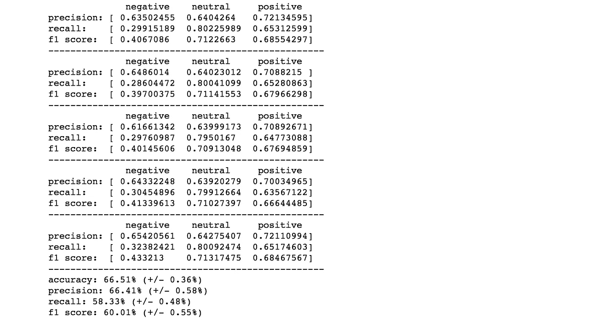

对于没有任何重采样的数据，我们可以看到精度高于召回率。如果你想了解更多关于精确度和召回率的知识，你可以查看我的旧帖子，“T2，另一个使用 Python 的 Twitter 情绪分析——第四部分”。

如果我们仔细观察每一次折叠的结果，我们还可以看到，否定类别的召回率很低，大约为 28~30%，而否定类别的准确率高达 61~65%。这意味着分类器非常挑剔，不认为许多事情是负面的。它归类为负面的所有文本有 61~65%的时间确实是负面的。然而，它也错过了很多实际的负面类，因为它非常挑剔。我们的召回率很低，但是准确率很高。这种精确和回忆背后的直觉来自 Andreas Klintberg 的[媒体博客。](https://medium.com/@klintcho/explaining-precision-and-recall-c770eb9c69e9)

# 过采样

有一个非常有用的 Python 包叫做“[unbalanced-Learn](https://github.com/scikit-learn-contrib/imbalanced-learn)”，它帮助你处理类不平衡问题，它与 Scikit Learn 兼容，并且易于实现。

在不平衡学习中，可以使用不同的技术进行过采样。我会用两个以下。

1.  RandomOverSampler
2.  合成少数过采样技术

如果使用过采样数据进行交叉验证，还有一点需要考虑。如果在交叉验证之前过采样，过采样少数类会导致过拟合问题。为什么会这样呢？因为通过在交叉验证拆分之前进行过采样，您已经将验证数据的信息泄露给了您的训练集。就像他们说的“已经看到的，不能再看不见了。”

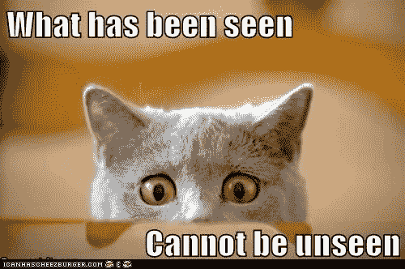

如果你想要更详细的解释，我推荐这个 Youtube 视频"[机器学习——过- &欠采样——Python/Scikit/Scikit-imb learn](https://youtu.be/DQC_YE3I5ig)"

幸运的是，我在上面定义为“lr_cv()”的交叉验证函数将只适合交叉验证拆分后的训练集拆分，因此它不会向模型泄露任何验证集的信息。

## RandomOverSampler

随机过采样只是重复少数类的一些样本并平衡数据集中类之间的样本数量的过程。

```
from imblearn.pipeline import make_pipeline
from imblearn.over_sampling import ADASYN, SMOTE, RandomOverSamplerROS_pipeline = make_pipeline(tvec, RandomOverSampler(random_state=777),lr)
SMOTE_pipeline = make_pipeline(tvec, SMOTE(random_state=777),lr) 
```

在我们安装每个管道之前，让我们看看 RadomOverSampler 是做什么的。为了更容易看到，我在下面定义了一些玩具文本数据，以及每个文本的目标情感值。

```
sent1 = "I love dogs"
sent2 = "I don't like dogs"
sent3 = "I adore cats"
sent4 = "I hate spiders"
sent5 = "I like dogs"
testing_text = pd.Series([sent1, sent2, sent3, sent4, sent5])
testing_target = pd.Series([1,0,1,0,1])
```

我的玩具数据一共 5 个条目，目标情绪是三正两负。为了平衡，这个玩具数据需要多一个负类的条目。

一件事是采样器将无法处理原始文本数据。它必须被转换到一个特征空间，过采样器才能工作。我将首先安装 tfidf 矢量器，并使用文本的 Tf-Idf 表示进行过采样。

```
tv = TfidfVectorizer(stop_words=None, max_features=100000)
testing_tfidf = tv.fit_transform(testing_text)
ros = RandomOverSampler(random_state=777)
X_ROS, y_ROS = ros.fit_sample(testing_tfidf, testing_target)
pd.DataFrame(testing_tfidf.todense(), columns=tv.get_feature_names())
```

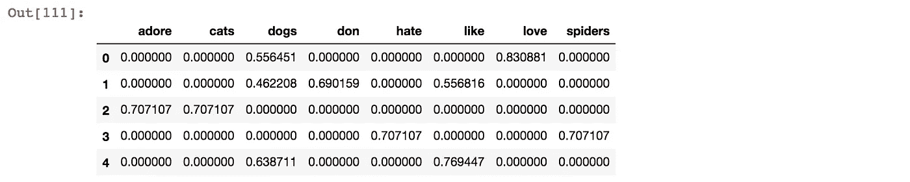

```
pd.DataFrame(X_ROS.todense(), columns=tv.get_feature_names())
```

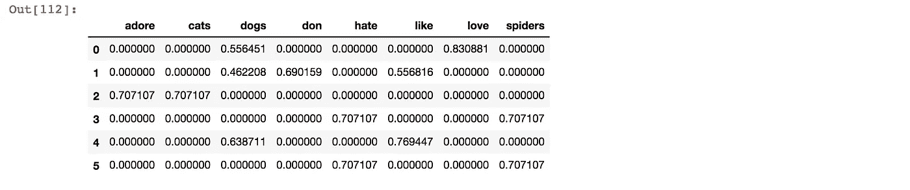

通过运行 RandomOverSampler，现在我们在末尾多了一个条目。RandomOverSampler 添加的最后一个条目与从顶部开始的第四个条目(索引号 3)完全相同。RandomOverSampler 只是重复少数类的一些条目来平衡数据。如果我们看看 RandomOverSampler 之后的目标情绪，我们可以看到它现在通过添加更多的负面类条目而在类之间达到了完美的平衡。

```
y_ROS
```

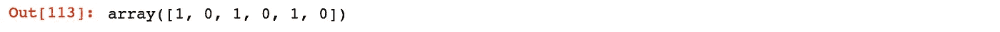

```
lr_cv(5, df.clean_text, df.sentiment, ROS_pipeline, 'macro')
```

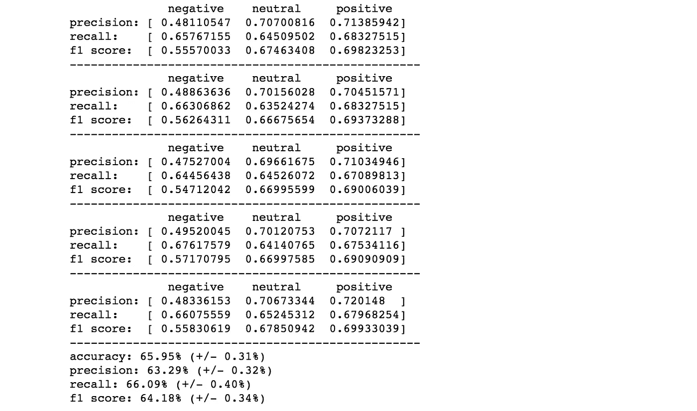

与用原始不平衡数据建立的模型相比，现在的模型表现相反。负类的准确率在 47~49%左右，但是召回率要高得多，在 64~67%之间。现在我们面临着高召回率，低准确率的局面。这意味着分类器认为很多东西是负面的。然而，它也认为大量的非否定性文本是否定性的。所以从我们的数据集中，我们得到了许多被归类为否定的文本，它们中的许多在实际否定集中，然而，它们中的许多也是非否定的。

但是在没有重采样的情况下，负类的召回率低至 28~30%,而通过重采样得到的负类的精确率在 47~49%左右。

另一种方法是看 f1 分数，它是精确度和召回率的调和平均值。原始不平衡数据的准确率为 66.51%，F1 值为 60.01%。然而，采用过采样时，我们得到的精度略低，为 65.95%，但 F1 值却高得多，为 64.18%

## 合成少数过采样技术

SMOTE 是一种过采样方法，其中通过创建“合成”样本对少数类进行过采样，而不是通过替换进行过采样。

根据最初的研究论文“[SMOTE:Synthetic Minority Over-sampling Technique](https://www.jair.org/media/953/live-953-2037-jair.pdf)”(Chawla et al .，2002)，“合成样本以如下方式生成:取所考虑的特征向量(样本)与其最近邻之间的差。将该差乘以 0 和 1 之间的随机数，并将其添加到所考虑的特征向量中。这导致沿着两个特定特征之间的线段选择一个随机点。这种方法有效地迫使少数类的决策区域变得更普遍。”这意味着当 SMOTE 创建一个新的合成数据时，它将选择一个数据进行复制，并查看其 k 个最近的邻居。然后，在特征空间上，它将在原始样本和它的邻居之间的特征空间中创建随机值。

一旦你看到玩具数据的例子，它会变得更加清晰。

```
smt = SMOTE(random_state=777, k_neighbors=1)
X_SMOTE, y_SMOTE = smt.fit_sample(testing_tfidf, testing_target)
pd.DataFrame(X_SMOTE.todense(), columns=tv.get_feature_names())
```

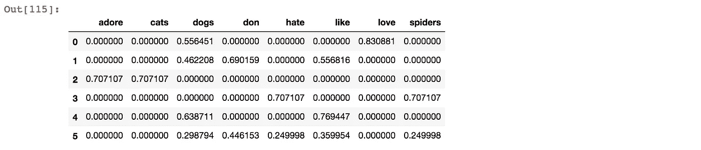

最后一个条目是 SMOTE 创建的数据。为了更容易看出，我们只看负类。

```
pd.DataFrame(X_SMOTE.todense()[y_SMOTE == 0], columns=tv.get_feature_names())
```

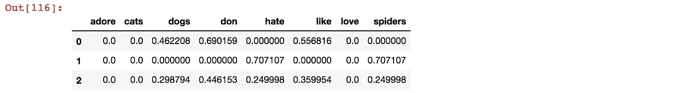

上面的两个条目是原始数据，下面的一个是合成数据。你可以看到它不只是重复原始数据。相反，Tf-Idf 值是通过取前两个原始数据之间的随机值来创建的。如您所见，如果两个原始数据的 Tf-Idf 值都为 0，那么合成数据的这些特征也为 0，如“adore”、“cactus”、“cats”，因为如果两个值相同，则它们之间没有随机值。对于这个玩具数据，我特意将 k_neighbors 定义为 1，因为只有两个负类条目，如果 SMOTE 选择一个进行复制，那么就只剩下一个其他的负类条目作为邻居。

现在让我们来拟合 SMOTE 管道，看看它如何影响性能。

```
lr_cv(5, df.clean_text, df.sentiment, SMOTE_pipeline, 'macro')
```

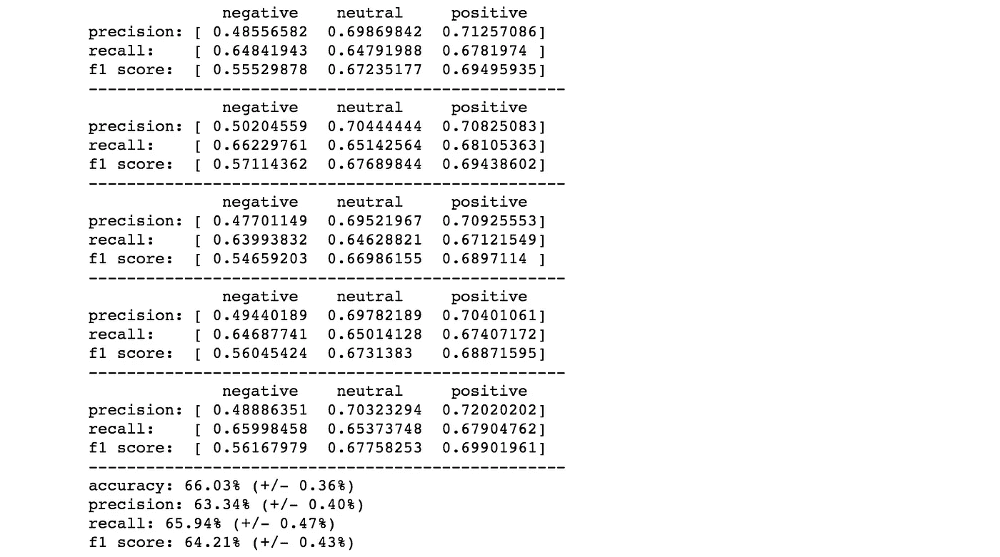

与随机过采样相比，SMOTE 采样似乎具有略高的精度和 F1 值。根据目前的结果，似乎选择 SMOTE 过采样比原始或随机过采样更可取。

# 向下采样

下采样怎么样？如果我们在上述过采样中对少数类进行过采样，利用下采样，我们试图减少多数类的数据，从而使数据类平衡。

```
from imblearn.under_sampling import NearMiss, RandomUnderSamplerRUS_pipeline = make_pipeline(tvec, RandomUnderSampler(random_state=777),lr)
NM1_pipeline = make_pipeline(tvec, NearMiss(ratio='not minority',random_state=777, version = 1),lr)
NM2_pipeline = make_pipeline(tvec, NearMiss(ratio='not minority',random_state=777, version = 2),lr)
NM3_pipeline = make_pipeline(tvec, NearMiss(ratio=nm3_dict,random_state=777, version = 3, n_neighbors_ver3=4),lr)
```

## 随机欠采样器

同样，在我们运行管道之前，让我们将它应用于玩具数据，看看它能做什么。

```
rus = RandomUnderSampler(random_state=777)
X_RUS, y_RUS = rus.fit_sample(testing_tfidf, testing_target)
pd.DataFrame(X_RUS.todense(), columns=tv.get_feature_names())
```

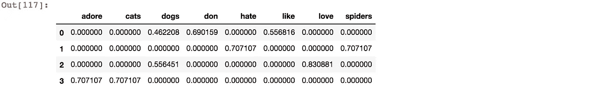

```
pd.DataFrame(testing_tfidf.todense(), columns=tv.get_feature_names())
```

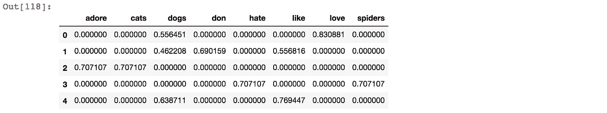

与原始不平衡数据相比，我们可以看到下采样数据少了一个条目，这是原始数据中属于正类的最后一个条目。RandomUnderSampler 通过从多数类中随机移除数据来减少多数类。

```
lr_cv(5, df.clean_text, df.sentiment, RUS_pipeline, 'macro')
```

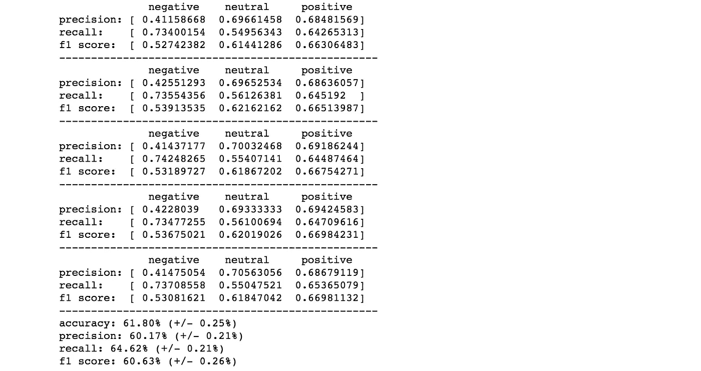

现在准确性和 F1 的分数已经明显下降。但低精度和高召回率的特点与过采样数据相同。只是整体表现下降了。

## 差点错过

根据“不平衡学习”的文档，“ [NearMiss 增加了一些启发式规则来选择样本。NearMiss 实现了 3 种不同类型的启发式算法，可通过参数 version 进行选择。NearMiss 启发式规则基于最近邻算法。](http://contrib.scikit-learn.org/imbalanced-learn/stable/under_sampling.html#controlled-under-sampling)

还有一篇关于重采样技术的好论文。“[用于改善不平衡数据集分类性能的重采样技术调查](https://arxiv.org/pdf/1608.06048.pdf)”(Ajinkya More，2016 年)

我借用了莫尔论文中对 NearMiss 三个不同版本的解释。

## 近距离-1

在 NearMiss-1 中，来自多数类的那些点到少数类中 k 个最近点的平均距离最低的点被保留。这意味着它将保持与少数阶级相似的多数阶级的观点。

```
nm = NearMiss(ratio='not minority',random_state=777, version=1, n_neighbors=1)
X_nm, y_nm = nm.fit_sample(testing_tfidf, testing_target)
pd.DataFrame(X_nm.todense(), columns=tv.get_feature_names())
```

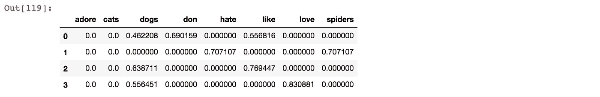

```
pd.DataFrame(testing_tfidf.todense(), columns=tv.get_feature_names())
```

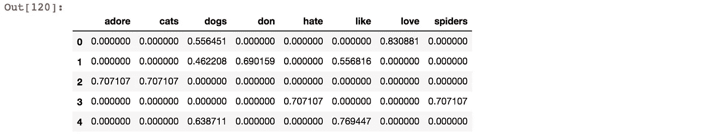

我们可以看到，NearMiss-1 已经删除了文本“I adore cats”的条目，这是有意义的，因为单词“adore”和“cats”都只出现在该条目中，因此使其在特征空间中的 Tf-Idf 表示方面与少数民族类最不同。

```
lr_cv(5, df.clean_text, df.sentiment, NM1_pipeline, 'macro')
```

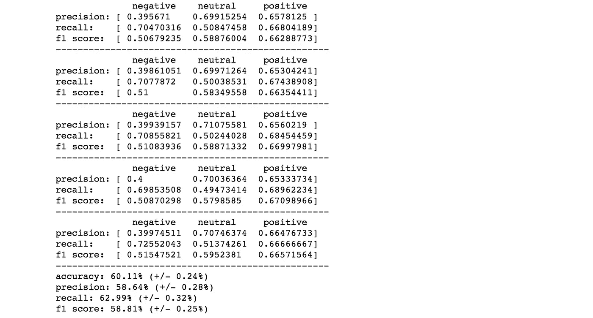

看起来准确性和 F1 分数都比随机欠采样差。

## 近地小行星-2

与 NearMiss-1 相反，NearMiss-2 保留了多数类中那些到少数类中 k 个最远点的平均距离最低的点。换句话说，它会保留多数阶级与少数阶级最大的不同点。

```
nm = NearMiss(ratio='not minority',random_state=777, version=2, n_neighbors=1)
X_nm, y_nm = nm.fit_sample(testing_tfidf, testing_target)
pd.DataFrame(X_nm.todense(), columns=tv.get_feature_names())
```

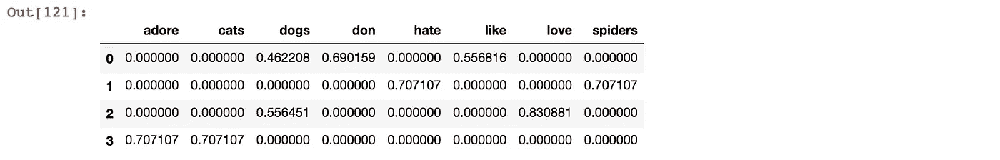

```
pd.DataFrame(testing_tfidf.todense(), columns=tv.get_feature_names())
```

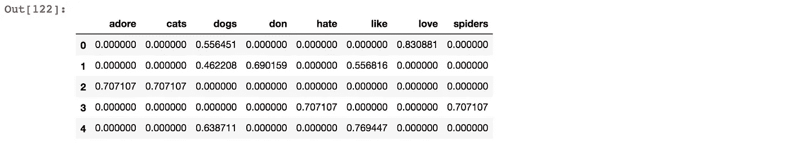

现在我们可以看到，NearMiss-2 删除了文本“我喜欢狗”的条目，这也是有意义的，因为我们也有一个负面条目“我不喜欢狗”。两个条目在不同的类中，但是它们共享两个相同的标记“like”和“dogs”。

```
lr_cv(5, df.clean_text, df.sentiment, NM2_pipeline, 'macro')
```

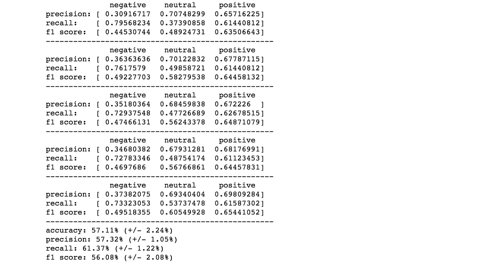

与 NearMiss-1 相比，准确性和 F1 得分甚至更低。我们还可以看到，所有指标在不同的筹码之间波动很大。

## NearMiss-3

最后的 NearMiss 变体 NearMiss-3 为少数类中的每个点选择多数类中的 k 个最近邻。在这种情况下，欠采样比率直接由 k 控制。例如，如果我们将 k 设置为 4，则 NearMiss-3 将选择每个少数类条目的 4 个最近邻居。

然后，我们将根据我们设置的 n 个邻居，得到比少数类更多或更少的多数类样本。例如，对于我的数据集，如果我在默认 n_neighbors_ver3 为 3 的情况下运行 NearMiss-3，它将会抱怨，并且中性类(在我的数据集中是多数类)的数量将小于负类(在我的数据集中是少数类)。因此，我显式地将 n_neighbors_ver3 设置为 4，这样我将拥有足够多的多数类数据，至少与少数类的数量相同。

有一点我不能完全确定，就是当用 n_neighbors_ver3 参数选择的所有数据都多于少数类时，它应用什么样的过滤。正如您将在下面看到的，在应用 NearMiss-3 之后，数据集达到了完美的平衡。然而，如果算法只是根据 n_neighbors_ver3 参数选择最近的邻居，我怀疑它最终会为每个类提供完全相同的条目数。

```
lr_cv(5, df.clean_text, df.sentiment, NM3_pipeline, 'macro')
```

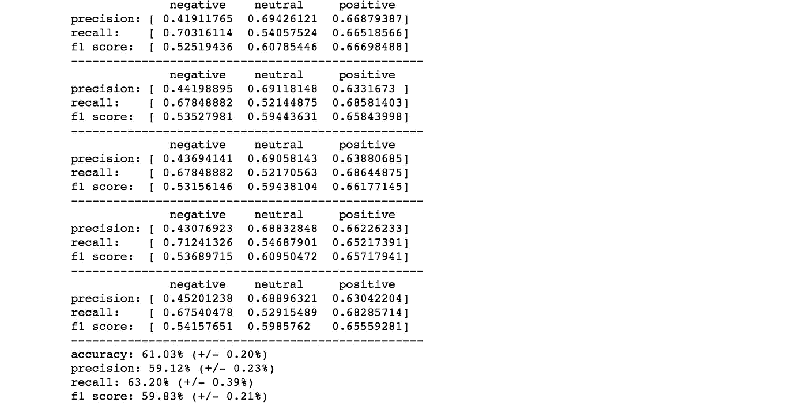

NearMiss-3 产生了 NearMiss 家族中最稳健的结果，但略低于 RandomUnderSampling。

```
from collections import Counternm3 = NearMiss(ratio='not minority',random_state=777, version=3, n_neighbors_ver3=4)
tvec = TfidfVectorizer(stop_words=None, max_features=100000, ngram_range=(1, 3))
df_tfidf = tvec.fit_transform(df.clean_text)
X_res, y_res = nm3.fit_sample(df_tfidf, df.sentiment)
print('Distribution before NearMiss-3: {}'.format(Counter(df.sentiment)))
print('Distribution after NearMiss-3: {}'.format(Counter(y_res)))
```


# 结果

**五重交叉验证结果** *(用于验证的分类器:默认设置的逻辑回归)*

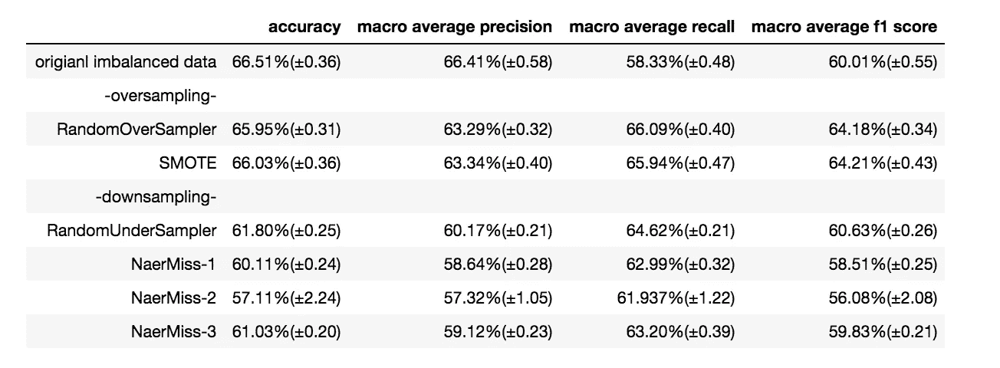

基于上述结果，我将在下一篇文章中使用的采样技术将被 SMOTE。在下一篇文章中，我将使用 SMOTE 过采样数据尝试不同的分类器。

感谢您的阅读，您可以通过以下链接找到 Jupyter 笔记本:

[](https://github.com/tthustla/yet_another_tiwtter_sentiment_analysis_part1/blob/master/Yet_Another_Twitter_Sentiment_Analysis_part1-Copy1.ipynb) [## tthustlea/yeth _ another _ tiw tter _ 情操 _ 分析 _part1

### 通过在 GitHub 上创建一个帐户，为另一个 _ tiwtter _ 情操 _ 分析 _part1 开发做出贡献。

github.com](https://github.com/tthustla/yet_another_tiwtter_sentiment_analysis_part1/blob/master/Yet_Another_Twitter_Sentiment_Analysis_part1-Copy1.ipynb)