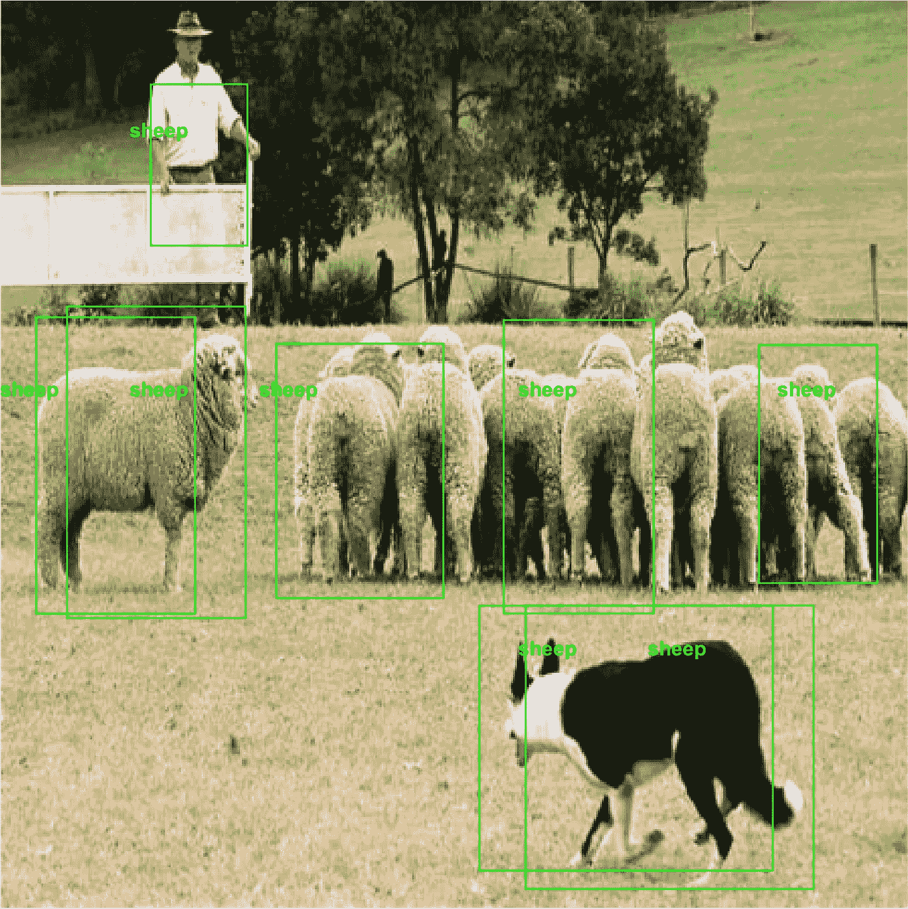
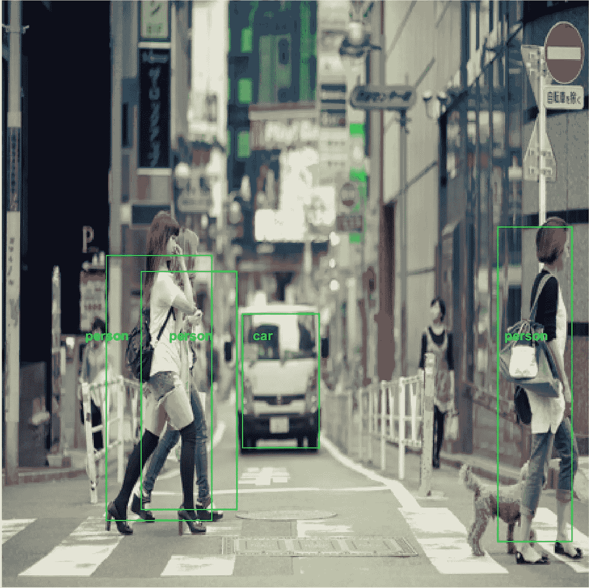
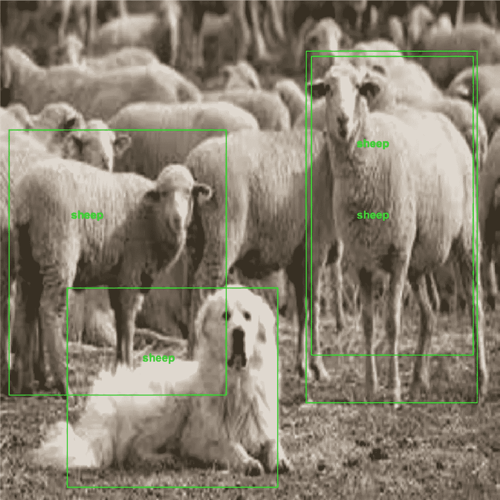
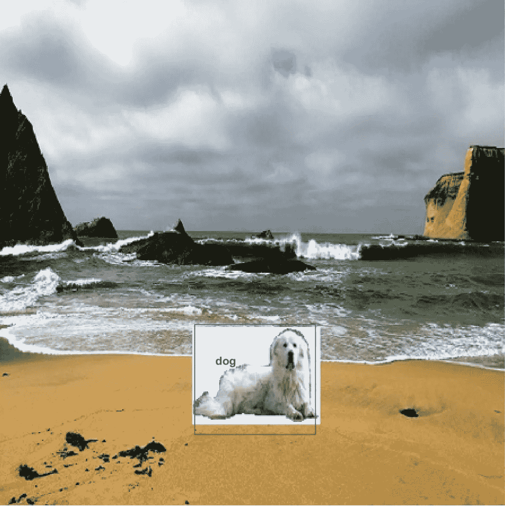
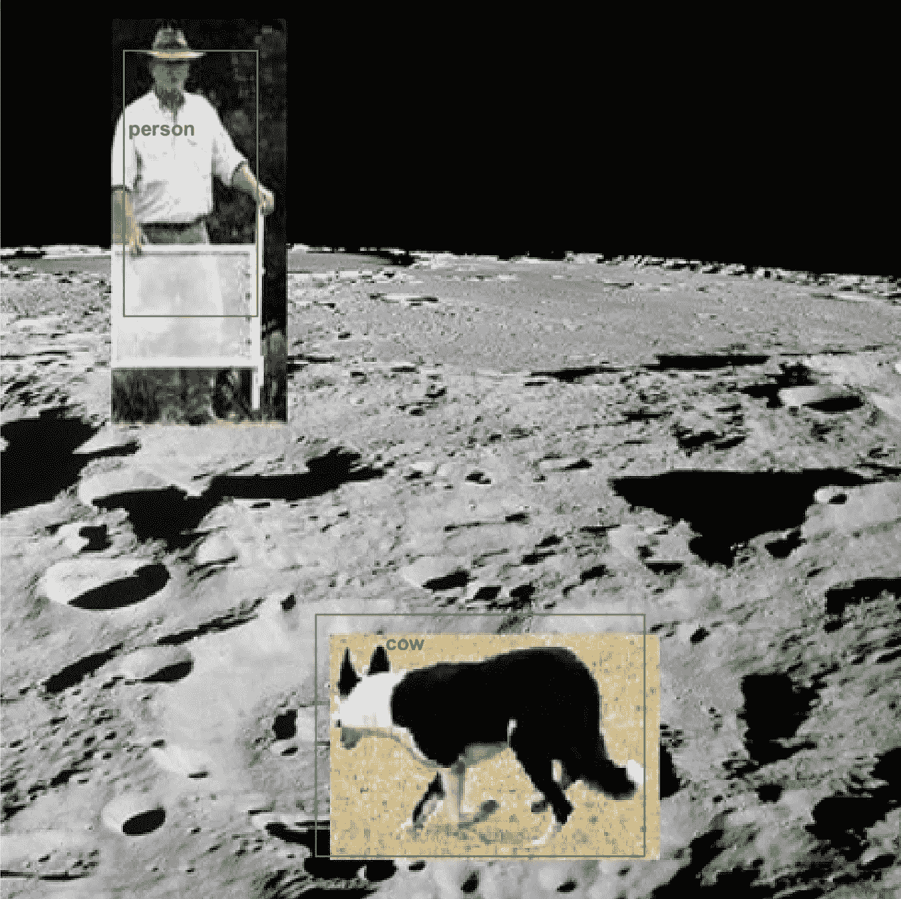
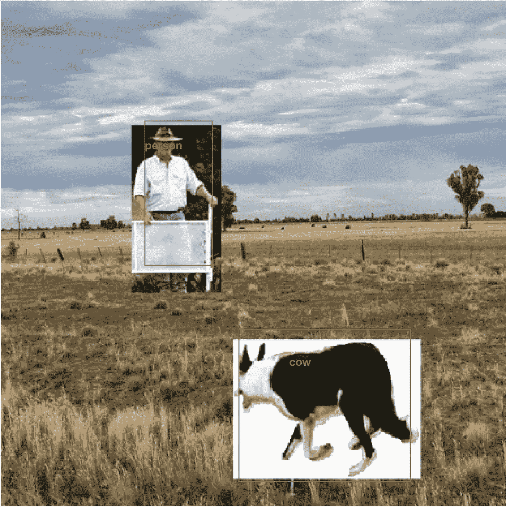

# YOLO 迷上了绵羊:统一目标探测中的环境背景

> 原文：<https://towardsdatascience.com/yolo-is-sheep-obsessed-environmental-context-in-unified-object-detection-91160dafa618?source=collection_archive---------20----------------------->

我最近将约瑟夫·雷德蒙(Joseph Redmond)的 YOLO 算法用于 MATLAB(目前为止没有非最大值抑制)，并花了一个小时在一系列图像上测试它。总的来说，这种算法非常有效:

然而，人们很快就会意识到 YOLO 对羊有一点痴迷。请注意下面两张图片中牧羊人和狗的标注错误:

Sheep, Sheep, Sheep….

Sheep, sheep, and some more sheep…

那只看门狗看起来需要度个假。在某个地方，她会觉得自己像一只狗，而不仅仅是羊群中的一只羊:

Impressive Photoshop skills, I know.

那更好。农夫和他的牧羊犬呢？去月球旅行怎么样？

A shepherd and his sneaky looking cow on the old Apollo studio lot in Hollywood (#moonlandingfaked)

公平地说，牧羊犬看起来确实像狡猾的奶牛。

似乎这个统一的对象检测器已经学会在对象环境的上下文中做出它的决定。与其他 CNN 对象检测算法不同，整个图像，包括周围的视觉背景，是通过网络一次馈入的。我喜欢把 CNN 想象成学习一系列越来越复杂的视觉特征来对一个物体进行分类。然而，我认为 YOLO 已经学会了一种便捷的逻辑捷径来解决检测绵羊的问题——绵羊通常是成群出现的。所以，靠近羊的物体更有可能是羊。

让我们测试一下，YOLO 所反应的周围视觉环境是否不是羊群，而是一个相关的视觉线索，比如周围的风景。这是我们的牧羊人和他的物种困惑的牧羊犬在一个领域。不是任何一块田地，而是澳大利亚的一块看起来非常像你可能会发现绵羊的那种贫瘠的地方的田地:

有意思。一个没有羊群的牧羊人仍然是一个人——即使是在田野里(一只牧羊犬仍然是一只偷偷摸摸的牛)。

YOLO 检测算法的这种行为让我想起了最近我听到的一个关于人工智能未来潜在危险的争论。由于没有足够详细地说明学习算法如何找到解决方案，或者没有对算法的解决方案空间进行足够的限制，我们最终可能会得到我们不喜欢的复杂重要问题的解决方案。最近听到的一个例子(可能来自 AI 扫兴者埃隆马斯克？)是一种算法可能“决定”让世界摆脱癌症的最简单方法是让世界摆脱所有动物。

当然，这个意外的物体识别捷径的例子远没有那么可怕。当然，除非该算法正被用于自动分类牲畜，以便在畜牧场屠宰…

还有人注意到 YOLO 或其他统一对象检测算法中的类似错误吗？