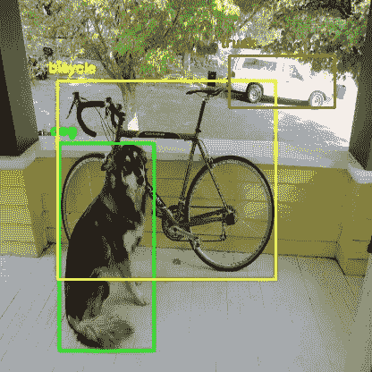
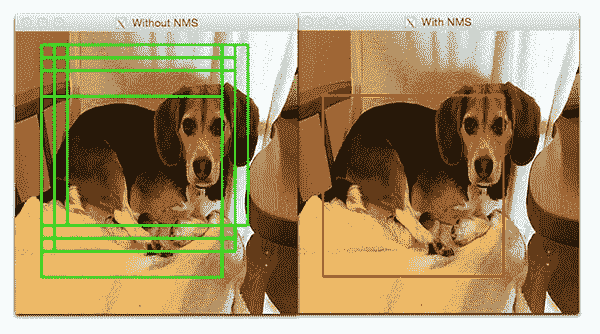
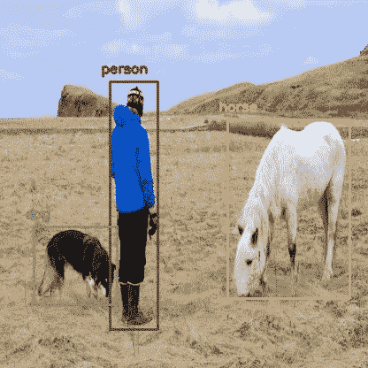
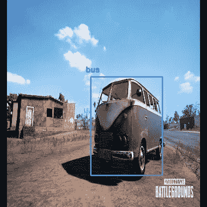

# 基于 OpenCV 和 Python 的 YOLO 物体检测

> 原文：<https://towardsdatascience.com/yolo-object-detection-with-opencv-and-python-21e50ac599e9?source=collection_archive---------3----------------------->



Image Source: [darknet github repo](https://github.com/pjreddie/darknet/blob/master/data/dog.jpg)

如果你一直在关注物体探测领域的进步，你可能已经习惯了听到“YOLO”这个词。这已经成了一个流行词。

# YOLO 到底是什么？

YOLO(你只看一次)是一种进行物体检测的方法。这是代码如何检测图像中的对象背后的算法/策略。

这个想法的官方实现可以通过 [DarkNet](https://pjreddie.com/darknet/) (作者用 C 从头开始的神经网络实现)获得。它在 [github](https://github.com/pjreddie/darknet) 上可供人们使用。

早期的检测框架以不同的比例多次查看图像的不同部分，并重新利用图像分类技术来检测对象。这种方法既慢又低效。

YOLO 采取了完全不同的方法。它只查看整个图像一次，并通过网络一次，检测对象。因此得名。它非常快。这就是它如此受欢迎的原因。

还有其他流行的对象检测框架，如**更快的 R-CNN** 和 **SSD** 也广泛使用。

在这篇文章中，我们将看看如何在 OpenCV 中使用预先训练好的 YOLO 模型，并立即开始检测物体。

# OpenCV dnn 模块

DNN(深度神经网络)模块最初是`opencv_contrib` repo 的一部分。去年它已经被转移到`opencv` repo 的主分支，使用户能够在 OpenCV 本身内部对预训练的深度学习模型进行推理。

(这里需要注意的一点是，`dnn`模块不是用来培训的。只是为了对图像/视频进行推理。)

最初只支持 Caffe 和 Torch 型号。随着时间的推移，对 TensorFlow 等不同框架/库的支持正在增加。

最近增加了对 YOLO/暗网的支持。我们将使用 OpenCV dnn 模块和预训练的 YOLO 模型来检测常见对象。

# 我们开始吧..

说够了。让我们开始写代码。(显然是用 Python)

## 安装依赖项

要执行我们将要编写的代码，需要做以下事情。

*   Python 3
*   Numpy
*   OpenCV Python 绑定

## Python 3

如果你用的是 Ubuntu，很可能已经安装了 Python 3。在终端运行`python3`检查是否安装。如果没有安装，请使用

`sudo apt-get install python3`

对于 macOS，请参考我之前关于 macOS 的[深度学习设置](https://www.arunponnusamy.com/deep-learning-setup-macos.html)的帖子。

如果你需要一个起点，我强烈推荐使用 Python `virtualenvironment.`看看我之前的[帖子](https://www.arunponnusamy.com/deep-learning-setup-macos.html)。

## Numpy

`pip install numpy`

这将安装`numpy.`确保 pip 链接到 Python 3.x ( `pip -V`将显示此信息)

如果需要，使用`pip3`。如果尚未安装，使用`sudo apt-get install python3-pip`获取`pip3`。

## OpenCV-Python

您需要从 github[上的 master 分支的源代码中编译 OpenCV 来获得 Python 绑定。(推荐)](http://github.com/opencv/opencv)

Adrian Rosebrock 在 PyImageSearch 上就此写了一篇很好的博文。(从主分支下载源代码，而不是从存档下载)

如果您被从源代码获取 OpenCV Python 绑定的指令弄得不知所措，您可以使用

`pip install opencv-python`

这不是由 OpenCV.org 官方维护的。这是一个社区维护的。感谢奥利-佩卡·海尼索的努力。

## 命令行参数

该脚本需要四个输入参数。

*   输入图像
*   YOLO 配置文件
*   预先训练的 YOLO 举重
*   包含类名的文本文件

所有这些文件都可以在我整理的 github 知识库中找到。(readme 中提供了下载预训练重量的链接。)

您也可以通过键入以下内容在“终端”中下载预训练的重量

`wget [https://pjreddie.com/media/files/yolov3.weights](https://pjreddie.com/media/files/yolov3.weights)`

这个特定的模型是在微软的 COCO 数据集(上下文中的公共对象)上训练的。它能够检测 80 种常见物体。完整名单见[此处](https://github.com/arunponnusamy/object-detection-opencv/blob/master/yolov3.txt)。

输入图像可以是你的选择。样品输入可在 [repo](https://github.com/arunponnusamy/object-detection-opencv) 中获得。

通过键入以下命令运行脚本

`$ python yolo_opencv.py --image dog.jpg --config yolov3.cfg --weights yolov3.weights --classes yolov3.txt`

# 准备输入

读取输入图像并获得其宽度和高度。

读取包含人类可读形式的类名的文本文件，并将类名提取到一个列表中。

为不同的类生成不同的颜色来绘制边界框。

`net = cv2.dnn.readNet(args.weights, args.config)`

上面一行读取权重和配置文件并创建网络。

```
blob = cv2.dnn.blobFromImage(image, scale, (Width,Height), (0,0,0), True, crop=False)net.setInput(blob)
```

上面的线准备输入图像运行通过深度神经网络。

# 输出图层和边界框

通常，在顺序 CNN 网络中，在末端将只有一个输出层。在我们使用的 YOLO v3 架构中，有多个输出层给出预测。`get_output_layers()`函数给出了输出图层的名称。输出层不与任何下一层相连。

`draw_bounding_box()`函数在给定的预测区域上绘制矩形，并在方框上写入类名。如果需要，我们也可以写置信值。

# 运行推理

`outs = net.forward(get_output_layers(net))`

上面的线是通过网络进行精确前馈的地方。关键时刻到了。如果我们不指定输出图层名称，默认情况下，它将仅从最终输出图层返回预测。任何中间输出层都将被忽略。

我们需要检查来自每个输出层的每个检测，以获得类 id、置信度和边界框角，更重要的是忽略弱检测(具有低置信度值的检测)。

# 非最大抑制

尽管我们忽略了弱检测，但仍会有许多重复的检测和重叠的边界框。非最大抑制会删除重叠程度高的长方体。



Source: [PyImageSearch](https://www.pyimagesearch.com/2018/05/14/a-gentle-guide-to-deep-learning-object-detection/)

最后，我们查看剩下的检测，并在它们周围绘制边界框，显示输出图像。



[source](https://github.com/pjreddie/darknet/blob/master/data/person.jpg)


[source](https://c8.alamy.com/comp/D5E4G0/woman-on-bicycle-waiting-at-stop-sign-to-cross-busy-road-salt-creek-D5E4G0.jpg)



I do not own copyright for the images used in this post. All are from Google Images.

# 摘要

在这篇文章中，我们看了如何使用 OpenCV dnn 模块和预训练的 YOLO 模型来进行物体检测。我们只是触及了表面。物体检测有更多的功能。

我们还可以训练一个模型来检测我们自己感兴趣的对象，这些对象没有包含在预训练的模型中。我将在未来更多地报道对象检测，包括其他框架，如更快的 R-CNN 和 SSD。请务必[订阅](http://eepurl.com/dtoOc9)我的[博客](http://arunponnusamy.com)，以便在新帖子发布时得到通知。

目前就这些。感谢阅读。我希望这篇文章对开始物体检测有用。欢迎在评论中分享你的想法，或者你可以在 twitter 上联系我。

和平。