# 复习:YOLOv1 —你只看一次(物体检测)

> 原文：<https://towardsdatascience.com/yolov1-you-only-look-once-object-detection-e1f3ffec8a89?source=collection_archive---------4----------------------->

在这个故事里，**的 YOLOv1** 由艾研究中心(FAIR)审查。**该网络只需查看图像一次即可检测多个物体。**因此，它被称为 **YOLO** ，**你只看一次**。

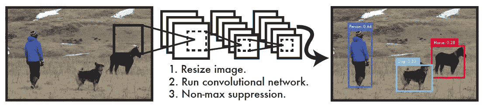

**YOLOv1 without Region Proposals Generation Steps**

通过只看一次图像，**检测速度是实时的(45 fps)** 。**快 YOLOv1 达到 155 fps。**这是另一种最先进的深度学习对象检测方法，在我写这个故事的时候已经发表在 **2016 CVPR** 上，被引用**2000 多次**。( [Sik-Ho Tsang](https://medium.com/u/aff72a0c1243?source=post_page-----e1f3ffec8a89--------------------------------) @中)

下面是作者提供的 YOLOv1 示例:

YOLO Watches Sports

如果感兴趣，他们还提供了其他 YOLOv1 示例:

*   [YOLO 看 YouTube 第一集](https://www.youtube.com/watch?v=U9c1gXO8xEU)
*   [YOLO 看 YouTube 第二部](https://www.youtube.com/watch?v=r6ZzopHEO1U)
*   [YOLO 看 YouTube 第三部](https://www.youtube.com/watch?v=A5QgsNNdphU)
*   [YOLO 手表自然第一部](https://www.youtube.com/watch?v=dTcfAuCEV3A)
*   [YOLO 手表自然第二部](https://www.youtube.com/watch?v=K9a6mGNmhbc)

# 涵盖哪些内容

1.  **统一检测**
2.  **网络架构**
3.  **损失函数**
4.  **结果**

# 1.统一检测

## 1.1 现有技术:R-CNN

像 R-CNN 这样的现有技术首先生成 2K 个区域提议(边界框候选)，然后如下检测每个区域提议内的对象:

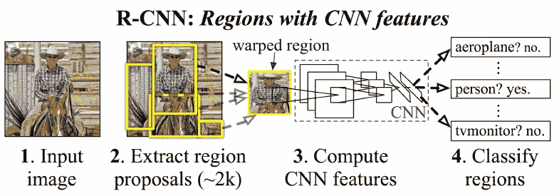

**R-CNN (First, extract region proposals; Then detect object for each region proposals)**

因为需要两步，所以它们非常慢。

## 1.2 YOLO

YOLO 建议有一个统一的网络来一次性完成所有任务。同样，端到端的培训网络也可以实现。

**YOLO Unified Detection**

**输入图像被分成一个 S×S 网格(S=7)** 。如果对象的中心落入网格单元，则该网格单元负责检测该对象。

**每个网格单元预测 B 个边界框(B=2)和这些框的置信度得分。**这些置信度得分反映了模型对盒子包含对象**的置信度，即盒子中的任何对象 P(对象)。**

**每个边界框由 5 个预测组成:x、y、w、h 和置信度。**

*   (x，y)坐标表示相对于网格单元边界的盒子中心。
*   相对于整个图像预测宽度 w 和高度 h。
*   置信度表示预测框和任何基础真值框之间的联合交集(IOU)。

每个网格单元还预测条件类概率 P(Classi|Object)。(班级总数=20)

下图说明了网络的输出:

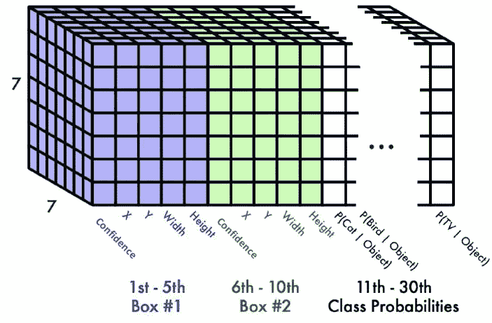

**The output from YOLO**

**输出大小变成:7×7×(2×5+20)=1470**

# 2.网络体系结构

**YOLO model network architecture**

**该模型由 24 个卷积层和 2 个全连接层组成。**交替的 1×1 卷积层减少了来自前面层的特征空间。(GoogLeNet 中使用了 1×1 conv 以减少参数数量。)

**快速 YOLO 更少的卷积层(9 层而不是 24 层)以及这些层中更少的滤波器。**网络管道总结如下:

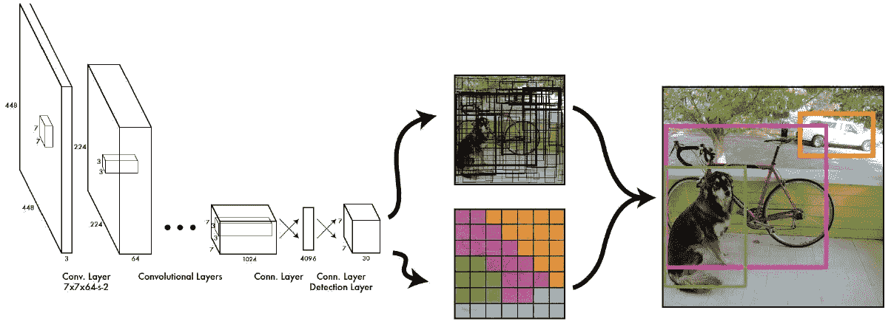

**Whole Network Pipeline**

因此，我们可以看到，输入图像通过网络一次，然后可以检测对象。我们可以进行**端到端学习**。

# 3.损失函数

## 3.1 损失函数解释

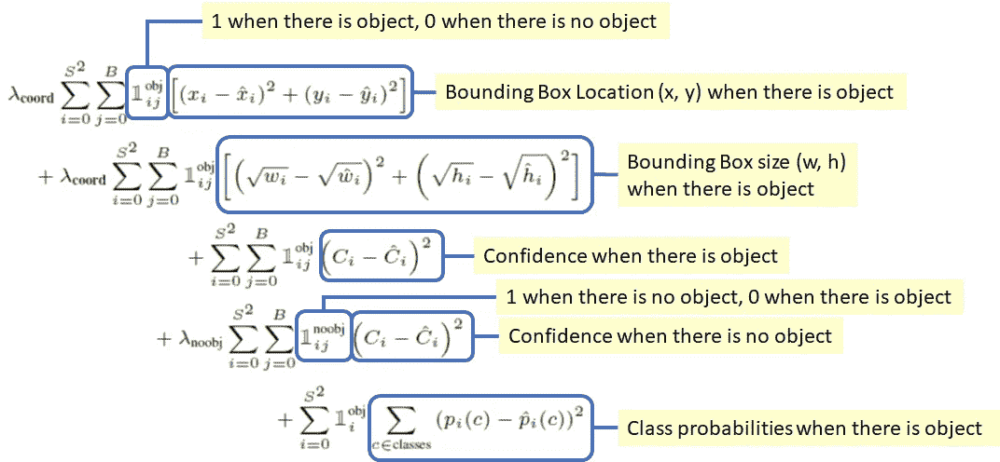

**Loss Function**

如上图所示，损失函数中有 **5 项。**

1.  **第一项(x，y)** :边界框 x 和 y 坐标被参数化为特定网格单元位置的偏移量，因此它们也被限制在 0 和 1 之间。并且只有在有目标的情况下才估计误差平方和(SSE)。
2.  **第二项(w，h)** :边界框的宽度和高度由图像的宽度和高度归一化，使它们落在 0 和 1 之间。SSE 只有在有对象的情况下才被估计。因为大盒子中的小偏差不如小盒子中的小偏差重要。边界框宽度 w 和高度 h 的平方根，而不是宽度和高度直接解决这个问题。
3.  **第三项和第四项(置信度)**(即预测框和任何地面真实框之间的 IOU):在每个图像中，许多网格单元不包含任何对象。这将这些单元的“置信度”分数推向零，通常会压倒包含对象的单元的梯度，并使模型不稳定。因此，不包含对象的盒子的置信度预测的损失减少，即 **λnoobj** =0.5。
4.  **第五项(类概率)**:有对象时类概率的 SSE。
5.  **λcoord** :由于第三和第四项中提到的相同原因，λcoord = 5，以增加边界框坐标预测的损失。

## 3.2 其他细节

除了最后一层，其他所有层都使用 leaky ReLU 作为激活函数。**ImageNet**对前 20 个卷积层进行预训练，使其在一周内达到 88%的前 5 名准确率。**然后，根据来自 PASCAL VOC 2007 和 2012 的训练和验证数据集，对网络进行大约 135 个时期的训练。**在对 2012 年进行测试时，我们还纳入了 VOC 2007 年的测试数据用于培训。使用的批次大小为 64。还使用了第一个完全连接的层的丢弃和数据增加。

在 PASCAL VOC 上，**预测了每幅图像 98 个包围盒**。

一些大的物体或者多个小区边界附近的物体可以同时被多个小区很好的定位。**使用非最大抑制。**

# 4.结果

## **4.1 VOC 2007**

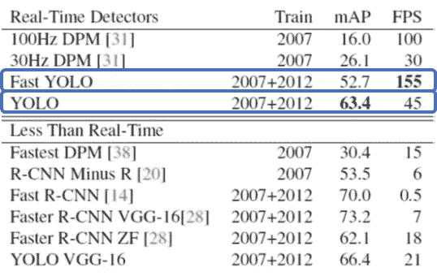

**mAP and FPS Results (VOC 2007)**

*   **YOLO** : 63.4 mAP(均值平均预测)和 45 FPS。与 DPM、R-CNN、快速 R-CNN 和更快 R-CNN 相比，YOLO 可以在相似的 mAP 下获得实时性能。
*   **快速 YOLO** : 52.7%贴图，155 FPS。如此高的 FPS，与 100Hz DPM 相比，它也有非常高的 mAP。
*   **YOLO VGG-16** : YOLO 使用 VGG016 架构，由于没有 1×1 卷积来减少模型大小，所以速度很慢，即使有 66.4%的 mAP 也只有 21 FPS。

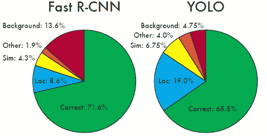

**Error Analysis (VOC 2007)**

**物体定位**:与快速 R-CNN 相比，YOLO 很难正确定位物体。

**背景误差** : YOLO 背景误差较小。快速 R-CNN 有 13.6%的顶部检测是假阳性。

由于 YOLO 和快速 R-CNN 各有利弊，所以可以将它们结合起来以具有更高的准确性。

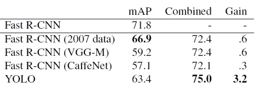

**Model combination with Fast R-CNN (VOC 2007)**

模型组合后，获得了 75.0%的 mAP，与其他组合相比具有相对较高的精度。

## **2012 年 4.2 VOC**

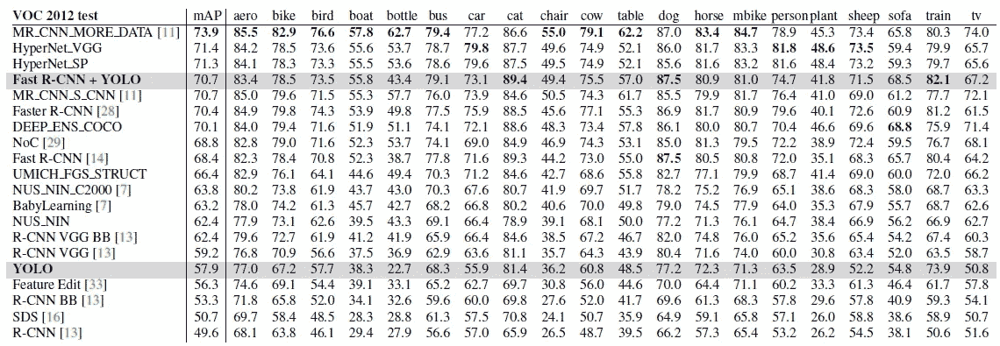

**Fast R-CNN + YOLO (VOC 2012)**

快速 R-CNN + YOLO 具有 70.7%的 mAP，这是最高性能的检测方法之一。

## 4.3 普遍性

在 Picasso 数据集和 People-Art 数据集上也尝试了艺术品上的人物检测。毕加索的模特接受 VOC 2012 培训，而人物艺术的模特接受 VOC 2010 培训。

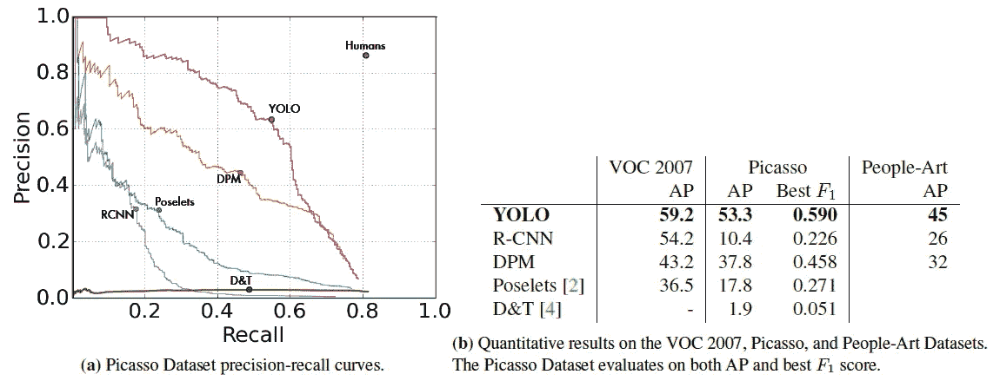

**Generalization Results**

*   **R-CNN** 在 VOC 2007 上 AP 高。然而，R-CNN **在应用到艺术品上时，就大大地减少了**。 **R-CNN 使用** **选择性搜索为自然图像调整的边界框提议。**
*   **DPM 将其 AP** 很好地应用于艺术品。先前的工作理论上认为 DPM 性能良好，因为它具有对象形状和布局的**强空间模型。**
*   **YOLO** 在 VOC 2007 上有很好的表现，当应用于艺术品时，它的 AP 降解比其他方法少。**艺术作品和自然图像在像素级别上非常不同，但它们在对象的大小和形状方面相似**，因此 YOLO 仍然可以预测良好的边界框和检测。

下面显示了一些非常有趣的可视化结果:

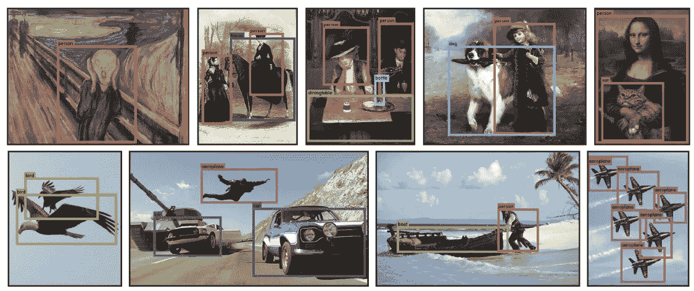

**Some detection results**

以后再讲 YOLOv2 和 YOLOv3。

# 参考

1.  【2016 CVPR】【yolov 1】
    T5【你只看一次:统一的，实时的物体检测

# 我的评论

[ [R-CNN](https://medium.com/coinmonks/review-r-cnn-object-detection-b476aba290d1) ] [ [快速 R-CNN](https://medium.com/coinmonks/review-fast-r-cnn-object-detection-a82e172e87ba) ] [ [更快 R-CNN](/review-faster-r-cnn-object-detection-f5685cb30202)][[Google net](https://medium.com/coinmonks/paper-review-of-googlenet-inception-v1-winner-of-ilsvlc-2014-image-classification-c2b3565a64e7)]