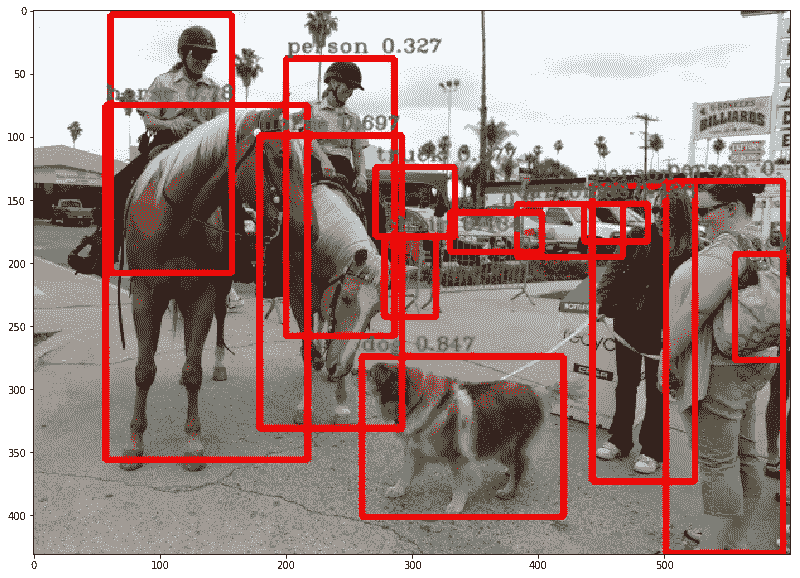
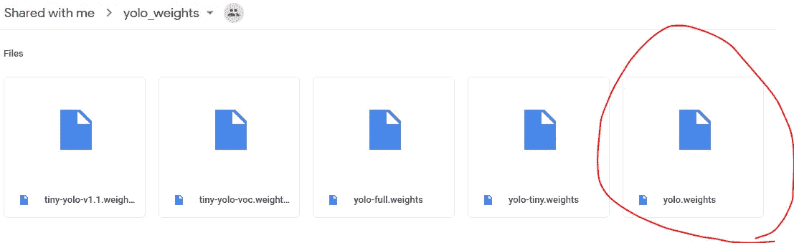
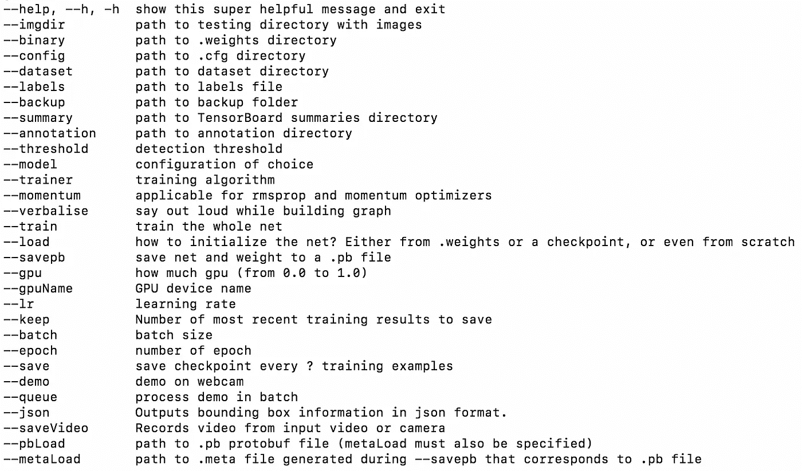
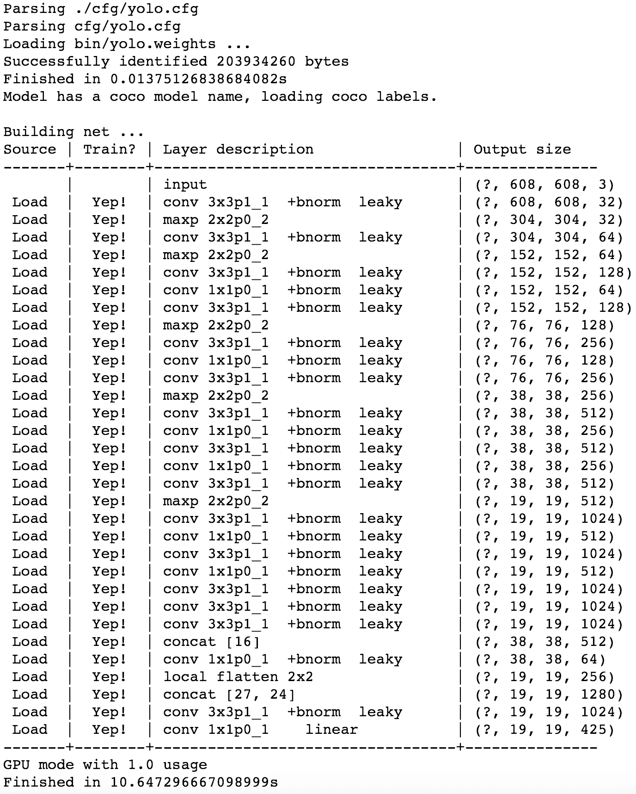
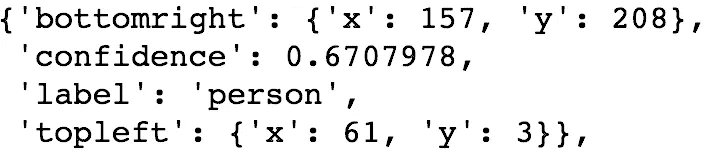
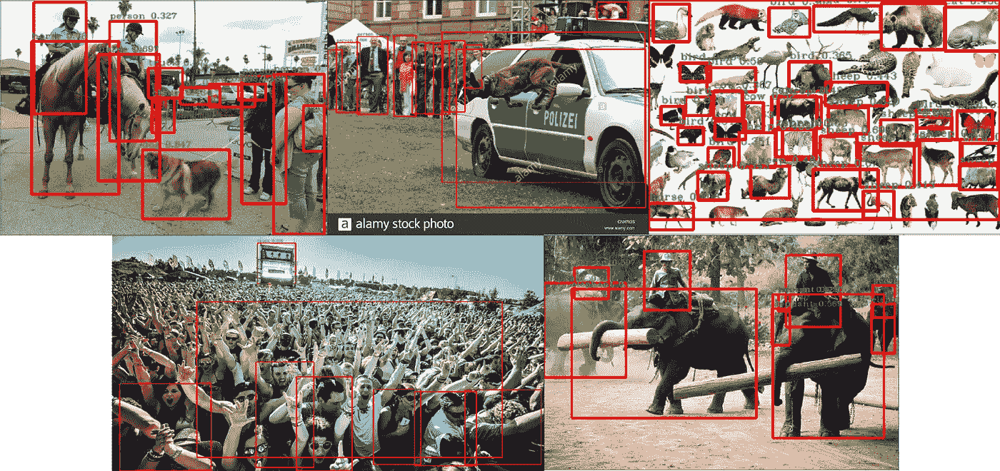

# 使用暗流的 YOLOv2 对象检测

> 原文：<https://towardsdatascience.com/yolov2-object-detection-using-darkflow-83db6aa5cf5f?source=collection_archive---------1----------------------->



这个故事介绍了如何检测物体。如果您计划构建一个受益于对象检测的应用程序，这将很有帮助。幕后使用 YOLOv2 算法。不过我用的是开源实现，“ [Darkflow](https://github.com/thtrieu/darkflow) ”，所以不需要担心细节。

简而言之，执行对象检测需要 4 个步骤。还有一些更多的细节，所以如果你真的想使用我的代码，请访问 [***我的 github 库***](https://github.com/deep-diver/Object-Detection-YOLOv2-Darkflow) 了解这个故事。这是这个故事的朱庇特笔记本。

# **安装暗流**

其实你可以访问 [***Darkflow 的 github 资源库***](https://github.com/thtrieu/darkflow) 并探索安装指南。在这里，我将让指令尽可能简单。

```
$ pip install Cython
$ git clone [https://github.com/thtrieu/darkflow.git](https://github.com/thtrieu/darkflow.git)
$ cd darkflow
$ python3 setup.py build_ext --inplace
$ pip install .
```

# **下载重量**

有两种方式下载预训练的重量。首先，你可以从[*YOLO 项目官方网页*](https://pjreddie.com/darknet/yolo/) 下载。第二，你可以在这里 [***下载***](https://drive.google.com/drive/folders/0B1tW_VtY7onidEwyQ2FtQVplWEU) 哪个 Darkflow 作者自己训练的版本。我决定使用第二种方法，因为我正在使用暗流实现。如果你愿意，你可以试试第一种方法。



Red circle indicates the weight file you need to download

# **建立模型**

正如您在下面看到的，构建模型非常简单。首先，您需要定义选项对象。然后，您需要用选项实例化 TFNet 类对象。

选项是模型及其环境的规范。下面的截图是您可以指定的完整列表。我将为这个故事使用 ***【模型】【加载】【阈值】******【GPU】***选项。



Darkflow Model Options

**型号选项**要求您指定想要使用的型号。有预定义的模型，我这里用的是 ***yolo.cfg*** 。这个文件包含了模型架构的完整描述。

**加载选项**用于指定您想要使用的权重文件。由于我建议从 [***这里***](https://drive.google.com/drive/folders/0B1tW_VtY7onidEwyQ2FtQVplWEU) 下载 yolo.weights，我指定了。如果您有自己的预训练权重文件，这是您让模型知道的地方(就像在您训练自定义对象之后，您的系统将产生特定的权重文件)。

当您的系统上有 gpu 时，使用 **gpu 选项**。这将提高预测任务的速度。

**阈值选项**是保留被检测对象的置信概率值的底线。我把它设置为 0.1，它似乎相当低。然而，我选择这个值来试验模型可以检测到多少个对象，并且我可以在以后进行过滤。



模型完全加载后，您将得到如上所示的输出。

# **检测物体并在图片上绘制方框**

上面的一行代码是你检测物体所需要做的一切。唯一指定的参数是以 numpy 数组样式表示的图像。如果你打印出结果，你会看到下面显示的对象列表。每个键在对象中的含义看起来非常直观。



我在下面定义了装箱函数，这样我也可以在图像和视频上重复使用。我使用 opencv-python 模块在图像上放置盒子和标签。

使用装箱功能，您可以显示如下结果图像。

或者你也可以像 follow 一样在视频上执行相同的任务。

*请根据您的操作系统在此处检查支持的视频输出格式[，并将其设置在 cv2 上。VideoWriter_fourcc 函数。就我而言，我在 Windows 10 上测试过，所以我指定了*“DIVX”。](https://docs.opencv.org/3.1.0/dd/d43/tutorial_py_video_display.html)

# 结果和评价

以下是我实验过的一些结果。



在各种图片上都好看。然而，我在第二张和第四张图片上看到了一些缺点。

对于第二张图片的情况，看起来 YOLO 人并不希望一只狗出现在图片中间。我想很多预先训练的照片都有狗在地上。

YOLO 实际上非常善于发现人。然而，对于第四张图片的情况，处于动态意外姿势的人看起来不容易被检测到。此外，当太多的对象重叠时，似乎很难检测到它们中的每一个。

我可以看到这个视频类似的问题。YOLO 可能受过有人驾驶汽车的训练。对于这个视频，即使是一只狗被关在车里，算法也预测出这只狗是一个人。此外，后座被预测为具有高置信度的人。