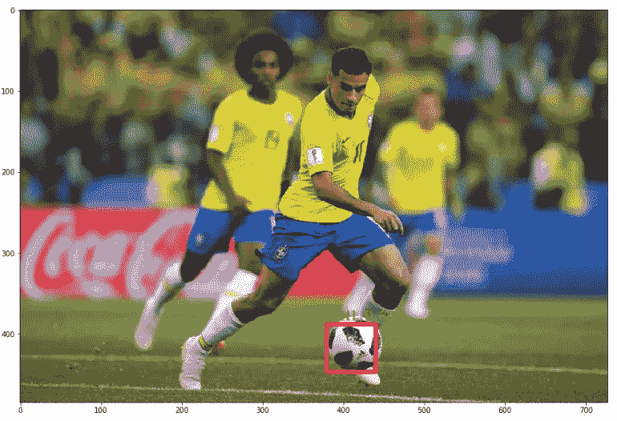
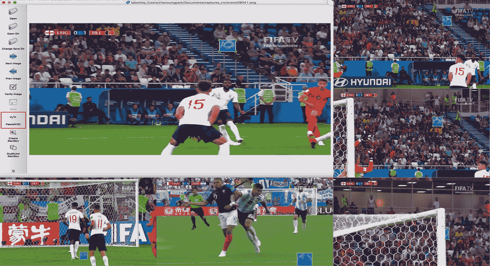
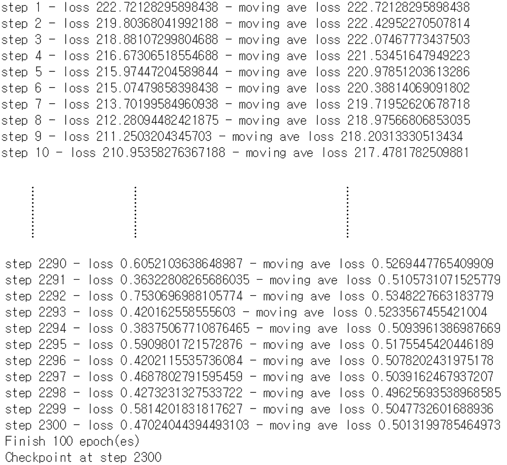
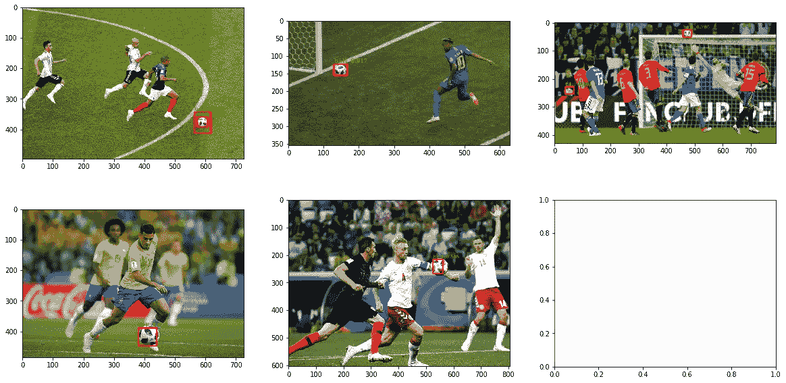

# YOLOv2 使用 Darkflow 检测您自己的对象

> 原文：<https://towardsdatascience.com/yolov2-to-detect-your-own-objects-soccer-ball-using-darkflow-a4f98d5ce5bf?source=collection_archive---------3----------------------->

[***上一个故事***](/yolov2-object-detection-using-darkflow-83db6aa5cf5f) 前一个展示了关于[***dark flow***](https://github.com/thtrieu/darkflow)**其中* 是 YOLOv2 对象检测模型的实现之一*

*这个故事介绍了在自定义数据集上进行对象检测的基本步骤。作为一个例子，我自己做了足球检测。简而言之，我将展示如何 **1 .准备数据集，2 .训练模型**和 **3 .预测对象**。*

*我在 Github*上写过一篇 [***Jupyter 的笔记本跟这个故事有关。如果您想亲自尝试，请访问***](https://github.com/deep-diver/Soccer-Ball-Detection-YOLOv2) ***[**此处**](https://github.com/deep-diver/Soccer-Ball-Detection-YOLOv2) 获取完整的数据集和训练程序。*****

# **准备数据集**

****这一步**要做的第一件事是**搜索你感兴趣的媒体(图像或视频)文件**。就我而言，我选择了足球，因为当我在这里时，2018 年俄罗斯世界杯正在进行。在 Youtube 上更容易找到精彩的视频剪辑，我可以制作很多截图(通过这个链接，你会找到一种从视频文件制作大量截图的方法)。如果你只是从网上收集图像文件，那也很好。**只要记住**所有来自互联网的**你的图像文件**或者截图**必须属于一个相似的**(或者**相同的**如果可能的话)**发行版**因为我们不打算构建通用 AI。**

****其次**，是**对采集到的图像数据集进行预处理**的时候了。可以用图像和相关联的注释来训练 YOLO 模型。图像文件链接到注释文件，而注释文件包含多个注释信息。注释指示图像中对象的位置及其大小，如(x_top，y_top，x_bottom，y_bottom，width，height)。这些批注应该是自己手写的，可能需要很长时间。然而，幸运的是，有很好的工具来简化这项任务。我选择了 [**这个工具**](https://github.com/tzutalin/labelImg) **(labelImg)** 。**

****

****labelImg TOOL for bounding boxes****

**从上面的截图可以看出，你可以很容易地在你感兴趣的对象周围绑定框。我只有足球的边界框，但是多个对象也可以。**只要记住**应该显示 **PascalVOC 文本**，因为它**表示 **YOLO 的**注释样式现在被选中，**即使你使用这样的工具，这个过程也要花费很长时间。**

## **如果你想要我的数据集…**

****我已经上传并分享了我的预处理图像数据集和相关注释。**你可以在这里 下载 [**。如果您想亲自试验训练/预测任务，您可能需要它；如果您想添加更多数据集以提高模型的性能，您也可能需要它。**](https://drive.google.com/drive/folders/1th1odcC5kjEnkZmwooETYlyLsz5AOTph?usp=sharing)**

# **预测对象**

**在这一步中， ***在预测*****之前，训练好的模型应该准备**进行推论。为了获得一个训练有素的模型，以下是你应该做的。**

1.  ****在 COCO 或 VOC 数据集上找到预训练模型****
2.  ****更改配置，使模型适合您自己的情况****
3.  ****建立模型****
4.  ****训练模型****

****首先是**，在我的例子中，我使用了****(yolov 2 的开源项目) [**其预训练参数**](https://drive.google.com/drive/folders/0B1tW_VtY7onidEwyQ2FtQVplWEU) 。请访问我的 github 库，查看完整的使用说明。******

********第二个**，应该有一个指定型号配置的文件。如果没有，您应该在代码本身中更改它。对于暗流，有一个文件(*。cfg)。**最后，**你应该改变最后一层的一些值。例如，在我的例子中，我只想检测一个足球。于是，我把**“类”的值改成了 1**(VOC 和 COCO 数据集的类数分别是 20 和 80)。由于最后一层中单元(类)的数量，**一些相关联的参数数量**也应该被适当地改变。根据 darkflow 的文档，我需要**将【卷积】层**(倒数第二层)中的过滤器更改为 **num * (classes + 5)，即 30** 。******

********第三和第四**步骤可能与各种实施方式不同。在 darkflow 中，下面的代码显示了如何构建模型。******

******它将打印出模型的架构，其中包含一些与预训练模型不同的相关更改。然后下面一行代码开始训练过程。******

************

******我确实运行了 100 个纪元，每个纪元有 23 个步骤。这样 2300 的总步骤就完成了。供你参考，**我用的是*英伟达 GTX 1080Ti*** ，用了**大约一个小时**完成训练过程。******

******每 250 步，darkflow 就会创建一个检查点文件。通过指定一个检查点文件，您可以从您离开的地方开始。此外，**您可以使用检查点文件**分发您的训练模型。下面的代码显示了如何加载它来预测流程。(-1 表示最新的检查点)******

******最后，您有了自己的模型来检测定制对象。如何用边界框显示图像或视频的详细描述在 [***前面的故事***](/yolov2-object-detection-using-darkflow-83db6aa5cf5f) 中有解释。也请访问 [***github 库***](https://github.com/deep-diver/Soccer-Ball-Detection-YOLOv2) 获取更详细的解释。******

# ******图像和视频预测结果******

************

******我用网上的随机图片做了实验**(上)**。它就像我期待的那样工作。视频显示了视频文件**(下图)**上的预测结果。******

# ******最后的想法******

*   ********我发现在足球比赛的宽视角下，球的检测相当困难，因为这个物体非常小(比你的指尖还小)。********
*   ******每个数据应该来自非常相似的分布。由于足球比赛的照片是从各种不同的角度拍摄的，有时很难预测。******
*   ********从不同的情况下收集尽可能多的数据。********
*   ********我发现数据集更好的包含了很多任意位置的物体。因为足球几乎出现在比赛的每个位置，所以看不见的位置很难预测。********
*   ********最后，足球有时会出现在球员之间或被球员部分隐藏，这也使得算法难以预测。数据集应该反映这种特殊情况。********