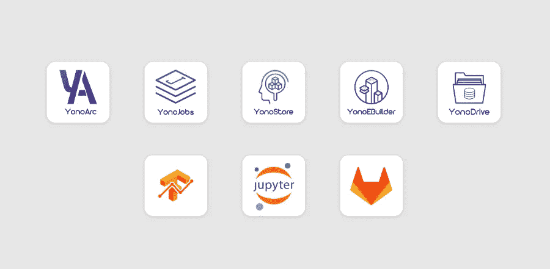
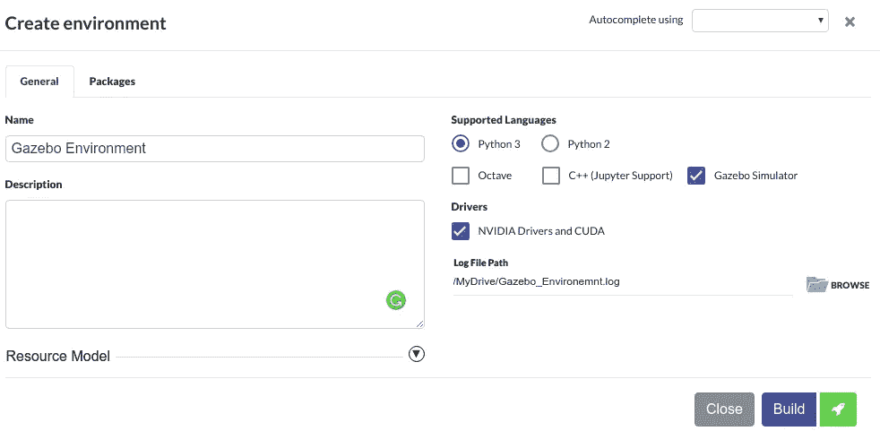
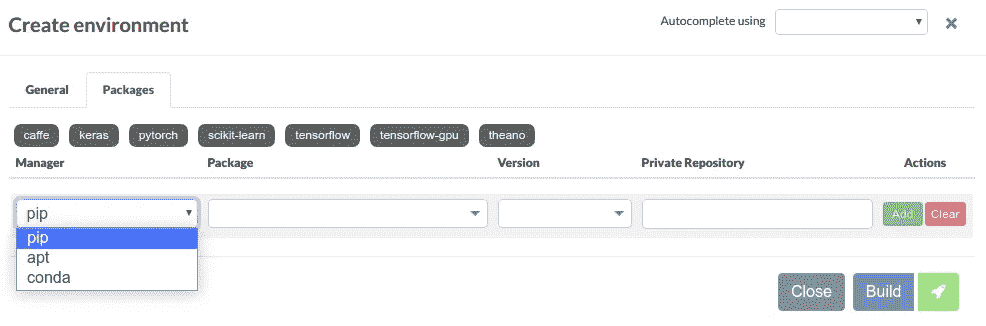
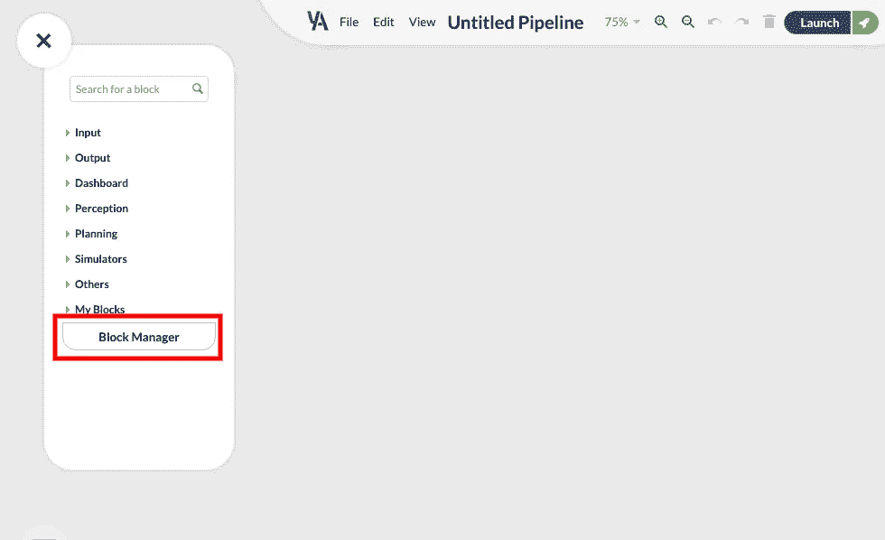
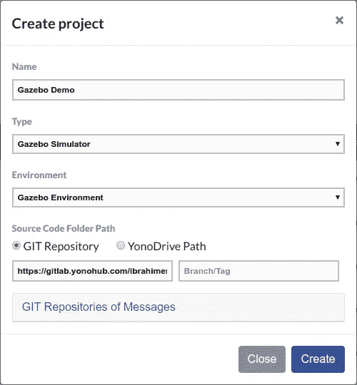
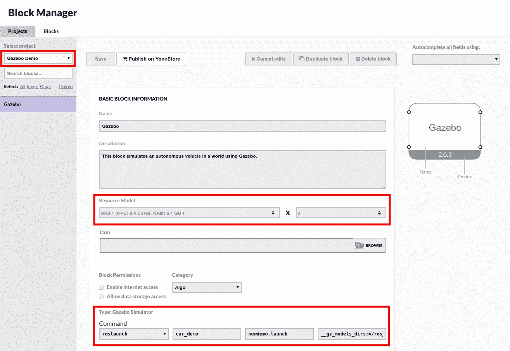
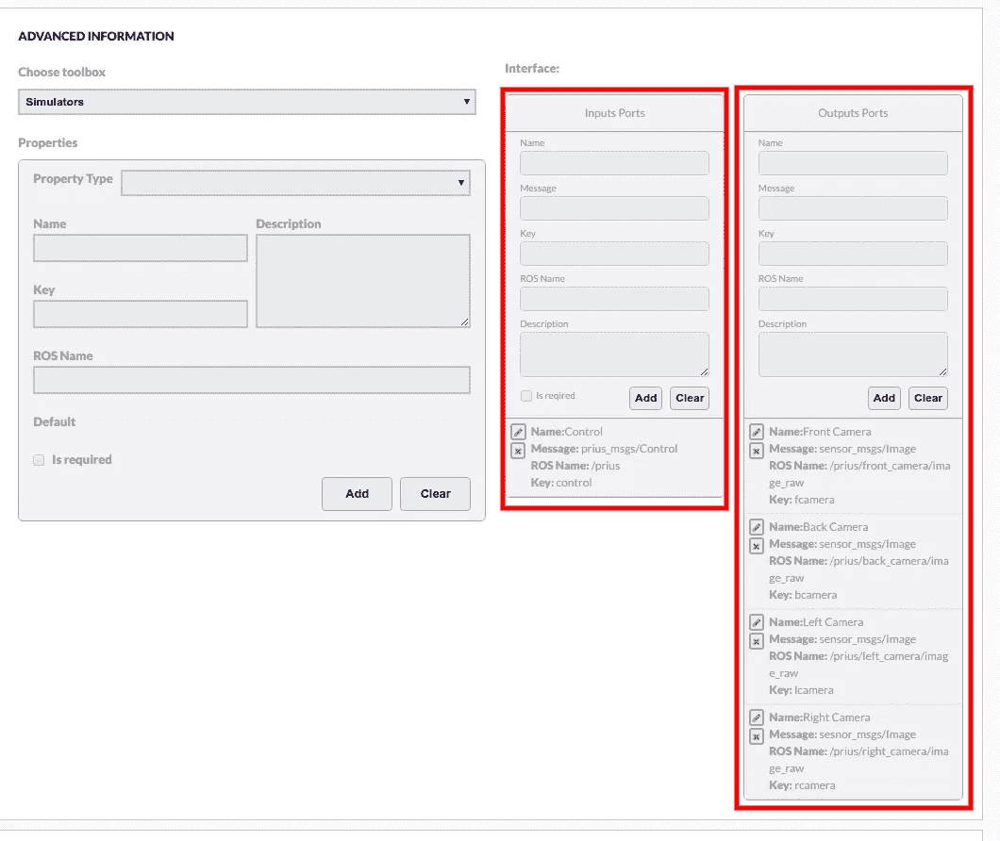
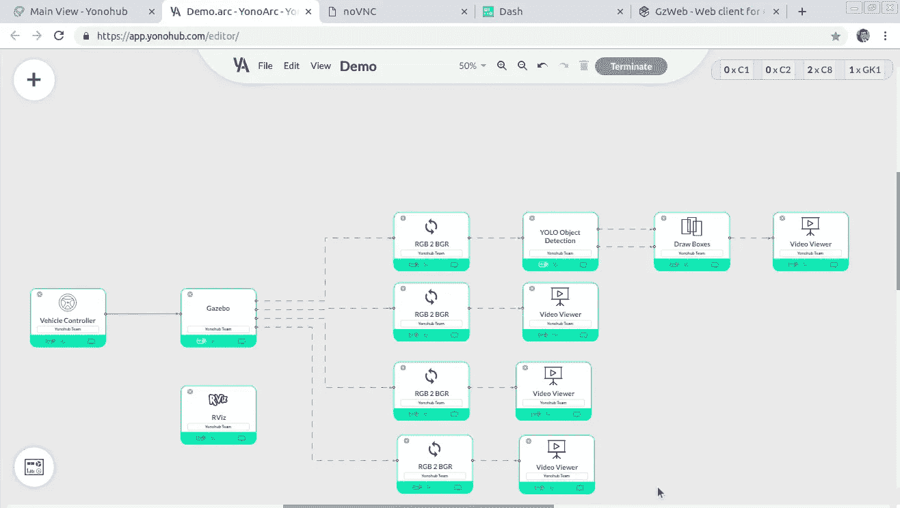

# Yonohub:使用积木的自动驾驶汽车

> 原文：<https://towardsdatascience.com/yonohub-autonomous-vehicles-using-blocks-ef4a1838d92c?source=collection_archive---------16----------------------->


在过去的几周里，我有机会尝试汽车行业最有前途的创新产品之一，我想与您分享我的经验和快速演示。

欢迎来到 [Yonohub](http://yonohub.com) ！

What is Yonohub?

> “Yonohub 是一个基于网络的云系统，用于构建、共享和评估由许多构建模块组成的复杂自动驾驶汽车系统。Yonohub 有一个拖放工具来构建复杂的系统，一个市场来分享和赚钱，一个定制开发环境的构建器，等等。

Yonohub 提供了几个功能强大且易于使用的应用程序，在建造自动驾驶汽车的整个过程中支持开发人员和研究人员:使用 **Jupyter Notebook** 开发算法，使用 **YonoArc** 部署和测试算法，使用**yono jobs**安排夜间培训工作，在 **YonoStore** 上分享和销售算法。



Yonohub Apps

这还不是全部。如你所见，还有现在流行的 GitLab 和 Tensoboard， **YonoDrive** 作为 Yonohub 的数据管理器， **YonoEBuilder。**

有了 **YonoEBuilder，**你再也不用担心你的算法依赖性了。只需点击几下，就可以使用各种包管理器(APT、pip 或 Conda)构建您的环境，并与您的团队或客户共享。

YonoArc 是我最想尝试的应用之一。你可以用不同的数据集来模拟和测试不同的算法，你所需要做的就是拖放块。很酷，不是吗？

该应用程序附带一些免费的块:卡拉模拟器，Gazebo 模拟器，YOLO 对象检测，SSD 对象检测，KITTI 数据集，Berkeley DeepDrive 数据集，等等。

当然，您可以使用 YonoArc 的 [Python](https://www.google.com/url?q=https://docs.yonohub.com/docs/yonohub/yonoarc/yonoarc-python3-api/&sa=D&source=hangouts&ust=1543352785957000&usg=AFQjCNFGNDqChQp2sLAO2jVl2JG3n0PWXQ) 或 [Octave](https://www.google.com/url?q=https://docs.yonohub.com/docs/yonohub/yonoarc/yonoarc-octave-api/&sa=D&source=hangouts&ust=1543352795863000&usg=AFQjCNFaQUpYBmHhVGz9TVpFce3ooUqZRw) 简单 API 创建自己的块，甚至可以导入用 C++或 Python 开发的现有 ROS 节点。如果你和我一样是 ROS 的粉丝，你会喜欢的！

让我和你们分享一个快速演示，在这个演示中，我使用了来自 T2 OSRF T3 的开源代码 T1。它使用 Gazebo 来模拟一辆普锐斯混合动力车，该车有 4 个摄像头，车顶上的 16 束激光雷达，8 个超声波传感器和 2 个平面激光雷达。所有这些传感器都可以使用 RViz 进行可视化，RViz 已经作为免费的 YonoArc 模块提供。这辆车的油门、刹车、转向和传动装置都可以用我创造的另一个模块轻松控制。

Gazebo world 文件是城市和高速公路立交的模型。您可以使用 Gazebo models repository 来包含汽车、人类、建筑等许多其他模型。

让我更详细地向您展示如何做到这一点。

# 创建凉亭模拟环境

任何街区都需要一个环境，所以我用 YonoEBuilder**T5 到**为凉亭街区创建一个环境:****

*   在 Yonohub 的主视图中点击图标，打开 YonoEBuilder。
*   单击创建新环境。所有的环境都预装了 ROS Melodic。
*   选中“Gazebo Simulator”复选框，确保您的环境中有它。
*   检查“NVIDIA 驱动程序和 CUDA ”,让 GPU 访问您的块。



Creating the Gazebo Environment Using YonoEbuilder

在 Packages 选项卡下，我们可以为我们的块安装任何需要的包。对于我们的演示，我们没有任何必需的包，所以我们将跳过这一步。



Creating the Gazebo Environment Using YonoEBuilder

现在一切准备就绪。让我们点击“构建”并让 YonoEBuilder 完成它的工作。让我们喝一杯咖啡，等到环境状态从“正在构建”变为“就绪”。

# 创建露台模拟块

让我们去 YonoArc 并打开这里的块管理器。



在块管理器页面中，让我们单击“创建项目”并填写必填字段。首先，不要忘记选择我们在上述步骤中创建的环境。然后，对于源代码，我们可以使用下面的 [GitLab](https://gitlab.yonohub.com/ibrahimessam/osrf-car-demo.git) repo，它包含了 Gazebo 9 和 ROS Melodic 支持的汽车演示工作区的修改版本。现在，我们可以单击创建。



下一步是构建项目。在 Block Manager 页面中，单击新项目旁边的 Build。

构建完项目后，让我们切换到 Blocks 选项卡并选择我们的项目。在这里，我们可以配置数据块端口、资源要求、权限和属性。对于资源模型，我们选择“GK0.1 (CPU: 0.4 核，RAM: 6.1 GB)”因为这个模型提供了一个 **Tesla K80 GPU。**

汽车演示包包含一个 ROS 启动文件，这个启动文件负责启动 Gazebo，加载世界，生成模型，并启动所有需要的 ROS 节点。有关 ROS 启动文件以及如何使用它们的更多信息，请查看 [ROS 文档](http://wiki.ros.org/roslaunch)。



下一步是定义所有数据块端口。我们可以通过在`/Prius` 主题上发布`prius_msg/Control` 类型的 ROS 消息来控制汽车。我们如何将它转换成 YonoArc 端口？

在高级信息→接口→输入端口下，我们定义一个输入端口，如下所示:

*   名字:控制→端口名:我们想怎么叫都行。
*   消息:prius_msgs/Control → ROS 消息类型
*   ROS 名称:/Prius → ROS 主题名称
*   Key: control →在这个块中没有使用，但是我们将在后面解释它。

输出端口的步骤相同。



Gazebo Block Inputs and Outputs

现在，凉亭块已准备好被保存和释放。在“项目”选项卡中，我们单击项目的“更多选项”图标，然后单击“发布”。

最终目标是让汽车自动驾驶，但为了收集训练数据，让我们从手动控制块开始。通过使用 YonoArc [Python API](https://docs.yonohub.com/docs/yonohub/yonoarc/yonoarc-python3-api/) ，我开发了一个模块，根据用户点击的按钮向 Gazebo 模块发送控制消息。

> YonoArc 的 API 是事件驱动的。一个块由实现一个或多个事件处理程序的单个类表示。请务必注意，每个端口或属性都有一个唯一的键，您可以在用户界面上创建块时选择该键。这是为了让块知道在哪个端口上接收特定消息以及不同属性的值。

Example Block Using YonoArc Python API

让我们启动 Jupyter 来实现我们的块。

*   点击 Yonohub 主视图上的 Jupyter 笔记本图标。
*   选择 YonoCommons CPU 环境，因为我们的环境不需要任何特殊需求。
*   选择 C1 资源模型，因为我们只需要 Jupyter Notebook 来实施该模块。
*   单击启动。等到 Jupyter 笔记本开始。

**现在让我们为新块创建一个文件夹，并编写代码:**

*   单击右上角的新建→文件夹。将创建一个名为“无标题文件夹”的文件夹。
*   通过选择文件夹并单击重命名，将文件夹重命名为 VehicleControlBlock。
*   通过单击文件夹名称导航到该文件夹。
*   单击新建→ Python 3，为 Python 3 代码创建一个新的 ipynb 文件。文件将在新的选项卡中打开。
*   通过单击顶部的文件名，将该文件从无标题重命名为 car_demo_control。
*   将下面的源代码粘贴到笔记本的第一个单元格中。

Vehicle Control Block Source Code

在上面的代码中，我们使用了来自 YonoArc API 的两个事件处理程序。

*   这里我们初始化我们的消息字段
*   `on_button_clicked(self):`这里我们处理不同的按钮动作。

首先，我们从`prius_msgs`包中导入`Control`消息。如前所述，Gazebo 块的输入端口使用相同的消息类型。

在`prius_msgs` ROS 包中可以找到`Control`消息的定义。

```
Header header
float64 throttle # Range 0 to 1, 1 is max
float64 brake # Range 0 to 1, 1 is max brake
float64 steer # Range -1 to +1, +1 is maximum left turn
uint8 NO_COMMAND=0
uint8 NEUTRAL=1
uint8 FORWARD=2
uint8 REVERSE=3 
uint8 shift_gears
```

构建输出消息后，我们可以使用`self.publish(port_key, message).`发布它

不要担心所有这些键，我们将在创建时在我们的块中定义它们。

让我们创建我们的块，但这次是作为自定义块。

*   在 YonoArc 中，单击左上角的 **+** 按钮，并将自定义块从 Others 工具箱拖到画布上。
*   单击自定义块上的设置图标。按如下方式设置块的属性:

**名称:**汽车车辆控制

**描述:**此区块控制露台区块的普锐斯车。

**块类型:** YonoArc API 块

**文件夹路径:**点击浏览，然后选择 VehicleControlBlock 文件夹，点击打开。

**文件路径:**点击浏览，选择 vehicle control block/car _ demo _ control . ipynb 文件，点击打开。在执行之前，YonoArc 会自动将该文件转换为. py 文件。

**类名:** CarDemoControl。这是表示块的类的名称。

**输出端口**:

具有以下属性的单个端口:

*   端口名称:控制
*   端口密钥:cmsg。该键用于发布控制消息`self.publish('cmsg’, controlmsg)`
*   端口消息:prius_msgs/Control。

**属性**:

添加具有以下属性的第一个属性:

*   类型:按钮
*   名称:转发
*   关键:前进。

单击创建属性。该按钮将被添加到块描述的下方。让我们也不要忘记创建其他按钮反向，转向，停止分别与关键反向，转向，停止。最后，我们需要为转向值和油门增加两个数字属性。

*   类型:数量
*   名称:转向角
*   钥匙:steerval
*   默认 **:** 0，最小值 **:** -1，最大值 **:** 1

**Git 消息存储库:**

这里，我们需要找到该块使用的所有消息。正常情况下，3 个默认回购包含所有常见信息。但是如果我们使用自定义的 ROS 消息，我们应该在这里添加消息 repo。

*   网址:[https://gitlab.yonohub.com/ibrahimessam/prius-messages.git](https://gitlab.yonohub.com/ibrahimessam/prius-messages.git)

**执行模式**:异步

**环境**:yono commons——CPU。

**资源模型** : C0.1 x 3。

现在所有的积木都准备好了，让我们把所有的东西连接起来。我还拖了一些其他块像 YOLO，RViz，和视频观众。



YonoArc Pipeline

正如你在上面的视频中看到的，正在运行的管道简单而强大。它介绍了 Yonohub 最大的特性之一，即连接不同的块，完全从它们不同的编程语言、环境或资源需求中抽象出来。你也可以在任何管道中重用这些模块，与你的团队分享，在 YonoStore 上出售。

我对 Yonohub 的总体体验非常愉快。我无法想象将像 YOLO 这样强大的深度学习算法与 ROS & Gazebo 模拟结合起来会这么容易。这让我相信，它很快就会成为每个从事自动驾驶汽车工作的人的必要平台。我很高兴目睹这一切。

正如你已经看到的，Yonohub 是一个快速原型化你的研究工作/模型的好地方。所以我想邀请你们所有人在你们的下一个自动驾驶汽车项目中尝试一下 Yohohub。