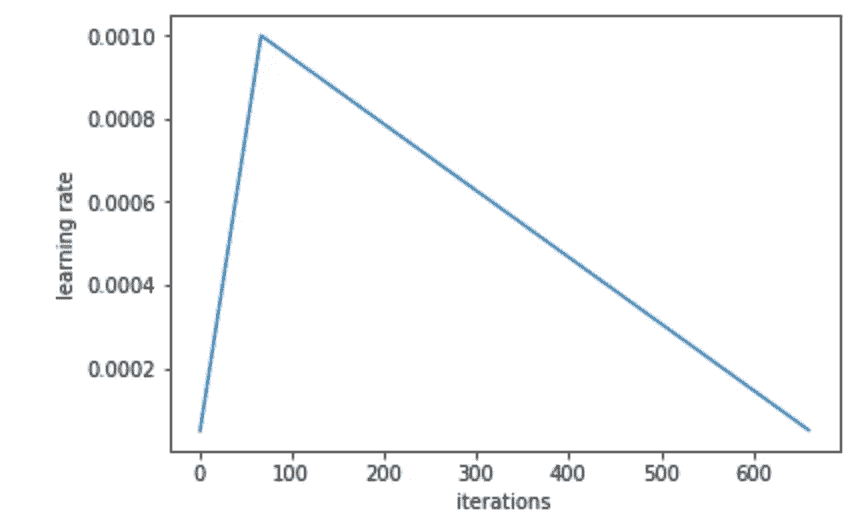
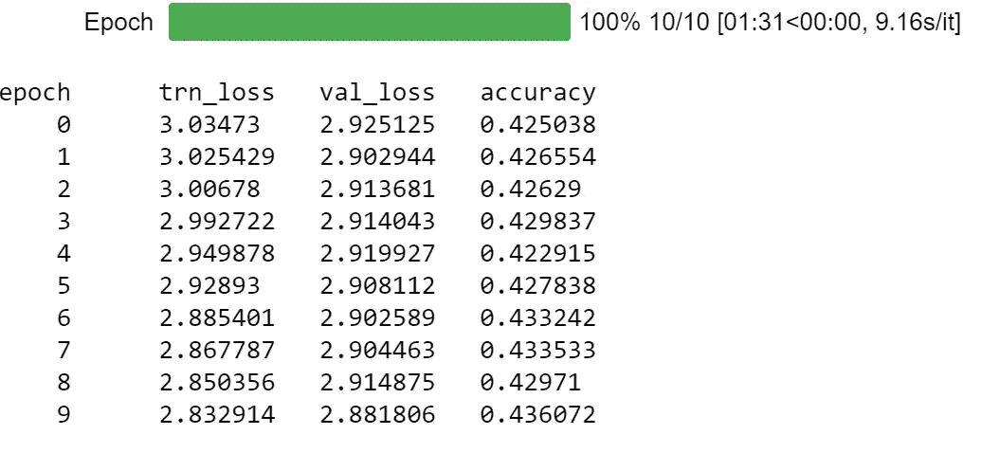
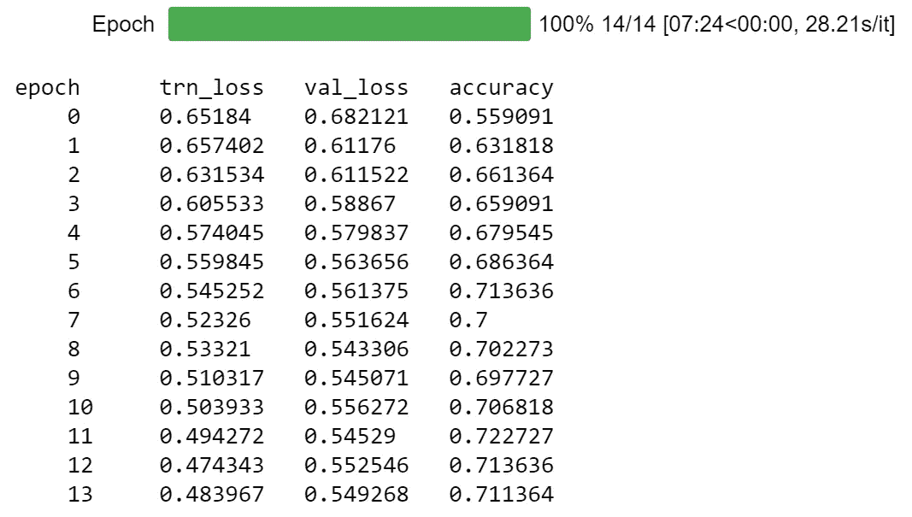

# “你处理不了真相！”

> 原文：<https://towardsdatascience.com/you-cant-handle-the-truth-transfer-learning-to-detect-memorable-movie-quotes-d2b5305062cd?source=collection_archive---------21----------------------->

## 迁移学习发现难忘的电影台词

在我看来，自然语言处理(NLP)是机器学习中最令人兴奋的分支之一。在过去的一年中，NLP 取得了重大突破，以前很难(甚至不可能)解决的问题现在可以更好、更容易地解决。自然语言处理中最大的突破之一是迁移学习的使用。如果你看过我之前的[博文](/does-deep-learning-really-require-big-data-no-13890b014ded)，你就会知道我是迁移学习的忠实粉丝。简而言之，迁移学习是训练一个模型做一件事(通常在 ImageNet 这样的大型数据集上)，并使用该模型的权重来解决另一种类型的问题。例如，在我以前的博客文章中，我使用了一个在 ImageNet 上预先训练的模型，将一个蓝色少女和小丑鱼图像的小数据集分类到它们适当的鱼类种类中。迁移学习非常有用，因为它允许使用小数据集来解决复杂的问题。虽然这种方法在计算机视觉中非常流行，但在 NLP 社区中很少使用。最近，一篇论文论证了迁移学习可以用来解决 NLP 问题；作者将这种方法称为[文本分类通用语言模型微调(ULMFiT)](https://arxiv.org/abs/1801.06146) 。我相信迁移学习的使用将会彻底改变这个领域，而且在某些方面已经发生了。

在这里，我将通过使用 ULMFiT 方法来演示迁移学习在 NLP 中的效用。我的博士学位专注于记忆(特别是从计算认知神经科学的角度来看)，所以很恰当地，我决定创建一个分类器，它可以检测一段电影台词是否值得记忆。这篇帖子对应的代码在我的 [GitHub](https://github.com/zachmonge/movie_quote_memorability) 上公开。

# **数据集**

对于数据集，我使用了[康奈尔电影引用语料库](http://www.cs.cornell.edu/~cristian/memorability.html)。该数据集由令人难忘的电影语录组成，摘自 IMDb 令人难忘的语录。这包括来自大约 1000 部电影的难忘的引用和匹配的不难忘的引用。匹配的非记忆性引语来自同一演讲者，长度相似，并且在脚本中尽可能接近相应的记忆性引语。例如，来自我最喜欢的电影之一《搏击俱乐部》:

**难忘:**“每晚我死去，每晚我重生。复活”

不值得纪念的:“我想…当人们认为你快死了的时候，他们真的会听，相反…”

在数据集中，有 2197 个匹配的记忆-非记忆引语。

# **建模方法:语言模型**

如上所述，我使用的是迁移学习法。我使用的语言模型是在维基百科的子集上预先训练的。该模型的架构和预训练重量可在[这里](http://files.fast.ai/models/wt103/)获得。该模型由三层 [AWD-LSTM](https://arxiv.org/abs/1708.02182) 组成，本质上是一个在各个点都有漏失的 LSTM。预训练模型是一个语言模型，这意味着它被训练来预测句子中的下一个单词。尽管我们已经有了一个预训练的语言模型，但这个模型是在维基百科上训练的，这可能不同于电影引用文本语料库。因此，首先，我对电影引用数据集上的预训练模型进行了微调。实际上，我发现这一步并没有帮助提高一个引语是否值得记忆的分类器的准确性。这可能是因为电影引用数据集的词汇量非常小(1545 个单词)。

只是一些关于模特训练的小注意事项。首先，正如 ULMFiT 论文中推荐的，我使用了**倾斜三角形学习率**。从下图可以看出，在模型训练期间，学习率快速增加，然后在训练的其余时间逐渐降低。

第二，我用了**逐步解冻**。开始训练的时候，我只是训练嵌入层，然后逐渐开始解冻/训练其他层。我还使用了**判别微调**，其中我对不同的层使用了不同的学习速率。有些层，比如输出层，可能比其他层需要更多的训练，所以我们应该对这些层使用不同的学习率。

我训练模型，直到我达到大约 43%的验证集准确率。

# 建模方法:分类器模型

既然我们已经对语言模型进行了微调，现在我们可以针对我们的实际任务对其进行进一步的微调，即预测电影引用是否值得记忆。这包括简单地去掉最后一层，用一个有两个输出(可记忆的，不可记忆的)的层来代替它。经过一段时间的训练后，我们达到了大约 70%的验证集准确率。考虑到数据集很小，还不算太坏！

为了进一步提高模型的准确性，我重新运行了所有的训练，但是文档是反过来的；也有公开可用的带有反向语言模型的预训练权重。这最终没有帮助，但值得在您自己的数据集中检查。

# 结论

在这里，这种分析表明，控制报价的长度和时间介绍，有一些关于某些报价的内容，使他们难忘。下一步可能是试图理解为什么有些引语是值得记忆的，而有些却不是(即模型解释)；实际上，这是这个数据集创建者的最初目标。也许这个分类器可以被作家和记者用来检查一个引语是否值得记忆。

用这么小的数据集，我们可以达到合理的准确度，这真的很令人惊讶。如果我们没有使用迁移学习，那么在如此小的数据集上很难达到这种精确度。看到迁移学习在 NLP 中的进一步应用，我真的很兴奋。训练这个模型还有很多其他的小细节。检查我的 [GitHub](https://github.com/zachmonge/movie_quote_memorability) 以查看实际代码，如果您有任何问题，请不要犹豫！