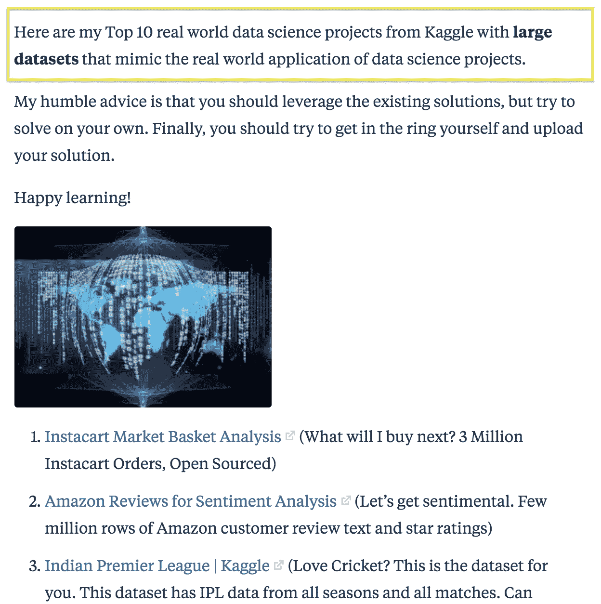
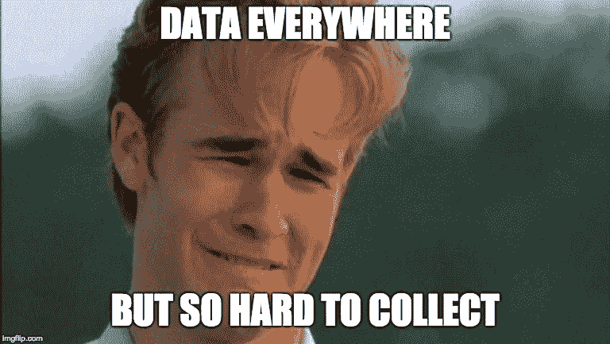
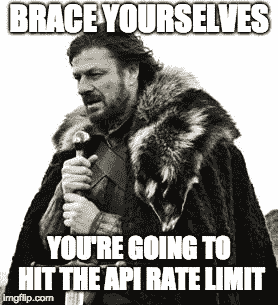

# 你不能谷歌所有的东西

> 原文：<https://towardsdatascience.com/you-cant-just-google-everything-38c52b402779?source=collection_archive---------13----------------------->

## 以及其他我希望在开始我最新的数据科学项目之前就知道的事情

Photo by [Chris Ried](https://unsplash.com/@cdr6934?utm_source=medium&utm_medium=referral) on [Unsplash](https://unsplash.com?utm_source=medium&utm_medium=referral)

几周前，我开始了一个新的数据科学项目，不出所料，h̶o̶r̶r̶i̶f̶i̶c̶绝对给了我启发。我之前对数据科学和机器学习项目做过一些尝试性的探索。但是我认为是时候做一些更大的事情了。但是我该从哪里开始呢？

# **你不能谷歌所有的东西**

公平地说，我犯了一个错误，在大多数人会去的地方寻找灵感——谷歌的首页。事实证明，有太多的*资源会让你迷失其中。有些提示有点乏味。这是我在 Quora 上找到的一个帖子:*

I fell asleep when I saw “cricket”

听起来不太对劲。为什么我要查看仅仅“模仿”数据科学真实应用的数据？我想建立一个真正的投资组合，解决真正的问题，给企业和人们带来真正的改变。我想分析一些我感兴趣的东西。毫无疑问，这些建议的数据集非常棒。它们可能是对你的数据探索、机器学习或可视化技能的巨大考验。但最终这一切又有什么意义呢？

> 我想建立一个真正的投资组合，解决真正的问题，给企业和人们带来真正的改变。

相反，我求助的最有用的资源之一是[上关于数据科学](https://towardsdatascience.com/)的作者。Michael Galarnyk 写了一篇关于建立数据科学投资组合的伟大文章，Jeremie Harris 为有抱负的数据科学家写了一份伟大的“不要做”清单。这部分对我来说是最好的:

> 当你有疑问时，这里有一些对你伤害大于帮助的项目:
> 
> *在[泰坦尼克号数据集](https://www.kaggle.com/c/titanic)上的生存分类。
> 
> *在 [MNIST 数据集](https://www.tensorflow.org/versions/r1.2/get_started/mnist/pros)上的手写数字分类。
> 
> *使用 [iris 数据集](https://archive.ics.uci.edu/ml/datasets/iris)进行花卉种类分类。

我对 Kaggle 和他们的比赛百感交集。我认为数据科学家应该拥有从各种难以想象的地方获取数据的能力。我真的不喜欢被“填鸭式”灌输数据的想法。也就是说…

# 收集自己的数据是痛苦的。真的。

所以我最终决定自己收集数据。该项目将是关于预测一部电影的 iTunes 价目表价格从其特点，如票房表现，评论家评级，演员阵容，情节等。预测电影成功的模型并不新鲜。但是有些问题没有被问及，也没有被回答。

*   一部电影上映后，在视频点播(VOD)平台上一部电影能标价多少钱？
*   我可以提前预测这个价格吗，这样我就可以决定我是否要支付它？
*   或者其他视频点播提供商会利用这些信息与 iTunes 进行价格竞争吗？
*   像网飞这样的视频点播提供商能利用这些信息来优化他们的定价策略吗？

*比看板球数据好多了。*

但是很少有数据集提供了电影和它们在 iTunes 或其他视频点播平台上的标价之间的联系。

最终，我转向开源电影数据库，如[电影数据库](https://developers.themoviedb.org/3/movies/get-movie-details)和[开放电影数据库](http://www.omdbapi.com/)，我将它们与 iTunes 数据结合起来分析数据。然而，这并非没有挑战。您可以在 [Github](https://github.com/zacharyang/movies-project) 上查看我的脚本和探索性分析，但是请继续关注关于我的整个数据收集过程的博客帖子。

# 每个拥有有价值数据的人都使用 API

我不是互联网协议、服务器脚本或数据库架构和工程方面的专家。但是我不认为我说的有多离谱。

在我的数据收集过程中，我很大程度上依赖于使用 API，但是我也使用 web 抓取技术来收集数据。我发现自己使用 API 对网站/服务器进行的查询要少得多，这为我提供了一种进行结构化查询以获得我需要的所有数据的方法。没有多余的或吵闹的。

对于组织来说，理解为什么 API 层对他们有好处是很重要的:

*   您可以保护托管信息的服务器。
*   您将保护推动您业务发展的数据。
*   它帮助您的合作伙伴和协作者轻松、安全地获得他们需要的数据和信息。
*   您可以通过调整速率限制来管理您的服务器资源。
*   您可以最终控制数据进出服务器的方式。

将 API [比作酒保](https://medium.freecodecamp.org/what-is-an-api-in-english-please-b880a3214a82)特别有用。与其开放你的数据“自助餐”式，人们会倾向于采取先抢后问的心态，不如让一个人来控制食物的消耗量。相当不错的东西。

感谢你阅读我的第一篇博文。随着项目的进展和想法浮出水面，我会发布更多的更新。