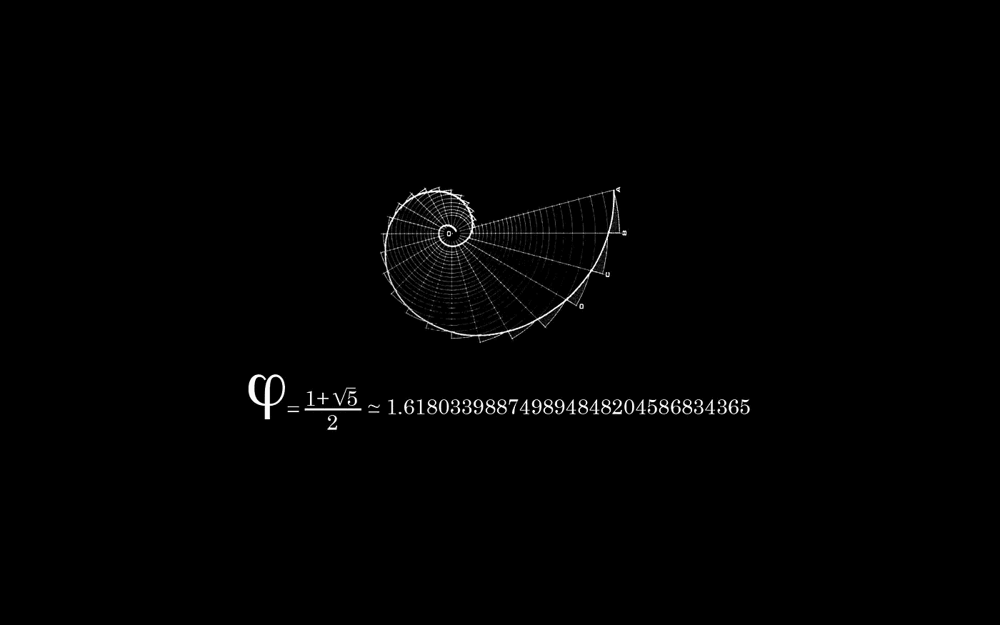

# 你不需要成为数学大师就可以开始机器学习

> 原文：<https://towardsdatascience.com/you-dont-have-to-be-guru-at-math-to-get-started-in-machine-learning-c00ba0498519?source=collection_archive---------5----------------------->

嗨，伙计们，机器学习领域的一个常见误解是，为了学习数据科学和机器学习，你必须成为数学大师，但数学是学习机器学习的先决条件吗？简单的回答是不！在这里，我会向你解释为什么

# 数学不是机器学习的首要前提

一个最被误导的想法是，你必须精通数学，知道线性代数，微积分，微分方程，数理统计，最优化，算法分析…，请不要以此为借口不学习机器学习。

这种想法通常来自学术界，因为他们是从零开始编写算法的人，他们肯定要经历数学，他们必须知道如何计算导数并从零开始编写梯度下降算法，但我想告诉你的是，即使你对数学不是很熟悉，你仍然可以在这个领域非常成功。

# 工具会帮你计算

有许多库使得应用机器学习算法来解决任务变得非常容易，以广泛使用的 Python 的 [scikit-learn](http://scikit-learn.org/stable/) 库为例，只需一行代码，您就可以获得最常用的算法，随时可以使用。如果你刚刚开始机器学习，并且你真的想亲自动手，抽象算法实现的细节会非常有帮助，我的意思是，我们很多人大多数时候都是通过摆弄代码来学习更多的东西，然后让它工作。

# 首先把事情做完，然后问你是怎么做到的。

对于许多人来说，这听起来可能是一个愚蠢的想法，但我可以向你保证，这非常有效，你可以自己尝试一下，找到你感兴趣的问题，选择一种算法并使用你可以使用的工具来解决问题，看看你会得到什么结果。他们会问幕后发生了什么，算法到底在做什么？它是如何学习的？你会惊讶于你将学到的东西。

# 数学仍然扮演着重要的角色

不要误解我的意思，你可以在不了解数学的情况下学到很多东西，做一些令人惊讶的事情，但是如果你的目的是参与、跟随或者仅仅是跟上研究性学习，那么数学可能会帮助你理解算法、公式、学习是如何完成的以及做许多事情。

学习机器学习不需要数学，但它可以帮助你理解许多算法的概念和实现。

## 最后一件事！

*如果你喜欢这些作品，请留下你的掌声👏推荐这篇文章，让其他人也能看到。*