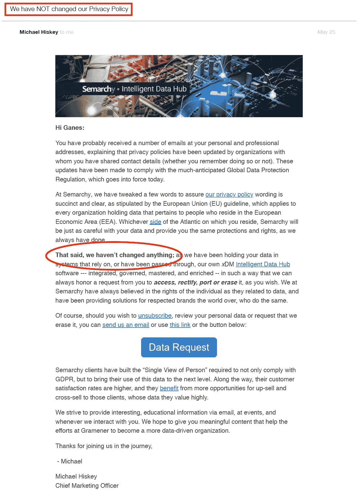

# “您的数据隐私已更新”——感谢您再次忽略它！

> 原文：<https://towardsdatascience.com/your-data-privacy-was-updated-thanks-for-ignoring-it-yet-again-9f6d1d567997?source=collection_archive---------3----------------------->

Photo by [Joe Green](https://unsplash.com/photos/bfJjBskA3gA?utm_source=unsplash&utm_medium=referral&utm_content=creditCopyText) on [Unsplash](https://unsplash.com/?utm_source=unsplash&utm_medium=referral&utm_content=creditCopyText)

## 下雨了 GDPR 的电子邮件，为什么一个盲目的'我同意'是不行的

垃圾邮件发送者在过去的一周有一些严重的竞争。几乎每一个网站和任何实体，哪怕只有一点网上存在的影子，都在忙着向网络发送那种*“隐私更新”*电子邮件。虽然我们的本能反应是点击屏幕上的任何地方来摆脱这个*的麻烦*，但这可能不是现在最好的做法。

这篇文章不是关于 GDPR 的入门，有来自 [NYT](https://www.nytimes.com/2018/05/23/technology/personaltech/what-you-should-look-for-europe-data-law.html) 和其他几个[人](https://www.theverge.com/2018/3/28/17172548/gdpr-compliance-requirements-privacy-notice)的好文章。除了我们作为用户现在可以做的一些实际事情之外，这是对作为数据科学从业者的数据的深远影响的反映。

## 无条件适用

我们已经习惯了*【条款&条件*以至于在注册任何新服务时，我们几乎连眼皮都不眨一下。以至于，如果一个应用程序强迫我们在勾选“我同意”之前向下滚动，它在我们的感知用户体验中就会下降一个档次。我们想知道 Chrome 是否也能自动完成这项工作。

然而，当我们在几天内突然收到一系列关于同一主题的电子邮件时，这激起了一些好奇心。这变得很奇怪，当我们听到来自我们从来不知道存在的公司的消息时，尤其是当他们的电子邮件谈到他们将如何开始与我们成为朋友并开始友好地对待我们的数据时。

数据隐私不仅仅属于法律论坛的范畴。作为了解数据力量的数据科学从业者，作为为互联网的发展做出贡献的消费者，这种变化至少需要我们的一点点关注。

> 不信任和谨慎是安全之母。—本杰明·富兰克林

## 为什么在数据政策上如此大惊小怪？

实质上，GDPR 法规要求公司在收集数据时必须征得用户同意，并且只分享那些使其服务正常运行所必需的数据。这是一项简单的措施，旨在通过尊重网民访问、更新或删除其数据的请求，将权力还给他们。

看起来令人惊讶的是，这样一个明显简单的变化(以及一些经济处罚)引发了所有这些行动。可以理解的是，公司可能需要更新他们的一些条款以符合法律规定，即使他们可能会负责任地处理数据。我收到了一封比其他邮件得分高的邮件，其中宣称政策没有改变。

然而，如果仅仅因为这项规定，公司就不得不彻底改变他们的工作方式，向用户披露新的东西，那就有些不对劲了。不难猜测，这些公司可能一直出于可疑的原因践踏我们的个人数据。

例如， [Twitter 现在向你显示](https://www.cnet.com/how-to/change-your-twitter-privacy-settings-now/)与你分享数据的广告商名单。我找到了一份大约 200 个(不是随机的)广告商的名单，Twitter 已经与他们分享了我的数据，我可能还会出现在 1200 多个定制的受众名单中。这一切都是*在[的新设置](https://twitter.com/personalization)中默认‘开启’*，在上周出现在 Twitter 上的显然无害的*‘我同意’*按钮下。

关于其他许多[大网站](https://techcrunch.com/2018/04/17/facebook-gdpr-changes/)也有类似的记述。这正是为什么这需要一些关注。

> 如果你不付钱，你就是被卖的产品。安德鲁·刘易斯

## 数据科学和隐私——一颗滴答作响的定时炸弹

鉴于当今数据分析的巨大力量，消费者数据是一个完美的切入点——a)一天中的海量流数据，汇集了各种用户兴趣和 b)先进的算法，可以解开甚至用户都没有意识到的偏好。

正是这种金矿的发现，让许多公司竭尽全力追逐它们。还有那些黑暗势力已经开始开采这些金矿，并向出价最高的人出售见解。这种缺乏公司内部道德规范以及缺乏明确的数据法规的情况导致了严重的隐私泄露。

作为数据科学领域的从业者，我完全支持充分利用数据来简化生活，让机器为我们工作。但是，在控制松懈的情况下，涉及消费者数据的数据隐私是一个定时炸弹，只是等待爆炸。

剑桥分析[这样的漏洞只是冰山一角。数据的力量远不止这些。考虑到如此巨大的风险，在这种情况下，以下三点可能会有所帮助:](https://www.nytimes.com/2018/03/19/technology/facebook-cambridge-analytica-explained.html)

*   **公司负责任地使用数据**展示高道德标准和自我控制
*   严格的法规和惩罚性的措施，至少在可能的范围内控制着黑暗势力
*   **意识增强的用户**要求正确的数据实践并质疑任何可疑的标准

在这些事情落实到位之前，我们所能做的就是希望不会发生重大违规事件，这可能会让用户深深陷入对数据和技术整体的不信任。

## 那么，我们能清除数据痕迹吗？

万一你想清理你的网页历史，抱歉，这真的没关系。这里有一个精彩的结尾片段，摘自雷·库兹韦尔的书《T2:奇点临近》(T3)，书中有一段虚构的对话，对话的主角是生活在 2004 年的人类莫莉和来自 2048 年的未来机器人乔治。

意识到即将到来的奇点，人类试图在准备中完成一些奇怪的任务，同时也试图“修复”一些不方便的数字记忆。看看机器有趣的反应。

> **乔治大约 2048(机器人):**哦，我可以帮你处理。
> 
> 莫莉 2004: 那真的没有必要。我完全有能力自己做这件事。我可能还想删除一些文档——你知道，我对我认识的几台机器有点冒犯。
> 
> 乔治 2048(机器人):哦，机器无论如何都会找到它们的——但是别担心，我们非常理解。

任何已经在互联网上的数据都被可疑地永远铭刻在以太中。试图抹去我们在网络上的数据痕迹的膝跳反应是徒劳的。此外，技术的好处大于它的风险，所以在这个节骨眼上变成一个不相信数字的人不是一个好主意。

但是，我们**现在能做的**是利用这些法规和一系列电子邮件来发现谁拥有我们的数据。通过利用现在已经开放的渠道，很容易删除所有未知或未使用的帐户。花几分钟在所使用的服务上，将数据共享限制在那些您可以从共享的社区见解中受益的渠道也是有意义的。

*对数据科学充满热情？随时加我在*[*LinkedIn*](https://www.linkedin.com/in/ganes-kesari/)*或者*[*Twitter*](http://twitter.com/kesaritweets)*。*

 [## Ganes Kesari | LinkedIn

### 在其他网站上包含此 LinkedIn 个人资料

www.linkedin.com](https://www.linkedin.com/in/ganes-kesari/)