# 您更聪明的分析策略

> 原文：<https://towardsdatascience.com/your-smarter-analytics-strategy-97fb3a1c1b1f?source=collection_archive---------1----------------------->

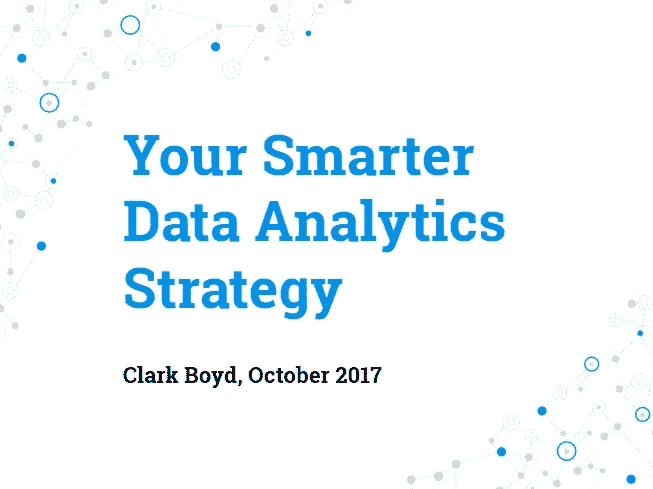

最近，我有幸在纽约市的社交媒体战略峰会上做了一个 3 小时的分析策略讲座。

会议内容包括:

*   成功分析策略的要素
*   人工智能的发展对分析意味着什么
*   如何定义和传达分析框架
*   如何为一系列利益相关者设置分析仪表板
*   最佳分析团队所需的人员和技能
*   当今使用人工智能和 NLP 的品牌案例研究
*   提高营销活动评估的实用技巧

本文末尾有一个完整演示文稿和附带注释的链接。在这里，我提出了一些要点来突出我的想法。

# **分析能实现什么？**

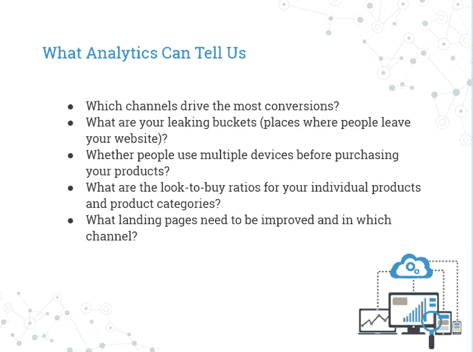

分析平台可以回答许多重要的问题，但通过分析策略，我们意味着对我们的数据来自哪里、为什么可靠、我们的测试方法是什么以及我们最终希望通过数据显示实现什么有一个清晰和有记录的视图。

分析策略也有不同程度的复杂性，从回顾性方法到前瞻性学科，如规范或自主分析:

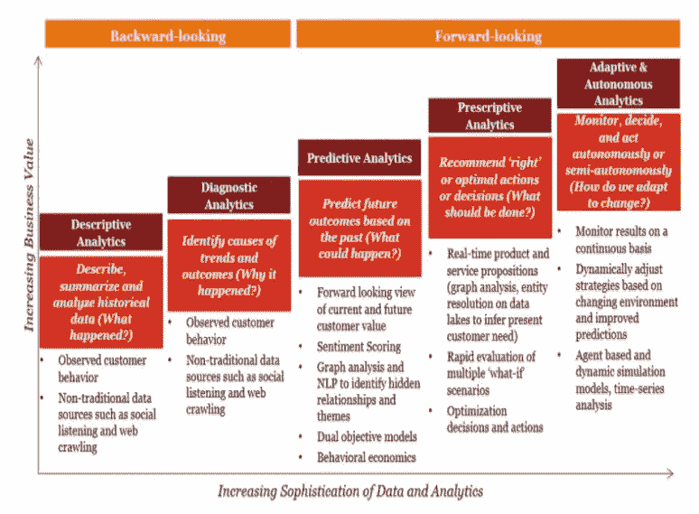

PwC

2017 年企业的许多日常工作都属于描述性或诊断性分析的定义。我们习惯于访问分析平台，以了解我们在过去几天或几周内观察到的趋势。

然而，许多组织正在超越这一点，进入更复杂、更有利可图的分析领域。

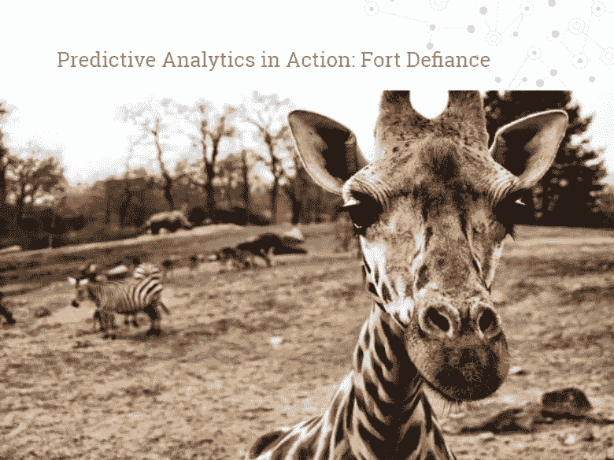

华盛顿塔科马的一家动物园与国家气象局合作，以确定导致游客人数如此不可预测地上升和下降的因素。这给管理层带来了问题，他们总是会为公园配备员工以迎合大量观众，但如果游客数量低于预期，他们往往会在工资上超支。

凭直觉，我们可以假设，在温暖干燥的日子里，上座率较高，但在寒冷或潮湿的日子里，上座率较低。然而，通过将国家气象局的数据纳入 IBM 的人工智能驱动的沃森平台，动物园能够准确地确定哪些条件导致更多人参观。

这一知识随后被用于模拟未来的游客模式，使用历史游客人数和预测的天气统计数据。

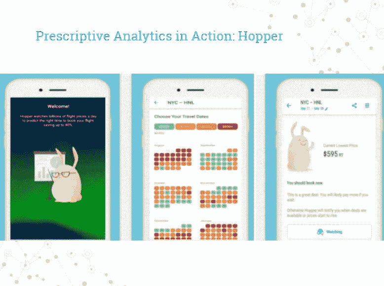

Hopper 通过预测未来的价格模式并提醒旅行者购买飞往他们首选目的地的航班的最便宜时间，领先一步。

它通过每天观察数十亿的价格，并基于每条路线的历史数据，预测趋势将如何发展来做到这一点。然后，用户可以设置通知，提醒他们在价格下降时预订。

尽管 Hopper 不是唯一一家提供这种服务的公司，但它的预测准确率高达 95%。

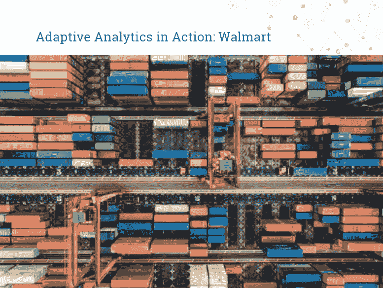

数据通过沃尔玛的“数据咖啡馆”在云中管理，该咖啡馆由硅谷的沃尔玛实验室团队维护。这是一项复杂的、大规模的工作，要根据可靠的数据做出准确的预测，就需要与如此规模的企业所需的变量数量保持一致。

他们网站上和商店里的一切都被同时跟踪，所有来自销售点系统的数据都与在线转换同步。

这使得沃尔玛能够毫不费力地转移库存，并确保它总是在正确的地方以正确的数量提供正确的产品。

# 问正确的问题

一个好的分析策略始于对企业希望用数据来回答的问题的纯粹理解。这提供了一个框架，我们可以据此评估我们所掌握的数据的数量和质量，以提供令人满意的答复。

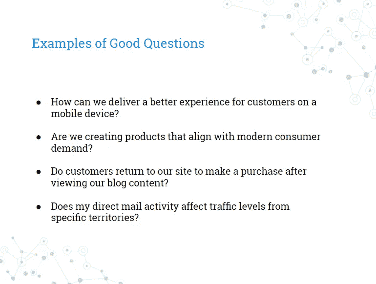

我们可以对这些问题进行分类，为我们发现增加更多的结构:

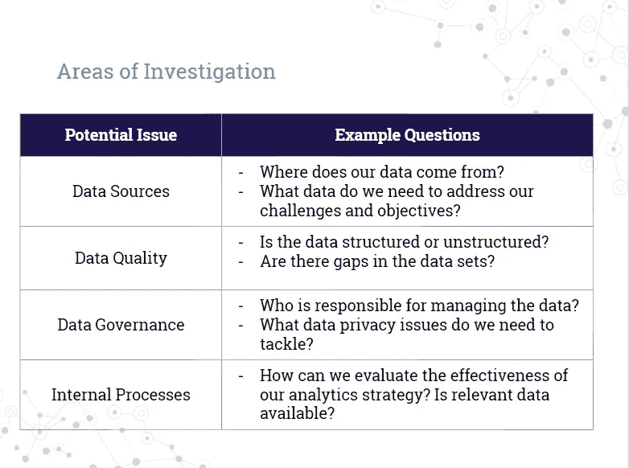

从这里，有一个清晰的过程。我们有一个更广泛的业务目标，并定义数字化如何实现这一目标。下一步是开始询问可能帮助我们更接近目标的问题，这将揭示我们需要测量的指标，以提供结论性的答案。

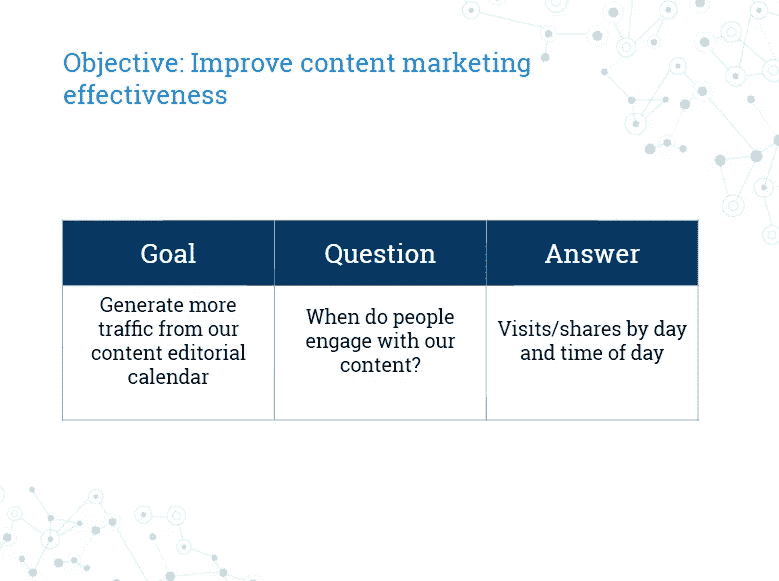

# 分析战略框架

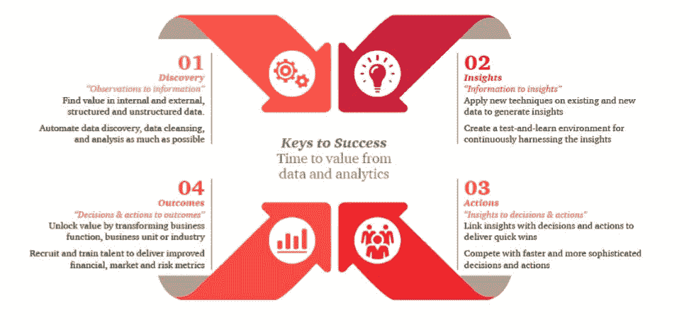

PwC

付诸行动:

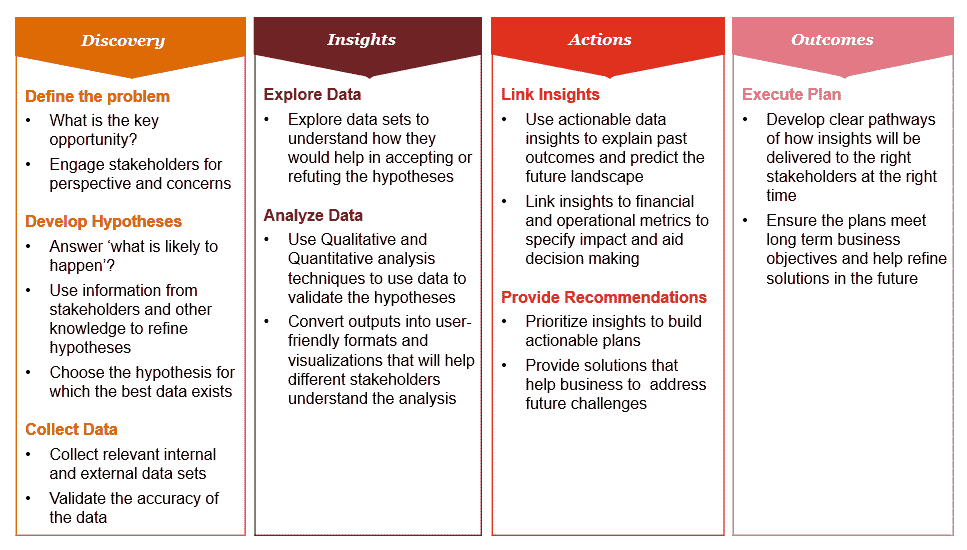

PwC

# **获得正确的测量值**

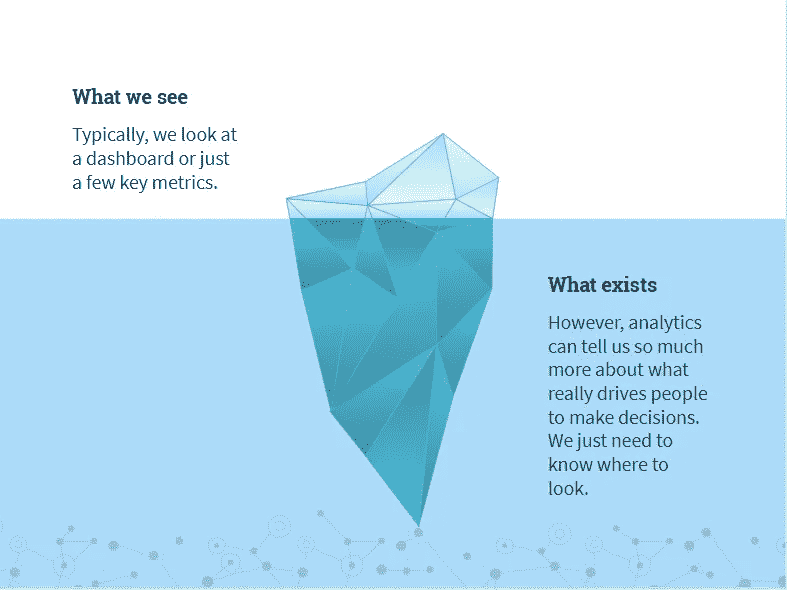

基本指标的一个例子是客户终身价值。当我们审视像社交媒体这样的努力时，或者当我们开始定义归因模型时，这一点就显得尤为重要。如果我们知道我们的客户终身价值，并且我们对我们的归因模型有信心，我们可以将商业价值应用到我们的品牌和我们的受众之间的任何在线互动中。

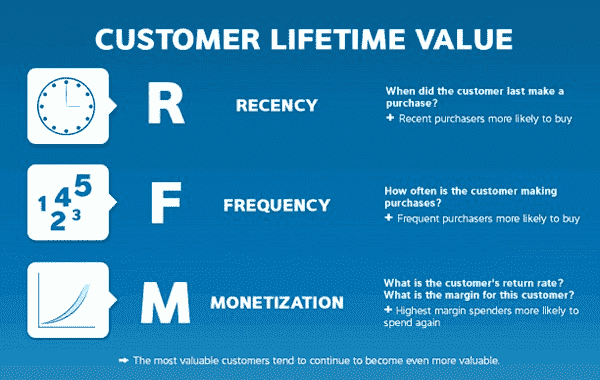

这是衡量策略的重要组成部分，是我们在开始任何数字活动之前都应该定义的东西:

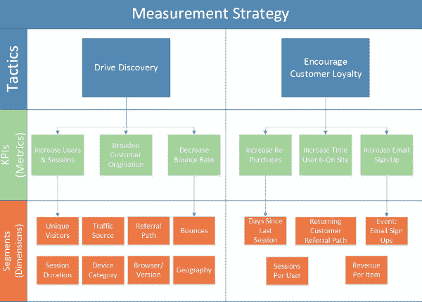

下面，我总结了会议的主要收获，但我也包括了幻灯片的链接。在该资料中，有关于谷歌分析设置、归因模型以及将分析融入公司文化的深入章节。

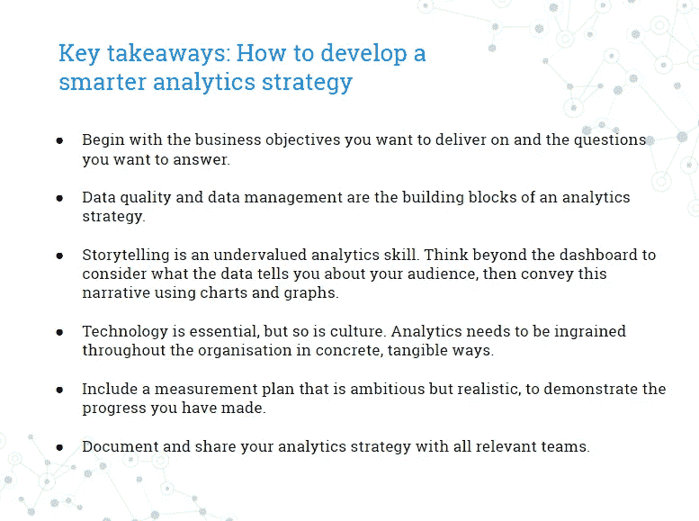 [## 您更聪明的分析策略

### 你更聪明的数据分析策略 Clark Boyd，2017 年 10 月

docs.google.com](https://docs.google.com/presentation/d/193iZ60lo7waACgkanElfQ1rYHmbyzDEsBgxTHphGMYA/edit?usp=sharing) 

希望你觉得有用！