# 青年选民疲劳——事实还是虚构

> 原文：<https://towardsdatascience.com/youth-voter-fatigue-fact-or-fiction-33d4d2b3037?source=collection_archive---------24----------------------->

我相信你以前听过这样的话:新注册的、精力充沛的年轻选民参加了他们的第一次选举，然后当他们参加的选举没有按照他们希望的方式进行时，他们就退出了这个过程。

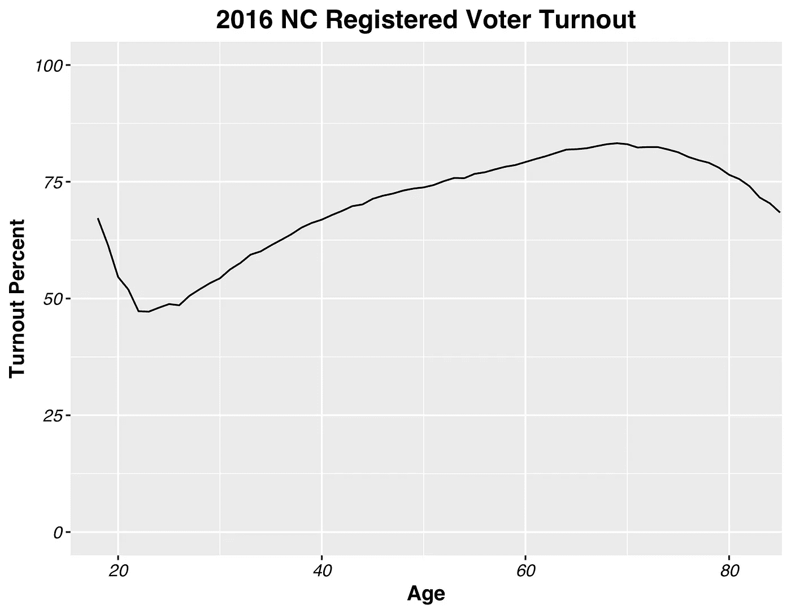

Turnout trend by age, for those who were registered to vote in North Carolina and voted in the 2016 general election.

从登记选民的投票率来看，这一理论似乎是正确的。在 2016 年的大选中，北卡罗来纳州登记投票的 18 岁年轻人中有 67.2%参加了投票。但是年轻人的投票率并不总是这么高。在登记投票的 23 岁年轻人中，2016 年只有 47.2%的人投票。自然，这就引出了一个重要的问题。

23 岁的人 ***客观上*** *投票率比 18 岁的人低吗？*

*投票率* ***真的在 18 岁后*** *下降吗？*

这一探索的结果有着有趣的含义，考虑到如果投票率的下降真正反映了年轻人的行为，那么投票率整体上升的潜力是巨大的。如果我们能让这些年轻选民参与到他们的生活中，而不是在他们 20 多岁时退出，我们国家的选民可能会有很大的不同。大多数人都会同意，年轻人更多的政治参与只会有利于我们的民主。

因此，为了测试这种投票率下降是否合理，我计算了投票率占公民投票年龄人口的比例，并将这些投票率值与已经登记投票的投票率值进行了比较。

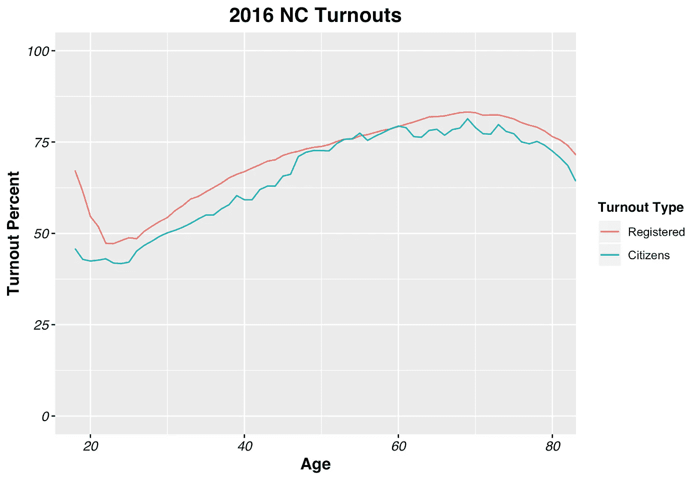

Turnout trends in North Carolina for the 2016 general election by age among registered voters and citizens.

在计算了登记选民的投票率和公民的投票率之后，这个发现是引人注目的。尽管公民投票率似乎略有下降，从 18 岁时的 45.8%下降到 24 岁时的 41.3%，但这一下降远不如登记选民中相对急剧的下降那么明显。公民投票率的总体趋势是随着年龄的增长而增加，而登记选民的投票率给了我们一个完全不同的想法。

考虑到 2016 年可能是数据中的异常(考虑到我们在那个选举周期经历了多少怪癖)，我们来看看其他选举年。

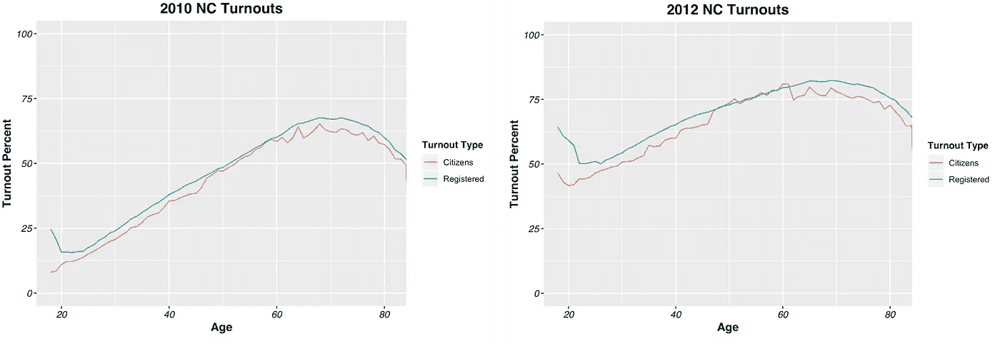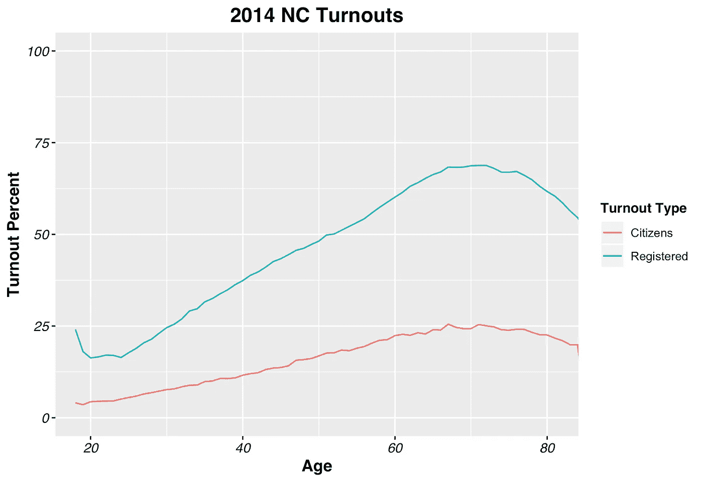

通过观察 2014 年、2012 年和 2010 年的结果，我们可以得出结论，这种现象并不局限于任何特定的选举周期，也不局限于任何类型的选举。在登记选民中，18 岁以后投票率下降是普遍现象；而公民投票率通常会随着年龄的增长而增加。

虽然一些选举确实显示投票率略有下降，如 2012 年和 2016 年(有趣的是，两次都是总统选举)，但登记选民的百分比下降总是大于公民的百分比下降，如下表所示。

我怀疑这种现象可以归因于选民登记记录中的**“朽木”，即已经改变地址但仍然存在于选民登记名册中的人的残余，这是因为《国家选民登记法》要求选举官员只有在一些联邦选举中未能投票后才能删除选民。我们看到的投票率下降可能是一个分子膨胀的症状，这是由于在登记投票率计算中,**夸大了年轻人的登记人数。考虑到年轻人频繁流动的倾向，年轻人在记录上有夸大的注册数量是有道理的。****

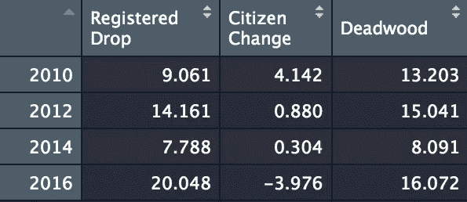

如上所述，总统选举年的登记选民投票率下降幅度似乎更大。第一栏显示了从 18 岁到当年最低投票年龄的登记选民投票率下降的百分比。第二项显示了同一年龄范围内公民投票率的百分比变化。第三列是前两列的补充，可以解释为登记选民投票率的下降在多大程度上是“朽木”的结果。**在两次总统选举中，登记选民的投票率再次出现了最大幅度的下降。**

如果投票率的下降是由于选民登记名册中没有更新的地址的变化引起的，我们可能会怀疑“朽木”的水平因种族而异。种族会影响注册选民投票率下降的幅度吗？

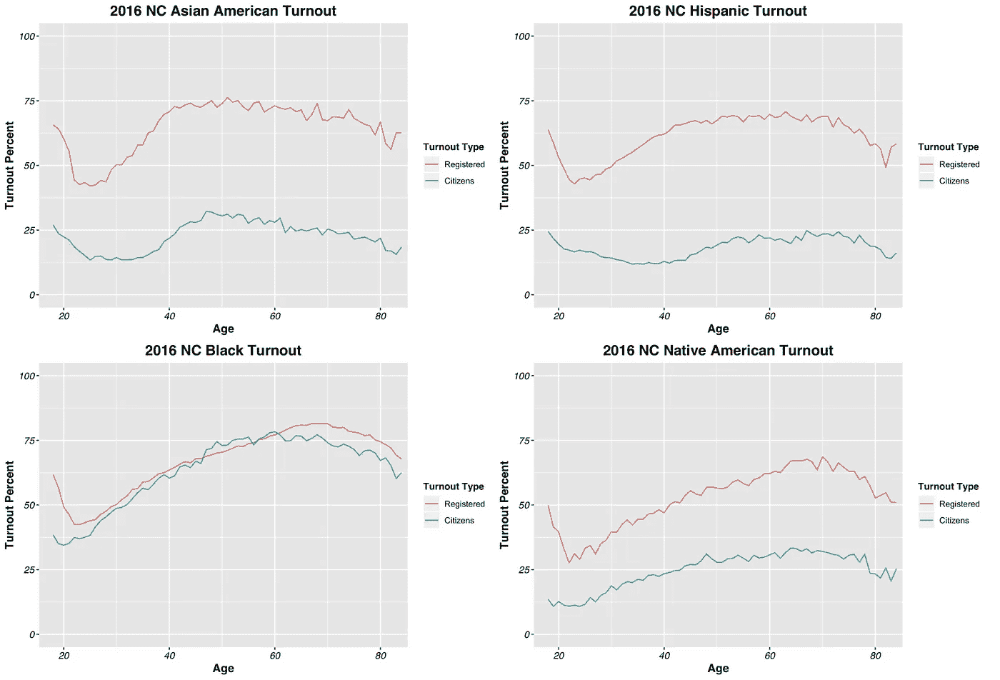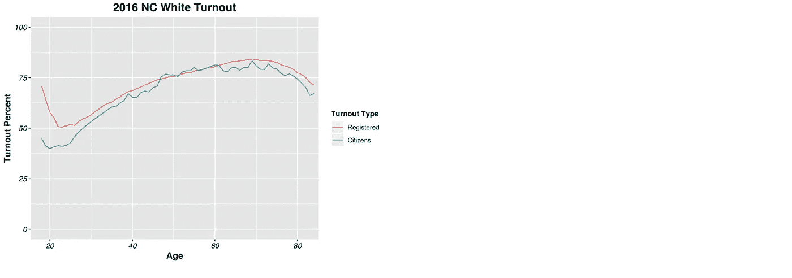

上面的图表描述了不同种族和族裔的选民在 2016 年大选中的登记选民和公民投票率。乍一看，似乎每个登记的投票人数都有相似的下降。另一方面，公民投票率在不同种族和民族之间差异很大。

从左边的表格中，我们可以看到每个种族和民族群体的公民投票率都有所下降。但是，在每一种情况下，登记投票率的下降幅度都大于公民投票率的下降幅度，这继续表明登记投票率由于登记人数的膨胀而呈现出错误的趋势。第三栏再次显示了登记投票率和公民投票率之间的百分比误差。这一分析显示，美国土著选民受登记记录中“朽木”的影响最大，其次是黑人选民。

应开展进一步研究，将其他国家包括进来，并扩大观察的选举周期的数量。查看选民登记记录以确定这些被夸大的登记属于谁以及它们为什么会出现在系统中也是很有趣的。然而，我们必须谨慎行事，不要鼓励进一步努力将选民从名册中清除出去。

与此同时，我们需要改变年轻人参与选举进程的说法。我们的结果表明，年轻人并没有因为选举失败而疲惫不堪，他们首先还没有被动员起来。让我们停止通过散布虚假的投票模式来阻止年轻人投票。

# 方法:

## 数据

使用的数据来自北卡罗来纳州的 FTP 网站，可以在这里找到。我使用了一个包含全州选民历史的文件和四个用于不同选举的不同选民登记文件。幸运的是，北卡罗来纳州在每次重大选举之前都会上传选民登记文件的“快照”(2010 年除外)，所以这是我在查看特定选举时经常使用的选民登记文件。为了计算市民估计，我使用了三个美国社区调查数据文件的组合，分别用于市民估计、年度人口估计和按年龄划分的人口统计。

## 算法

对于每次选举，我的代码基本上分为两个主要部分:查找登记选民投票率和公民投票率。两者都是从为适当的选举过滤投票历史文件开始的。

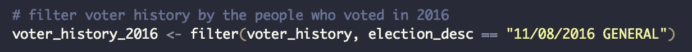

然后，我将投票历史文件和选民登记文件合并在一起，创建一个数据框，其中只包含在我感兴趣的选举中投票的人，还添加了选民登记文件中的有用信息，如年龄。接下来，为了计算登记的选民投票率，我计算选民登记文件中的人数，合并文件中的人数，并将结果保存到一个新的数据框中。注册投票率是这两个值的划分。

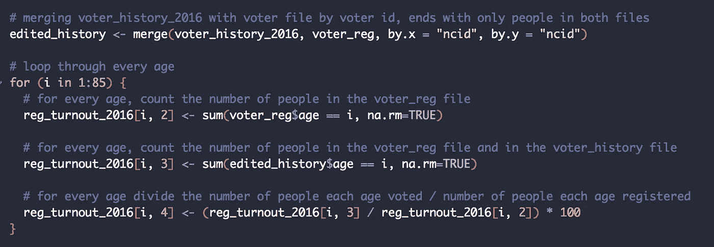

为了计算公民投票率，我首先找到每个年龄段的估计人数。现有数据是 7 月份发布的年度估计值。为了更好地估计 7 月估计和 11 月选举之间的人口增长，我添加了选举年估计和即将到来的选举之间的差异，并乘以选举年估计的 0.3。

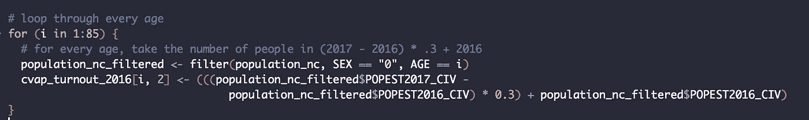

然后，我需要用公民占人口的百分比来缩小这个人口估计。我有每个年龄组的公民人数的数据，我用它来计算每个年龄组中有公民身份的人的百分比。利用这些群体估计，我缩小了人口估计。

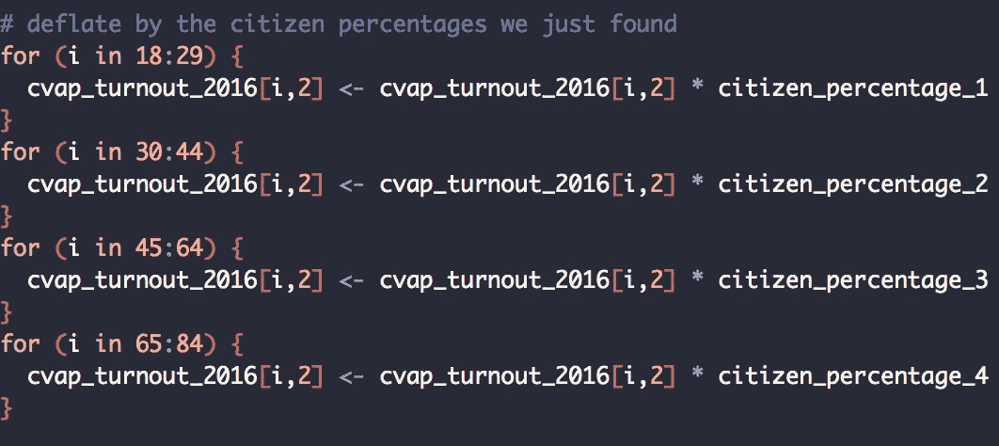

对于公民投票率，分子与登记投票率相同，因此我在这里简单地使用相同的数据并计算新的投票率数字。

为了按种族划分这些趋势，我简单地再次过滤了选民登记文件，以表明我正在分析哪个种族或民族代码。

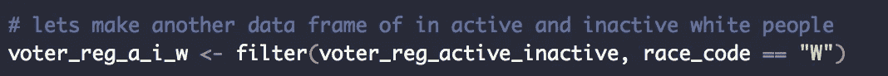

按种族划分的公民投票率也必须被编辑。我使用之前的同一个文件来获得按年龄划分的人口估计值，这一次在我的计数中指定我想要哪个种族或民族的数据。和以前一样，我使用之前发现的年龄范围公民百分比来缩小公民估计的人口估计。在未来，我更倾向于使用每个种族或民族类别的公民百分比来缩小人口估计，而不是总人口的公民百分比。同样，如果我能找到一个包含按年龄而非年龄组划分的公民百分比的数据集，这将使我的公民投票率计算更加准确。

我所有的图表都是用 ggplot 创建的。我使用了一个自定义的主题，你可以看到下面的细节。

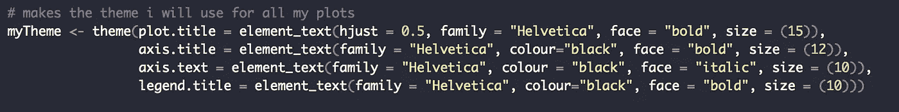

## 挑战

这个项目最大的挑战之一当然是分析大型数据文件。我不得不导入四个不同的选民登记文件，每个文件在 4g 到 16g 之间，另外一个 5gb 的文件包含该州的投票历史。这意味着我的电脑运行我的代码非常非常慢。如果我幸运的话，整个脚本运行需要 1.5 小时。然而，比我愿意承认的更多的是，由于我的计算机完全崩溃，我的编码会话结束了。谢天谢地，这个问题只需要耐心就能解决。

占据我更多时间的一个挑战恰好是选民登记文件的细节。北卡罗莱纳州在他们的登记文件中有一栏显示了选民的身份，可以标记为“活动”、“不活动”或“已删除”。当我开始这个项目时，我将“被移除”的选民包括在我的计算中，我很快意识到这使我的数据失去了意义。

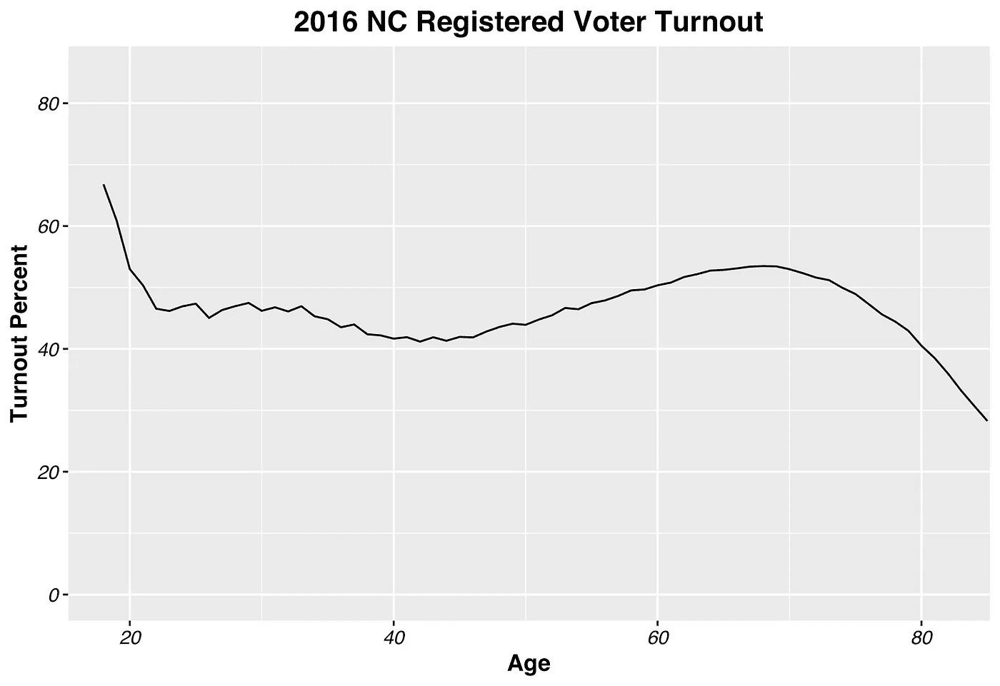

2016 North Carolina registered voter turnout with “removed” voters included

这张图表看起来与我在本文中使用的登记选民投票率完全不同，因为它在分子和分母中包括了已经从选民登记名册中“删除”的人，使得两者都比它们应该的要大。然后，我试图通过编辑分母来计算登记的选民投票率，只包括登记文件中标记为“非活动”或“活动”的选民。

这一变化帮助我的曲线看起来更接近预期，除了公民投票率高于登记投票率，这违背了逻辑。这个问题是由于我没有从投票历史记录和注册记录中过滤掉“被删除”的投票人。由于地址的变化，许多被标记为“已删除”的人在选民登记文件中有多行，其中只有一行被标记为“活动”。如果我忽略了过滤掉被除名的选民，而那些有多次被除名历史的选民中有一个碰巧投票了，他们的其他历史就会被算作 2016 年的选票。显然，这夸大了分子中的人数，使百分比上升到看似合理的水平之上。