# Youtube 浏览量预测

> 原文：<https://towardsdatascience.com/youtube-views-predictor-9ec573090acb?source=collection_archive---------0----------------------->

## 由机器学习支持的获得更多 YouTube 浏览量的综合指南

这个项目是由[艾伦·王](https://medium.com/@allenwang_32775)、[阿拉文·斯里尼瓦桑](https://medium.com/@aravindsrinivasan_30995)、[凯文·易](https://medium.com/@kevinyee)和[瑞安·奥法雷尔](https://medium.com/@ryanofarrell)建造的。我们的脚本和模型可以在[这里](https://github.com/allenwang28/YouTube-Virality-Predictor)找到。

在这里输入你自己的缩略图和标题到我们的模型来预测你的视频[的浏览量。](https://enigmatic-wave-74142.herokuapp.com/)

# 背景

在过去的 5 年里，YouTube 已经向 YouTube 内容创作者支付了超过 50 亿美元。流行的 YouTuber PewDiePie 在 2016 年仅从 YouTube 就赚了 500 万美元，这还不包括赞助、代言和 YouTube 以外的其他交易。随着越来越多的公司转向 YouTube 的影响者来吸引千禧一代的观众，让人们在 YouTube 上观看你的视频变得越来越有利可图。

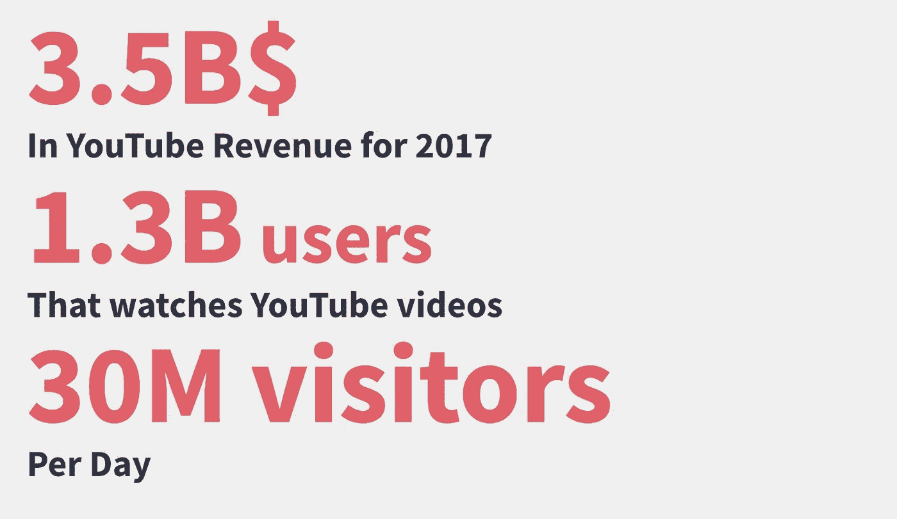

我们的目标是创建一个模型，帮助有影响力的人预测他们下一个视频的浏览量。Youtube 上的内容涵盖了各种类型，如喜剧、体育、时尚、游戏和健身。由于问题的严重程度，我们将范围缩小到了与健身相关的视频。健身内容是 YouTube 的一大部分。人们正涌向免费的在线健身内容寻求建议，而不是雇佣昂贵的私人教练。

一个人在看 YouTube 推荐的相关视频时，首先会看到标题和缩略图。如果特定的标题和缩略图可以产生更多的潜在视图，YouTuber 可以使用这些信息来产生他们努力工作的视频内容的最大潜在视图。因此，我们的目标是创建一个使用非视频功能的模型来预测观看次数，健身影响者可以使用它来帮助扩大他们的渠道。

# 数据

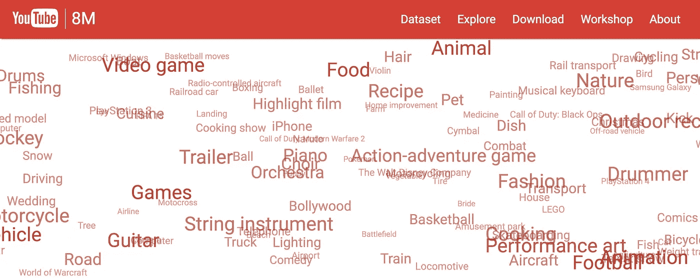

我们找不到合适的数据集，所以我们自己拼凑了一个。我们使用了 [YouTube 的 800 万数据集](https://research.google.com/youtube8m/)，其中包含 32 GB 的预先标记的数据，这些数据按各种类型分类(如体育、时尚、电影)。我们过滤了所有带有“健身和健身房”相关标签的数据，得到了 15，305 个视频。为了增加数据集的大小，我们收集了之前数据集中每个用户的视频。我们现在有 115，362 个视频要处理。我们为每个视频搜集了以下特征:

*   标题
*   极小的
*   描述
*   喜欢计数
*   不喜欢计数
*   视图计数
*   最喜欢的计数
*   评论计数
*   出版日期
*   频道的订户计数
*   频道发布的视频数量
*   整个频道的观看次数
*   频道发布的上一个视频的评论计数
*   频道发布的上一个视频的观看次数
*   频道发布的上一个视频的标题
*   频道的年龄

# 特征工程和提取

我们关注视频的标题和缩略图，因为这是用户浏览视频时会看到的主要特征。我们必须从缩略图和标题中提取有意义的特征，以便在我们的模型中考虑它们。

类似于我们在 BuzzFeed 等网站上看到的 clickbait 标题的效果，我们希望在 YouTube 视频上看到 clickbait 标题和缩略图的效果。具体来说，通过观察专注于健身的成功 YouTubers，我们注意到了一些共同的特征:

*   标题用过多的大写字母和感叹号激起了人们的热情
*   标题作出保证和承诺捷径
*   标题包括一个列表
*   该图像包括一个健康的男人或女人

我们尝试在标题和缩略图上训练神经网络(稍后会有更多介绍)，但没有得到非常有希望的结果。

我们决定走一条不同的路——特别是使用预先训练好的网络作为特征提取器。我们发现了一个由雅虎开源的 [NSFW 计分器和一个](https://github.com/yahoo/open_nsfw) [clickbait 计分器](https://github.com/saurabhmathur96/clickbait-detector)。我们对以前的标题、当前的标题和缩略图进行了测试，并提供了代表这些信息的新功能，从而产生了新的可用功能。

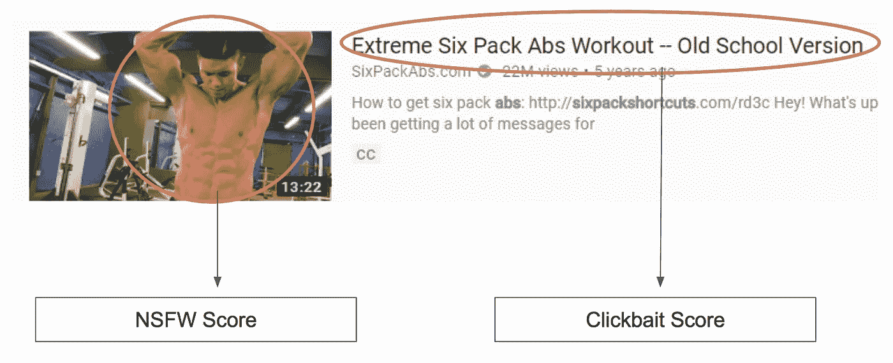

# 数据探索

我们的主要目标是生成一个预测视图数量(或视图差异)的模型。首先，我们剔除一些异常值，即已经“病毒式传播”的视频，我们将其定义为浏览量超过 100 万的视频。

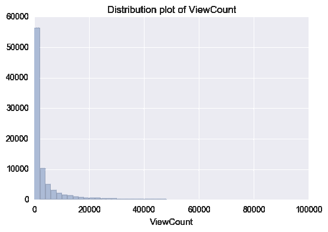

我们可以看到这是严重的倾斜，这是可以理解的——大多数普通的 YouTubers 用户可能不会有那么多的浏览量。此外，来自 YouTube-8M 数据集的视频似乎完全是随机采样的(即不偏向流行视频)，因为它的目标是标记给定视频级别信息的类别。

当我们最终得到我们的预测器时，我们想要预测类似高斯曲线的东西。幸运的是，我们可以对 ViewCount 应用一个 log 转换来实现这一点。

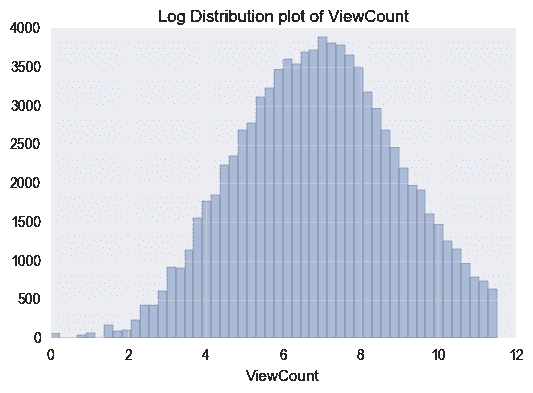

我们可以尝试预测的另一个量是视图计数的差异。我们从剔除异常值开始，即观看次数增加或减少超过 5 倍的视频。

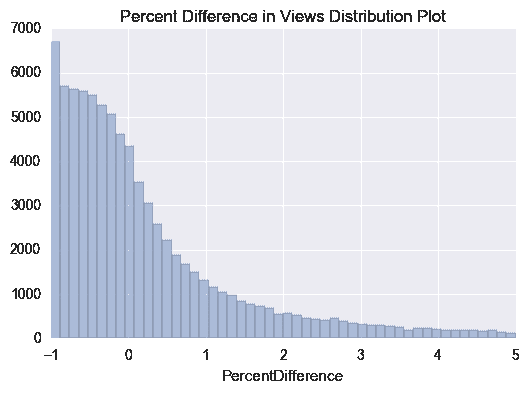

请注意，在我们的视频中，视图之间的差异通常在 0 左右波动，但实际上集中在-1 左右。计算方法如下:

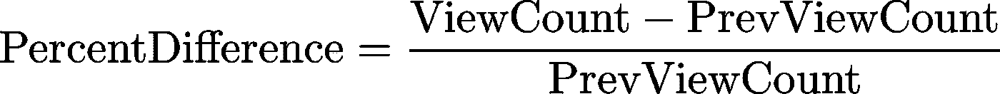

因此，百分比差异约为-1 的条目是那些(当前视频的)查看次数约为 0 的条目。这很有意思——我们目前的大部分浏览量都是最近抓取的视频。可以这么说，这可能是因为视频发布的时间还不够长，无法获得“真实”的浏览量。因此，我们可能需要一个特性来表示它被上传和我们抓取之间的时间。

最后，让我们看看从标题和缩略图中提取的特征:

***点击诱饵得分***

我们使用预先训练好的网络来提取每个标题的点击诱饵分数。clickbait 得分从 0 到 1，得分越高，标题越“clickbait-y”。点击诱饵分数分布如下所示:

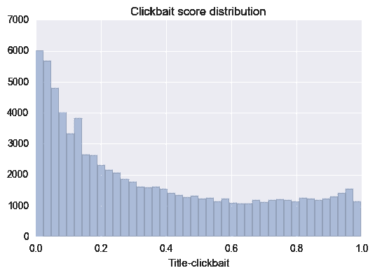

我们有兴趣看看 YouTubers 是否在他们的频道上使用了不同程度的“点击诱饵”标题。因此，我们计算了每个 YouTuber 视频的点击诱饵得分的差异，并绘制了分布图:

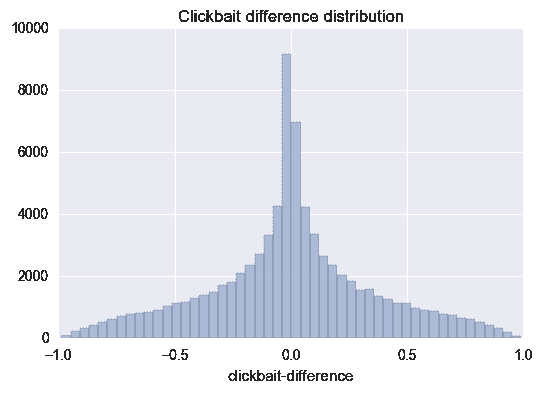

有趣的是，我们看到 clickbait 得分的差异几乎看起来像一条零均值高斯曲线。这意味着我们不希望 YouTubers 在标题中偏离默认的“点击诱饵”。

最后，我们比较了观看次数最少的 10%和最多的 10%的点击诱饵分数:

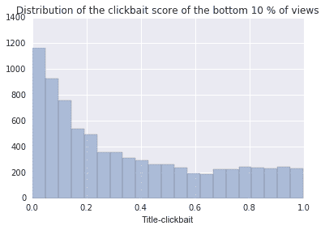

事实证明,“clickbait-y”标题并不局限于 YouTubers 上的顶级网站，使用它可能不是一种产生更多视图的简单方法。“点击诱饵性”对浏览量的总体影响还不清楚，但我们认为这一特征在我们的模型中不会提供太多的预测能力。

接下来，我们来看看 clickbait 分数和 ViewCount 之间的实际散点图:

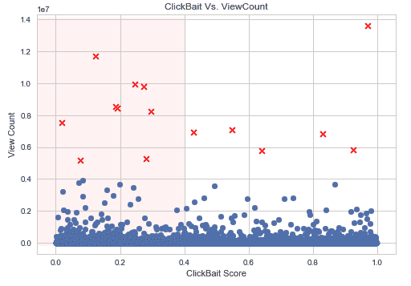

从这个图中，我们注意到在视图计数和 clickbait 得分之间没有太多的相关性，这意味着 clickbait 可能不是病毒式传播的先决条件。

接下来，我们决定看看标题中的实际单词。

***常用词和名词短语*** 为了验证我们对标题中使用的技巧背后的直觉，我们决定找出最常用的词和名词短语。过滤掉一些常用词，如“the”、“to”、“and”等。，一些非常常见的单词和三元组:

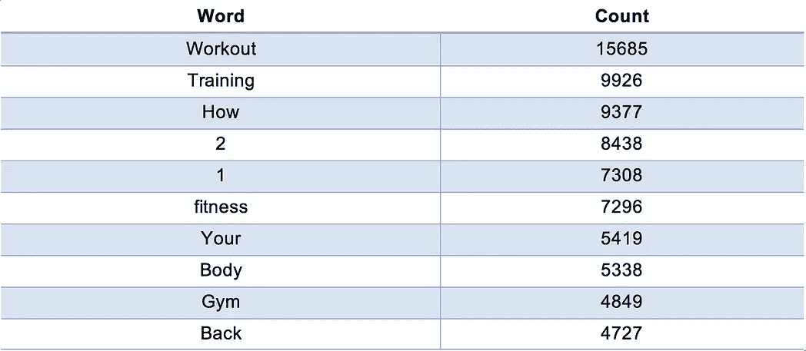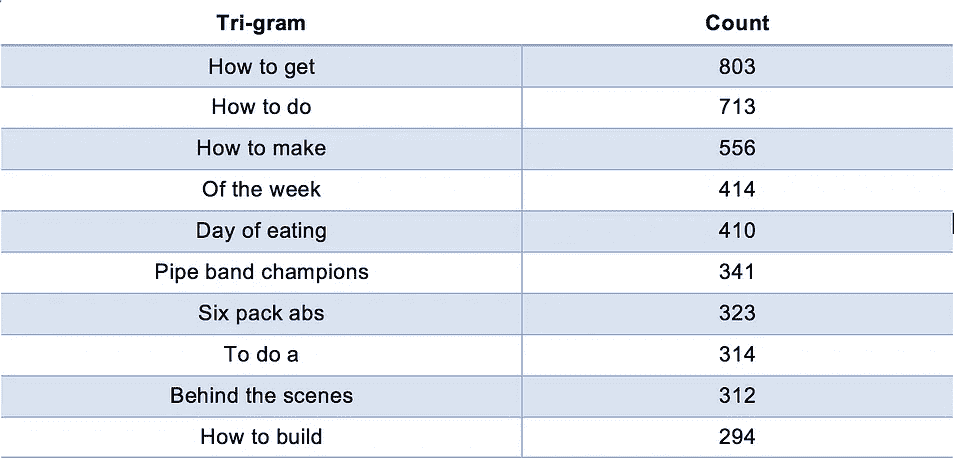

***NSFW 得分***

让我们看看从缩略图中提取的 NSFW 分数的分布:

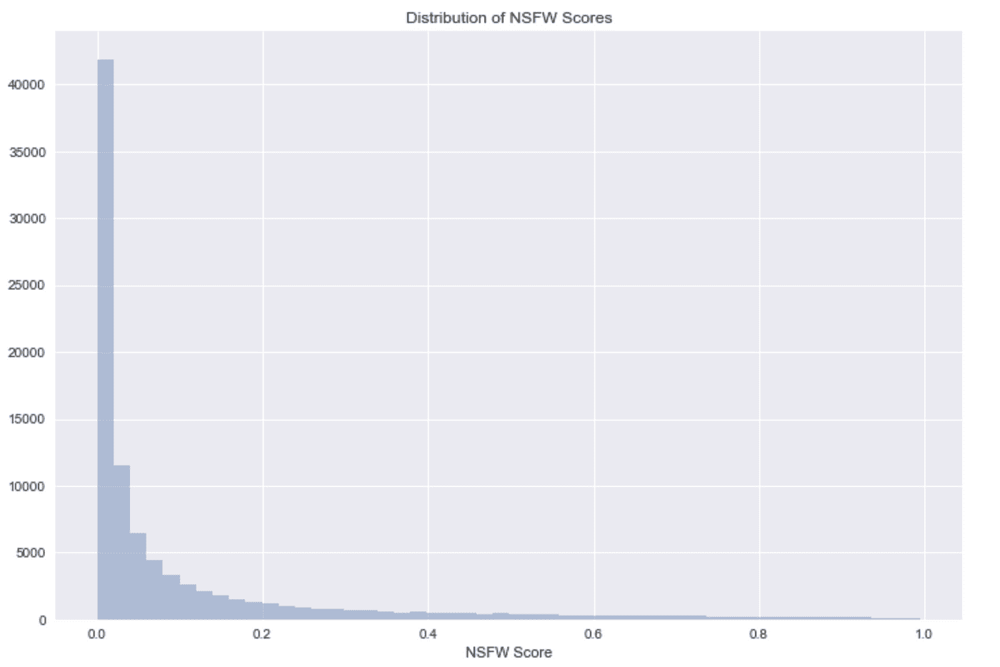

nsfw 分数严重偏向 0，平均值为 0.107。当我们查看观看率最高的 10%的视频和观看率最低的 10%的视频的平均分数时，这变得很有趣。

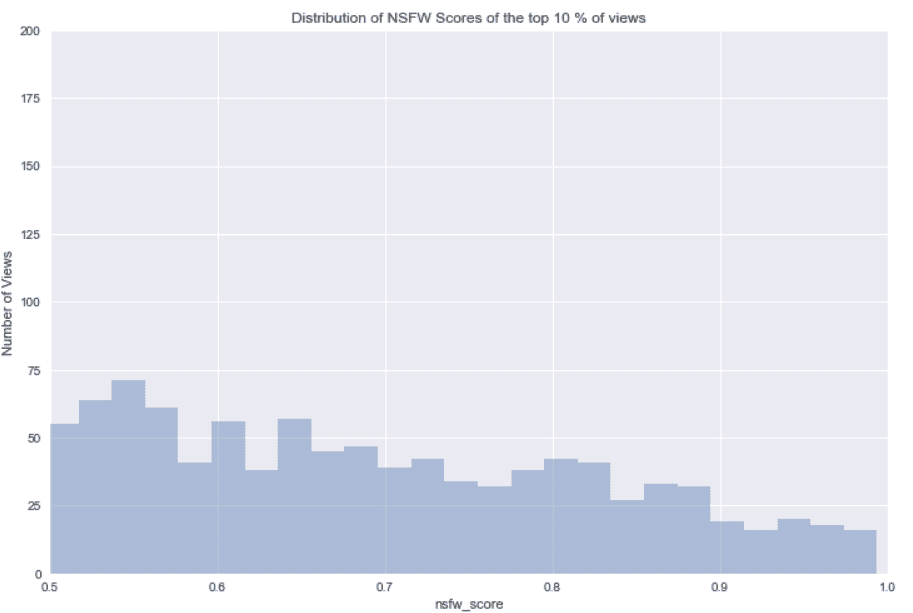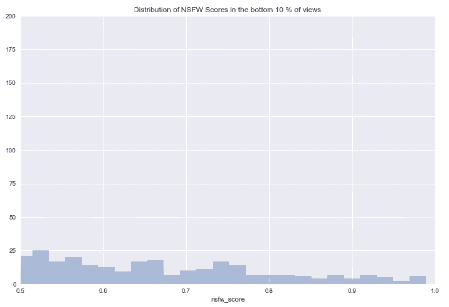

前 10%的平均 nsfw 得分为 0.158，后 10%的平均 nsfw 得分为 0.069。这似乎提供了比点击诱饵分数更强的预测能力，并且证实了我们一直以来都知道的——性销售。

# 预言者

使用 GradientBoostedRegressor，我们绘制了特征重要性:

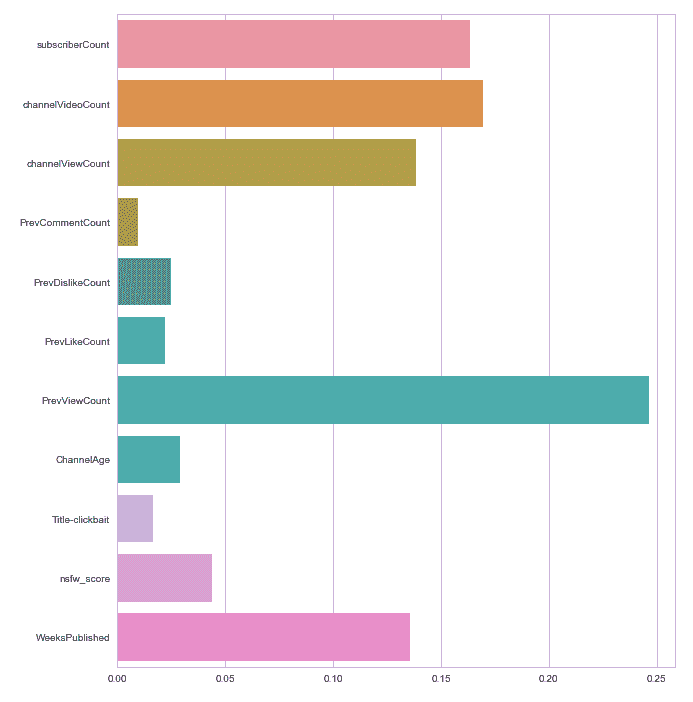

最终，看起来过去的表现决定了未来的成功。预测你的频道表现如何的最佳指标是你之前视频的浏览量。你的缩略图的暗示性和视频标题的“点击诱惑性”对观看者能获得的观看次数影响不大。最后，我们使用一个 XGBRegressor 来预测 log 转换后的视图计数。我们使用交叉验证来获得:

R = 0.750 0.007
RMSE = 0.970 0.021

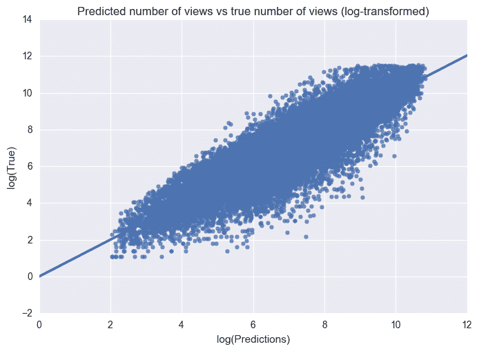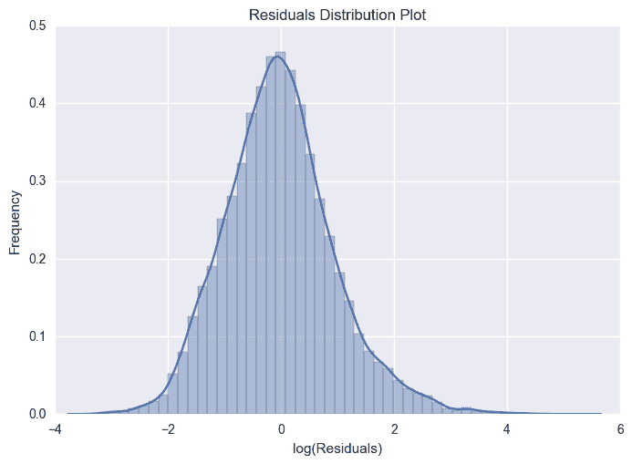

从我们的预测到真实值图中，我们可以看到模型似乎很好地拟合了数据。此外，残差图表明误差偏差是由零均值高斯分布引起的。

最后，我们对输出进行指数运算，以获得视图的真实数量:

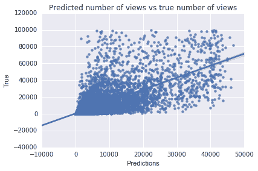

**RMSE = 8727.0 100.9**

这实质上意味着，如果 YouTuber 使用我们的预测器，他们可以预期实际结果在模型结果的 8800 个实际视图之内。对于一个拥有大约 1000 个浏览量的业余 YouTube 来说，这有点没用，但对于一个拥有大约 100，000 个浏览量的 YouTube 来说，这开始变得更加有用。然而，最终预测视图的数量本身就很困难，所以这些结果和我们预期的差不多。

# 可能需要更多调查的模型

最初当我们计划这个项目时，我们试图从标题和缩略图本身来预测视图的数量。不幸的是，我们很快发现，观看次数与频道信息本身有更大的关系——通常是观看次数、订户数等。本节将涵盖我们实验的各种其他模型，以评估标题和缩略图对视图的影响。

由于我们有两个独立的文本序列，我们需要找到一种方法将它们作为网络的输入。我们决定用一个明显的分隔符号将以前的和当前的标题结合起来。如果真的有不同的标题之间的差异，那么网络应该捡起来。

我们使用[手套嵌入](https://nlp.stanford.edu/projects/glove/)将每个标题转换成向量序列，然后对每个序列进行零填充，使其长度相同。

首先，我们尝试了一个在 NLP 任务中使用的相当标准的网络:

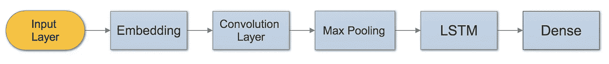

我们注意到网络训练得很快，但是尽管训练损失在迅速减少，但验证损失实际上开始增加。这是模型可能过度拟合的迹象。牢记这一点，我们建立了第二个网络:

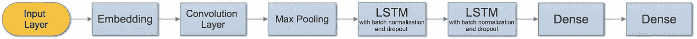

不同的是，在这个新的网络中，我们在每层增加了更多的 LSTM 单元和另一个 LSTM 层。我们对每一个都进行了更多的规范化，以避免过度拟合。我们对此进行了大约 30 个时期的训练，并注意到训练损失会略有下降，但验证损失波动很大。最终，仅仅使用视频的标题，噪音似乎比信号更多。每个纪元都需要很长时间来训练，特别是有这么多 LSTM 单位，所以我们决定不走这条路线。

***卷积神经网络:男女*** 这里的目标是验证缩略图中的人的性别是否与查看次数相关。我们用[这个](https://github.com/yu4u/age-gender-estimation)预训练的 CNN 提取了一个二元性别特征。然而，像大多数性别分类 CNN 一样，我们的网络在识别缩略图中的面孔时遇到了困难。我们的网络在没有人的情况下也很难处理缩略图。考虑到这种方法的问题以及从每个缩略图中提取人脸所需的时间，我们决定不使用这种方法作为特征提取器。

# 结论

我们对这个项目有很多不同的想法，但可能最初对我们的目标来说过于雄心勃勃。我们最初试图预测只有标题和缩略图的浏览数。我们希望神经网络能够在顶级 YouTubers 撰写标题和创建缩略图的方式中学习隐藏的功能，但很快发现这只是一厢情愿的想法。然而，相反，我们能够找到比原始标题和缩略图对预测器更有意义的特征，并最终能够创建一个对中等大小的 YouTube 频道有用的预测器。如果我们有更多的时间，我们可以尝试更多的事情，包括

*   扩展到不同的类型
*   对评论进行情感分析，以创建更强大的“用户简档”,该简档可用作一项功能
*   使用对评论的情感分析来创建一个强大的“接受”特征(类似于喜欢/不喜欢)，然后可以预测该特征
*   使用创成式模型创建注释
*   在缩略图上训练 CNN——由于 NSFW 分数似乎比 clickbait 分数提供了更大的预测能力，因此应用于缩略图的 CNN 可能会比在标题上训练的 LSTMs 表现得更好