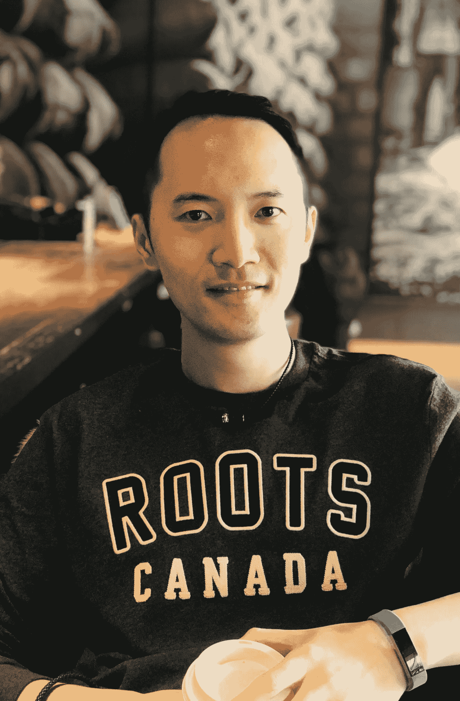
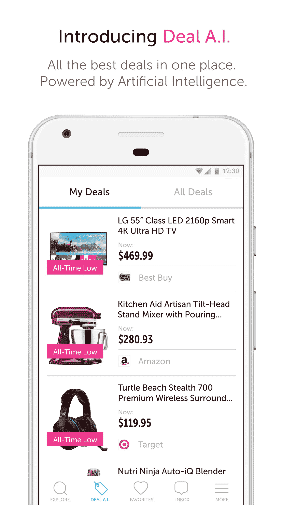

# YROO:人工智能辅助购物的未来

> 原文：<https://towardsdatascience.com/yroo-the-future-of-ai-assisted-shopping-43a90afaae92?source=collection_archive---------7----------------------->

以客户为中心是人工智能的承诺。这似乎是一直躲避商业的圣杯。营销解决方案和系统集成商正试图为下一个最佳行动建立技术框架，将实时消费者环境考虑在内。他们仍然有所欠缺。但是，如果真正了解客户的核心的唯一方法是从不同的角度、不同的数据集积累大量的数据，以便在正确的时间返回直观地符合消费者期望的结果，那会怎么样呢？这正是 YROO 打算做的事情。

我在多伦多市中心的一条安静的街道上见到了 YROO 的首席技术官兼创始人尼克·朱七。他的小办公室和一个 22 人的团队位于多伦多商业区的中心，但仍然被不同种族的餐馆包围着，而且离南边著名的圣劳伦斯市场只有一箭之遥。一个沉着冷静的年轻人向我打招呼。但是当我们开始交谈时，我感觉到在他讲述他的故事时，这种激情的暗流弥漫在我们的讨论中。

# **它开始的地方……**

尼克·朱七是一名有着 17 年专业经验的资深软件工程师。他毕业于上海大学，获得经济学学士学位。他谈到了他的父亲，一位接受传统数学培训的经济学教授，以及他的祖父，一位在他很小的时候就向他介绍无线电元件和电路世界的电气工程师。尼克对计算机很感兴趣，记得在一年级时学过一种叫做 Logo 的语言。虽然尼克的学位是经济学，但他的兴趣来自于消费者行为和数据。

在创办 Yroo.com T4 公司之前，尼克在 dot.com 的繁荣时期培养了自己的编程技能，成为了一名软件工程师。后来，他完成了计算机科学硕士学位，开始作为一名独立的软件顾问工作。后来，他加入 ThoughtWorks，担任加拿大业务的首席顾问。在过去的 10 年里，他的热情和专长集中在分布式计算、语言设计、机器学习和数据挖掘上。

# **实时语境关联成功……**

在 ThoughtWorks，Nick 为一个广告平台开发了广告跟踪软件，用于跟踪在线广告并实时分析来自网络的数十亿个信号。此外，他还为一家呼叫中心软件供应商开发了软件，使他们能够通过聚合社交数据、语音数据和账户信息、分析消费者情绪的语音语调并显示上下文相关性来优化呼叫处理，从而提高呼叫中心的客户参与度。这些项目利用大数据和机器学习(ML)来帮助企业预测客户行为，并优化旅程中的客户转化点。

# **输入 YROO:解决市场问题……**

优化消费者体验很容易转化为在线零售领域正在发生的事情。据尼克所说，

> “自电子商务在 90 年代末首次亮相以来，过去 20 年中真正发生了什么变化？选择增加了，物流、交货速度和客户服务都有了显著改善。但从信息的角度来看，消费者收到的东西并没有改变太多。虽然零售和企业巨头已经积累了关于他们的客户、产品和竞争对手的信息，但消费者却没有同样的信息优势。"

信息不平衡，消费者继续做所有的工作。他们也不知道如何做出更好的购买决定。如果一家零售商以六折促销一种产品，这意味着什么？是从建议零售价打折的吗？如果你昨天收到 60%的折扣，但今天是 40%呢？价格比前一天上涨了 20%。在尼克看来，像 MarketWatch 这样的研究公司已经注意到，建议零售价(SRP)过高，因此不可信。那么基线是什么呢？

随着时间的推移，企业零售对数据的访问使他们能够更好地在正确的时间向消费者销售正确的产品。他们的武器库收集了客户的人口统计信息、家庭构成、可支配收入、兴趣和在线搜索等。

# **一个想法……**

通过进一步的探索，尼克和他的团队意识到零售商提供了大量的数据，但没有人系统地试图从中收集见解。许多数据非常混乱，需要多次迭代才能理解它们的价值。例如:在 Shopping.com，一位客户正在寻找一款特定的无线扬声器。这个扬声器也在另外两个网站上销售。不同网站的图片、标题、文字描述可能略有不同，但是通过一些视觉和信息比较，人们可以在几分钟内得出结论，这些产品是相同的。尼克猜测的…

> 如果一个人可以通过购物比较合理地得出结论，一种产品是相同的，那么这是一个可以应用于机器的“可学习的问题”。在机器学习中，这被定义为实体解析:将实体(对象或事物)链接在一起的能力。”

# **市场中的实体解析…**

YROO 现在正在生产中运行其算法的第 3 版。花了 18 个月才走到这一步。Yroo 在美国上线，聚合了来自 5000 家商家和平台的信息，包括 F100 企业零售商。这个模型很聪明，它可以将产品聚集在一起，因此对于消费者来说，在一个地方实时获得所有信息是很有用的。瞬间，顾客可以决定从哪个零售商那里购买什么产品。

**以消费者为中心的搜索引擎:提供客观排名的结果**

Yroo 要解决的下一个算法是排名。由于消费者一次只能消化有限的信息，所以提供对消费者有用的信息非常重要。对于第一次消费的消费者，他们通常会首先获得赞助位置，以及可能为零售商提供最佳利润的产品。YROO 开始改变这种情况，目标是直观地返回符合消费者预期的结果。通过访问其他信号，包括畅销产品、各商家的销售排名，以及利用神经网络来提高排名，Yroo 能够优化买家行为。

YROO 确实有一些赞助广告，作为其货币化战略的一部分，但在大多数情况下，返回的结果是有机的。他们的承诺是确保赞助广告不会像亚马逊一样将相关结果推到折叠线以下。

虽然大量数据来自亚马逊，但尼克表示，现在可以广泛访问许多商家有助于消除亚马逊庞大数量中的偏见。最终，该算法将代表大众消费市场，而不是更专业、更小众的市场。

他们过得怎么样？与同一时期的平均移动流量相比，上一次黑色星期五活动在 YROO 上为最大的平台之一带来了两倍的移动转化率。这种认可也转化为 YROO 因其销售线索生成和转化表现而获得的佣金。

# **支持消费者的智能浏览器扩展现已上线**

如果你碰巧在亚马逊上搜索那个特殊的演讲者，如果你的浏览器上弹出一个小通知，显示其他商店以不同的价格销售该产品，会怎么样？所以，不用再在谷歌上搜索或者跳到其他零售商那里比价了。当你寻找某个特定产品的时候，一切都来了。这将消除以前为确保找到最佳价格而花费的时间和精力。这种并排比较减少了消费者的搜索工作，并直接为您带来了强大的正确信息！

> “你不必来我们的地盘。你不必改变购物的方式。YROO 会走到你面前，自动向你展示备选方案……我们制造这台机器是为了理解消费者能理解的网页。我们解读网页上的信息，理解它，并浏览整个网页，了解所有的比较特征。然后我们在恰当的时候把相关信息带给消费者。”

**关于人工智能和广告的下一步的想法…**

反思真正理解消费者的演变，尼克认为广告不会很快消失。通过个性化和大众媒体的品牌认知将会继续。然而，在线广告市场充斥着许多不道德的特征，从欺诈到点击诱饵、机器人和点击农场。它需要改革，否则可能会损失大量广告资金。程序化的兴起是一种众所周知的猎枪方法，进一步降低了行业的声誉。有了人工智能，这些数据将为消费者提供更少干扰、更个性化、更智能和更有价值的信息。

随着人工智能变得更加普遍，我们进一步进入深度神经网络，尼克表示，这将使深入研究可解释的人工智能变得更加困难。

“与随机森林(Random Forest)在其分支上应用逻辑一样，深度神经网络由直觉组成，可以识别作为重要特征的变量。然而，与随机森林不同的是，很难确定一个神经网络做出的特定决定以及它到达最终结果的路径…

人脑是复杂的。有时候，我们认为我们做的和我们说的和我们实际做的是完全不同的三件事。我们大脑的一边给出解释，而另一半实际上做出决定。很多时候，他们可能不会和解。"

人工智能的未来也试图编纂人类知识。正如尼克所指出的，挑战在于试图将“诀窍”编纂成文，即你无法解释但只是“知道如何做”的事情，例如骑自行车或走路。这是一个值得注意的时刻，一个数学方程可以真正地编纂直觉或行动，而不需要真正的逻辑。这是人类大脑与众不同的本质。

在与尼克的会面中，我现在意识到这个以客户为中心的圣杯活得很好。其神话般的假设在伊鲁实现了。尼克试图了解消费者需求和行为的实验给这位企业家带来了难以置信的成功，他对实现这一目标的专注和热情丝毫未减。

这篇文章起源于[认知世界](http://cognitiveworld.com/article/yroo-future-ai-assisted-shopping)。