# Zig-Zag //双流递归神经网络，具有交互式代码的双神经网络。[带 TF 的手动后撑]

> 原文：<https://towardsdatascience.com/zig-zag-dual-stream-recurrent-neural-network-twin-neural-network-with-interactive-code-b5c0a58b7f92?source=collection_archive---------9----------------------->

GIF from this [website](https://giphy.com/gifs/motionaddicts-inspiration-idea-spark-26BkNrGhy4DKnbD9u)

我从来没有双胞胎兄弟，但如果我有一个，这将是非常酷的。我们会有不同的想法，但彼此非常相似。这让我思考，这个概念是否也可以应用于神经网络？我想弄清楚。和往常一样，下面是我想为这篇文章实现的不同架构的列表。

*案例 a:双流递归神经网络
案例 b:双流之字形递归神经网络
案例 c:双流混合递归神经网络
案例 d:非孪生(标准)神经网络
案例 e:孪生神经网络*

> **请注意，这篇帖子只是为了娱乐，也是为了表达我的创意。因此不是面向结果的。**

**多流递归神经网络**

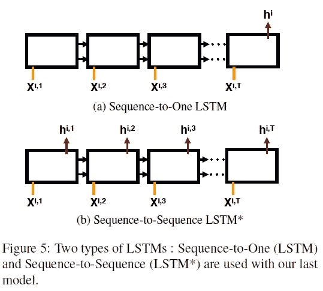

Image from this [paper](https://arxiv.org/abs/1704.01194)

在写这篇文章时，我找到了几篇关于多流递归神经网络架构的论文。我想总的想法是，我们可以有两个(或三个)网络，而不是一个[长短期记忆](https://en.wikipedia.org/wiki/Long_short-term_memory) (LSTM)或[循环神经网络](https://en.wikipedia.org/wiki/Recurrent_neural_network) (RNN)。下面是我在写这篇文章时发现的论文列表。

1.  [双流 LSTM:人体动作识别的深度融合框架](https://arxiv.org/abs/1704.01194)
2.  [用于多流分类的并行长短期记忆](https://arxiv.org/abs/1702.03402)
3.  [多流长短期记忆神经网络语言模型](https://www.isca-speech.org/archive/interspeech_2015/papers/i15_1413.pdf)

现在我想介绍一下我们将在本帖中使用的基础网络架构。

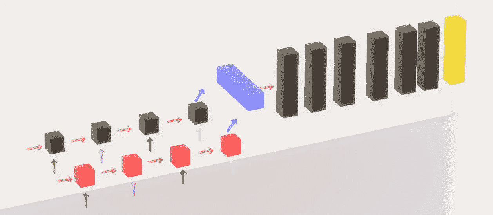

Case a: Dual RNN

**红色方块，黑色方块** →流 1 RNN，流 2 RNN
**粉色箭头** →隐藏状态，每个时间戳都被保留
**绿色、粉色、黑色、蓝色箭头** →输入时间戳 0，1，2，3
**蓝色矩形，箭头** →最终串接输出每个 RNN
**黑色矩形** →卷积层(基于 [*所有卷积)*](/iclr-2015-striving-for-simplicity-the-all-convolutional-net-with-interactive-code-manual-b4976e206760)

我真的希望三维图形有助于每个人的理解。(挺烂的 lol)。但主要思想是在卷积神经网络之前有某种多流 RNN，基本上就是这样。最后，我想提一下，对于不同的时间戳，我们要么向网络提供原始图像，要么提供增强图像。(我们将使用 [CIFAR 10](https://www.cs.toronto.edu/~kriz/cifar.html) 数据集)

**之字形递归神经网络**

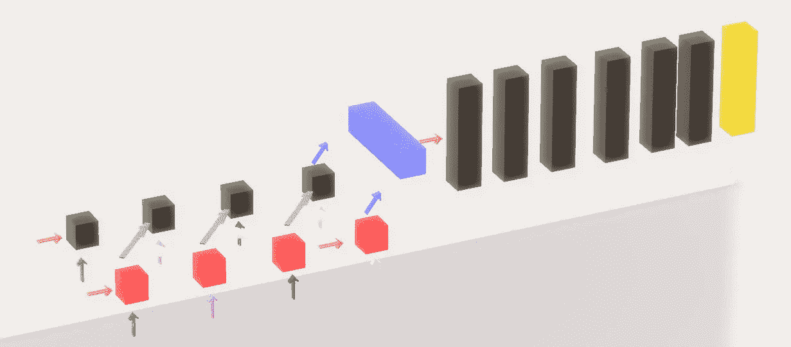

Case b: Dual Zig Zag RNN

**白色、灰色箭头** →改变隐藏状态的方向

现在让我们引入一些不同的东西，就像上面看到的，而不是使用来自同一个流的前一个时间戳的隐藏状态。我们将改变所使用的隐藏状态的方向。(因此得名 zig zag。).与两个独立的 RNN 电视网相比，我希望每个电视网都能学会如何相互合作，以获得更好的性能。

最后，让我们看一下网络结构，其中我们结合了之字形结构以及直线前馈操作。

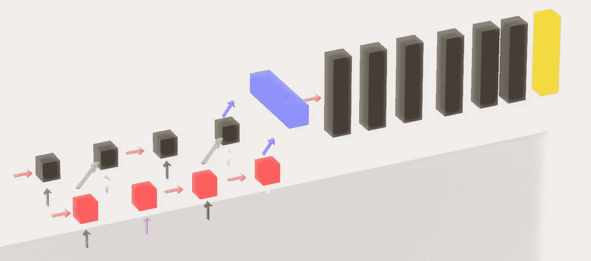

Case c: Dual Mix RNN

如上所述，这一次我们将结合 zig zag 结构以及原始的递归神经网络结构。(在从 2 时间戳到 3 时间戳的转换期间，我们将让网络使用它们自己的隐藏状态。)

**结果:案例 a:双流递归神经网络**

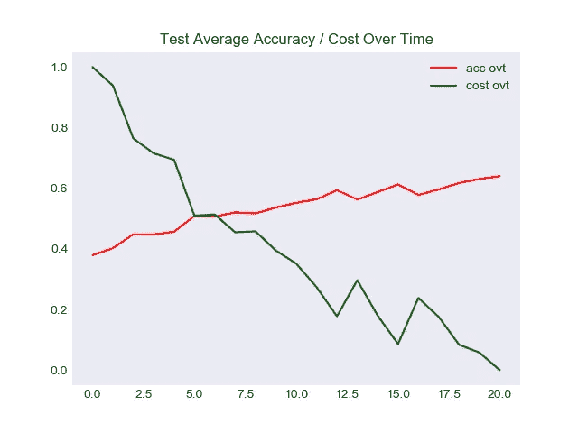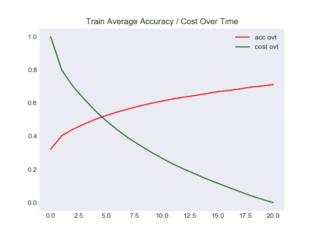

**左图** →测试集精度/时间成本
**右图** →训练集精度/时间成本

马上，我们可以注意到，这种类型的架构不适合图像分类任务。在训练结束时，我们只能达到 71%的训练图像准确率，而 64%的测试图像准确率。

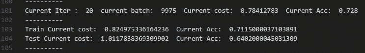

**结果:案例 b:双流之字形递归神经网络**

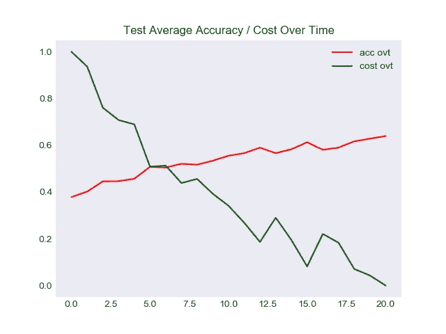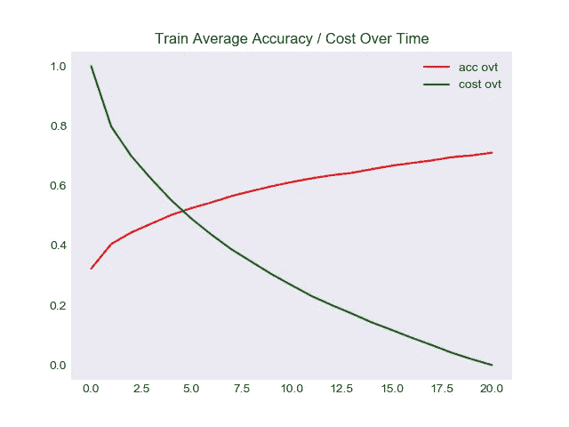

**左图** →测试集精度/时间成本
**右图** →训练集精度/时间成本

我真的不知道对这个网络有什么期望，但它似乎与原来的网络没有明显的区别。以相似的(在测试图像上更差)准确度完成训练。

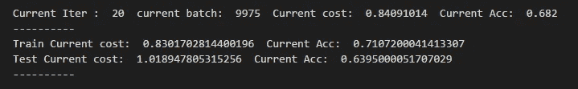

**结果:案例 c:双流混合递归神经网络**

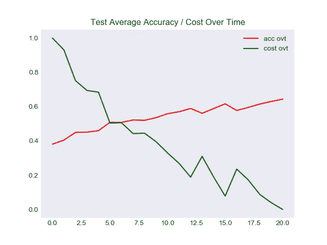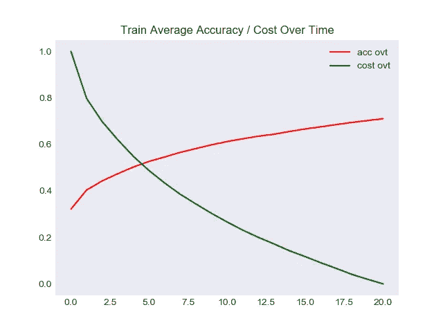

**左图** →测试集精度/时间成本
**右图** →训练集精度/时间成本

最终类型的网络给出了相似的结果。然而，它能够胜过原来的网络以及 zig zag 网络。(按 0.003)。

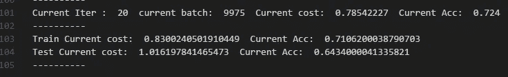

**孪生神经网络**

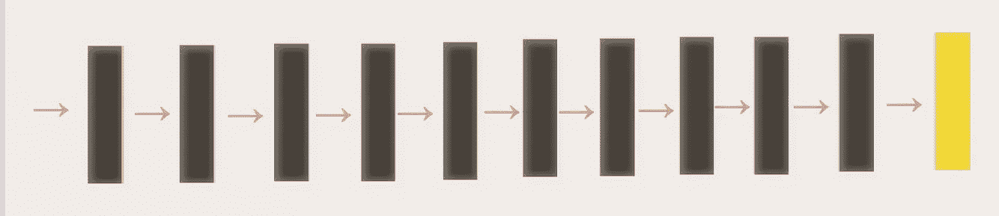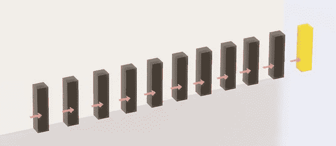

Case d: Non Twin network

**黑框** →卷积层
**粉色箭头** →前馈运算
**黄色框** →全局平均池和 Softmax

在看一下 Twin 网络之前，让我们先看看我们的基本网络。如上所述，我们的基本网络只是从[全卷积网络](/iclr-2015-striving-for-simplicity-the-all-convolutional-net-with-interactive-code-manual-b4976e206760)的扩展，在末端增加了一个卷积层。(使总层数为 10。)现在让我们来看看 Twin Network 的架构。

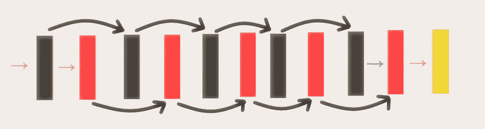

Case e: Twin Network

**黑盒** →孪生 1 的卷积层
**红盒→** 孪生 2 的卷积层
**粉色箭头** →前馈操作
→绿色箭头 →级联和前馈操作
**弯曲箭头** →前馈操作
**黄色框** →全局平均池和 Softmax

如上所述，与原始网络没有太大区别，但我们可以观察到的主要区别是，现在不是用一个 10 层网络来完成所有工作。我们有两个相互交织的较小的网络。

**结果:案例 d:非孪生(标准)神经网络**

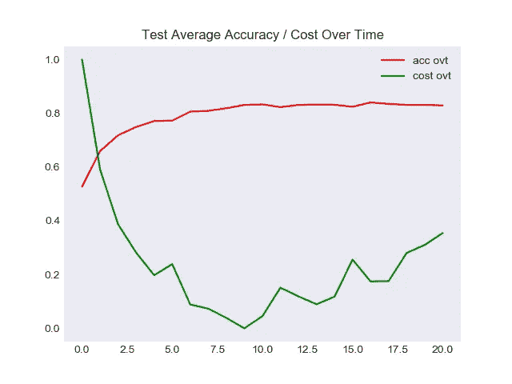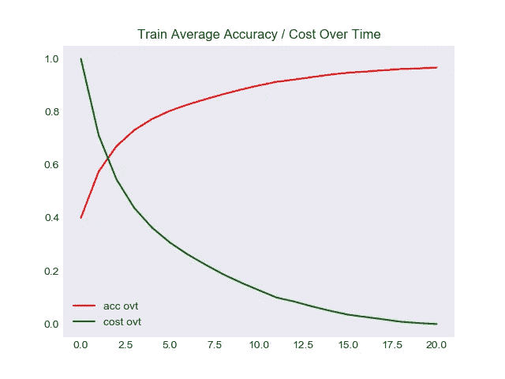

**左图** →测试集精度/时间成本
**右图** →训练集精度/时间成本

很明显，网络正遭受过度拟合，我们可以通过测试集精度以及训练集精度来观察这一点。

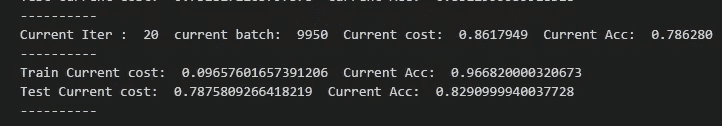

如上所述，我们能够在测试集图像上实现 82%的准确率，但我们需要考虑到训练图像的准确率已经超过 95%的事实。(96%)

**结果:案例 e:双神经网络**

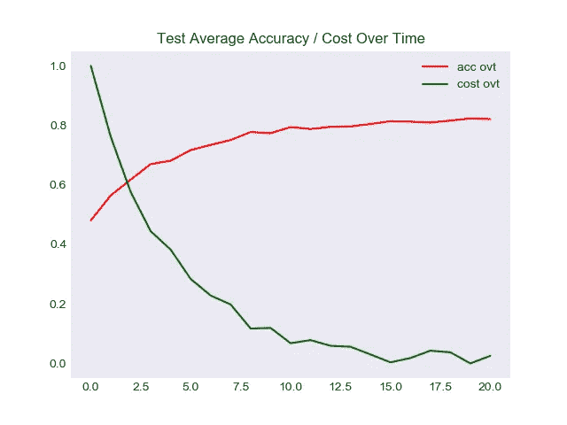

**左图** →测试集精度/时间成本
**右图** →训练集精度/时间成本

与标准的 10 层神经网络相比，这是一个明显的优势。然而，该模型仍然存在过度拟合的问题。有了更好的正则化技术，就有可能克服这个问题。

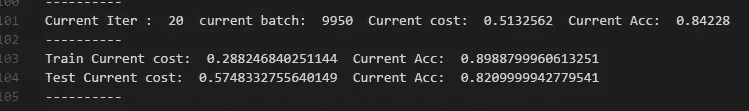

如上所述，我们能够在测试图像上实现相同的准确性，同时在训练图像上实现 89%的准确性。

**互动代码**

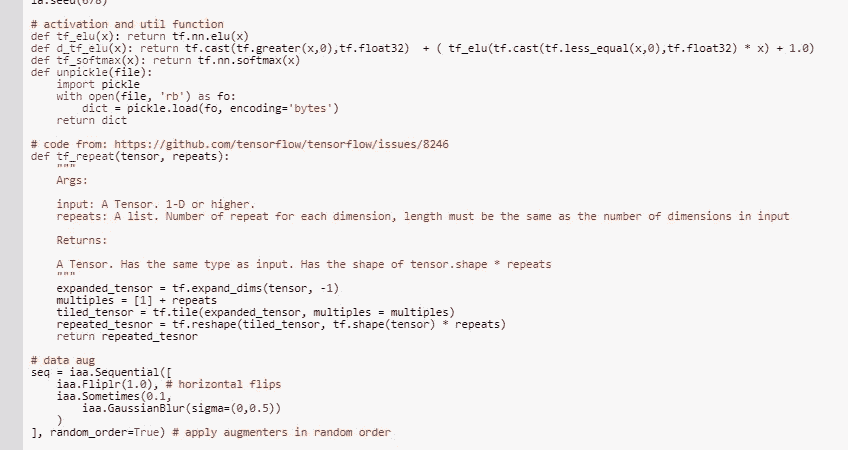

*对于谷歌 Colab，你需要一个谷歌帐户来查看代码，而且你不能在谷歌 Colab 中运行只读脚本，所以在你的操场上做一个副本。最后，我永远不会请求允许访问你在 Google Drive 上的文件，仅供参考。编码快乐！同样为了透明，我在 github 上上传了所有的训练日志。*

要访问案例[的代码，请点击此处](https://colab.research.google.com/drive/1_LtQihIqYN0LTo9sFi0vMPUKFWi16pHI)，要查看[日志，请点击此处。](https://github.com/JaeDukSeo/Daily-Neural-Network-Practice-2/blob/master/NeuralNetwork/ZigZag_Twin/a/a.txt)
访问案例 [b 的代码点击此处](https://colab.research.google.com/drive/1RpSE8qdiUZVyYhSmKVV96Xnk7G8yVB3F)，查看[日志点击此处。](https://github.com/JaeDukSeo/Daily-Neural-Network-Practice-2/blob/master/NeuralNetwork/ZigZag_Twin/b/b.txt) 要访问案例 [c 的代码，单击此处](https://colab.research.google.com/drive/1riDsWP_z3Kz3S0VLITf4cmG3zApYTIkK)，要查看[日志，单击此处。](https://github.com/JaeDukSeo/Daily-Neural-Network-Practice-2/blob/master/NeuralNetwork/ZigZag_Twin/c/c.txt)
要访问案例 [d 的代码，请单击她的](https://colab.research.google.com/drive/1-p8BIloIjBTFjBX8qFeInYVthdJLOfcQ) e，要查看[日志，请单击此处。](https://github.com/JaeDukSeo/Daily-Neural-Network-Practice-2/blob/master/NeuralNetwork/ZigZag_Twin/d/c.txt)
要访问案例 [e 的代码，请点击此处](https://colab.research.google.com/drive/1ItODQ1vVL0vaY6q7YfKXOdi2s9Sgegdg)，要查看[日志，请点击此处。](https://github.com/JaeDukSeo/Daily-Neural-Network-Practice-2/blob/master/NeuralNetwork/ZigZag_Twin/e/e.txt)

**最后的话**

我更喜欢不同网络相互协作的想法。在发这个帖子的时候，我反复地听“ [*我的火焰——鲍比·考德威尔*](https://www.youtube.com/watch?v=3hK6IgvZ0CY) ”。我只是想推荐给大家。

Video from [RUMnWINE](https://www.youtube.com/channel/UCn_Td6IQrkcsfhC0ehBgFQQ)

如果发现任何错误，请发电子邮件到 jae.duk.seo@gmail.com 给我，如果你想看我所有写作的列表，请在这里查看我的网站。

同时，在我的 twitter 上关注我[这里](https://twitter.com/JaeDukSeo)，访问[我的网站](https://jaedukseo.me/)，或者我的 [Youtube 频道](https://www.youtube.com/c/JaeDukSeo)了解更多内容。我还实现了[广残网，请点击这里查看博文](https://medium.com/@SeoJaeDuk/wide-residual-networks-with-interactive-code-5e190f8f25ec) t。

**参考**

1.  Matplotlib 样式库。(2018).tonysyu . github . io . 2018 年 6 月 11 日检索，来自[https://tonysyu . github . io/raw _ content/matplotlib-style-gallery/gallery . html](https://tonysyu.github.io/raw_content/matplotlib-style-gallery/gallery.html)
2.  Matplotlib:有格调的美好剧情。(2016).Futurile.net。检索于 2018 年 6 月 11 日，来自[http://www . futurile . net/2016/02/27/matplotlib-beautiful-plots-with-style/](http://www.futurile.net/2016/02/27/matplotlib-beautiful-plots-with-style/)
3.  我的爱人——鲍比·考德威尔。(2018).YouTube。检索于 2018 年 6 月 11 日，来自[https://www.youtube.com/watch?v=3hK6IgvZ0CY](https://www.youtube.com/watch?v=3hK6IgvZ0CY)
4.  NumPy . dtype—NumPy 1.14 版手册。(2018).Docs.scipy.org。检索于 2018 年 6 月 11 日，来自[https://docs . scipy . org/doc/numpy-1 . 14 . 0/reference/generated/numpy . dtype . html](https://docs.scipy.org/doc/numpy-1.14.0/reference/generated/numpy.dtype.html)
5.  为什么 range(开始，e. (2018)。为什么 range(start，end)不包括 end？。堆栈溢出。检索于 2018 年 6 月 11 日，来自[https://stack overflow . com/questions/4504662/why-does-rangestart-end-not-include-end](https://stackoverflow.com/questions/4504662/why-does-rangestart-end-not-include-end)
6.  数组，I. (2018)。将元素插入 numpy 数组。堆栈溢出。检索于 2018 年 6 月 11 日，来自[https://stack overflow . com/questions/21761256/insert-element-into-numpy-array](https://stackoverflow.com/questions/21761256/insert-element-into-numpy-array)
7.  NumPy . insert—NumPy 1.14 版手册。(2018).Docs.scipy.org。检索于 2018 年 6 月 11 日，来自[https://docs . scipy . org/doc/numpy/reference/generated/numpy . insert . html](https://docs.scipy.org/doc/numpy/reference/generated/numpy.insert.html)
8.  [副本]，第(2018)页。阻止 TensorFlow 访问 GPU？。堆栈溢出。检索于 2018 年 6 月 11 日，来自[https://stack overflow . com/questions/44552585/prevent-tensor flow-from-access-the-GPU](https://stackoverflow.com/questions/44552585/prevent-tensorflow-from-accessing-the-gpu)
9.  Gammulle，h .，Denman，s .，Sridharan，s .，& Fookes，C. (2017 年)。双流 LSTM:人体动作识别的深度融合框架。Arxiv.org。检索于 2018 年 6 月 11 日，来自 https://arxiv.org/abs/1704.01194
10.  长短期记忆。(2018).En.wikipedia.org。检索于 2018 年 6 月 11 日，来自 https://en.wikipedia.org/wiki/Long_short-term_memory
11.  递归神经网络。(2018).En.wikipedia.org。检索于 2018 年 6 月 11 日，来自[https://en.wikipedia.org/wiki/Recurrent_neural_network](https://en.wikipedia.org/wiki/Recurrent_neural_network)
12.  [ ICLR 2015 ]追求简单:具有交互码的全卷积网。(2018).走向数据科学。检索于 2018 年 6 月 11 日，来自[https://towardsdatascience . com/iclr-2015-努力简化-所有卷积网-交互式代码-手册-b4976e206760](/iclr-2015-striving-for-simplicity-the-all-convolutional-net-with-interactive-code-manual-b4976e206760)
13.  (2018).Isca-speech.org。检索于 2018 年 6 月 11 日，来自[https://www . isca-speech . org/archive/inter seech _ 2015/papers/i15 _ 1413 . pdf](https://www.isca-speech.org/archive/interspeech_2015/papers/i15_1413.pdf)
14.  m .布阿齐兹、m .莫奇德、r .杜福尔、利纳尔：s，g .，& De Mori，R. (2017 年)。用于多流分类的并行长短期记忆。Arxiv.org。检索于 2018 年 6 月 11 日，来自[https://arxiv.org/abs/1702.03402](https://arxiv.org/abs/1702.03402)
15.  CIFAR-10 和 CIFAR-100 数据集。(2018).Cs.toronto.edu。检索于 2018 年 6 月 12 日，来自[https://www.cs.toronto.edu/~kriz/cifar.html](https://www.cs.toronto.edu/~kriz/cifar.html)
16.  dmlc/xgboost。(2018).GitHub。检索于 2018 年 6 月 12 日，来自[https://github.com/dmlc/xgboost](https://github.com/dmlc/xgboost)