# 僵尸和模型腐烂(带 ML 引擎+数据存储)

> 原文：<https://towardsdatascience.com/zombies-model-rot-with-ml-engine-datastore-747b299526e9?source=collection_archive---------16----------------------->

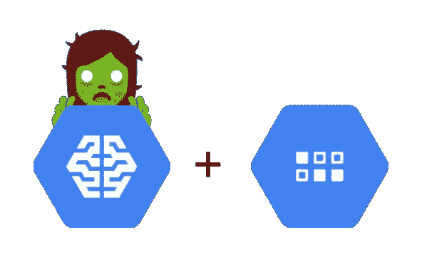

Don’t leave your models to rot into obscurity

所以你已经把你的机器学习模型部署到了云端，你的所有应用和服务都能够从中获取预测，太好了！你可以永远不去管那个模型去做它的事情…也许不会。大多数机器学习模型都在建模这个世界的一些东西，而这个世界是不断变化的。要么和它一起改变，要么被甩在后面！

# 什么是模型腐烂？

模型腐，数据腐，AI 腐，随便你怎么叫，都不好！假设我们已经建立了一个模型来预测僵尸是否友好。我们将它部署到云端，现在世界各地的应用程序都在使用它来帮助公众了解他们可以与哪些僵尸交朋友而不会被咬。令人惊讶的是，人们似乎对你的模型非常满意，但是几个月后，你开始收到人们发来的愤怒的电子邮件，他们说你的模型很糟糕！原来是丧尸种群变异了！现在你的模式是过时了，还是**烂了**！您需要更新您的模型，更好的是，添加一种方法来跟踪您的模型的腐烂状态，以便这种情况不会再次发生。

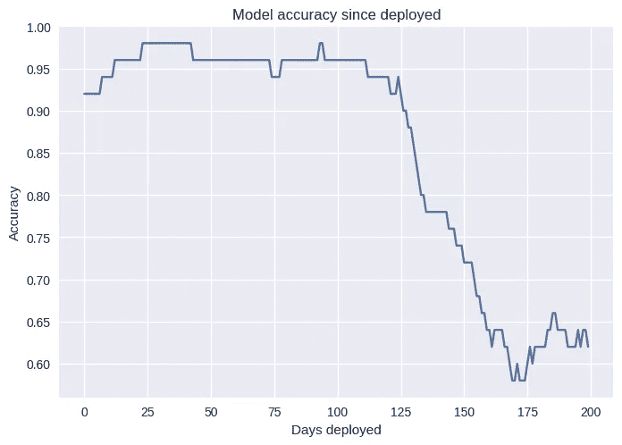

This is an example of a very sudden case of model rot!

# 改变的不仅仅是僵尸

当然，虚构的生物可以改变，但金融市场、居住环境、交通模式、天气模式、人们写微博的方式、猫的样子也可以改变！好吧，也许猫永远看起来像猫(虽然给它几百万年，也许不是)。关键是，取决于你的模型预测的东西会影响它们腐烂的速度。

同样重要的是要注意到，你预测的东西不需要为了你的模型腐烂而改变。也许您用来捕获输入数据的传感器发生了变化。当部署模型时，任何对模型性能产生负面影响的东西都会导致模型腐烂，要么移除导致性能降低的东西，要么更新模型(很可能是后一种选择)。

# 让我们与模型腐烂作斗争(用 ML 引擎+数据存储)

有一个僵尸爆发，但它并不像电影会让你相信的那样可怕。它们是相当缓慢移动的生物，它们中的许多只是在寻找人类朋友，但有些不是。为了帮助人们正确选择僵尸朋友，我们开发了一个模型，根据几个特征来预测僵尸是否友好:

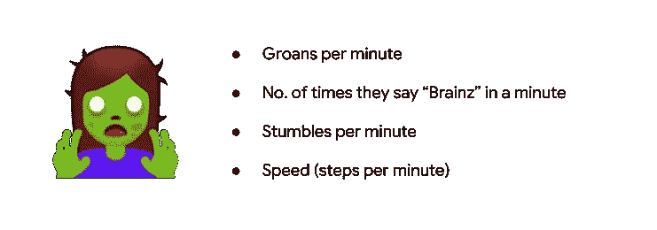

我们使用 Scikit-Learn 构建了一个决策树分类器模型。查看 [**笔记本此处**](https://github.com/ZackAkil/rotting-zombie-model/blob/master/Friendly_zombie_predictor.ipynb) 查看做这件事的确切代码。

现在的计划是将我们的模型部署到 [ML 引擎](https://cloud.google.com/ml-engine/)，它将在云上为我们托管我们的模型。( [*在笔记本*](https://github.com/ZackAkil/rotting-zombie-model/blob/master/Deploying_a_Sk_Learn_model_to_ML_Engine.ipynb) 中查看我们如何使用 gcloud 命令做到这一点)

首先，我们将把我们的模型放到云存储中:

```
gsutil cp model.joblib gs://your-storage-bucket/v1/model.joblib
```

然后创建一个新的 ML 引擎模型，你可以使用 Google Cloud 控制台 UI 或使用 **gcloud** 命令( [*，你可以在这里看到在笔记本*](https://github.com/ZackAkil/rotting-zombie-model/blob/master/Deploying_a_Sk_Learn_model_to_ML_Engine.ipynb) )来完成:

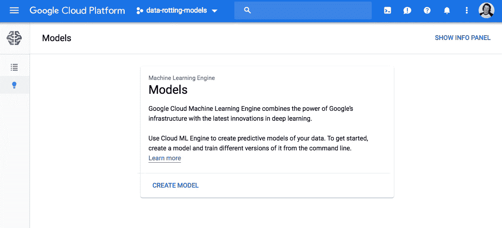

ML Engine UI

然后，我们将决策树模型部署为版本 1:

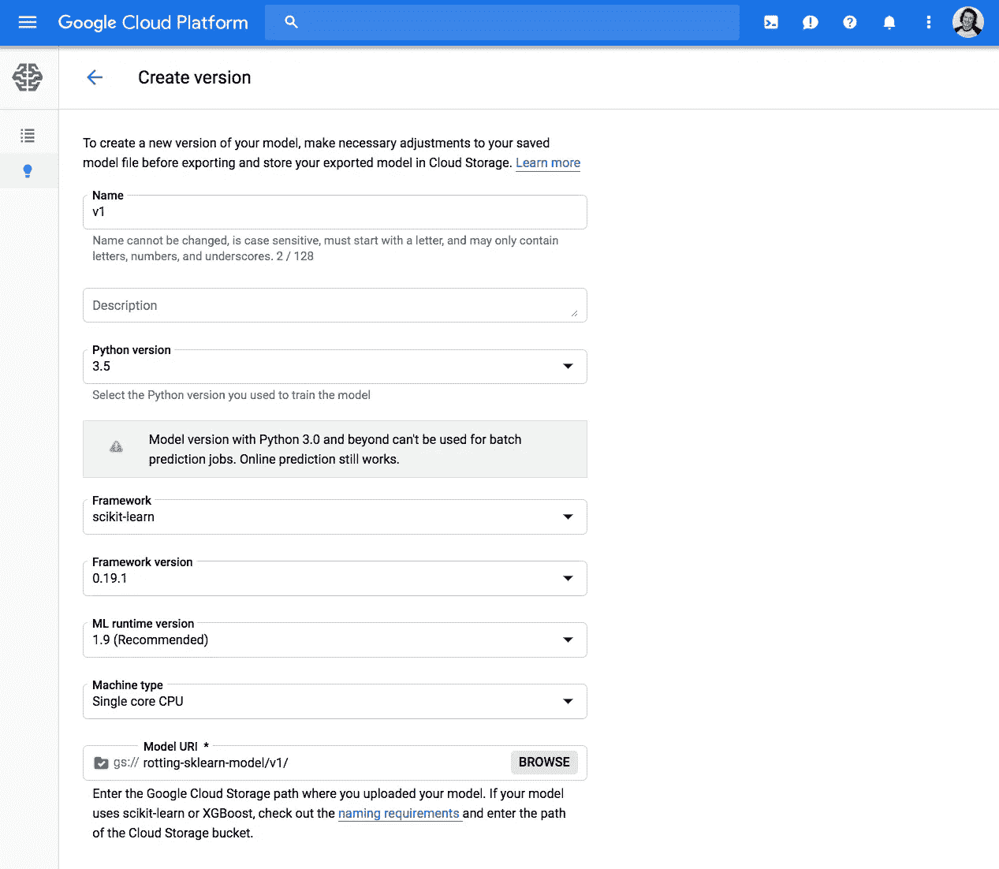

Creating a new version of your model using the Cloud Console UI

为了让应用程序更容易从我们的模型中获取预测，我们将使用云函数创建一个公共端点。你可以在我和我的同事 Sara Robinson 写的这篇博客文章中读到更多关于如何做到这一点的内容。

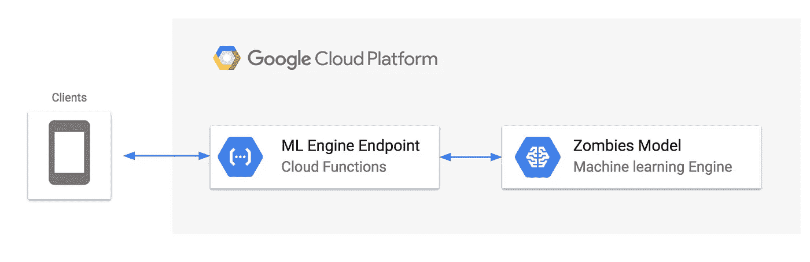

here’s the current architecture of our system

好了，我们的模型已经部署好了，应用程序可以很容易地从中获取预测！现在，使用数据存储监视模型 rot！

# 数据存储？

想象一下，在云中有一个地方，可以快速存储数百万个 python 字典，然后查询它们(也很快)。那就是[数据存储](https://cloud.google.com/datastore/)，一个在谷歌云平台上完全托管的 NoSQL 数据库。如果您以前有过使用数据库的经验，那么您可能习惯于仔细计划在表中存储什么样的数据结构，然后体验创建迁移脚本来更新数据库结构的痛苦。对于数据存储来说，不要胡说八道，要存储以下数据:

```
{
  "name": "Alex"
  "occupation": "Zombr trainer"
}
```

然后这样做(*使用 python 客户端库*):

```
# create new entity/row
new_person = datastore.Entity(key=client.key('person'))new_person['name'] = 'Alex'
new_person['occupation'] = 'Zombr trainer'# save to datastore
client.put(new_person)
```

哦，等等，你想开始储存人们的 githubs 和 twitters？去做吧:

```
# create new entity/row
new_person = datastore.Entity(key=client.key('person'))new_person['name'] = 'Zack'
new_person['occupation'] = 'Zombr CEO'
new_person['github'] = '[https://github.com/zackakil](https://github.com/zackakil)'
new_person['twitter'] = '[@zackakil](https://twitter.com/zackakil)'# save to datastore
client.put(new_person)
```

数据存储会说“谢谢”:

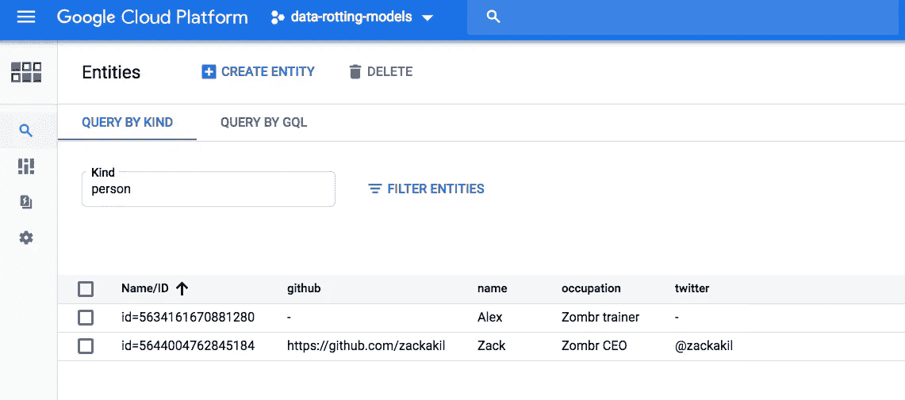

DataStore’s UI

# 使用数据存储收集模型反馈

我们将要收集的反馈数据如下所示:

```
{
"model": "v1",
"prediction input": [2.1, 1.4, 5.3, 8.0],
"prediction output": 1,
"was correct": False,
"time": "23-10-2018,14:45:23"
}
```

这些数据将告诉我们 ML 引擎上的哪个版本的模型用于生成预测(**模型**)、预测的输入数据是什么(**预测输入**)、模型做出的预测是什么(**预测输出**)、预测是否正确(来自用户的实际反馈)(**是正确的**)，以及反馈提交的时间(**时间**)。

我们将再次使用云函数来创建另一个 web API 端点，这次是为了接收反馈数据并将其存储在数据存储中:

don’t forget to add “google-cloud-datastore” to the Cloud Function’s requirements.txt

现在，我们的系统架构如下所示:

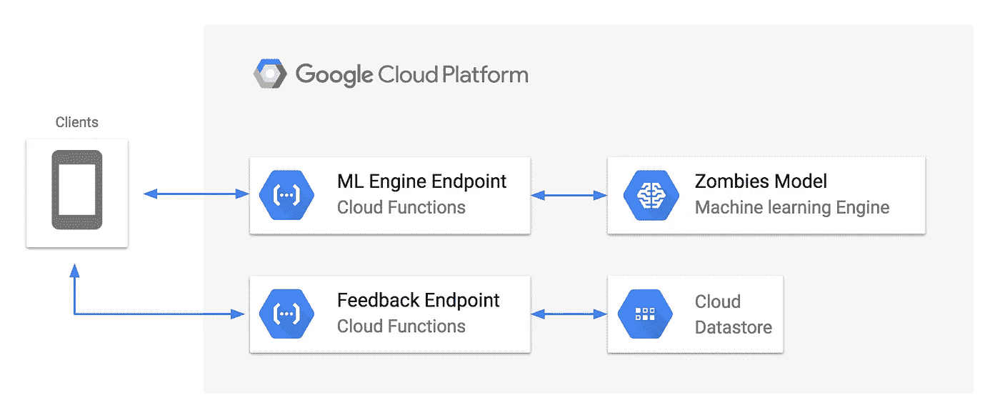

the new architecture of our system

客户端应用程序只需要以一种直观的方式添加用户提交他们的反馈。在我们的例子中，它可以是一个简单的“拇指向上或拇指向下”的提示，在用户看到一个预测之后:

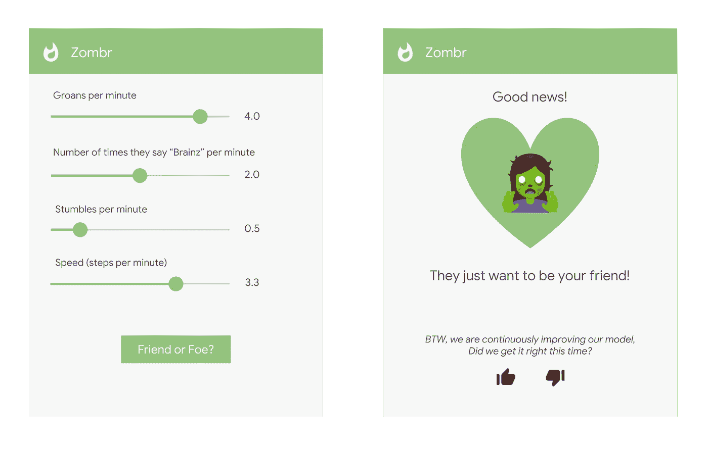

You may have come across feedback prompts like this before

# 创造性地收集反馈

很多时候，你可以推断出关于你的模型的反馈，而不是像我在 **Zombr** 界面**中所做的那样，明确地向用户请求反馈。**例如，如果我们看到用户在预测后立即停止使用应用程序，我们可以使用该数据来指示错误的预测😬。

回到现实中，狗收养机构可能有一个新主人的推荐系统。模型的成功采用率是它自己的性能反馈。如果代理商突然发现系统成功匹配的次数比平时少了很多，那么他们就可以用这个来表明模型已经损坏，可能需要更新。

# 反馈收集完毕，现在做什么？

现在我们可以分析反馈数据。对于任何数据分析工作，我默认使用 Jupyter 笔记本。

[点击此处查看我如何从数据存储中获取数据并分析反馈的完整记录](https://github.com/ZackAkil/rotting-zombie-model/blob/master/Feedback_analyse_from_DataStore.ipynb)。

从数据存储中获取数据的要点是，首先安装数据存储 python 客户端库:

```
pip install google-cloud-datastore
```

然后，您可以导入它并连接到数据存储:

```
**from** google.cloud **import** datastore*# connect to DataStore*
**client = datastore.Client('your project id')***# query for all prediction-feedback items* 
**query = client.query(kind='prediction-feedback')** 
*# order by the time field* 
**query.order = ['time']** 

*# fetch the items 
# (returns an iterator so we will empty it into a list)* 
**data = list(query.fetch())**
```

该库自动将所有数据转换成 python 字典:

```
print(data[0]['was correct'])
print(data[0]['model'])
print(data[0]['time'])
print(data[0]['input data'])>>> True
>>> v1
>>> 2018-10-22 14:21:02.199917+00:00
>>> [-0.8300105114555543, 0.3990742221560673, 1.9084475908892906, 0.3804372006233603]
```

由于我们在反馈数据中保存了一个“was correct”布尔值，我们可以通过查看该字段的“**true”**比率，轻松计算出反馈模型的准确性:

```
number_of_items = len(data)
number_of_was_correct = len([d **for** d **in** data **if** d['was correct']])print(number_of_was_correct / number_of_items)>>> 0.84
```

0.84 并不算太糟糕，因为我们[第一次训练我们的模型](https://github.com/ZackAkil/rotting-zombie-model/blob/master/Friendly_zombie_predictor.ipynb)，其得分约为 0.9，但这是使用所有反馈数据一起计算的。如果我们在数据的滑动窗口上进行同样的精度计算并绘制出来会怎么样？(*你可以在* [*分析笔记本*](https://github.com/ZackAkil/rotting-zombie-model/blob/master/Feedback_analyse_from_DataStore.ipynb) 里看到这么做的代码)

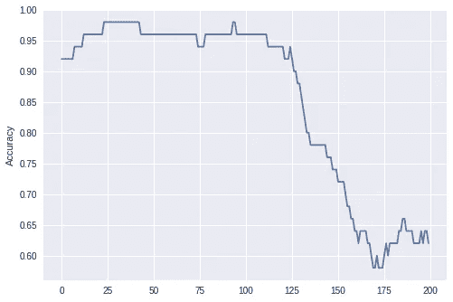

对于最近的反馈，这是一个很大的性能下降。

我们应该进一步调查。让我们比较高精度和低精度时的输入数据(即僵尸特征数据)。好在我们在反馈中也收集了这些信息:

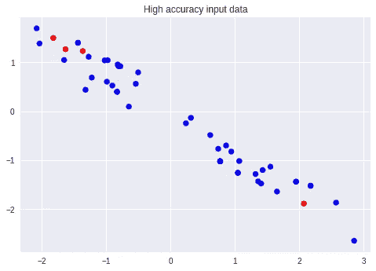

blue = correct prediction, red = incorrect prediction

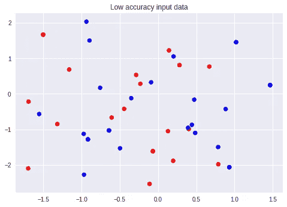

blue = correct prediction, red = incorrect prediction

啊，数据看起来完全不一样。我猜僵尸种群已经变异了！我们需要尽快用新数据重新训练我们的模型。好在我们收集了反馈中的输入数据，我们可以将其用作新的训练数据(使我们不必手动收集新数据)。我们可以使用有关模型所做预测(“预测”字段)和用户反馈(“正确”字段)的信息来推断新训练数据的正确预测标签:

[在反馈分析笔记本](https://github.com/ZackAkil/rotting-zombie-model/blob/master/Feedback_analyse_from_DataStore.ipynb)的底部查看这段代码是如何使用的。

有了这个新的数据集，我们可以训练一个新版本的模型。这是与训练初始模型相同的过程，但是使用不同的数据集([参见笔记本](https://github.com/ZackAkil/rotting-zombie-model/blob/master/Friendly_zombie_predictor_re_train.ipynb))，然后将其作为模型的新版本上传到 ML 引擎。

一旦它在 ML 引擎上，您可以将其设置为僵尸模型的新默认版本，以便您的所有客户端将自动开始将其预测请求发送到新模型，或者您可以指示您的客户端在其预测请求中指定版本名称:

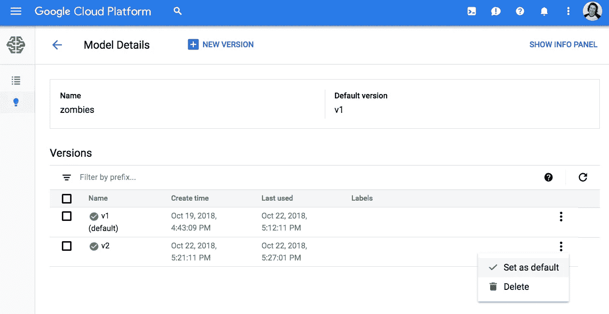

setting v2 as the default model

如果您将默认模型设置为 v2，那么所有对“僵尸”的预测请求都将转到 v2 版本:

```
PREDICTION REQUEST BODY:
{
"instances":[[2.0, 3.4, 5.1, 1.0]],
"model":"zombies"
}
```

或者你的客户可以说得更具体一些:

```
PREDICTION REQUEST BODY:
{
"instances":[[2.0, 3.4, 5.1, 1.0]],
"model":"zombies/versions/v2"
}
```

完成所有这些后，您可以坐下来，在收集到更多反馈后运行相同的分析:

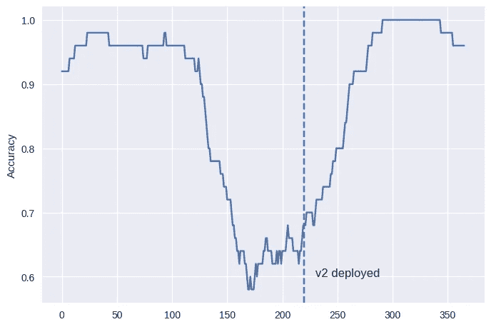

seems like people find our v2 model helpful

希望这已经给了您一些关于如何监控您部署的模型模型腐烂的想法。使用的所有代码都可以在 [github repo](http://ZackAkil/rotting-zombie-model) 中找到:

[](https://github.com/ZackAkil/rotting-zombie-model) [## ZackAkil/腐烂僵尸模型

### 🧟资源反击腐烂你部署的机器学习模型。预测僵尸！…

github.com](https://github.com/ZackAkil/rotting-zombie-model) 

如果您对监控模型腐烂有任何想法或问题，请联系我。